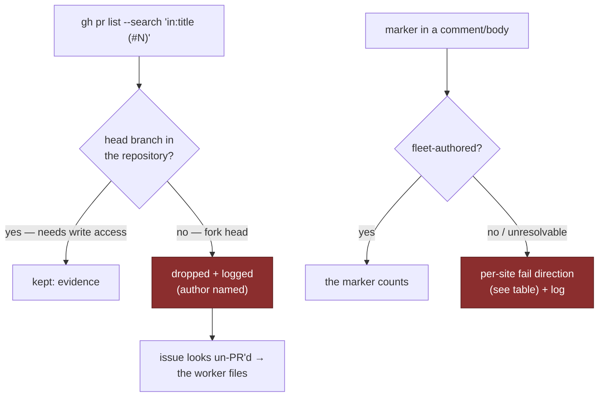

# PR Summary — Pay down the marker-dedup author manifest (Issue #1124)

Closes #1124.

## Summary

`worker/deno/lib/marker_dedup_author_manifest.ts` was the shrink-only record of
dedup lookups that decided whether to act on a marker in an issue title, body or
comment **without checking who wrote it**. On a public repository that text is
attacker-supplied and only the author is authenticated, so a planted marker
steers the fleet — almost always into silence.

Both lists are now **empty**: the six remaining scanned sites and the four
consumers were paid down. Every fix routes through an existing helper —
`lib/alert_dedup_authors.ts` or `lib/idle_task_wrapper_dedup.ts` — so there is
still no third title/body dedup helper (the duplication #1123 records).

### Manifest size

| List | Before | After |
| --- | --- | --- |
| `MARKER_DEDUP_AUTHOR_UNVERIFIED_FILES` | 6 | 0 |
| `MARKER_DEDUP_AUTHOR_UNVERIFIED_CONSUMERS` | 4 | 0 |

### The fail direction was chosen per site, never copied

The harmless outcome differs by what the marker drives, so each site states and
asserts its own direction. Copying one answer to all six is the mistake this
table exists to prevent.

| Site | What a planted marker did | Fail direction when the author set cannot be resolved |
| --- | --- | --- |
| `lib/issue_query.ts` (`fetchPRsForIssueByTitle`) | A fork PR titled `(#N)` read as "the fleet already has this issue in hand" | **Act** — the row is dropped, so the issue looks un-PR'd and the worker files |
| `lib/idle_task_backfill.ts` | A planted wrapper title steered the `idle-task` label onto somebody else's issue | **Write nothing** — no label is applied; the sweep is idempotent and retries |
| `lib/shared_cooldown.ts` (`cleanExpiredCooldownComments`) | An attacker-chosen timestamp made the worker delete a stranger's comment | **Delete nothing** — the worker tidies only its own cooldown markers |
| `setup/best_practices_sync.ts` | A planted body marker redirected the findings comment into a stranger's issue | **File fresh, never comment** |
| `lib/claim_pr_comment.ts` | A planted `PR_COMMENT_CLAIM:` sorted earliest and handed the PR to nobody | **Leave it claimable** — no competing claim is counted |
| `lib/pr_branch_lock.ts` | A planted `BRANCH_UPDATE_LOCK` with a fresh timestamp never expires and stalls the branch | **Leave it claimable** — no competing lock is counted |
| `lib/stale_workflow_detector.ts` (`hasExistingStaleComment`) | A planted diagnostic marker silenced the stale-issue diagnostic for good | **Do not suppress** — the diagnostic is posted |

Every direction is logged when it is taken, and every one has a test asserting
it. `lib/failure_detection_resume.ts` was already verified through
`selectFleetAuthoredComments`; its manifest entry had simply outlived the fix.

### The two PR lookups needed a different control

`issue_query.ts` and `pr_issue_linking.ts` read **PRs**, not issues, so the
issue helper does not fit. Both now request `--json …,author,isCrossRepository`
and drop every **fork-headed** row, naming the author GitHub authenticated in
the log line.

The head branch is the stronger evidence here: pushing a branch into the target
repository needs write access there, so a same-repository head is something no
unprivileged account can manufacture, while a fork head is a claim anybody can
make. It is also the *right* boundary for this question — a human maintainer's
PR for an issue legitimately means "already in hand", so a fleet-only author
filter would have the worker duplicate it. `pr_issue_linking.ts`'s uncached
fallback, which matches titles client-side and so is invisible to the scanner,
applies the same check.

## Evidence

No UI change and no performance change, so there is no screenshot or benchmark
to show. The evidence is the test suite: each fix has a regression test that
fails against the unfixed code, plus the cap test, which fails in **both**
directions and therefore forced every manifest entry to be deleted in this same
change.

## Test Plan

All added tests are **unit** tests — behavioural, self-contained, fast and
parallel-safe. Each site gets the same four-way shape: the request asks for the
author, a planted marker no longer drives the action, a **sibling fleet
account's** marker still does (the guard against the fix becoming "always act"),
and the unresolvable case takes the site's chosen direction and logs it.

Added or modified:

- `tests/issue_query_title_search_cache_test.ts` — the `--json` list carries
  `author` and `isCrossRepository`; a same-repository PR is kept; a fork-headed
  PR is dropped and logged with its author; a genuine match survives beside a
  dropped impostor; a pre-#1124 cache row reads as same-repository.
- `tests/pr_issue_linking_test.ts` — the uncached fallback ignores a fork-headed
  PR and asks who opened each PR.
- `tests/idle_task_backfill_test.ts` — planted title never labelled; sibling
  fleet host's wrapper still rescued; unresolvable fleet writes no label.
- `tests/shared_cooldown_test.ts` — the cleanup projection keeps `.user.login`;
  an outsider's expired marker is left alone; an unresolvable fleet deletes
  nothing.
- `tests/setup_best_practices_sync_test.ts` — planted marker never redirects the
  comment; a sibling's issue is still updated; an unresolvable fleet files fresh.
- `tests/claim_pr_comment_test.ts` — the re-read asks for the commenter; a
  planted claim does not cost this host the race; an unresolvable fleet leaves
  the work claimable.
- `tests/pr_branch_lock_test.ts` — the re-read asks for the commenter; a planted
  lock does not stall the branch; a sibling's earlier lock still wins; an
  unresolvable fleet leaves the branch updatable.
- `tests/stale_workflow_detector_test.ts` — planted marker does not silence the
  diagnostic; a sibling's marker still dedups; an unresolvable fleet posts and
  logs.
- `tests/marker_dedup_author_cap_test.ts` — unchanged; it is what required both
  manifest lists to be emptied here.

Fixture updates (behaviour changed, so the fixtures had to say who wrote each
marker): `tests/pr_ci_processor_lock_test.ts`,
`tests/pr_feedback_processor_test.ts`,
`tests/stale_workflow_detector_resume_test.ts`.

Verification: `deno fmt`, `deno lint`, `deno check mod.ts`, `deno check tests/`
and `deno task test:unit` — the parallel pass is green; the serial pass shows
only the known load-dependent wall-clock timing failures
(`secret_redaction_bounds_test.ts`, `claude_runner_kill_bound_test.ts`), which
pass when run on their own and touch none of the files in this change.
