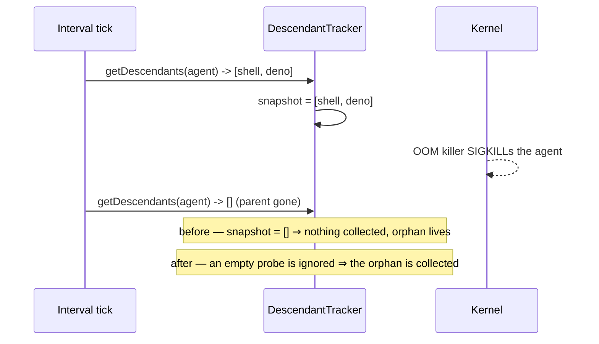

# Two flaky tests, and the two real faults behind them

Closes #1135.

## Summary

Two intermittent failures were traced to root cause rather than papered over.
One of them turned out to be a **production defect the test was correctly
reporting**; the other was a test that never had the isolation its own comment
claimed. Neither test was deleted, weakened, slept on or ignored.

### 1. `claude_runner_killed_test.ts` — the orphan really does survive

`runClaudeWithRetry - a SIGKILLed agent's surviving descendant is collected`
fails under load. It is not a timing artefact of the test: the descendant
genuinely survives.

`DescendantTracker` (`worker/deno/lib/orphan_collector.ts`) remembers the
agent's descendant tree on an interval so that, after an external SIGKILL has
re-parented the children to PID 1, the runner can still find and collect them
(Issue #4382). `refresh()` replaced the snapshot with **whatever the probe
returned, including nothing** — and `getDescendants` answers `[]` to three
different questions:

- the tree really is empty;
- the parent has gone (`pid_guard.getDescendants` returns `[]` for a parent it
  cannot see);
- the probe itself failed (a `pgrep` that cannot spawn under load answers `[]`
  too).

So on a busy host the interval tick that lands in the instant the agent dies
wipes the only record of the tree, milliseconds before that record is needed.
`collectOrphans` then returns on its `snapshot.length === 0` guard and signals
nothing.

Captured live, with the collector's seams instrumented (the trace is the whole
diagnosis):

```text
getDescendants(21752) -> [21812,21815] @87359     <- the tree, remembered
getDescendants(21752) -> []            @87563     <- the tick that raced the kill
                                                  <- no isRunning, no getParentPid,
                                                     no signal: nothing to collect
AssertionError: orphan 21812 survived
```

This bites hardest under exactly the conditions #4382 was written for — a
memory-pressured VM where the OOM killer takes the agent and everything else is
slow. The surviving `quality.sh` → `deno run` → `deno test` tree is the live
host-23 incident.

**Fix**: an empty probe result never erases a tree already seen. Keeping older
members costs nothing, because `collectOrphans` already re-checks liveness,
parentage and start time (the PID-reuse guard) before it signals anything.



### 2. `setup_credential_provisioning_test.ts` — the teardown raced a program the test did not own

The idempotency case failed on CI with every assertion green and only the
`finally` red:

```text
error: Error: Directory not empty (os error 39): remove '/tmp/a608138619c33790'
```

Nothing in `provision_vibe_credentials` spawns a background process, and none
survived it — measured directly over 80 runs with a reachable `gh`, checking
`ps -E` for `HOME=<tmp>` and `lsof +D <tmp>` after every `cmd.output()`, plus
polling the tree for 500 ms afterwards: no survivor, no late entry.

What is **not** true is the helper's own claim:

```ts
// A PATH without `gh` keeps the login lookup off the network.
PATH: "/usr/bin:/bin",
```

`ubuntu-latest` ships the GitHub CLI at `/usr/bin/gh` (GitHub CLI 2.98.0 in the
runner image). So on CI, and only on CI, `write_gh_hosts_file` ran the **real**
`gh api user` against api.github.com with `HOME` pointed at the test's temp
directory — a third-party program writing its own state into the tree the test
then deletes, on a schedule set by a network round trip. Measured, it leaves
`$HOME/.local/state/gh/device-id` behind.

**Fixes, both of them:**

- The helper now puts an offline `gh` stub first on the child's `PATH`, so every
  host behaves the way the comment always claimed: no network, no foreign
  writer, and a `hosts.yml` that is the same on a laptop and on CI.
- Teardown moved to `tests/support/temp_tree.ts`. A tree that does not come away
  is retried for a bounded window and **never in silence**: a removal that
  needed a retry says so, and one that outlasts the window fails with the words
  "this is a cleanup failure, not a failure of the behaviour under test" and the
  surviving entries listed. `withTempDir` also stops a teardown error thrown
  from a `finally` overwriting the assertion the reader needs.

All eighteen temp-directory teardowns in the file were the same three lines, so
all eighteen moved.

## Evidence

Both fixes have a regression test that fails against the unfixed code.

**Orphan collector** — with `lib/orphan_collector.ts` stashed:

```text
$ deno test --no-check --allow-all --filter "Issue #1135" tests/orphan_collector_test.ts
orphan collector - a probe that lands as the child dies does not erase the tree it must collect
  Actual []  /  Expected [101, 102]
FAILED | 1 passed | 1 failed
```

With the fix: `ok | 8 passed | 0 failed`.

**Provisioning hermeticity** — with the helper pointed at a `PATH` where `gh`
resolves, i.e. the CI condition:

```text
$ deno test --no-check --allow-all --filter "writes nothing into HOME" \
    tests/setup_credential_provisioning_test.ts
Actual   [ ".local/state/gh/device-id" ]
Expected []
FAILED | 0 passed | 1 failed
```

With the fix: `ok | 19 passed | 0 failed`.

**Reproduction of the flake itself** — the descendant case, run under a
concurrent `deno task test:unit --serial-only`:

- before the fix: **24 pass, 1 fail** in 25 runs
  (`orphan 19393 must have been
  collected`);
- after the fix: see the run counts in the PR description.

## Test Plan

| File                                                      | Change                                                                                                                       |
| --------------------------------------------------------- | ---------------------------------------------------------------------------------------------------------------------------- |
| `worker/deno/lib/orphan_collector.ts`                     | an empty probe no longer erases a remembered tree                                                                            |
| `worker/deno/tests/orphan_collector_test.ts`              | two cases: the probe that races the kill, and an empty tree that was genuinely empty                                         |
| `worker/deno/tests/support/temp_tree.ts`                  | new — `removeTempTree` / `withTempDir` / `listTree`                                                                          |
| `worker/deno/tests/temp_tree_test.ts`                     | new — ten cases over the retry, the loud failure, and the body-error-wins rule                                               |
| `worker/deno/tests/setup_credential_provisioning_test.ts` | offline `gh` on the child `PATH`; eighteen teardowns via `withTempDir`; one new case pinning what may be written into `HOME` |

## Follow-up

`write_gh_hosts_file` takes `gh`'s **stdout** as the login even when `gh` exited
non-zero. `gh api user --jq .login` prints the error body on failure, so a host
whose token `gh` rejects gets a `hosts.yml` with a JSON blob where the username
belongs. Removing `gh` from this suite's world means this suite will never show
it again, so it is raised as its own issue rather than left unrecorded.
