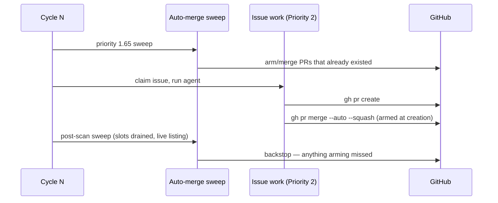

# A cycle now merges the PRs it raises

## Summary

The priority 1.65 auto-merge sweep runs near the top of a cycle; the Priority 2
issue scan — the pass that raises PRs — runs after it. The ordering guaranteed
that a PR raised by cycle N was never swept by cycle N: PR #1133 was created 51
minutes after that cycle's sweep, sat `CLEAN` and unarmed, and blocked every
sibling issue in its milestone until a human merged it. Five fleet PRs needed a
human that day for the same reason.

Three changes, in the order they matter:

1. **Arm at creation.** The completion phase now arms auto-merge for *every* PR
   it raises, milestone children included, and logs the outcome. The Issue
   #1125 skip named "milestone PRs" but only ever hit children into
   `milestone/**` — the summary PR is raised by `milestone_completion.ts` and
   re-gated on open children at merge time (Issue #3909) — so it delayed
   exactly the PRs that block a stream. This restores **F11** in
   `DESIGN-PRINCIPLES.md`, which `docs/workflows/label-flows.md` had recorded
   as a known divergence.
2. **Sweep again once the slots drain.** `runPostScanAutoMerge` repeats the
   sweep at the end of a cycle that claimed work, listing **live** rather than
   from the `prs_${author}` cache the 1.65 pass filled before those PRs
   existed. It is the backstop for what arming cannot cover: a failed arming
   call, a host that died mid-run, and an unprotected base whose gated direct
   merge deferred because CI was still running when the PR was raised.
3. **The sweep says what it saw.** Each repo produces a line — the candidate PR
   numbers, or `no candidates` — so "found nothing" no longer reads the same as
   "refused everything" (Issue #470's lesson, applied to the pass that hid this
   defect for five instances in a day).

Closes #1136.

## Evidence

Backend/loop change — no web interface to screenshot. The evidence is the
ordering asserted by tests and the gate run.



Red-then-green on the ordering itself: with the gate keyed on success rather
than on the claim, `run_core - a claim that then FAILED is still swept` fails
(`FAILED | 0 passed | 1 failed`); with the claim gate it passes. The whole
suite and `./quality.sh` pass:

```text
run_core - a PR raised by this cycle's issue work is swept in the same cycle ... ok
run_core - the post-scan sweep bypasses the cached open-PR list ... ok
run_core - an idle cycle raises no PR, so it does not sweep twice ... ok
run_core - a claim that then FAILED is still swept ... ok
run_core - the post-scan sweep says what it did, and why when it skips ... ok
run_core - a failing post-scan sweep is loud and does not abort the cycle ... ok

Result: PASSED (with skipped checks)   # ./quality.sh, 18 checks
```

## Acceptance Criteria

<!-- vibe-spec-review inputs="diff+issue-body" -->

- **met** — a PR raised during a cycle is mergeable without waiting for the
  next cycle, asserted on ordering not wall-clock — evidence:
  `worker/deno/tests/run_core_post_scan_auto_merge_test.ts::run_core - a PR raised by this cycle's issue work is swept in the same cycle (Issue #1136)`,
  `worker/deno/lib/phases/completion_phase.ts:167` — reviewer: met
- **met** — every sweep decision is logged with the repo, PR number and
  outcome, including "no candidates" — evidence:
  `worker/deno/lib/auto_merge_sweep.ts:133`,
  `worker/deno/tests/auto_merge_sweep_test.ts::a sweep that finds nothing anywhere still says so`
  — reviewer: met
- **partial** — a green, unblocked, review-free PR does not remain open across
  a cycle boundary — evidence:
  `worker/deno/lib/run_core.ts::runPostScanAutoMerge` — reviewer: partial —
  reason: the reviewer found two holes and both were fixed after the review
  (the gate now keys on `claimedRepos`, so a run that raised its PR and then
  failed is still swept; the sweep now runs *before* the `exitOuterLoop` /
  `spendCeilingReached` breaks). It stays `partial` for a residual the fix
  cannot remove: on an **unprotected** base the gated direct merge defers while
  CI is still running, so a PR raised in the last minutes of a cycle can still
  land on the next cycle's sweep. Native `--auto` on a protected base has no
  such window.
- **met** — regression test reproducing the ordering: a PR created after the
  sweep in cycle N is merged without a cycle N+1 sweep — evidence:
  `worker/deno/tests/run_core_post_scan_auto_merge_test.ts:188` (asserts a
  sweep between `pr-created` and the cycle-end sleep) — reviewer: met
- **unrequested** — the Issue #1125 milestone auto-merge skip is reversed on
  both the creation and the recovery path, and its two tests inverted
  (`worker/deno/lib/phases/completion_phase.ts:261,1391`,
  `worker/deno/tests/issue_worker_test.ts:2254`) — reviewer: unrequested —
  reason: it is the mechanism the issue asks for ("every PR the fleet raises
  should get `gh pr merge --auto`") and PR #1133, the reported case, was a
  milestone-base PR — but it is a merge-policy reversal, so it is named here
  rather than buried. `docs/workflows/label-flows.md` already recorded the skip
  as a divergence from **F11**.
- **unrequested** — Mermaid sequence diagram and prose in `docs/MERGE.md`,
  `docs/INTERNALS.md`, `docs/workflows/*` — reviewer: unrequested — reason:
  required by "A Code Change Owes a Docs Change"; three workflow docs still
  described `skipAutoMerge` at create.

## Standards Review

<!-- vibe-standards-review inputs="diff+CODING-STANDARDS.md" -->

- **violation** — `docs/workflows/milestones.md:9`, `:19`, `:93` still stated
  milestone-issue PRs skip auto-merge at creation — evidence:
  `docs/workflows/milestones.md:9` — reason: fixed in this diff.
- **violation** — `docs/workflows/label-flows.md:263` table row and two Mermaid
  nodes still said `skipAutoMerge` — evidence:
  `docs/workflows/label-flows.md:263` — reason: fixed in this diff; the "known
  divergence from F11" note now records the divergence as closed.
- **violation** — `docs/workflows/WORKED-EXAMPLE.md:35` described the reversed
  behaviour — evidence: `docs/workflows/WORKED-EXAMPLE.md:35` — reason: fixed
  in this diff.
- **violation** — the `refreshOpenPrs` → `fetchOpenPRsForFleet` positional
  wiring had no test, so a mis-ordered argument would stay green — evidence:
  `worker/deno/lib/run_core_production_deps.ts:2240` — reason: fixed —
  `worker/deno/tests/run_core_production_deps_cache_test.ts::the post-scan sweep's forced refresh sees a PR raised after the 1.65 pass`
  pins the contract (cached read blind to the new PR, forced refresh sees it).
- **violation** — the PR summary was absent — evidence:
  `docs/archive/pr-summaries/pr-summary-1136.md` — reason: this file.
- **violation** — a false docstring claim of Australian English words the file
  did not contain — evidence:
  `worker/deno/tests/run_core_post_scan_auto_merge_test.ts:12` — reason: fixed
  in this diff.
- **violation** — `runPostScanAutoMerge` (58 lines) added to the 5,300-line
  `run_core.ts` rather than a focused module — evidence:
  `worker/deno/lib/run_core.ts:3868` — reason: stands. It is cycle
  orchestration over `RunCoreDeps` and `WorkProgressTracker`, both declared in
  `run_core.ts`; extracting it would either duplicate those types or create an
  import cycle. The sweep itself already lives in `auto_merge_sweep.ts` and is
  reused, not duplicated.
- **clean** — Australian English in all added code and prose; fail-loud error
  handling (`runPostScanAutoMerge` logs via `deps.logError` on both `!ok` and a
  throw, never swallows; `armAutoMergeAtCreation` logs a refusal); real tests
  that call `runCoreLoop`, `sweepAutoMerge` and `fetchOpenPRsForFleet` with
  injected clocks and no source-grepping or wall-clock thresholds; the two
  repurposed Issue #1125 tests carry explicit rationale comments; commit safety
  (no hidden paths, key material or `.config*.json` staged; every commit
  carries `Vibe-Coder-Run-Id` and references #1136); Deno-native tooling
  throughout; `Result<T, E>` preserved; DRY — the second pass reuses
  `sweepAutoMerge`.

## Test Plan

Added:

- `worker/deno/tests/run_core_post_scan_auto_merge_test.ts` — six tests over
  one `runCoreLoop` cycle: the ordering (a sweep between the PR and the
  cycle-end sleep), the forced live listing, the idle cycle sweeping only once,
  a claim that then failed still being swept, the skip reason being logged, and
  a throwing sweep being loud without aborting the cycle.
- `worker/deno/tests/auto_merge_sweep_test.ts` — three tests: a repo with no
  open fleet PR logs `no candidates`, a sweep that finds nothing anywhere still
  says so, and the candidates a repo contributes are named before they are
  attempted.
- `worker/deno/tests/run_core_production_deps_cache_test.ts` — the forced
  refresh sees a PR raised after the 1.65 pass; the cached read does not.
- `worker/deno/tests/issue_worker_test.ts` — the arming outcome is logged at PR
  creation.

Modified (business-logic change, documented): the two Issue #1125 tests that
asserted `skipAutoMerge === true` for milestone PRs now assert the PR is armed,
on both the creation and the recovery path. Their rationale comments name why
the skip was wrong. The third #1125 test (non-milestone PRs are armed) is
unchanged and still passes.

Gate: `./quality.sh` — 18 checks, `Result: PASSED (with skipped checks)`; the
three SKIPPED checks (config integration, pages-liquid, mermaid built output)
are environment-gated and unrelated to this change.
