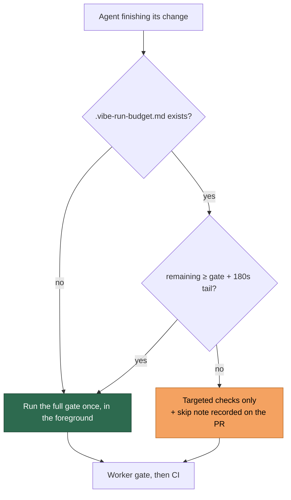

# The quality gate is conditional on the run budget left to pay for it

## Summary

The full quality gate is the most expensive thing an agent can start: 407
observations of a run's most recent tool call being `./quality.sh` give a
median of 17 minutes inside a run budget of roughly an hour, with agents still
inside it at 49–68 minutes. Eight prompt files ordered it unconditionally
before pushing, one of them permitting three fix-and-rerun cycles. The same
checks arrive twice more for free — the worker runs its own gate before the PR,
and CI runs it on the PR — so the agent's run is the third copy and the only
one paid for out of the run budget.

This change makes that run conditional, from one source of truth, and makes a
skipped gate visible:

- **`worker/deno/lib/quality_gate_budget.ts`** holds the decision. The gate
  runs when the remaining budget covers its duration plus a 180 s tail to fix,
  commit and push what it reports; otherwise it is skipped and recorded under
  `<!-- vibe-quality-gate-skipped … -->`. An unknown budget runs the gate (no
  notice means the run is not near its cap); a nonsense budget is treated as
  exhausted.
- **`buildQualityInstructions`** splices that decision into every prompt with a
  `{{QUALITY_INSTRUCTIONS}}` placeholder, quoting what the gate actually cost
  on this repository this cycle — the baseline gate is now timed
  (`PhaseState.baselineQualityDurationSeconds`) — or the 900 s fleet assumption
  when the baseline was reused from cache.
- **The run-budget notice refuses the gate outright** when the runway cannot
  cover it, and hands over the note that records the skip. Its trigger band is
  now the *wider* of the wind-down window (600 s) and what the gate needs
  (~1080 s): under the old narrower rule an agent at 1000 s of runway got no
  notice at all, so the budget condition could not be evaluated and it started
  a gate that outlived the run — exactly the band the measurements found. The
  two bands log distinctly and the handover note reads the notice's contents,
  so a gate refusal is never mistaken for a wind-down warning.
- **The PR-side flows** (`ci_fix`, `pr_feedback`, `spelling_fix`) run no
  progress extension, so no notice is ever written for them. They pass the
  run's whole budget instead: a gate that cannot fit inside it is refused at
  prompt-build time, and one that fits is quoted as a share of the run.
- **`worker/deno/lib/prompt_gate_instruction_check.ts`** stops the drift coming
  back: no template may hard-code its own gate order, and the check runs over
  the shipped prompts on every suite run.

The prompts named in the issue (`ci_fix`, `spelling_fix`, `pr_feedback`,
`coding_guidelines`, `issue`) plus `merge_conflict` now defer to that block
instead of ordering the gate themselves.

Closes #1138.

## Evidence

Backend/CLI change — no web interface to screenshot. The evidence is the
rendered agent-facing output and the test suites.

Quality instructions rendered with a measured 1020 s gate:

```text
   - While you iterate, use the repository's fast checks — formatter, linter, type check, and only the test files your change touches. Seconds, not minutes.
   - Before you finish, and only when the run budget covers it (next line), run ./quality.sh < /dev/null once, in the foreground, and fix whatever it reports.
   - The gate is not free: it took 17m on this repository this run (measured), so it needs about 1200s of run budget including the time to fix, commit and push what it reports. Read `.vibe-run-budget.md` before you start it …
   - A skipped gate must be recorded, never silent. Put the `<!-- vibe-quality-gate-skipped … -->` note in the PR summary (or `.pr_response_message`) …
```

The notice at 1000 s of runway — not winding down, but the gate no longer
fits:

```text
# Run budget: 1000s remaining

The worker wrote this file because the runway left no longer covers
something you might be about to start — see below. The run itself is
not over …

## Do not start the full quality gate

The full gate is skipped: it needs 1200s (gate measured 17m plus 180s to fix,
commit and push) and only 1000s of run budget remain.
```



Full gate run in the foreground after the final edit: **PASSED** (18 checks,
3 skipped for absent optional tooling).

## Acceptance Criteria

<!-- vibe-spec-review inputs="diff+issue-body" -->

- **met** — No prompt instructs an unconditional `./quality.sh` before pushing
  — evidence: `prompts/issue/prompt.md:461-471`, `prompts/ci_fix/prompt.md`,
  `prompts/spelling_fix/prompt.md`, `prompts/pr_feedback/prompt.md`,
  `prompts/coding_guidelines/prompt.md`, `prompts/merge_conflict/prompt.md:70`,
  guarded by
  `worker/deno/tests/prompt_gate_instruction_check_test.ts::no shipped prompt orders the gate unconditionally`
  — reviewer: met
- **met** — A run that would exceed its budget on the gate skips it and records
  why — evidence: `worker/deno/lib/quality_gate_budget.ts`,
  `worker/deno/lib/wind_down_notice.ts::shouldWriteRunBudgetNotice`,
  `worker/deno/tests/quality_gate_budget_test.ts`,
  `worker/deno/tests/wind_down_notice_test.ts` — reviewer: partial — reason:
  the reviewer marked this partial on two grounds, both addressed after its
  verdict. Its first — the PR-side flows write no notice, so the prompt's
  budget condition could never fire there, and the wording affirmatively
  authorised the gate — is fixed by passing the whole run's budget into
  `buildQualityInstructions`
  (`worker/deno/commands/pr_feedback_processor.ts:156`,
  `pr_ci_processor.ts:148`, `pr_spelling_processor.ts:155`), so a gate that
  cannot fit the run is refused at prompt-build time. Its second — "records
  why" is agent-voluntary, with no worker-side reader of
  `GATE_SKIP_MARKER` — stands as stated: the record is the note on the PR,
  which is what the issue asked for ("skip it and say so in the PR"), and a
  worker-side verifier of the marker is not in this issue's scope.
- **met** — Run records distinguish a deadline kill from a genuine failure —
  evidence: `worker/deno/lib/failure_diagnosis.ts:102` (`Released on
  schedule:`), `:144` (`scheduled_release`), `:277`
  (`DEADLINE_BOUND_TIMEOUT_MARKER`),
  `worker/deno/lib/run_outcome_classifier.ts:210-216`
  (`scheduled-release`, never a code-fixable failure) — reviewer: met —
  reason: satisfied by pre-existing code, not by this diff; the reviewer
  verified it independently and this change deliberately adds nothing there.
- **missing** — The share of runs ending in failure falls (6/20 baseline) —
  reviewer: missing — reason: withdrawn by the issue author's own correction
  ("only one of the six failures hit the deadline … rescoped accordingly —
  this is about run budget and cost, not about the failure rate"). Nothing in
  this diff claims it, and it cannot be demonstrated from a PR.
- **unrequested** — `worker/deno/lib/prompt_gate_instruction_check.ts` and its
  test — reviewer: unrequested — reason: the issue asks for the wording
  change; this is the guard that stops it drifting back, which is how this
  repo holds every other cross-cutting invariant. Kept.
- **unrequested** — `GATE_TAIL_SECONDS = 180` — reviewer: unrequested —
  reason: the issue's rule is "remaining < the gate's typical duration"; a gate
  that finishes with nothing left to fix or push it with buys nothing, so the
  tail is part of what the gate genuinely needs. Kept, and named in the
  guidance so the arithmetic is visible.
- **unrequested** — the measured-duration plumbing
  (`PhaseState.baselineQualityDurationSeconds` through to the notice) —
  reviewer: unrequested — reason: the issue's rule is stated against "the
  gate's typical duration", and the baseline gate measures exactly that on
  this repo this cycle; the 900 s constant remains the fallback. Kept.
- **unrequested** — the docs sections in `CODING-STANDARDS.md`,
  `docs/CONFIGURATION.md` and `docs/TROUBLESHOOTING.md` — reviewer:
  unrequested — reason: required by the repo's own "a code change owes a docs
  change" rule; the standards document carried the contradicting
  unconditional rule. Kept.
- **unrequested** — the raised ceiling in
  `tests/claude_runner_external_progress_508_test.ts` — reviewer: unrequested
  — reason: a consequence of the widened notice band, documented in the test
  and in the Test Plan below rather than hidden.

## Standards Review

<!-- vibe-standards-review inputs="diff+CODING-STANDARDS.md" -->

- **violation** — `docs/CONFIGURATION.md` described the pre-change single
  600 s notice window — evidence: `docs/CONFIGURATION.md:2010` — reason: fixed
  in this diff; the section now documents both bands and their distinct log
  lines.
- **violation** — `docs/TROUBLESHOOTING.md` asserted the refusal band and the
  wind-down window were the same ten minutes — evidence:
  `docs/TROUBLESHOOTING.md:868` — reason: fixed in this diff, with the
  `run-budget notice written` grep added.
- **violation** — the operator log called every notice a wind-down, and its
  latch was consumed by the gate-refusal write, so the genuine wind-down
  logged nothing — evidence: `worker/deno/lib/claude_runner.ts:1476` — reason:
  fixed in this diff; two bands, two latches, two messages.
- **violation** — the handover note derived "the run was warned" from the
  notice file merely existing, which the widened band made untrue — evidence:
  `worker/deno/lib/handover_note.ts:397` — reason: fixed in this diff; it now
  reads the contents via `noticeOrdersWindDown`, covered by
  `worker/deno/tests/handover_note_test.ts::a gate-refusal notice is not a
  wind-down warning`.
- **violation** — catch-and-ignore swallowed every prompt read failure —
  evidence: `worker/deno/lib/prompt_gate_instruction_check.ts:133` — reason:
  fixed; only `Deno.errors.NotFound` is benign, anything else is rethrown.
- **violation** — `CODING-STANDARDS.md` still carried the unconditional
  "run the gate before raising the PR" rule the change overturns — evidence:
  `CODING-STANDARDS.md:209` — reason: fixed; the Quality Gates section now
  carries the budget condition and the skip-note rule.
- **clean** — Australian English throughout added prose, comments and
  identifiers; one decision function behind the prompt lines, the notice and
  the write trigger (no forked logic); behavioural tests with error and edge
  paths, no wall-clock thresholds, no test removed or weakened; fail-loud
  handling (nonsense budgets read as exhausted, `filesScanned` distinguishes
  "nothing found" from "nothing scanned"); no new credentials, subprocesses or
  dependencies, and the new regexes are bounded and lazy with no nested
  quantifiers; no hidden paths staged, every commit carrying its issue
  reference and `Vibe-Coder-Run-Id` trailer.
- **noted, not fixed** — `buildProgressExtension` now takes four trailing
  optional positional parameters; the reviewer's nit is that an options object
  would age better. Left alone: changing that signature is a refactor of a
  seam this issue only passes through.

## Test Plan

New suites:

- `worker/deno/tests/quality_gate_budget_test.ts` — the decision (full budget,
  short budget, the tail boundary, measured vs assumed duration, nonsense
  measurements, absent and nonsense budgets), the skip note's marker and
  figures, and the prompt lines.
- `worker/deno/tests/prompt_gate_instruction_check_test.ts` — the scanner
  against literal templates (run order, "passed locally", the gate named in
  prose, an order wrapped across a line break, fenced examples, prose about the
  gate, budget-qualified instructions), plus the standing guard that scans the
  shipped prompts.
- `worker/deno/tests/baseline_quality_duration_test.ts` — the baseline gate
  records its duration; a cache hit and a gate that errored record nothing.

Extended:

- `worker/deno/tests/repo_config_test.ts` — the instructions are
  budget-conditional, quote a measured duration, and still skip everything for
  a `skip_quality_check` repo.
- `worker/deno/tests/wind_down_notice_test.ts` — the notice band above the
  wind-down window, a gate-only notice that does not order a wind-down, a
  measured duration deciding the refusal, and `noticeOrdersWindDown`
  distinguishing the two.
- `worker/deno/tests/handover_note_test.ts` — a gate-refusal notice is not
  reported to the next run as a wind-down warning.

Modified (documented business-logic change):

- `worker/deno/tests/claude_runner_external_progress_508_test.ts` — the
  "plenty of runway" case used a 600 s ceiling, which is now inside the
  gate-refusal band, so a notice there is correct rather than premature. The
  ceiling moves to an hour so the scenario means what its name says; the
  Issue #508 assertion itself is unchanged, and no test was removed or
  weakened.
