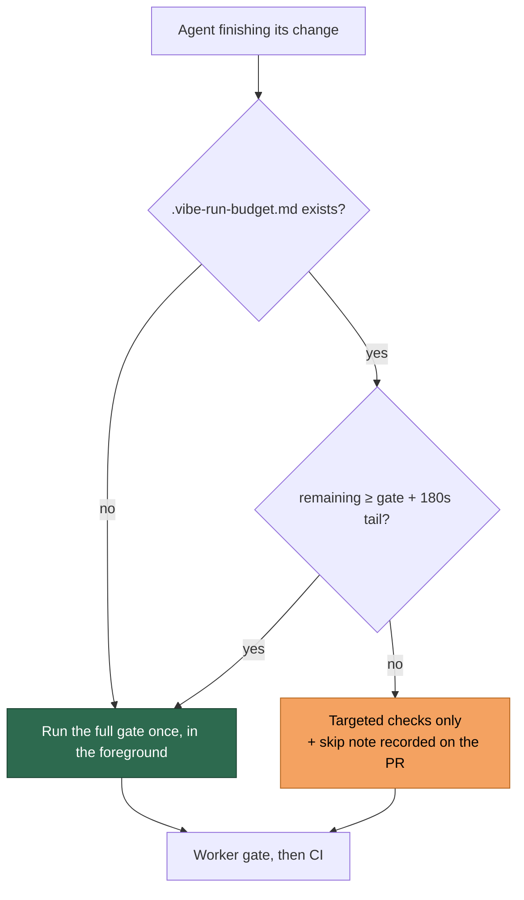

# The quality gate is conditional on the run budget left to pay for it

## Summary

The full quality gate is the most expensive thing an agent can start: 407
observations of a run's most recent tool call being `./quality.sh` give a
median of 17 minutes inside a run budget of roughly an hour, with agents still
inside it at 49–68 minutes. Eight prompt files ordered it unconditionally
before pushing, one of them permitting three fix-and-rerun cycles. The same
checks arrive twice more for free — the worker runs its own gate before the PR,
and CI runs it on the PR — so the agent's run is the third copy and the only
one paid for out of the run budget.

This change makes that run conditional, from one source of truth, and makes a
skipped gate visible:

- **`worker/deno/lib/quality_gate_budget.ts`** holds the decision. The gate
  runs when the remaining budget covers its duration plus a 180 s tail to fix,
  commit and push what it reports; otherwise it is skipped and recorded under
  `<!-- vibe-quality-gate-skipped … -->`. An unknown budget runs the gate (no
  notice means the run is not near its cap); a nonsense budget is treated as
  exhausted.
- **`buildQualityInstructions`** splices that decision into every prompt with a
  `{{QUALITY_INSTRUCTIONS}}` placeholder, quoting what the gate actually cost
  on this repository this cycle — the baseline gate is now timed
  (`PhaseState.baselineQualityDurationSeconds`) — or the 900 s fleet assumption
  when the baseline was reused from cache.
- **The run-budget notice refuses the gate outright** when the runway cannot
  cover it, and hands over the note that records the skip. Its trigger band is
  now the *wider* of the wind-down window (600 s) and what the gate needs
  (~1080 s): under the old narrower rule an agent at 1000 s of runway got no
  notice at all, so the budget condition could not be evaluated and it started
  a gate that outlived the run — exactly the band the measurements found.
- **`worker/deno/lib/prompt_gate_instruction_check.ts`** stops the drift coming
  back: no template may hard-code its own gate order, and the check runs over
  the shipped prompts on every suite run.

The prompts named in the issue (`ci_fix`, `spelling_fix`, `pr_feedback`,
`coding_guidelines`, `issue`) plus `merge_conflict` now defer to that block
instead of ordering the gate themselves.

Closes #1138.

## Evidence

Backend/CLI change — no web interface to screenshot. The evidence is the
rendered agent-facing output and the test suites.

Quality instructions rendered with a measured 1020 s gate:

```text
   - While you iterate, use the repository's fast checks — formatter, linter, type check, and only the test files your change touches. Seconds, not minutes.
   - Before you finish, and only when the run budget covers it (next line), run ./quality.sh < /dev/null once, in the foreground, and fix whatever it reports.
   - The gate is not free: it took 17m on this repository this run (measured), so it needs about 1200s of run budget including the time to fix, commit and push what it reports. Read `.vibe-run-budget.md` before you start it …
   - A skipped gate must be recorded, never silent. Put the `<!-- vibe-quality-gate-skipped … -->` note in the PR summary (or `.pr_response_message`) …
```

The notice at 1000 s of runway — not winding down, but the gate no longer
fits:

```text
# Run budget: 1000s remaining

The worker wrote this file because the runway left no longer covers
something you might be about to start — see below. The run itself is
not over …

## Do not start the full quality gate

The full gate is skipped: it needs 1200s (gate measured 17m plus 180s to fix,
commit and push) and only 1000s of run budget remain.
```



Full gate run in the foreground after the final edit: **PASSED** (18 checks,
3 skipped for absent optional tooling).

## Acceptance Criteria

<!-- vibe-spec-review inputs="diff+issue-body" -->

PENDING

## Standards Review

<!-- vibe-standards-review inputs="diff+CODING-STANDARDS.md" -->

PENDING

## Test Plan

New suites:

- `worker/deno/tests/quality_gate_budget_test.ts` — the decision (full budget,
  short budget, the tail boundary, measured vs assumed duration, nonsense
  measurements, absent and nonsense budgets), the skip note's marker and
  figures, and the prompt lines.
- `worker/deno/tests/prompt_gate_instruction_check_test.ts` — the scanner
  against literal templates (run order, "passed locally", the gate named in
  prose, an order wrapped across a line break, fenced examples, prose about the
  gate, budget-qualified instructions), plus the standing guard that scans the
  shipped prompts.
- `worker/deno/tests/baseline_quality_duration_test.ts` — the baseline gate
  records its duration; a cache hit and a gate that errored record nothing.

Extended:

- `worker/deno/tests/repo_config_test.ts` — the instructions are
  budget-conditional, quote a measured duration, and still skip everything for
  a `skip_quality_check` repo.
- `worker/deno/tests/wind_down_notice_test.ts` — the notice band above the
  wind-down window, a gate-only notice that does not order a wind-down, and a
  measured duration deciding the refusal.

Modified (documented business-logic change):

- `worker/deno/tests/claude_runner_external_progress_508_test.ts` — the
  "plenty of runway" case used a 600 s ceiling, which is now inside the
  gate-refusal band, so a notice there is correct rather than premature. The
  ceiling moves to an hour so the scenario means what its name says; the
  Issue #508 assertion itself is unchanged, and no test was removed or
  weakened.
