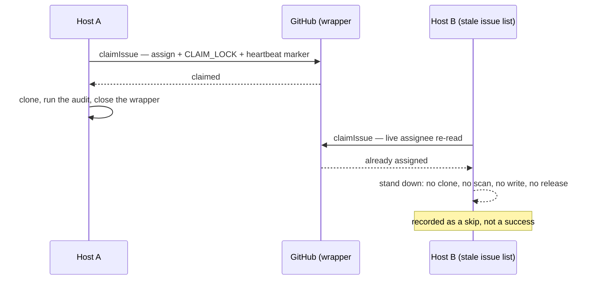

# Two hosts ran the same issue because the idle-task route never claimed it

## Summary

The duplicate runs the issue measured were **idle-task wrappers**, and the
claim lock was not lost across hosts — it was never taken. `processIssue`
routes a recognised wrapper through `routeIdleTaskInProcessIssue` **before**
`workOnIssue`, and `workOnIssue`'s setup phase held the only call to
`claimIssue`. A routed wrapper therefore collected no assignee and no
`CLAIM_LOCK` comment: nothing on GitHub said "taken", so every host's scan
kept offering it and each host ran the scan believing it held the issue.

This PR makes the route take the same lock the standard pipeline uses —
assignee, `CLAIM_LOCK` comment, earliest-comment race resolution, and a
heartbeat that beats for the life of the scan — before it clones anything or
runs anything. A host that does not hold the wrapper stands down having
written nothing, and its run is recorded as a skip (another run holds it) or a
failure (the claim itself could not be made), never as an ordinary success.

Closes #1139.

## Evidence

**The measured incident, verified against GitHub.** Both duplicated issues are
`idle-task` wrappers titled "Run a GitHub Actions audit", and **neither
timeline carries a single `assigned` event**:

```console
$ gh api repos/stSoftwareAU/NEAT-AI-Lamarck/issues/206/timeline --jq '.[] | "\(.created_at) \(.event)"'
2026-09-05T01:50:14Z labeled       # idle-task
2026-09-05T02:01:28Z commented     # audit complete
2026-09-05T02:01:29Z closed
```

The run records agree: GRQ-3 ran `01:56:42 → 02:01:32`, Mac-Ultra-M2 ran
`02:00:25 → 02:05:25` — overlapping, both `result: success`. The issue's
leading hypothesis (a stale issue-list cache) is the *reason the wrapper was
offered*; the defect is that nothing refused it at claim time.

**Reproduction of the unfixed behaviour.** Against `origin/main` (fix
reverted, the new module moved aside), a throwaway test drove the route twice
over one wrapper: both hosts scanned it and the route issued **zero**
`gh issue edit` calls — no claim was ever attempted. With the fix in place the
same two-host scenario runs the scan exactly once
(`idle_task_cross_host_claim_1139_test.ts`, first test). The throwaway file
was deleted; the committed test is the permanent cover.

**Claim, then work — never the other way round.**



**The stand-down releases nothing.** The fleet runs every host under one
GitHub login, so `--remove-assignee <githubUser>` removes *whichever* host's
assignment is on the issue. A stand-down that released would strip the
**winner's** claim and clear its heartbeat marker mid-scan — the Issue #214
state, and a third host could then claim it. `processIssue` now reports
`claimNotHeld` and `run_core` releases nothing for a run that held no claim
(covered in `run_core_test.ts` and `run_core_slot_pool_test.ts`).

No UI is involved — this is worker/CLI code, so the evidence is the test
output above and the full `./quality.sh` run, which passed (19 checks, 3
skipped by environment).

## Acceptance Criteria

<!-- vibe-spec-review inputs="diff+issue-body" -->

- **partial** — Two hosts cannot both run the same issue, with a regression
  test for two hosts and one issue — evidence:
  `worker/deno/tests/idle_task_cross_host_claim_1139_test.ts::two hosts, one wrapper: the second host's stale issue list does not let it re-run the scan`
  — reviewer: partial — reason: fixed for the idle-task route, which is where
  both measured duplicates happened; the two sibling pre-pipeline routes
  (`add-repo`, `seed-idle-tasks`) have the identical defect and are filed as
  `stSoftwareAU/VibeCoder#1193` rather than folded into this change. The
  reviewer also noted the test does not exercise `applyInFlightClaims`: it
  does not need to — the claim re-reads the live issue, so a stale list can
  still offer the wrapper and the claim is what refuses it, which is exactly
  what the test asserts.
- **met** — A host that loses the claim race stops before doing the work —
  evidence:
  `worker/deno/tests/idle_task_process_issue_route_test.ts::claims the wrapper before cloning or scanning`
  and `::a wrapper a sibling host holds is never cloned, scanned or written to`
  — reviewer: partial — reason: the reviewer split this criterion and marked
  "stops before the work" genuinely met; its `partial` is for "says so in its
  run record" — see the next entry, where the same objection is recorded.
- **partial** — …and says so in its run record; duplicate detection is
  observable rather than an ordinary success — evidence:
  `idle_task_wrapper_claim.ts` logs one greppable refusal line with the reason
  and the `unavailable` classification, and `idleTaskRouteRunResult`
  (`idle_task_process_issue_route.ts:151`) reports a skip, never a success —
  reviewer: partial — reason: a stand-down deliberately publishes **no** run
  record. The callback contract that produces the fleet records is
  `result: "success" | "failure"` (`run_callbacks.ts:92`), and `run_core`'s
  own rule is that a run which never held a claim fires no hook
  (`run_core.ts`, "a skip passes no `ran`"). Publishing `success` is the
  defect this issue reported; publishing `failure` for a healthy stand-down
  would be a lie. What the fleet records show now is one run for the issue
  instead of two — and a claim this host genuinely could not make **is**
  reported as a failure, with a record.
- **unrequested** — a heartbeat lifecycle for the scan (initial marker in the
  claim comment, refreshed until the scan ends) — reviewer: unrequested —
  reason: not optional in practice. `claimIssue`'s own lost-race cleanup
  unassigns `githubUser`, and the fleet shares one login, so the loser's
  cleanup drops the **winner's** assignee mid-scan; the beating marker is what
  refuses the next host. Demonstrated in
  `idle_task_cross_host_claim_1139_test.ts::two hosts claiming at once…`,
  where a third host is refused with `heartbeat_active`.
- **unrequested** — `claimNotHeld` added to the general `processIssue`
  contract and both loops, set by one caller — reviewer: unrequested —
  reason: without it the stand-down itself strips the holder's claim; the
  mechanism is general because the standard pipeline needs it next
  (`stSoftwareAU/VibeCoder#1193`).
- **unrequested** — wrappers now inherit `claimIssue`'s full guard set, so a
  scan can be deferred by `fleet_pr_exists` or `blocking_label` — reviewer:
  unrequested — reason: discovery already applies both rules to idle-task
  candidates (`collect_idle_task_candidates.ts`); the claim-time re-check only
  catches the discovery→claim window, and diverging here would mean a second
  notion of "claimable".
- **unrequested** — a claim that could not be made (`gh` outage,
  non-collaborator) reaches the failure counters — reviewer: unrequested —
  reason: the fail-loud standard, and the same verdict the standard pipeline
  gives that condition; folding a broken GitHub into the benign skip bucket is
  what the reviewer's own standards pass flagged.

## Standards Review

<!-- vibe-standards-review inputs="diff+CODING-STANDARDS.md" -->

- **violation** — the new test wrote host state into a fixed shared path
  (`/tmp/work/.machine-id`, marker files) instead of a temp directory —
  evidence: `worker/deno/tests/idle_task_cross_host_claim_1139_test.ts:223` as
  reviewed — reason: fixed here; `workDir` is now `Deno.makeTempDir()` per
  test and removed afterwards, and every test injects `machineIdFn`.
- **violation** — a machine-id failure left the claim running a full scan with
  no heartbeat marker at all — the exact degraded state the module exists to
  prevent — evidence: `worker/deno/lib/idle_task_wrapper_claim.ts:204` as
  reviewed — reason: fixed here; a missing or empty machine id now refuses the
  claim as `claim_error` before any GitHub write, covered by
  `idle_task_wrapper_claim_test.ts::no machine id means no liveness…`.
- **violation** — `fleetAuthors`/`pushCapableAuthors` were required on the
  route input but optional one layer down in the claim module, so the guard
  could still be disabled by forgetting a field — evidence:
  `worker/deno/lib/idle_task_wrapper_claim.ts:64` as reviewed — reason: fixed
  here; both are required in both places, one statement of the rule.
- **violation** — `HELD_ELSEWHERE` logged `heldElsewhere: true` for
  `already_closed`, `blocking_label` and `fleet_pr_exists`, which nobody
  holds — evidence: `worker/deno/lib/idle_task_wrapper_claim.ts:139` as
  reviewed — reason: fixed here; renamed to `isWrapperUnavailable` with an
  accurate doc comment and an `unavailable` log field, covered by
  `idle_task_wrapper_claim_test.ts::isWrapperUnavailable…`.
- **violation** — the heartbeat-did-not-start, heartbeat-threw and
  `!result.ok` branches had no test — evidence:
  `worker/deno/lib/idle_task_wrapper_claim.ts:288` as reviewed — reason: fixed
  here; all three are covered in the new
  `worker/deno/tests/idle_task_wrapper_claim_test.ts`.
- **violation** — a new module with no matching `tests/<module>_test.ts` —
  evidence: `worker/deno/lib/idle_task_wrapper_claim.ts:1` — reason: fixed
  here; the module's own contract tests moved into
  `worker/deno/tests/idle_task_wrapper_claim_test.ts`, leaving the two-host
  integration behaviour in the `_1139_` file.
- **violation** — a wall-clock `setTimeout(5)` inside a new unit test —
  evidence: `worker/deno/tests/run_core_slot_pool_test.ts:430` as reviewed —
  reason: fixed here; the assertion never depended on the overlap, so the
  sleep is gone.
- **clean** — Australian English throughout; no hidden paths staged; tests
  drive real code over a faked `gh` transport and assert on decisions, not
  request text; the eight `releaseIssueClaim` call sites in `run_core.ts` were
  each checked for the `claimNotHeld` wiring; `Result<T>` and discriminated
  unions per convention; file sizes and comment quality; docs updated with the
  code (`docs/IDLE-TASK-FRAMEWORK.md`, including the corrected "Issue-claim
  atomicity" text, which claimed a guard that was never armed on this path);
  `deno check`, `deno lint`, `deno fmt` and `markdownlint` clean.

## Test Plan

Added — `worker/deno/tests/idle_task_cross_host_claim_1139_test.ts` (new,
three tests driving the real `routeIdleTaskInProcessIssue` →
`claimIdleTaskWrapper` → `claimIssue` over one shared fake GitHub issue):

- two hosts, one wrapper: the second host's stale issue list does not let it
  re-run the scan — the scan runs once, the loser writes nothing, beats
  nothing, and reports `claimNotHeld`;
- two hosts claiming at once: the loser stands down on the earliest
  `CLAIM_LOCK` and deletes its own claim comment; `claimIssue`'s cleanup then
  drops the shared login's assignee, and a **third** host is refused on the
  winner's still-beating marker (`heartbeat_active`) rather than picking the
  wrapper up mid-scan;
- a lost claim is recorded as a skip, never as an ordinary success — and a
  claim that could not be made at all is recorded as a failure.

Added — `worker/deno/tests/idle_task_wrapper_claim_test.ts` (new, eight tests
for the claim module's own contract, every seam injected): the won claim and
what reaches `claimIssue`; a refusal with no detail still naming what holds
the wrapper; a thrown and a `Result`-shaped claim failure; a missing or empty
machine id refusing the claim before any GitHub write; a heartbeat that will
not start and one that throws, both loud and both leaving the claim standing;
and the `isWrapperUnavailable` classification over every refusal code.

Added — `worker/deno/tests/idle_task_process_issue_route_test.ts`:

- the wrapper is claimed before cloning or scanning (order assertion);
- a wrapper a sibling host holds is never cloned, scanned or written to.

Added — `worker/deno/tests/run_core_test.ts` and
`worker/deno/tests/run_core_slot_pool_test.ts`: a run that never held the
claim releases nothing, on the skip path and on the failure path, in both the
serial loop and the slot pool.

Modified — the ten existing tests in
`idle_task_process_issue_route_test.ts` now supply `githubUser`,
`fleetAuthors`, `pushCapableAuthors` and a claim stub, because the route input
gained those required fields and the route claims before it scans. No existing
assertion was weakened or removed.

Full gate: `./quality.sh` passed.

## Follow-up

`stSoftwareAU/VibeCoder#1193` — the same defect in the two sibling
pre-pipeline routes (`add-repo`, `seed-idle-tasks`), which still run
unclaimed, plus wiring the new `claimNotHeld` signal into the standard
pipeline's claim-refusal path.
