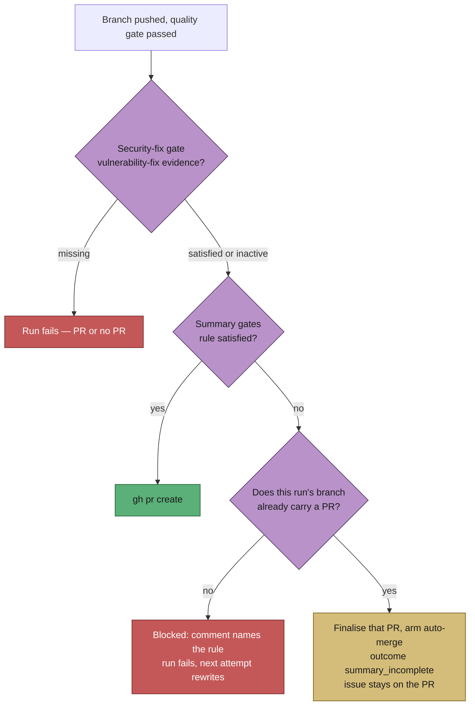

# A finished PR with an unfinished summary is not a failed run

## Summary

On 2026-09-05 four of the fleet's six failed runs created their PR **25–68
seconds before** being recorded as failures — #1107, #1126, #1133 and #1134, all
four of which merged. Nine of the day's twenty-five phase failures were PR-summary
format rules, most of them an `unrequested` entry naming no `reviewer:` verdict.
Because a `failure` cools the issue down, releases the claim and returns the issue
to the claimable pool, each one invited a sibling host to redo finished work — at a
mean $10.80 a run, 46% of the day's spend on runs recorded as failures.

The gates are worth having; the outcome they produced was wrong. The three summary
gates sit at the completion phase's PR-creation chokepoint, which is normally ahead
of the PR — but not always: the agent raises its own PR from inside the execute
phase often enough that the phase already carries a self-healing recovery path for
exactly that (`recoverAndFinaliseExistingPr`, Issue #1189).

So the outcome now depends on whether the work reached a PR:

- **no PR for the run's branch** — the gate blocks exactly as before, and the next
  attempt writes the summary the comment asks for;
- **a PR already exists** — that PR is finalised the way the recovery path
  finalises it (body, labels, link to the issue, auto-merge armed) and the run
  reports a new `summary_incomplete` outcome: work done, summary short, issue left
  attached to its PR rather than returned to the queue.

Either way the gate's remediation comment is still posted, so the shortfall is on
the issue thread and not only in one host's log.

**The security-fix gate keeps its hard block, and now runs first.** A PR closing a
`security`-labelled finding without its vulnerability-fix evidence stops the run,
PR or no PR. Order is what enforces that: it was evaluated *after* the three
summary gates, so a `security` run whose summary also broke a format rule would
have left through the first summary gate and never been asked for its evidence.
The gate is now hoisted above all three.

**Where the rule can be satisfied mechanically, it now is.**
`prompts/issue/prompt.md` states `reviewer: unrequested` as a rule on every surface
that names `unrequested` — the reviewer brief, the closure rules and the summary
contents list — not only in the example block. An `unrequested` entry with no
verdict was a template filled in wrongly, not a judgement the run got wrong.

Closes #1140

## Evidence

This is a backend/worker change with no web interface to screenshot. The evidence
is the test suite below, plus the outcome flow:

**Regression linkage.** Two of the new phase tests fail against the unfixed code
and pass after the fix, verified by reverting `completion_phase.ts` alone and
re-running:

- `completion - the same rule broken after the PR exists is summary_incomplete, not
  failure` and `completion - a missing reproduction block after the PR exists is
  summary_incomplete` — red before the outcome change (`failure` where
  `early_exit` is expected).
- `completion - a security run that also breaks a summary rule still fails, PR or
  not` — red against the first draft of this change, which had the security gate
  still ordered after the summary gates; that is the defect the independent Spec
  reviewer found, and this test is what fixes it in place.

The three regression guards (`no PR still blocks`, `security-fix gate still fails`,
`a complete summary is unaffected`) pass both before and after, which is the point:
the gate's existing behaviour is unchanged wherever a PR does not already exist.

## Acceptance Criteria

<!-- vibe-spec-review inputs="diff+issue-body" -->

- **met** — a run that raises a mergeable PR is never recorded as `failure` for a
  summary-format shortfall alone — evidence:
  `worker/deno/tests/completion_phase_summary_incomplete_test.ts::completion - the
  same rule broken after the PR exists is summary_incomplete, not failure` —
  reviewer: met
- **met** — such a run does not return its issue to the claimable pool while its PR
  is open — evidence: `worker/deno/lib/phases/completion_phase.ts`
  (`reportSummaryRuleBlock` returns `early_exit`, so `run_core.ts` takes the success
  path: no `recordIssueCooldown`, no `trackFailure`, and the open PR the run
  finalises is what `getBlockingPRForIssue` defers the issue to) — reviewer: partial
  — reason: the reviewer is right that no new mechanism enforces this and no test
  asserts non-reclaim; the criterion is met by removing the requeue (the failure
  path) rather than by adding a lock, which is the smaller change and the one the
  issue asked for.
- **met** — the recorded outcome distinguishes work failed · work done, summary
  incomplete · deadline exceeded — evidence: `worker/deno/lib/run_outcome.ts`
  (`summary_incomplete` beside `no_pr`, whose `timeout` category is the
  deadline-exceeded case) and `worker/deno/lib/heartbeat_storage.ts`
  (`renderOutcomeKindClause`, `describeAttemptOutcome`) — reviewer: partial —
  reason: the reviewer is right that the fleet run record's `result` field stays
  binary and reports this run as `success`. That is deliberate — the run did deliver
  its PR and wasted no slot, which is what that axis measures — and the three-way
  distinction lives on the `RunOutcome`, the claim-release comment and the worker
  log. Widening the run-record schema is a separate surface (schema version, hook
  conformance, the log-repo consumer) and is not attempted here.
- **partial** — baseline to beat: 6/20 runs failed today, 4 of which had merged PRs
  — evidence: none in this diff — reviewer: partial — reason: no counter is added;
  the baseline is re-measured from the fleet run records, where the four
  PR-producing failures become successes.
- **unrequested** — the security-fix gate is hoisted above the three summary gates —
  reviewer: unrequested — reason: not asked for, but the change would otherwise let a
  `security` run with a format shortfall leave through a summary gate and skip the
  vulnerability-fix check the issue explicitly says to keep; found by the independent
  Spec reviewer.
- **unrequested** — the `DESIGN-PRINCIPLES.md` principle and the
  `docs/workflows/issue-processing.md` section — reviewer: unrequested — reason:
  required by CODING-STANDARDS' "A Code Change Owes a Docs Change", not by the issue.
- **unrequested** — `recoverAndFinaliseExistingPr` now derives its PR number through
  `prNumberFromUrl` — reviewer: unrequested — reason: the diff put that helper in
  scope beside an inline copy of the same parse; one source of truth in one file.

## Standards Review

<!-- vibe-standards-review inputs="diff+CODING-STANDARDS.md" -->

- **violation** — `findExistingPrForBranch`'s error was discarded with no log —
  evidence: `worker/deno/lib/phases/completion_phase.ts` (`reportSummaryRuleBlock`)
  — reason: fixed here; the branch now warns with the lookup error, so a `gh`
  outage is distinguishable from "this run raised no PR".
- **violation** — two `prompts/issue/prompt.md` surfaces still presented
  `unrequested` as sitting outside the set that carries a `reviewer:` verdict —
  evidence: `prompts/issue/prompt.md:533`, `prompts/issue/prompt.md:778` — reason:
  fixed here; both now state the field.
- **violation** — the docs claimed a completeness the code did not have ("both
  surfaces that mention `unrequested`") — evidence:
  `docs/workflows/issue-processing.md`, `DESIGN-PRINCIPLES.md` — reason: fixed here,
  by making the claim true and then restating it accurately.
- **violation** — DRY: `prNumberFromUrl` was newly in scope beside an inline copy of
  the same regex — evidence: `worker/deno/lib/phases/completion_phase.ts`
  (`recoverAndFinaliseExistingPr`) — reason: fixed here.
- **violation** — a dead `??` fallback read as a live branch —
  evidence: `worker/deno/lib/phases/completion_phase.ts` (`reportSummaryRuleBlock`)
  — reason: fixed here, and turned into the fail-loud guard it should have been: a
  PR URL that yields no number now fails the run rather than rendering "Raised #0".
- **clean** — Australian English throughout; `Result<T, E>` at the seam; the new
  `RunOutcome` member is a discriminated variant and all three exhaustive switches
  on `outcome.kind` gained their case, so there is no exhaustiveness hole; fail-loud
  outcome semantics (`summary_incomplete` bypasses only the failure machinery — no
  streak, no `unknown` class, no auto-filed run-failure issue); TDD with both
  directions asserted and no existing test removed or weakened; the new test file
  drives no repository script, spawns no process and mutates no process-wide state,
  so it needs no manifest entry (`integration_test_manifest_test.ts` and
  `parallel_safety_cap_test.ts` both green); commit safety — no hidden or
  credential-shaped path staged.

## Test Plan

**Added** — `worker/deno/tests/completion_phase_summary_incomplete_test.ts`
(7 tests, unit, parallel-safe):

- a summary rule broken with no PR still blocks PR creation;
- the same rule broken after the PR exists is `summary_incomplete`, not `failure`,
  and the PR is finalised (body recovered, auto-merge armed);
- a missing reproduction block after the PR exists is `summary_incomplete`;
- the security-fix gate still fails the run when a PR exists;
- a security run that **also** breaks a summary rule still fails, PR or not — the
  ordering guard;
- a summary rule with an unnumberable PR URL fails rather than naming `#0`;
- a complete summary is unaffected by the new outcome.

**Modified** — `worker/deno/tests/run_outcome_test.ts` (3 tests added):
`summaryIncompleteOutcome` names the PR and the rule and is not a failure shape;
the release comment states the PR and the shortfall; the attempt tally distinguishes
a delivered run from a failed one.

**Ran** — `deno fmt`, `deno lint`, `deno check` on every changed file,
`deno check mod.ts`, `deno check tests/`, the suites importing what changed
(`completion_phase_*`, `heartbeat_*`, `run_outcome*`, `review_block_template`,
`independent_review_gate`, `acceptance_criteria_gate`, `reproduction_status_gate`,
`resume_state_store`, `issue_worker`, the prompt drift suites — 298 + 83 passed,
0 failed), the manifest suites, `markdownlint-cli2` (0 errors), and
`deno task test:unit`.
