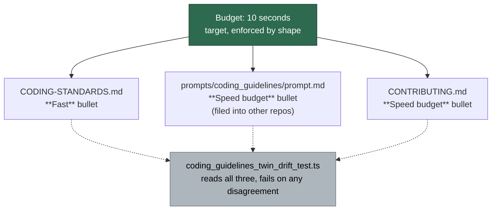

# Settle the unit-test speed budget at 10 seconds on every surface

## Summary

The unit-test speed budget had three spellings. `CODING-STANDARDS.md` said
**10 seconds**; the injected `prompts/coding_guidelines/prompt.md` said **120**
in one bullet and **30** in the next; `CONTRIBUTING.md` said **120** as well.
The prompt is filed verbatim into other repositories, so the wrong figure was
not merely present — it was distributed.

Settled on **10 seconds**, and each surface now says which kind of number it
is: a **target enforced by shape, not a run-time kill**. Nothing times a unit
test at run time in this repository, so the rule is enforced by shape
(`test-audit` check 13 flags a wall-clock sleep, a real-clock retry loop, a
polling wait or a spawned script) rather than by a stopwatch. That resolves the
question the issue put first — 120 was never a hard timeout anyone could point
at.

`BATS_TEST_TIMEOUT=120` is dropped rather than lowered. It was the second
contradiction the issue warned about, and it names no runner this repository
has: the BATS suite was fully migrated to Deno (`docs/INTERNALS.md:156`), and
the tree carries no `.bats` file. Removing the knob is what leaves no third
spelling behind.

The durable half is the drift pin.
`worker/deno/tests/coding_guidelines_twin_drift_test.ts` — the test that exists
precisely to stop these twins diverging, and did not catch this because the
budget was not among the passages it compared — now compares the budget across
all three surfaces, including `CONTRIBUTING.md` as the third carrier.

Closes #1166.

## Evidence

Documentation and prompt change with no web interface to screenshot. The
evidence is the test suite: the three new cases were observed **failing**
against the unchanged docs and passing after the edits.

Red, before the doc edits:

```text
FAILURES

twin pair - every surface states the same unit-test speed budget (Issue #1166)
twin pair - the speed budget is stated as a shape-enforced target, not a kill (Issue #1166)
twin pair - the guidelines name no timeout knob for a suite this repo dropped (Issue #1166)

FAILED | 4 passed | 3 failed (13ms)
```

Green, after:

```text
ok | 7 passed | 0 failed (4ms)
```

Full gate: `./quality.sh < /dev/null` → `Result: PASSED (with skipped checks)`
(the skips are `config integration`, `pages-liquid` and `mermaid built output`,
which need tooling absent from this container).

How the three surfaces now relate:



## Test Plan

Added to `worker/deno/tests/coding_guidelines_twin_drift_test.ts`:

- `twin pair - every surface states the same unit-test speed budget (Issue
  #1166)` — extracts every `N second` reading from each surface's budget passage
  and fails on any figure other than 10, so a fourth spelling cannot be
  introduced in any of the three.
- `twin pair - the speed budget is stated as a shape-enforced target, not a
  kill (Issue #1166)` — both twins must say the budget is enforced by shape, so
  neither can drift back to reading as an absolute timeout.
- `twin pair - the guidelines name no timeout knob for a suite this repo
  dropped (Issue #1166)` — the injected prompt must not prescribe
  `BATS_TEST_TIMEOUT`.

No existing test was modified or removed; the four Issue #793 cases in the same
file still pass.
