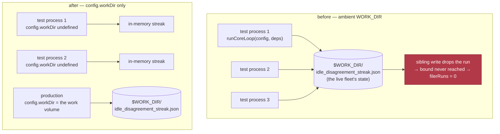

# Idle-disagreement streak: the work directory is an argument, not the environment

## Summary

`runCoreLoop` resolved the idle-disagreement streak's state directory from
`config.workDir` **and then fell back to `Deno.env.get("WORK_DIR")`**. The
worker container exports the live work volume there, so every suite that drove
the loop without naming a work directory read and wrote the running fleet's
`idle_disagreement_streak.json`. Under `deno test --parallel` that is one file
shared by several test processes: each process's load-apply-save dropped the
run another was accumulating, the elapsed-time bound was never reached, and the
forced filer attempt never came — the `0` where `1` was expected that the issue
reports. Which of the two cases lost the race varied because the interleaving
did.

The loop now takes its work directory from `config.workDir` alone.
`createProductionRunCoreDeps` already resolves it once (`--work-dir`, then
`WORK_DIR`, then the default) and puts it in the config, so production is
unchanged; a caller that names no directory keeps the streak in memory, which
is the module's documented behaviour for a caller with no volume. The gate's
`WORK_DIR` scrub (Issue #1098) stays as the second layer for the other
production readers of that variable.

Closes #1177.



## Evidence

Backend/CLI change with no web interface, so there is nothing to screenshot.
The evidence is measurement.

**The cause, isolated.** Six concurrent runs of the named suite, with the
container's `WORK_DIR` present and then removed — the only variable changed:

```text
WORK_DIR set:    6 processes, 6 failures  (3× "disagreement streak resets…",
                 3× "persistent audit/scan disagreement…", all count assertions)
WORK_DIR unset:  6 processes, 6 passes
```

**Gate-shaped full parallel passes** (`deno test --parallel` over `tests/` with
the manifest ignore arg, `WORK_DIR` present — the shape the issue measured):

```text
before the fix:  3 passes run, 3 red
                 (pass 2 included "run_core - disagreement streak resets after a
                  forced attempt so a second window fires again (Issue #2475)")
after the fix:   5 consecutive passes green
                 ok | 18057 passed (4 steps) | 0 failed | 4 ignored (43–45s)
final tree:      3 further consecutive passes green
                 ok | 18058 passed (4 steps) | 0 failed | 4 ignored (44–53s)
```

**The guard is host-independent.** Restoring `|| Deno.env.get("WORK_DIR")` in
`resolveRunStateWorkDir` and running the new planted-`WORK_DIR` case with the
parent's `WORK_DIR` **unset** still fails it — so the guard also holds under
the gate, which scrubs that variable from the test stage (Issue #1098).

**Full quality gate**: `./quality.sh` — `Result: PASSED (with skipped checks)`;
`deno tests`, `deno lint`, `deno type check`, `deno fmt`, `semgrep`,
`markdownlint`, `mermaid` and the chokepoint guards all PASSED.

**Second consumer.** `resolvedWorkDir` also feeds the lane-rotation cursor
(`readLaneRotation` / `advanceLaneRotation`, Issue #608), so tests were writing
the fleet's live lane cursor too. Production is unchanged — `config.workDir` is
always set there — and an unnamed caller now rotates from offset 0 in memory
rather than from the operator's file.

## Reproduction

- **symptom** — `run_core_idle_detect_audit_test.ts`'s two disagreement-streak
  cases fail intermittently under a full `--parallel` pass, always with a count
  assertion (`0` where `1` was expected), and pass in isolation
- **status** — `verified` — the new regression cases were observed failing
  against the unfixed code (`persisted=true` for a config that named no work
  directory; `filerRuns` `0` where `1` was expected in the concurrent case) and
  passing after the fix; the original `#2475` case was also observed red on the
  unfixed code in a full parallel pass and green in five consecutive passes
  after
- **regression test** —
  `worker/deno/tests/run_core_idle_detect_audit_test.ts::run_core - two concurrent loops without a workDir do not share a streak (Issue #1177)`

## Acceptance Criteria

<!-- vibe-spec-review inputs="diff+issue-body" -->

The issue states its criteria under "What needs to be done" rather than an
`## Acceptance Criteria` heading; they are answered here in the same shape.

- **met** — establish whether the streak state is shared across the concurrently
  running suites, or whether the window is wall-clock dependent — evidence:
  shared state, proved by measurement (six concurrent processes, 6/6 red with
  `WORK_DIR` set, 6/6 green with it unset) and by
  `worker/deno/tests/run_core_idle_detect_audit_test.ts::run_core - two concurrent loops without a workDir do not share a streak (Issue #1177)`
  — reviewer: met
- **met** — fix at the root, or list the file in the manifest with the
  measurement — evidence: fixed at the root; the `Deno.env.get("WORK_DIR")`
  fallback is gone and the resolution is `worker/deno/lib/run_core.ts:1338`
  (`resolveRunStateWorkDir`), called at `worker/deno/lib/run_core.ts:4293`. No
  entry was added to `SUBPROCESS_TIMING_TEST_FILES` or `WALL_CLOCK_TEST_FILES`
  — reviewer: met
- **met** — five consecutive full `--parallel` passes green — evidence: five
  consecutive gate-shaped passes green after the fix and four more on the final
  tree, quoted under Evidence above — reviewer: met — reason: the reviewer saw
  only the diff and could not re-execute the passes; the runs are recorded here
  and the gate re-ran the same parallel pass on the final tree
- **unrequested** — the three pre-existing disagreement cases were re-pointed at
  the new `createDisagreementDeps` / `disagreementLines` helpers — reviewer:
  unrequested — reason: the new cases need those deps, and adding a fourth copy
  of an inline block already written three times in the file would have been the
  DRY violation the standards review flagged; assertions are unchanged
- **unrequested** — comment and prose corrections in
  `worker/deno/lib/unit_test_passes.ts`,
  `worker/deno/tests/quality_gate_test_env_test.ts` and `CODING-STANDARDS.md` —
  reviewer: unrequested — reason: all three described the removed fallback in
  the present tense, so this change owes them the correction
- **unrequested** — this PR summary file — reviewer: unrequested — reason:
  required of every PR by the repository's own standards
- **unrequested** — extracting and exporting `resolveRunStateWorkDir`
  (`worker/deno/lib/run_core.ts:1338`) — reviewer: unrequested — reason: new
  public API. It exists so the host-independent guard can call the real
  resolver from a child process; without it the only guards left are ones that
  bite on the author's host and not under the gate
- **unrequested** — the lane-rotation cursor (`worker/deno/lib/run_core.ts:5075`)
  takes the same resolver, so a caller with no `config.workDir` also stops
  persisting lane rotation — reviewer: unrequested — reason: side effect of the
  shared resolution, reachable only from tests since production always sets
  `workDir`; recorded under Evidence and in the field's own doc

Two reviewers ran on this axis. The first returned after the summary was
written and reproduced the fault independently — four concurrent `deno test`
processes sharing one `WORK_DIR`, 4/4 red with the fallback restored and 4/4
green with it gone, plus five consecutive gate-shaped `--parallel` passes green
at the final tree with `WORK_DIR` deliberately left set. It reached the same
three `met` verdicts and found nothing implemented wrongly.

**Residual, recorded rather than fixed.** The host-independent guard asserts on
`resolveRunStateWorkDir`, so a future regression that reads
`Deno.env.get("WORK_DIR")` inside `runCoreLoop` itself — bypassing the resolver
— would still merge green under the gate, which scrubs that variable. The three
loop-level cases would catch it on any host that exports `WORK_DIR`, which is
every fleet container.

## Standards Review

<!-- vibe-standards-review inputs="diff+CODING-STANDARDS.md" -->

- **violation** — the regression cases only went red on a host that exports
  `WORK_DIR`, and the gate scrubs it, so re-introducing the fallback would have
  merged green — evidence: `worker/deno/tests/run_core_idle_detect_audit_test.ts:517`
  — reason: fixed here. The resolution is now the exported
  `resolveRunStateWorkDir`, and a new case plants `WORK_DIR` in a child process
  and asserts it still resolves to nothing; verified red against the old
  fallback with the parent's `WORK_DIR` unset.
- **violation** — stale JSDoc on `RunCoreConfig.workDir` still said the
  environment read "remains only as the default" — evidence:
  `worker/deno/lib/run_core.ts:198` — reason: fixed here.
- **violation** — `CODING-STANDARDS.md` still described the fallback in the
  present tense — evidence: `CODING-STANDARDS.md:147` — reason: fixed here; the
  paragraph now records that #1177 removed it in the code as well as scrubbing
  it in the gate.
- **violation** — the new comment credited the
  `--work-dir` → `WORK_DIR` → default chain to `createProductionRunCoreDeps`
  when it lives in `commands/run_core.ts` — evidence:
  `worker/deno/lib/run_core.ts:4256` — reason: fixed here.
- **violation** — the lane-rotation cursor is a second consumer of
  `resolvedWorkDir` and went unmentioned — evidence:
  `worker/deno/lib/run_core.ts:5042` — reason: fixed here; the resolver is named
  for run-outliving state generally, both consumers are named in its doc, and
  the change is recorded under Evidence above.
- **violation** — the concurrency case asserted only what the case above it
  already asserted, and collected two log arrays it never read — evidence:
  `worker/deno/tests/run_core_idle_detect_audit_test.ts:647` — reason: fixed
  here; each loop's own `streak=` sequence is now asserted to be `1,2,3,4`,
  which interleaving breaks.
- **violation** — the new deps helper duplicated three inline copies already in
  the file (DRY / Boy Scout Rule) — evidence:
  `worker/deno/tests/run_core_idle_detect_audit_test.ts:540` — reason: fixed
  here; the three older disagreement cases now use the shared helper.
- **violation** — the same incident narrative was told four times, 22 comment
  lines for a one-line change — evidence: `worker/deno/lib/run_core.ts:4255` —
  reason: fixed here; the story lives once on `resolveRunStateWorkDir` and the
  call site is a four-line pointer.
- **violation** — no `docs/archive/pr-summaries/pr-summary-1177.md` in the diff
  — evidence: `docs/archive/pr-summaries/` — reason: the reviewer read the diff
  before this file was committed; it is this file.
- **clean** — Australian English throughout; tests call real code and assert on
  emitted diagnostics, the forced-attempt count and the on-disk state file (no
  source grepping); no test removed, weakened or commented out; no
  `Deno.env.set`/`delete`/`chdir`, so the file stays correctly out of
  `PARALLEL_UNSAFE_TEST_FILES`; temp directory removed in `finally`; no sleeps,
  polling or wall-clock thresholds — the clock is driven through the mocked
  `now`/`sleep` seams; Deno-native tooling and `@std/assert` only; no hidden or
  credential paths staged; production behaviour preserved, since
  `commands/run_core.ts` is the only caller of `runCoreLoop` and always resolves
  a work directory first.

## Test Plan

Added to `worker/deno/tests/run_core_idle_detect_audit_test.ts` (each runs real
code — `runCoreLoop` or `resolveRunStateWorkDir` — and asserts on observable
output: the worker log, the forced-attempt count, the state file):

- `run_core - a planted WORK_DIR never becomes the loop's state directory (Issue #1177)`
  — a child process is spawned carrying `WORK_DIR=/planted/…`, and the real
  resolver must still answer "none" for a config that named none, while a
  config that names one gets it back. The variable is planted in the child, not
  in the test runner, so nothing races the parallel pass. This is the one guard
  that does not depend on the host's own environment: red against the old
  fallback with the parent's `WORK_DIR` unset.
- `run_core - a config naming no workDir keeps the streak in memory, whatever WORK_DIR says (Issue #1177)`
  — every `action=audit_scan_disagreement` diagnostic reports `persisted=false`,
  and the bound still forces its one attempt. Red against the unfixed code
  (`persisted=true`).
- `run_core - a config naming a workDir still persists the streak there (Issue #1177)`
  — the other half of the contract: with `config.workDir` set to a temp
  directory the diagnostics report `persisted=true` and
  `idle_disagreement_streak.json` in that directory carries the `cycle`
  observer's run. Guards against "fixed" meaning "persistence quietly dropped".
- `run_core - two concurrent loops without a workDir do not share a streak (Issue #1177)`
  — the flake in miniature: two loops driven concurrently in one process each
  force exactly one attempt. Red against the unfixed code (`0` where `1` was
  expected).

Unchanged in behaviour and still passing: the two cases the issue names, the
rest of `run_core_idle_detect_audit_test.ts`, `idle_disagreement_streak_test.ts`,
`run_core_idle_task_filer_test.ts`, `run_core_test.ts`,
`quality_gate_test_env_test.ts` and `unit_test_passes_test.ts`.

No test was removed, weakened or commented out. Three existing disagreement
cases were re-pointed at the shared `createDisagreementDeps` helper rather than
each building the identical deps inline — assertions unchanged, only the
duplication is gone. The comment updates in `unit_test_passes.ts`,
`quality_gate_test_env_test.ts` and `CODING-STANDARDS.md` correct prose that
described the fallback this change removes.
