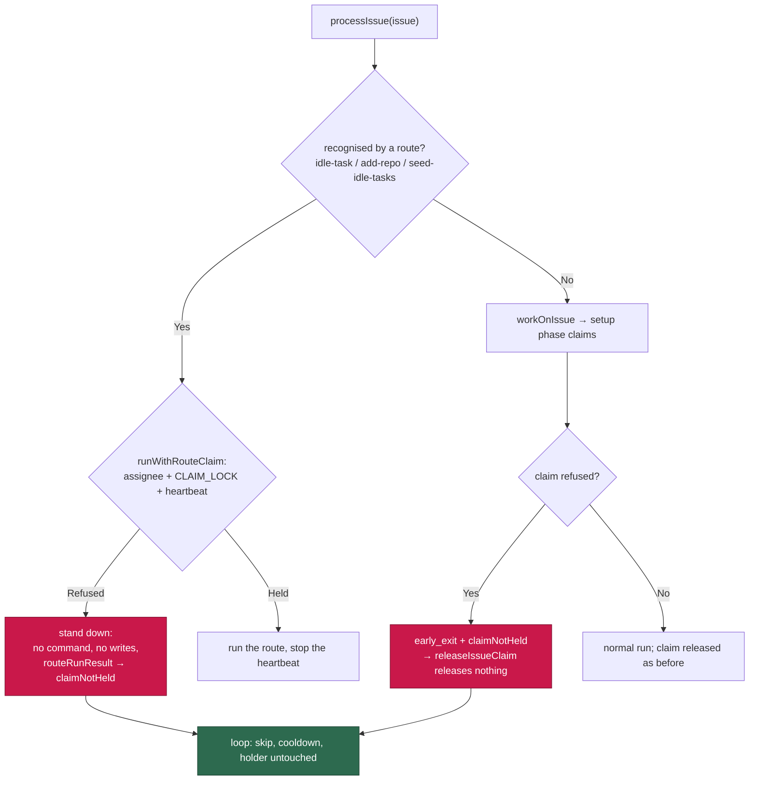

# Claim every pre-pipeline route, and release nothing when the claim was refused

## Summary

Two of the three routes `processIssue` dispatches **before** `workOnIssue` —
`add-repo:` and `seed-idle-tasks:` — took no claim at all, so two hosts
scanning the same repo could both run one request. And when the standard
pipeline's setup phase was *refused* a claim, the loop still called
`releaseIssueClaim`, which under the fleet's single shared login unassigns
whichever host holds the issue and clears its live heartbeat marker.

This change:

1. Generalises `idle_task_wrapper_claim.ts` into
   **`worker/deno/lib/route_claim.ts`** — `claimRoutedIssue`,
   `runWithRouteClaim`, `routeRunResult` — and has all three routes take the
   same cross-host claim (assignee, `CLAIM_LOCK` comment, earliest-comment
   race resolution, a heartbeat beating for the life of the routed work)
   before they do anything. A refused host runs nothing, writes nothing, and
   reports `claimNotHeld` so the loop releases nothing.
2. Carries a refused setup-phase claim out through
   `PhaseResult.claimNotHeld` → `WorkOnIssueResult.claimNotHeld` →
   `processIssue`, where `run_core.ts` already knew to release nothing.

Closes #1193.

## Evidence

Backend/worker change with no web interface, so there is nothing to
screenshot. The evidence is the test suite and the full quality gate.

- `./quality.sh` — **PASSED** (all 19 checks; 3 environment-gated skips),
  re-run after the review fixes.
- Red-before-green, observed: with `lib/phases/setup_branch_phase.ts` stashed
  back to `origin/main`,
  `deno test --allow-all --no-check tests/setup_claim_refusal_1193_test.ts`
  fails 3 of 4 cases; with the fix all pass. The route tests could not even
  compile against the unfixed routes (no `claimRouteFn`, no claim inputs).

Where the claim now sits, for all three pre-pipeline routes:

### Behaviour notes for the reviewer

- **Routed requests now obey the fleet-PR guard.** `claimIssue`'s live
  re-check defers a claim while a fleet PR is open in the same repo, so an
  `add-repo:` or `seed-idle-tasks:` request filed during an open fleet PR is
  now *deferred* (a skip with a cooldown, retried next cycle) rather than run
  immediately. That is the same behaviour #1139 gave the idle-task route and
  the setup phase gives every other issue; the request is never lost.
- **A `processIssue` that throws still leaks its claim.** Pre-existing and
  cross-cutting — the serial loop and `runSlotIssue` re-throw without
  releasing (`run_core.ts:2204-2217`, `:3708-3714`), so the issue sits
  assigned with a dead marker until the 30-minute recovery. Not introduced
  here and out of scope for #1193, so it is filed as
  stSoftwareAU/VibeCoder#1222 rather than folded in.
- **The setup phase's `!claimResult.ok` branch is unreachable in
  production**, which is why it does not set `claimNotHeld`: `claimIssue`
  has no `ok: false` return — every failure is folded into a
  `claimed: false` reason (`grep -n "ok: false" worker/deno/lib/claim_issue.ts`
  is empty), and production wires it directly
  (`issue_worker_wiring.ts:502`).

## Acceptance Criteria

<!-- vibe-spec-review inputs="diff+issue-body" -->

- **met** — No route reachable from `processIssue` runs an issue this host
  has not claimed; a regression test per route with two hosts and one issue —
  evidence: `worker/deno/lib/add_repo_process_issue_route.ts` and
  `worker/deno/lib/seed_idle_tasks_process_issue_route.ts` both call
  `runWithRouteClaim` with the command inside the claim-held closure;
  `worker/deno/tests/route_claim_1193_test.ts::two hosts, one add-repo
  request…`, `::two hosts, one seed-idle-tasks request…`, and the retained
  `worker/deno/tests/idle_task_cross_host_claim_1139_test.ts::two hosts, one
  wrapper…` — reviewer: met
- **met** — A claim refused in the setup phase releases nothing: the holder
  keeps its assignee and its heartbeat marker — evidence:
  `worker/deno/lib/phases/setup_branch_phase.ts` sets `claimNotHeld` on the
  refusal only, carried through `issue_worker.ts` and
  `run_core_production_deps.ts`;
  `worker/deno/tests/setup_claim_refusal_1193_test.ts::two hosts, one issue: a
  refused claim in setup leaves the holder's assignee and marker intact`, with
  the release half covered by the pre-existing
  `tests/run_core_test.ts::a run that never held the claim releases nothing` —
  reviewer: met
- **unrequested** — the `route` label on the claim input, logged with every
  claim and refusal — reviewer: unrequested — reason: a stand-down that does
  not say *which* route stood down is not greppable in a fleet log; asserted
  by `route_claim_1193_test.ts`.
- **unrequested** — `tests/support/fake_claim_hub.ts`, the two-host fake
  extracted from the #1139 test — reviewer: unrequested — reason: the issue
  asks for a two-host regression test per route, and three copies of the same
  fake `gh` would be the alternative.
- **unrequested** — the idle-task route restructured (early return when no
  template, `scan` closure) and `idleTaskRouteRunResult` replaced by the
  shared `routeRunResult` — reviewer: unrequested — reason: the issue asks for
  the module to be generalised; the shared helper is what makes three routes
  one code path, and the retained #1139 tests pin the behaviour unchanged.
- **unrequested** — the "Routing add-repo issue to process-add-repo" info log
  moved inside the claim-held closure — reviewer: unrequested — reason: a host
  that stood down did not route anything, so claiming it did in the log would
  be false.
- **unrequested** — the extra guard test "claim churn escalation still
  releases: the claim was taken" — reviewer: unrequested — reason: the churn
  escalation happens *after* a won claim, so it must keep releasing; without
  the test that boundary is one careless edit from inverting.
- **unrequested** — doc updates to `docs/ADD-REPO.md`,
  `docs/IDLE-TASK-FRAMEWORK.md` and `docs/INTERNALS.md` — reviewer:
  unrequested — reason: all three described the old behaviour ("Routes a
  claimed issue…"), which the standards rule "a code change owes a docs
  change" requires fixing in the same change.

## Standards Review

<!-- vibe-standards-review inputs="diff+CODING-STANDARDS.md" -->

- **violation** — no PR summary file — evidence:
  `docs/archive/pr-summaries/pr-summary-1193.md` absent at review time —
  reason: fixed here; this file is it.
- **violation** — stale module headers contradicting the fix — evidence:
  `worker/deno/lib/add_repo_process_issue_route.ts:4`,
  `worker/deno/lib/seed_idle_tasks_process_issue_route.ts:4`,
  `worker/deno/lib/run_core_production_deps.ts:3011` and `:3040` all still
  said "a **claimed** issue" — reason: fixed in commits b26ae7b and 48abef9.
- **violation** — DRY: the four claim fields and their JSDoc copy-pasted into
  each route's input — evidence:
  `worker/deno/lib/add_repo_process_issue_route.ts:45-66` and
  `worker/deno/lib/seed_idle_tasks_process_issue_route.ts:48-69` — reason:
  fixed in 48abef9; all three route inputs now extend `RouteClaimInput`
  (`Omit<ClaimRoutedIssueInput, "route">`), so the contract is spelled once.
- **violation** — the new `route` field had no test, and
  `runWithRouteClaim`'s documented heartbeat-stop-on-throw had no case —
  evidence: `worker/deno/lib/route_claim.ts:85`, `:300` — reason: fixed in
  48abef9; `route_claim_1193_test.ts` now asserts the full refusal log context
  and adds `::a route that throws still stops the claim's heartbeat`.
- **violation** — test-file naming departed from the module→test pairing —
  evidence: `worker/deno/tests/route_claim_helper_test.ts`, the only
  `*_helper_test.ts` in the suite — reason: fixed in 48abef9, renamed to
  `tests/route_claim_test.ts`.
- **clean** — Australian English throughout the added lines; commit safety
  (no hidden or credential paths staged, run-id trailer on every commit);
  test quality (every test drives real `claimIssue` → `claimRoutedIssue` →
  route code, no source-grepping, per-test `Deno.makeTempDir()` rather than
  host state); fail-loud (`claim_error` stays `skipped: false` so a `gh`
  outage reaches the failure counters, no catch-and-ignore added);
  Deno-native tooling only; rename hygiene (no live reference to the old
  module or symbols survives outside the #1139 archive summary); KISS —
  `idle_task_process_issue_route.ts` shrank by 62 lines.

## Test Plan

Added:

- `worker/deno/tests/route_claim_1193_test.ts` — two hosts and one issue over
  a shared fake GitHub, driving the real claim path for the `add-repo:` and
  `seed-idle-tasks:` routes: the second host stands down, the command runs
  once across the fleet, the loser writes nothing and starts no heartbeat, the
  refusal log names the route, and `routeRunResult` reports
  `claimNotHeld`. Plus: a non-matching title is never claimed (ordinary issues
  still take the setup phase's claim), `claim_error` is a failure rather than
  a benign skip, and a throwing route still stops its heartbeat.
- `worker/deno/tests/setup_claim_refusal_1193_test.ts` — the setup phase marks
  a refused claim `claimNotHeld` (and a churn escalation, which follows a *won*
  claim, does not); `workOnIssue` carries it out while staying an expected
  skip; and two hosts over the real `claimIssue` show the holder's assignee and
  heartbeat marker byte-identical after the refused run.
- `worker/deno/tests/support/fake_claim_hub.ts` — the shared two-host fake
  `gh`, extracted from the #1139 test so all three routes exercise one.

Modified (kept, not weakened):

- `tests/idle_task_cross_host_claim_1139_test.ts`,
  `tests/route_claim_test.ts` (renamed from
  `tests/idle_task_wrapper_claim_test.ts`),
  `tests/idle_task_process_issue_route_test.ts` — renamed symbols
  (`claimRoutedIssue`, `routeRunResult`, `claimRouteFn`) and the generalised
  refusal wording; every assertion retained.
- `tests/add_repo_process_issue_route_test.ts`,
  `tests/seed_idle_tasks_process_issue_route_test.ts` — supply the now-required
  claim inputs and inject a granted claim, so the routing assertions stand
  unchanged.

Run: `./quality.sh` PASSED, plus the focused suites (39 route/claim tests,
194 with `run_core` and `issue_worker`).
