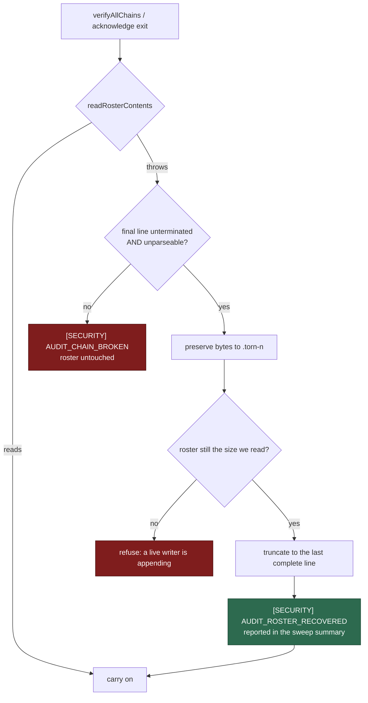

# Heal a torn audit-roster line instead of failing the whole sweep

## Summary

`addToRoster` appended to `${dir}.roster.jsonl` with a plain
`Deno.writeTextFile(..., { append: true })` and no crash recovery. Issue #1074
gave the *journal* append a declared-then-settled repair and left the roster
beside it as it was, so a run killed mid-append could leave a torn roster line
— and a torn roster line is not scoped to one journal:

- `readRosterContents` throws on a line that does not parse,
- `verifyAllChains` turns that into `[SECURITY] [AUDIT_CHAIN_BROKEN] sweep
  failed: …` for the **whole directory**, and
- both acknowledgement exits read the roster before doing anything, so neither
  `--acknowledge-loss` nor `--acknowledge-damage` applied.

That left no documented exit but hand-editing the tamper-evidence file, which
Issue #359 established must never be the remedy.

The sweep and both acknowledgement exits now settle the one shape a short write
can leave — an **unterminated, unparseable** final line — preserving the bytes
in a `.torn-<n>` sidecar and reporting them, exactly as
`audit_append_recovery.ts` does for a journal. Every other unreadable roster
stays as loud as it ever was. Closes #1202.

## Evidence

Backend/CLI only — there is no web surface to screenshot, so the evidence is
the red-then-green run below plus the tests listed in the test plan.

**Red against the unfixed code.** A one-off script seeded an audit directory,
appended `{"journal":"audit-test-worker-2026-09-0` (no newline) to the roster,
then swept and tried the loss exit, with the fix stashed:

```text
sweep ok? false audit roster has a malformed line: /tmp/repro-1202-…roster.jsonl: {"journal":"audit-test-worker-2026-09-0
acknowledge-loss ok? false audit roster has a malformed line: /tmp/repro-1202-…roster.jsonl: {"journal":"audit-test-worker-2026-09-0
```

**Green after the fix** — `worker/deno/tests/audit_roster_recovery_test.ts`,
9 tests, including the two shapes above:

```text
ok | 9 passed | 0 failed (69ms)
[SECURITY] [AUDIT_ROSTER_RECOVERED] /tmp/audit-roster-….roster.jsonl: an
interrupted roster append was discarded — 39 torn byte(s) in an unterminated
final line were moved to /tmp/audit-roster-….roster.jsonl.torn-1 and the
roster truncated to its last complete line; dropped:
"{\"journal\":\"audit-test-worker-2026-09-0"
```

Full gate: `./quality.sh` — `Result: PASSED (with skipped checks)`; the three
skips are environmental (no `.config.json`, no Ruby/Liquid toolchain, no Pages
build).

### What is repaired, and what still fails loud

The roster needs no write-ahead declaration: it is append-only and every line
stands alone, so there is no head to advance and nothing for a `pending` record
to disambiguate.

| Final roster line on disk | Verdict |
| --- | --- |
| Newline-terminated, whatever it holds | **fails loud** — the writer finished; a kill did not do this |
| Unterminated but complete, parseable JSON | **fails loud** — the forged-line shape; a missing newline must not launder it |
| Unterminated and unparseable | **heals** — discarded to `audit.roster.jsonl.torn-<n>` |



Four safety properties carry over from the journal repair: nothing before the
last complete line is touched; the discarded bytes are **moved, not deleted**,
into a sidecar that housekeeping is now forbidden to sweep
(`isReservedWorkRootEntry`); the repair refuses to truncate a roster that grew
underneath it, so a live writer's line cannot be destroyed; and the repair is
announced as `[SECURITY] [AUDIT_ROSTER_RECOVERED]` and named in the sweep
summary rather than folded into "OK".

## Test Plan

Added `worker/deno/tests/audit_roster_recovery_test.ts` (9 tests):

- a torn final line no longer fails the whole sweep — the repair is reported,
  the bytes are preserved, the roster's expectations survive, and the next
  sweep is clean with nothing left to repair (the regression test for this
  issue);
- a newline-terminated malformed line stays loud, roster byte-identical;
- an unterminated but complete JSON line stays loud, roster byte-identical
  (the forged-line guard);
- a healthy roster, a valid final line missing only its newline, and an absent
  roster all settle to `null`;
- out of `.torn-<n>` sidecars, the repair refuses rather than overwriting;
- a torn roster no longer blocks `acknowledgeJournalLoss`;
- `formatRosterRecovery` names the bytes, the sidecar and the dropped text.

Modified:

- `worker/deno/tests/audit_chain_verify_command_test.ts` — the command reports
  `[SECURITY] [AUDIT_ROSTER_RECOVERED]`, names the repair in its summary, and
  carries it in the typed payload;
- `worker/deno/tests/stale_workdir_test.ts` — `audit.roster.jsonl.torn-<n>` is
  a reserved work-root entry, so housekeeping cannot delete preserved evidence.

No existing test was removed, weakened or commented out; the pre-existing
"a half-formed acknowledgement line is a tamper signal" test uses a terminated
line and still fails loud, unchanged.
