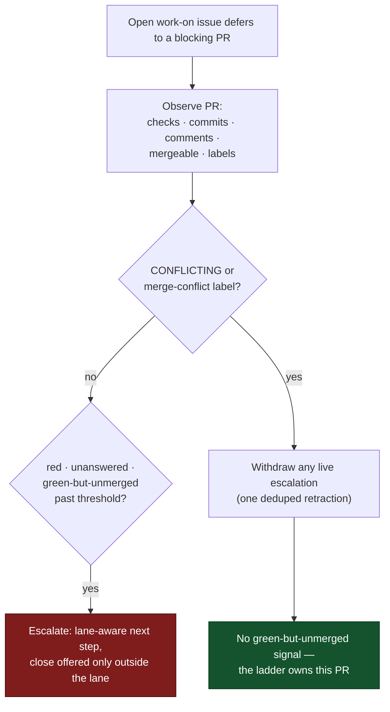

# Blocking-PR stall watchdog defers to the merge-conflict ladder

## Summary

The blocking-PR stall watchdog read checks, auto-merge and draft state but never
the PR's mergeability or labels, so a `CONFLICTING` PR tripped `unmerged-green`
and was told to "push a fix … **or close it**". Nothing withdrew that
instruction when the PR entered the merge-conflict lane, so
`NEAT-AI-Ockham#119` was closed by hand thirteen minutes later — inside the
ladder's cooldown, before rung 1 ever ran — and the work was redone by hand.

`worker/deno/lib/blocking_pr_stall_detector.ts` now knows about the lane:

- **Observation reads the lane.** `gh pr view` also fetches `mergeable` and
  `labels`; `isMergeConflictLaneOwned()` says the ladder owns a PR when GitHub
  reports `CONFLICTING` **or** the `merge-conflict` label is on it (the two land
  a scan apart, so either alone is enough).
- **A lane-owned PR is never green-but-unmerged.** It is not landing because it
  conflicts, which is a lane with its own attempts, cooldown and abandon rung.
- **The next step is conditional on the lane.** Any escalation a lane-owned PR
  does carry (red CI, an unanswered comment) keeps the actionable verbs and
  drops the close: "leave this PR open — the merge-conflict ladder owns whether
  it is resolved, rebased or retired".
- **A live escalation is withdrawn when the PR enters the lane.**
  `withdrawBlockingPrStallEscalation()` posts one retraction, deduped by
  `<!-- blocking-pr-stall-withdrawn -->`, so an instruction cannot outlive its
  condition.

Closes #1213.

## Evidence

Backend/CLI change — no web interface to screenshot. Verified by the unit tests
below (43 pass in `blocking_pr_stall_detector_test.ts`) and the full gate:
`./quality.sh` → `Result: PASSED (with skipped checks)`.

## Reproduction

- **symptom** — a `CONFLICTING` PR blocking a `work-on` issue was escalated as
  "green and unmerged … or close it", and the instruction stayed live after the
  merge-conflict ladder claimed the PR
- **status** — `verified` — with the lane gate and the conditional next step
  removed from `blocking_pr_stall_detector.ts`, the new tests failed
  (`FAILED | 35 passed | 5 failed`: the two green-lane tests, both next-step
  tests, and the scan withdrawal test); restoring the fix turns all 43 green
- **regression test** —
  `worker/deno/tests/blocking_pr_stall_detector_test.ts::a CONFLICTING blocking PR is never reported as green but unmerged`,
  `…::a lane-owned stall's next step never invites a close`,
  `…::the scan withdraws the live escalation on a PR that entered the lane`

## Acceptance Criteria

<!-- vibe-spec-review inputs="diff+issue-body" -->

- **met** — read mergeability in the observation; a `CONFLICTING` PR is not
  "unmerged-green" — evidence:
  `worker/deno/lib/blocking_pr_stall_detector.ts:189` (`isMergeConflictLaneOwned`)
  and
  `worker/deno/tests/blocking_pr_stall_detector_test.ts::a CONFLICTING blocking PR is never reported as green but unmerged`
  — reviewer: met
- **met** — make the next step conditional on the lane — evidence:
  `worker/deno/lib/blocking_pr_stall_detector.ts:428` (`buildBlockingPrStallNextStep`)
  and
  `worker/deno/tests/blocking_pr_stall_detector_test.ts::the escalation comment on a lane-owned PR omits the close invitation`
  — reviewer: met — reason: the reviewer also judged the first wording
  over-reaching (it dropped "push a fix"/"reply", which the ladder does not do,
  and named a label that may not be on the PR yet); both were rewritten in
  commit `fb143f9` before this summary
- **partial** — withdraw or amend a live stall escalation when the PR enters
  the lane — evidence:
  `worker/deno/lib/blocking_pr_stall_detector.ts:663` (`withdrawBlockingPrStallEscalation`),
  wired at `:1027`, covered by
  `worker/deno/tests/blocking_pr_stall_detector_test.ts::a live unmerged-green escalation is withdrawn once the PR enters the lane`
  — reviewer: partial — reason: the PR comment is retracted, but the separate
  work-queue issue `escalateAsWork` filed before the PR entered the lane still
  carries the old next step in its body; the watchdog does not record that
  issue's number, so amending it is a change to `escalate_as_work.ts`'s
  contract rather than to this watchdog
- **unrequested** — new "The merge-conflict ladder owns its own PRs" subsection
  and two flowchart nodes in `docs/CONFIGURATION.md`, plus a cross-reference
  bullet in `docs/workflows/merge-conflicts.md` — reviewer: unrequested —
  reason: "A Code Change Owes a Docs Change" — both are the operator-facing
  descriptions of the behaviour this diff changes, and they cross-link so the
  two lanes' docs cannot drift apart again

## Standards Review

<!-- vibe-standards-review inputs="diff+CODING-STANDARDS.md" -->

- **violation** — no `docs/archive/pr-summaries/pr-summary-1213.md` — evidence:
  the reviewer ran against the tree before this file existed — reason: fixed
  here; this file is the artefact it asked for
- **violation** — neither error path of `withdrawBlockingPrStallEscalation` was
  tested — evidence: `worker/deno/lib/blocking_pr_stall_detector.ts:688` and
  `:721` — reason: fixed in commit `fb143f9` — see
  `…::a withdrawal that cannot read the thread fails loud` and
  `…::a withdrawal whose comment cannot be posted fails loud`; lane-ownership
  edge cases (`UNKNOWN`, absent fields, empty labels) are covered too
- **clean** — Australian English throughout; `Result<T>` returns with
  context-carrying errors and no catch-and-ignore; the failed withdrawal is
  logged, never swallowed; Deno-native tooling only; tests call real functions
  with injected `gh`/logger stubs, are fast and parallel-safe, and no existing
  test was removed or weakened; no hidden or credential paths staged; the commit
  messages reference Issue #1213 and carry the `Vibe-Coder-Run-Id` trailer

## Test Plan

Added to `worker/deno/tests/blocking_pr_stall_detector_test.ts` (43 pass):

- a `CONFLICTING` blocking PR is never reported as green but unmerged
- the `merge-conflict` label alone takes a PR out of the green lane
- a red `CONFLICTING` PR still trips, and is marked lane-owned
- a PR outside the lane keeps the original next step
- a lane-owned stall's next step never invites a close
- the escalation comment on a lane-owned PR omits the close invitation
- observation gathering reads the PR's mergeability and labels
- a live `unmerged-green` escalation is withdrawn once the PR enters the lane
  (and is not repeated on the next pass)
- nothing is withdrawn when no escalation is live, or when the lane does not own
  the PR
- the scan withdraws the live escalation on a PR that entered the lane
- lane ownership tolerates unknown, absent and empty state
- both fail-loud paths of the withdrawal (unreadable thread, refused comment)

Also run: `./quality.sh` (PASSED), and
`tests/merge_conflict_stall_watchdog_test.ts` +
`tests/pr_merge_conflict_scan_test.ts` (113 pass) for the neighbouring lane.
