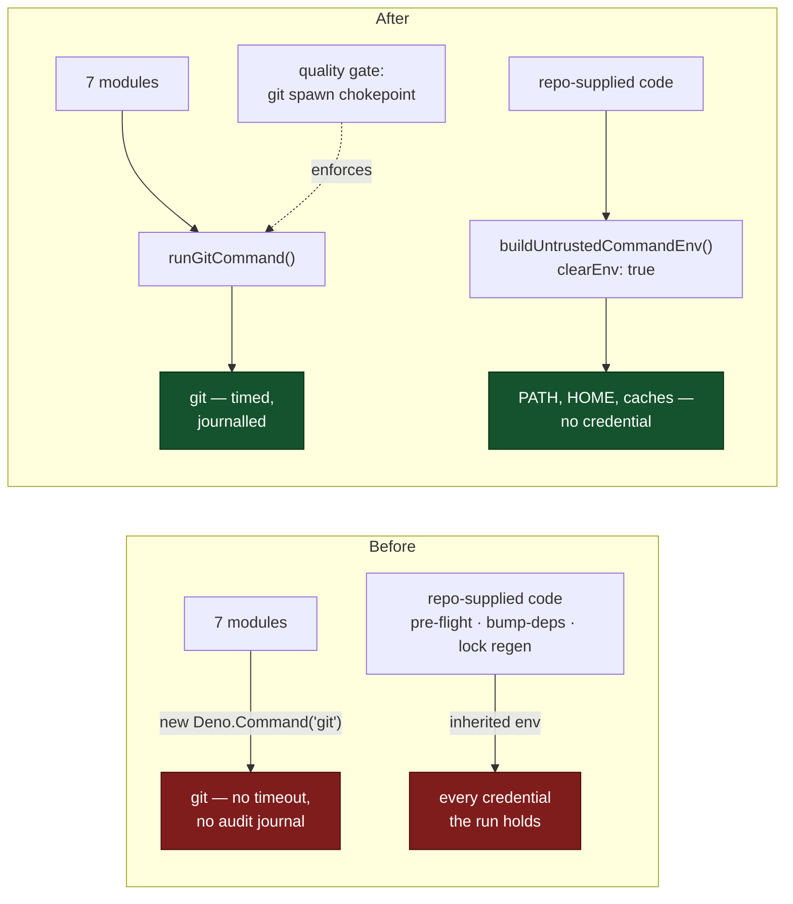

# Subprocess and argv sweep of `worker/deno/lib/` — two classes fixed

## Summary

Semantic security review of all 54 `worker/deno/lib/` modules that spawn a
subprocess (chunk 12a of the #1209 scan overflow). Two classes survived triage
and are fixed here; four residual findings are filed as their own `security`
issues; the swept paths are recorded under `docs/audits/`. Closes #1214.

**Class 1 — `git` spawned outside its chokepoint.** `runGitCommand`
(`git_timeout.ts`) owns the `AbortController` timeout, the audit journal for git
mutations (#2380) and the work-volume fault detector (#229). Seven modules had
grown their own `new Deno.Command("git", …)` and skipped all three. The sharp
one was `stale_workdir.ts`, whose unpushed-work rescue ran
`git push origin <branch>` **untimed and unjournalled** — an unresponsive remote
hangs the worker's start-up rescue outright, which is the exact failure mode
`CODING-STANDARDS.md` records as having pinned a container until a human killed
the host. All seven now route through `runGitCommand`, and because this is a
_class_, a new quality-gate check (`git_spawn_chokepoint_check.ts`) fails the
build on any future direct spawn — the repo's existing idiom, mirroring
`gh_spawn_chokepoint_check.ts` (#3703), with the scanning machinery of both
lifted into `spawn_chokepoint_scan.ts`.

**Class 2 — repository-supplied code inherited the worker's credentials.**
`untrusted_command_env.ts` (#572) exists so code the worker did not write has no
credential in scope. It was wired into the quality-gate spawn only. Three
sibling spawns of repository-supplied code inherited the worker's whole
environment: the pre-flight gate (whose scripts `docs/CONFIGURATION.md` states
plainly "are supplied by the target repo"), the per-repo `bump-deps.sh`, and the
lock-file regeneration tools that run `npm install`/`deno install` and their
install hooks over a repository-controlled manifest.
`echo
$CLAUDE_CODE_OAUTH_TOKEN` in any of them was the whole exploit. All three
now build the child environment with `buildUntrustedCommandEnv()` +
`clearEnv: true`.



## Evidence

Backend/CLI change — no web interface to screenshot. The evidence is the
regression tests and the gate, each observed in both directions.

**Class 1 —
`worker/deno/tests/git_spawn_chokepoint_check_test.ts::scanDirectoriesForGitSpawn - the worker tree has no direct git spawns`**
reproduces the flaw, **fails against the unfixed code** and passes after the
fix. Against the pre-fix tree it names all seven bypass sites:

```
-   [
-     "worker/deno/lib/bash_script_refs_scanner.ts:560",
-     "worker/deno/lib/codebase_map.ts:147",
-     "worker/deno/lib/prompt_manager.ts:470",
-     "worker/deno/lib/security_sarif_upload.ts:61",
-     "worker/deno/lib/semgrep_check.ts:201",
-     "worker/deno/lib/stale_workdir.ts:381",
-     "worker/deno/commands/pr_manager.ts:205",
-   ]
+   []
```

**Class 2 — `worker/deno/tests/untrusted_spawn_env_test.ts`** spawns each of the
three sites for real and reads the child's own `printenv`. Run against the base
revision, the pre-flight and bump-deps tests fail with the leaked names listed
verbatim — `VIBE_RUN_ID`, `GH_CONFIG_DIR`, `CLAUDE_CONFIG_DIR`, `WORK_DIR`,
`CLAUDE_CODE_SESSION_ID` and ~40 more — and the lock-regeneration test fails the
same way. All three pass after the fix.

The full gate was run: `git spawn chokepoint PASSED`,
`gh spawn chokepoint
PASSED`, and the semgrep + `deno test` failures the first
run reported were fixed (a non-literal `RegExp` in the shared scanner, replaced
with two literal patterns; a `Deno.env` mutation in the new test, replaced with
a parallel-safe whole-name-set assertion; a missing `page_icon` for the new
audit page).

**Trigger closed, no trivial bypass.** For class 1, `runGitCommand` is now the
only construction site of a `git` subprocess in `worker/deno/{lib,commands}`,
and the gate re-derives that fact from the tree on every run, so restoring the
trigger means reintroducing a spawn the build refuses. For class 2, the child
environment is built from an allowlist and `clearEnv: true` empties everything
else, so the original input — a repository-committed script reading a credential
from its environment — now finds no credential present; there is no equivalent
bypass because the allowlist is by name, not by pattern, and adding one is a
deliberate edit to `ALLOWED_ENV_NAMES`. The one bypass that _does_ exist is
stated rather than hidden: a spawn whose binary name is a variable evades the
literal-matching gate, which is filed as #1227 and recorded as residual risk in
the module docstring and the audit record.

## Findings filed, not fixed here

Each carries a `<!-- finding-id: SEC-… -->` marker with `severity:*` and
`confidence:*` labels, per `docs/SECURITY-SCAN.md`:

- **#1226** (SEC-1214-03) — content-processing tooling (markdownlint, Ruby
  liquid, the semgrep tree sweep) inherits the worker's credentials. Same shape
  as class 2, one exposure band lower: the trust source is the worker's own
  supply chain, not the target repository.
- **#1227** (SEC-1214-04) — a variable binary name evades the `gh` chokepoint
  gate; `language_detector.ts` and `workflow_auditor.ts` both do it.
- **#1228** (SEC-1214-05) — three spawns over attacker-influenced content with
  no timeout on any layer.
- **#1229** (SEC-1214-06) — the `gh` chokepoint's timeout is opt-in, so most
  `gh` invocations have none.

## Acceptance Criteria

<!-- vibe-spec-review inputs="diff+issue-body" -->

- **met** — every file in the regenerated 54-file list read at its spawn sites,
  argv provenance traced — evidence:
  `docs/audits/security-sweep-1214-subprocess-argv.md` — reviewer: partial —
  reason: the reviewer found `benchmark.ts`, `container_runtime.ts` and
  `quality_helpers.ts` present in the swept list but absent from the
  Fixed/Filed/Refuted sections; all three were added to the refuted section in
  this diff, which is why the status departs from its verdict
- **met** — each surviving finding filed as its own `security` issue with a
  `finding-id` marker and `severity:*`/`confidence:*` labels — evidence: issues
  #1226–#1229 — reviewer: met
- **met** — an empty result would be stated, not left silent — evidence: this
  slice had findings and says so; the audit record states each outcome —
  reviewer: met
- **met** — swept paths recorded under `docs/audits/` — evidence:
  `docs/audits/security-sweep-1214-subprocess-argv.md`, listing all 54 paths as
  swept — reviewer: met
- **met** — each fix ships a test that fails against the pre-fix code, with the
  fail direction stated — evidence:
  `worker/deno/tests/git_spawn_chokepoint_check_test.ts::scanDirectoriesForGitSpawn - the worker tree has no direct git spawns`
  and
  `worker/deno/tests/untrusted_spawn_env_test.ts::pre-flight gate - a repo-supplied command sees only the allowlisted environment`
  — reviewer: met
- **partial** — a class finding is held fixed by an architectural invariant in
  the quality gate — evidence: `worker/deno/lib/git_spawn_chokepoint_check.ts`
  wired into `quality_gate.ts` — reviewer: partial — reason: class 1 has its
  gate; class 2 is fixed at all three sites but has no gate stopping a _fourth_
  future spawn of repo-supplied code from inheriting the environment, because
  "is this child untrusted?" is a judgement a static scan cannot make
- **met** — the equivalent chokepoint reasoning applied to `git`, `deno`,
  `docker`/`podman` and shell spawns — evidence: the "other binaries" section of
  the audit record — reviewer: partial — reason: the reviewer saw no treatment
  of `deno` or `podman`; that section was added in this diff and states why only
  `git` earned a gate
- **unrequested** — `worker/deno/commands/pr_manager.ts` is modified, and the
  new gate scans `worker/deno/commands` as well as `worker/deno/lib` — reviewer:
  unrequested — reason: the issue lists `worker/deno/commands/` as a sibling
  issue's scope, but a gate that ignores it cannot hold the class, and the `gh`
  gate it mirrors already scans both directories; leaving the one `commands/`
  violation in place would have failed the new check on its first run

## Standards Review

<!-- vibe-standards-review inputs="diff+CODING-STANDARDS.md" -->

- **violation** — the new test mutated process-wide state with `Deno.env.set` /
  `Deno.env.delete`, which races under `deno test --parallel` — evidence:
  `worker/deno/tests/untrusted_spawn_env_test.ts:33` — reason: fixed here; the
  test now asserts that _every_ name the child sees is allowlisted, which needs
  no planted variable and is the stronger property.
  `parallel_safety_cap_test.ts` confirmed it, having failed on the first gate
  run
- **violation** — `gitCommandFn` discarded `result.error` and returned `""` on
  failure, so "git could not run" was indistinguishable from "git found nothing"
  — evidence: `worker/deno/commands/pr_manager.ts:207` — reason: fixed here; it
  now throws, exactly as the raw `Deno.Command` it replaced did
- **violation** — the new `spawn_chokepoint_scan.ts` had no corresponding test
  file — evidence: `worker/deno/lib/spawn_chokepoint_scan.ts` — reason: fixed
  here, `worker/deno/tests/spawn_chokepoint_scan_test.ts` added
- **violation** — no `docs/archive/pr-summaries/pr-summary-1214.md` — evidence:
  the branch at review time — reason: fixed here; this file
- **clean** — Australian English throughout; DRY (the two chokepoint checks
  share one scanner rather than duplicating it); tests call real code rather
  than grepping source; comments explain why, not what; no hidden or secret
  paths staged; new modules small and single-purpose; `SECURITY.md`,
  `docs/CONFIGURATION.md` and `docs/SECURITY-SCAN.md` updated alongside the
  code; both commits reference the issue and carry a `Vibe-Coder-Run-Id` trailer

## Test Plan

Added:

- `worker/deno/tests/git_spawn_chokepoint_check_test.ts` — 8 tests: content
  scanning, the allowlist, the test-file exclusion, and the tree-wide invariant
  (the regression test, verified red against the pre-fix tree).
- `worker/deno/tests/untrusted_spawn_env_test.ts` — 3 tests, one per fixed spawn
  site, each spawning for real and asserting on the child's own view of its
  environment. Verified red against the base revision.
- `worker/deno/tests/spawn_chokepoint_scan_test.ts` — 3 tests for the shared
  scanner, including the `excludeTests` behaviour the two checks differ on.

Unchanged and re-run green: `gh_spawn_chokepoint_check_test.ts`,
`codebase_map_test.ts`, `prompt_manager_test.ts`,
`security_sarif_upload_test.ts`, `semgrep_check_test.ts`,
`bash_script_refs_scanner_test.ts`, `stale_workdir_test.ts`,
`pre_flight_gate_test.ts`, `git_push_preflight_test.ts`,
`dependency_lock_regen_test.ts`, `bump_deps_test.ts`, `bump_deps_phase_test.ts`,
`quality_gate_test.ts`, `quality_gate_phase_test.ts`,
`pr_manager_command_test.ts`, plus the full suite via `./quality.sh`.
