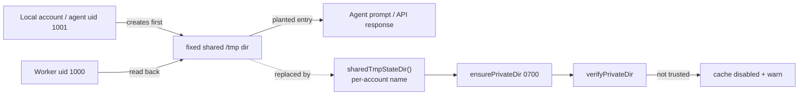

## Summary

Security sweep chunk 12b — filesystem, path and temp-file handling across
`worker/deno/lib/`. All 76 files the issue's command returns were read at their
filesystem call sites and the provenance of every path component traced. One
class was found and fixed; five surviving findings were filed as their own
`security` issues; the coverage record and the refuted candidates are in
`docs/audits/filesystem-path-temp-sweep-1215.md`. Closes #1215.

**The class fixed.** `private_cache_dir.ts` exists (Issue #3709,
SEC-e70b8134af26) because a cache under a world-writable `TMPDIR` is the same
path for every account on the host, so whoever creates it first owns what the
worker reads back. The control had been wired into exactly one cache,
`timeline_cache.ts`. Three siblings carrying data with more direct reach into
the agent had none:

- `prompt_cache.ts` — the fixed literal `/tmp/vibe-prompt-cache-deno`, holding
  assembled **prompt text** handed to the coding agent;
- `codebase_map_cache.ts` — the fixed literal `/tmp/vibe-codebase-map-deno`,
  passed to `PromptCache` explicitly;
- `issue_cache.ts` — `${TMPDIR}/vibe-issue-cache-deno`, read back as GitHub API
  responses by the issue finders and the idle-task gate.

All three now build the directory through the new `sharedTmpStateDir()` — the
single place a shared-tmp name is composed, per-account by construction — create
it `0700` with `ensurePrivateDir`, and refuse to read or write it when
`verifyPrivateDir` reports another account could have written to it. The refusal
is logged and the cache degrades to a miss; it is never silently ignored. The
check follows the directory's **location** (`isSharedTmpPath`), not whether the
caller named it — that is what closes the codebase-map case, which passed a
fixed `/tmp` literal explicitly and would have walked straight through a
default-only check.

**Findings filed, not fixed here** (each a distinct root cause, with a
`finding-id` marker and `severity:*` / `confidence:*` labels):
[#1238](https://github.com/stSoftwareAU/VibeCoder/issues/1238) the GitHub token
staged through a symlink-following write and `chmod`-ed only afterwards ·
[#1239](https://github.com/stSoftwareAU/VibeCoder/issues/1239) the credit log's
symlink-following append and the spend-ceiling bypass ·
[#1240](https://github.com/stSoftwareAU/VibeCoder/issues/1240) the codebase map
following committed symlinks out of the clone into the agent prompt ·
[#1241](https://github.com/stSoftwareAU/VibeCoder/issues/1241) `.config.json`
written without the 0600 its canonical writer requires ·
[#1242](https://github.com/stSoftwareAU/VibeCoder/issues/1242) the five state
directories still built by raw `TMPDIR` interpolation, plus the quality-gate
check that would hold the class closed. Evidence raising
[#1233](https://github.com/stSoftwareAU/VibeCoder/issues/1233) above
`severity:low` was added as a comment there rather than re-filed. An earlier
attempt at this sweep filed #1232/#1233/#1234/#1235 before its branch was lost;
those are cross-referenced in the audit record rather than duplicated.

## Evidence

Backend/CLI change with no web interface, so no screenshot applies. The evidence
is the regression suite below, run in both directions.

With the trust check bypassed — the pre-fix behaviour, every cache directory
trusted as it was before:

```
shared tmp cache dirs - every default name is per-account ... ok
shared tmp cache dirs - the shared root is recognised wherever it is ... ok
issue cache - refuses a planted entry in a world-writable directory ... FAILED
issue cache - does not write into a world-writable directory ... FAILED
issue cache - creates its directory owner-only ... FAILED
prompt cache - refuses a planted prompt in a world-writable directory ... FAILED
prompt cache - fails loud rather than writing into a world-writable directory ... FAILED
prompt cache - creates its directory owner-only and round-trips ... FAILED
FAILED | 2 passed | 6 failed
```

With the fix in place:

```
ok | 8 passed | 0 failed (23ms)
```

The regression test is
`worker/deno/tests/shared_tmp_cache_dir_test.ts::issue cache - refuses a planted entry in a world-writable directory`.
It reproduces the flaw: it **fails against the unfixed code** — the cache reads
the entry another account planted in a mode-0777 directory under the shared
temporary root and serves it as a GitHub API response — and **passes after the
fix**, where the directory is not trusted and the read returns `null`.

**The original trigger is closed with no trivial bypass.** The attack input was
a cache entry planted by another account in a directory that account created
first. Every read and write path of both caches is now gated on
`verifyPrivateDir`, which fails on any group/other permission bit and on a
foreign owning uid, so a directory an attacker could have written to yields a
cache miss (and, for `PromptCache.set`, a loud error) rather than data. The
obvious bypasses do not work: supplying the `/tmp` path explicitly is still
checked, because `isSharedTmpPath` classifies by location rather than by
argument — that is the codebase-map case, covered by
`prompt cache - refuses a planted prompt in a world-writable directory`; racing
the worker to create the directory leaves it non-private and disables the cache
rather than granting a read; and the per-account name means the path the worker
will use cannot be pre-created by a different uid. The residual — other modules
that still interpolate `TMPDIR` by hand, and the quality-gate check that would
fail the build on a new one — is stated in the audit record and filed as
[#1242](https://github.com/stSoftwareAU/VibeCoder/issues/1242), not left
implicit.



## Test Plan

- Added `worker/deno/tests/shared_tmp_cache_dir_test.ts` (8 tests, real classes
  against a real filesystem; no `Deno.env` mutation, so the suite stays
  parallel-safe per Issue #880):
  - `shared tmp cache dirs - every default name is per-account`
  - `shared tmp cache dirs - the shared root is recognised wherever it is`
  - `issue cache - refuses a planted entry in a world-writable directory` — the
    regression test above
  - `issue cache - does not write into a world-writable directory`
  - `issue cache - creates its directory owner-only`
  - `prompt cache - refuses a planted prompt in a world-writable directory` —
    covers the codebase-map bypass, where the `/tmp` path was supplied
    explicitly
  - `prompt cache - fails loud rather than writing into a world-writable directory`
  - `prompt cache - creates its directory owner-only and round-trips`
- Re-ran the neighbouring suites unchanged: `issue_cache_test.ts`,
  `prompt_cache_test.ts`, `prompt_cache_telemetry_test.ts`,
  `timeline_cache_test.ts`, `timeline_cache_trust_test.ts`,
  `private_cache_dir_test.ts`, `codebase_map_cache_test.ts`,
  `agent_mcp_config_test.ts` — 83 passed, 0 failed.
- `./quality.sh` run in full after the final edit.
- Docs updated for the changed paths: `docs/GH-API-OPTIMISATION.md` and
  `docs/MODEL-AND-CACHING.md` name the per-account, ownership-checked
  directories; `_data/page_titles.yml` registers the new audit page.
