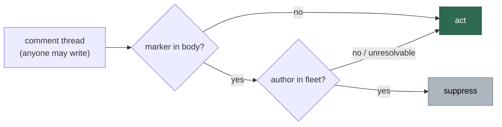

## Summary

Chunk 12c of the #1209 security-scan overflow: the untrusted-ingestion slice of
`worker/deno/lib/`. **177 modules** were read at their GitHub-data ingestion
points, every GitHub-sourced field classified as authenticated or
attacker-writable, and every trust decision traced. **The result was not empty** —
nineteen distinct root causes survived triage. Closes #1216.

One class was fixed here; the rest were filed. The class:

**SEC-1216-01 — comment-marker dedup with no author evidence.** Four modules
(seven call sites) read a marker out of an issue/PR comment body and acted on
the match without asking GitHub who wrote it. A comment body is text any GitHub
account may write, so each let one planted, invisible HTML comment steer the
worker — and every one of them failed towards silence.

| Module | What a planted comment did |
| ------ | -------------------------- |
| `lib/issue_comment_pages.ts` `issueCommentsContainMarker` | The shared helper. Substring-matched the **raw page JSON**, so a marker anywhere in the payload from anyone counted. Four callers: the blocking-PR stall escalation (suppressed outright), each stall-reason comment, the self-schedule announcement, the CI-nudge audit trail |
| `lib/needs_human_escalation.ts` | Every production dedup key is derivable from public numbers (`context-budget-<n>`, `merge-blocked:<repo>#<pr>`, …), so one marker silenced a hand-off's "why / next step" explanation for 24 h |
| `lib/run_failure_issue.ts` | The follow-up marker's epoch is attacker-chosen and unbounded, so `t - epoch < window` stayed true for ever and the descending sort put the forged comment first. Every later occurrence of the class was `PATCH`ed onto the attacker's comment — or, when the edit was refused, the class was permanently `suppressed:gh_failed`. Step 1 of the same function already author-verified the *issue* match; step 3 dropped the discipline |
| `lib/milestone_branch_self_heal.ts` | Permanently exempted a PR from being retargeted at its milestone branch, so its work merged to the default branch outside the milestone |

All four now route through `selectFleetAuthoredComments`
(`lib/alert_dedup_authors.ts`), so the comparison set is the fleet identity.
**The fail direction is uniform and safe:** every one of these markers
*suppresses* an action, so an unresolvable fleet identity discards every match,
the suppressed action goes ahead, and the condition is logged loudly.

**Why the existing gate missed it.** `marker_dedup_author_manifest.ts`'s scanner
recognises two shapes: a `--search` matching `in:title`/`in:body`, and a
`gh api …/comments --jq` that both selects on `.body` and projects it back. None
of these sites is either — they page raw REST comments with no `--jq` at all, or
project without a `select(.body`. Both manifest lists read zero while six live
instances sat in the tree. That blind spot is now written into the module, into
`SECURITY.md` §5 (whose "residual risk, stated" paragraph predicted exactly
this), and into the audit record.

## Evidence

Backend/CLI only — no web interface to screenshot. The evidence is the test
suite and the audit record.

**Regression tests were observed failing against the unfixed code.** Each new
test file was copied onto a scratch worktree at the milestone-branch base and
run there:

```
# base worktree, unfixed lib/issue_comment_pages.ts
issue_comment_pages - a planted marker from outside the fleet does not count ... FAILED
issue_comment_pages - the search continues past a page of planted markers ... FAILED
issue_comment_pages - an authorless comment carrying the marker does not count ... FAILED
issue_comment_pages - an unresolvable fleet identity fails towards acting ... FAILED
issue_comment_pages - the marker must be in a comment body, not anywhere in the payload ... FAILED
FAILED | 9 passed | 5 failed

run failure issue - a follow-up marker planted by an outsider is not updated in place (Issue #1216) ... FAILED
selfHealMilestoneBranches - a retarget marker planted by an outsider does not exempt the PR (Issue #1216) ... FAILED
escalateToHuman - a dedup marker planted by an outsider does not suppress the comment ... FAILED
```

All pass on this branch. Full gate: `./quality.sh` → **PASSED** (with the
environment's usual `config integration`, `pages-liquid` and
`mermaid built output` skips).

**The original trigger is closed with no trivial bypass.** The attack input was
a comment body containing the marker, posted by any account. It is now rejected
at the only place the decision is made: `issueCommentsContainMarker` parses each
page, collects the comments whose **`body`** carries the marker, reads each
one's `user.login`, and passes them to `selectFleetAuthoredComments`, which
keeps only logins in the fleet set. There is no second path to a `true` result —
the raw-JSON substring match that the old code used is deleted, so a marker
planted in any other field (a login, a URL, a `note`) no longer counts either,
and a comment with no readable author yields `null` and is discarded. The same
filter guards the other three modules, and `deps.dedupAuthors` is the only
injection point, which production never supplies. Flooding a page with planted
markers does not hide a later fleet marker (the scan continues past a page whose
matches were all rejected), and an unresolvable fleet identity discards *every*
match rather than accepting any.



**Findings filed** (each with a `<!-- finding-id: SEC-… -->` marker, a
`<!-- cwe: … -->` tag and `severity:*` / `confidence:*` labels):

| Id | Issue | Finding |
| --- | --- | --- |
| SEC-1216-02 | [#1243](https://github.com/stSoftwareAU/VibeCoder/issues/1243) | `idle_task_snapshot.ts` finding-id dedup trusts an unauthenticated issue body — one planted issue suppresses a real finding across ~12 scanners |
| SEC-1216-03 | [#1244](https://github.com/stSoftwareAU/VibeCoder/issues/1244) | the planning close-out path decides from unauthenticated text at four sites |
| SEC-1216-04 | [#1245](https://github.com/stSoftwareAU/VibeCoder/issues/1245) | measured catastrophic backtracking in `plan_coverage_gate.ts` — 40 000 dashes → 5.4 s, quadratic |
| SEC-1216-05 | [#1246](https://github.com/stSoftwareAU/VibeCoder/issues/1246) | milestone tracking issues identified by title alone → milestone branch deleted, third-party issue closed |
| SEC-1216-06 | [#1247](https://github.com/stSoftwareAU/VibeCoder/issues/1247) | conflict attempt history read from unauthenticated PR comments → two planted markers close the PR |
| SEC-1216-07 | [#1248](https://github.com/stSoftwareAU/VibeCoder/issues/1248) | issue title interpolated into the PR title unscrubbed → another issue stranded permanently |
| SEC-1216-08 | [#1249](https://github.com/stSoftwareAU/VibeCoder/issues/1249) | overflow tracker: 12 further findings beyond the per-run filing cap of six |

Full record, including the swept path list, the two negative sweeps and the
refuted set: `docs/audits/security-sweep-1216-untrusted-github-ingestion.md`.

## Acceptance Criteria

<!-- vibe-spec-review inputs="diff+issue-body" -->

- **met** — every module in the regenerated list read at its ingestion points,
  each GitHub-sourced field classified authenticated vs attacker-writable, every
  trust decision traced — evidence:
  `docs/audits/security-sweep-1216-untrusted-github-ingestion.md` reproduces the
  regeneration command (the reviewer re-ran it and got exactly 177) and carries
  the classification table plus a substantial refuted section — reviewer: met
- **partial** — surviving findings filed one per finding with a
  `<!-- finding-id: SEC-… -->` marker and `severity:*` / `confidence:*` labels,
  severity recalibrated for this exposure band — evidence: #1243–#1248 are one
  per finding and each carries the marker, a `<!-- cwe: … -->` tag and both
  labels — reviewer: partial — reason: #1249 bundles twelve root causes rather
  than filing each. That is the `docs/SECURITY-SCAN.md` Phase 4 rule ("cap 6 +
  overflow tracker") taking precedence over the issue's wording, so it stands;
  the reviewer could not see the filed bodies and so could not confirm the
  marker was written into them — it was, in all seven.
- **met** — any new unauthenticated-dedup site is added to the manifest rather
  than fixed silently, so the count stays visible — evidence:
  `worker/deno/lib/marker_dedup_author_manifest.ts`
  `MARKER_DEDUP_AUTHOR_UNVERIFIED_CONSUMERS` now carries five entries
  (`conflict_abandon_restart.ts`, `idle_task_activity.ts`,
  `idle_task_snapshot.ts`, `milestone_children_gate.ts`,
  `pr_merge_conflict_scan.ts`), each with a note — reviewer: partial — reason:
  the reviewer saw only two entries and was right that `idle_task_snapshot.ts`
  and `milestone_children_gate.ts` were left in prose; three more were added in
  response, including `idle_task_activity.ts`, which the manifest previously
  excluded on reasoning this sweep showed to be wrong. The non-marker text
  matchers (`planning_processor.ts`, `plan_coverage_gate.ts`,
  `idle_task_freshness.ts`) stay out — the manifest is about marker dedup
  lookups, and those are `Part of #N` prose, a markdown table and a
  last-comment read; they live in #1244 and #1249.
- **met** — an empty result stated explicitly — evidence: the audit record's
  "**This is not an empty result.** … Nineteen distinct root causes survived
  triage." — reviewer: met
- **met** — the fix ships with a test feeding attacker-shaped input through the
  real entry point, asserting the fail-closed direction — evidence: 14 new tests
  across 8 files, e.g.
  `worker/deno/tests/issue_comment_pages_test.ts::issue_comment_pages - a planted marker from outside the fleet does not count`
  — reviewer: met
- **partial** — the existing manifest gate catches any dedup-class finding —
  evidence: `worker/deno/tests/marker_dedup_author_cap_test.ts` (the real gate;
  the issue names a file that does not exist) passes with the new entries —
  reviewer: partial — reason: the two-directional staleness assertion covers
  only `MARKER_DEDUP_AUTHOR_UNVERIFIED_FILES`, and consumer entries cannot be
  gated that way *by construction* — the scanner is what makes the cap possible
  and these are the sites it cannot classify. Rather than fake a gate, the
  limitation is now stated in the module
  (`marker_dedup_author_manifest.ts`, "This list has no staleness gate, and
  cannot have one").
- **partial** — coverage detected by the `docs/audits/` record naming the swept
  paths — evidence: the record names 91 of the 177 paths individually and
  reproduces the exact regeneration command — reviewer: partial — reason: a
  later run must re-run the command to enumerate the other ~86. That matches the
  sibling record `security-sweep-1214-subprocess-argv.md`, which names its list
  the same way.
- **unrequested** — `lib/needs_human_escalation.ts` accepts a marker whose
  author equals the escalation's own `githubUser` without consulting the fleet
  set — reviewer: unrequested — reason: `githubUser` is worker configuration —
  the `GITHUB_USER` half of `resolveFleetMaintenanceAuthorSet` — compared
  against a GitHub-authenticated `comment.author`, so it is the same trust
  boundary rather than a bypass; it keeps the hand-off dedup working on a host
  whose fleet config cannot be read, which is the one place a *duplicate*
  needs-human comment is genuinely costly.
- **unrequested** — `lib/milestone_branch_self_heal.ts` swaps its hand-rolled
  `gh api --paginate … --jq .[].body` for the shared helper, which caps at
  `MAX_COMMENT_PAGES` — reviewer: unrequested — reason: reusing the helper is
  what makes the author check DRY, and the cap is itself a control
  (SEC-2ab604fe9137, #3709: unbounded `--paginate` materialises a whole thread
  in memory). Past 2 000 comments the marker becomes invisible and the PR is
  re-commented; that is the trade the bounded helper already makes everywhere
  else.
- **unrequested** — new `dedupAuthors` fields on
  `HandOffSuspiciousImageDeps`, `ProcessCiNudgeCandidateDeps`,
  `SelfDiagnosticDeps`, `EscalateBlockingPrStallDeps` /
  `ScanBlockingPrStallsOptions`, `MilestoneSelfHealDeps` and
  `EscalateUnworkableDeps` — reviewer: unrequested — reason: the seam the
  standards require, so a unit test names the fleet instead of reading the
  host's `.config.json`. Production omits it and reads the configured fleet.
- **unrequested** — `_data/page_titles.yml` gains the audit page — reviewer:
  unrequested — reason: `page_titles_completeness_test.ts` fails without it.

## Standards Review

<!-- vibe-standards-review inputs="diff+CODING-STANDARDS.md" -->

- **violation** — `worker/deno/lib/marker_dedup_author_manifest.ts:22` said
  "both lists below are now empty" while the same change repopulated
  `MARKER_DEDUP_AUTHOR_UNVERIFIED_CONSUMERS` — evidence:
  `worker/deno/lib/marker_dedup_author_manifest.ts:22` — reason: fixed in this
  diff; the header now records what #1216 found and what it recorded.
- **violation** — `SECURITY.md:1205` said "The manifest is now empty (Issue
  #1124)", false once the consumer list carries entries — evidence:
  `SECURITY.md:1205` — reason: fixed in this diff; §5's "residual risk, stated"
  paragraph now records that the risk it predicted landed.
- **violation** — `docs/archive/pr-summaries/pr-summary-1216.md` missing —
  evidence: the path itself — reason: this file.
- **violation** — the new unworkable-work-on regression test reached the fleet
  resolution with no `dedupAuthors`, so it read the host's `.config.json` —
  evidence: `worker/deno/tests/escalate_unworkable_work_on_test.ts:170` —
  reason: fixed by taking the seam the reviewer identified as missing —
  `EscalateUnworkableDeps.dedupAuthors` is forwarded to `escalateToHuman`, and
  the test names the fleet.
- **clean** — Australian English throughout (the only `color:` hits are Mermaid
  `style` CSS); fail-loud on every new path, each with its own
  `unverifiedOutcome` sentence and no catch-and-ignore added; TDD — 14 tests
  calling real exported entry points against injected `gh` stubs, no
  source-grepping, no sleeps, no `Deno.env.set`/`chdir`; the one existing test
  whose expectation changed is documented in place; all suites stay unit tests
  and run in ~1 s; `deno fmt`/`deno lint`/`deno check` clean; KISS/DRY — one
  shared helper threaded through an optional dep, no third fleet-identity
  definition, and `milestone_branch_self_heal.ts` is a net deletion; no hidden
  paths staged; Deno-native tooling only; no monolith created; audit doc
  cross-links resolve and use Mermaid with no literal Liquid.

## Test Plan

14 tests added, all feeding attacker-shaped input through the real entry point
and asserting the fail-closed direction; 2 existing tests updated (documented
above) plus their stubs, which now render the REST `user.login` shape the
production reads.

`worker/deno/tests/issue_comment_pages_test.ts`

- `::issue_comment_pages - a planted marker from outside the fleet does not count`
- `::issue_comment_pages - a fleet marker still counts on a thread an outsider also marked`
- `::issue_comment_pages - the search continues past a page of planted markers`
- `::issue_comment_pages - an authorless comment carrying the marker does not count`
- `::issue_comment_pages - an unresolvable fleet identity fails towards acting`
- `::issue_comment_pages - the marker must be in a comment body, not anywhere in the payload`

`worker/deno/tests/needs_human_escalation_test.ts`

- `::escalateToHuman - a dedup marker planted by an outsider does not suppress the comment`
- `::escalateToHuman - an unresolvable fleet identity posts rather than dedups`

Per-caller:

- `worker/deno/tests/blocking_pr_stall_detector_test.ts::an auto-fix-cap marker planted by an outsider does not suppress the escalation (Issue #1216)`
- `worker/deno/tests/collect_self_diagnostic_candidates_test.ts::self-schedule - an announcement marker planted by an outsider does not suppress the announcement (Issue #1216)`
- `worker/deno/tests/pr_ci_nudge_scan_test.ts::processCiNudgeCandidate - a nudge marker planted by an outsider does not skip the comment (Issue #1216)`
- `worker/deno/tests/run_failure_issue_test.ts::run failure issue - a follow-up marker planted by an outsider is not updated in place (Issue #1216)`
- `worker/deno/tests/milestone_branch_self_heal_test.ts::selfHealMilestoneBranches - a retarget marker planted by an outsider does not exempt the PR (Issue #1216)`
- `worker/deno/tests/escalate_unworkable_work_on_test.ts::escalateUnworkableWorkOn - a dedup marker from another author does not suppress the comment (Issue #1216)`

Modified, with the reason recorded in place:

- `worker/deno/tests/needs_human_escalation_test.ts::escalateToHuman - dedup: same key within 24h skips comment, still ensures label` and the
  `suspicious-image - re-run within 24h dedups the escalation comment` sibling —
  both now state the fleet, because a marker with no attributable author no
  longer dedups.
- `worker/deno/tests/escalate_unworkable_work_on_test.ts::escalateUnworkableWorkOn - idempotent: a prior dedup marker suppresses the comment` —
  now passes `githubUser: "bot"`, which is what makes the prior marker the
  worker's own.
