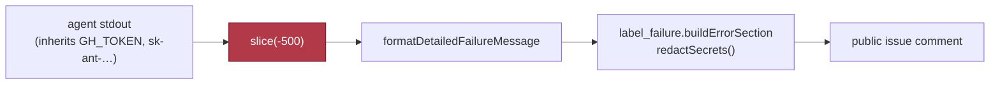

## Summary

Chunk 12d of the #1209 security sweep: environment, configuration and
secret-sink coverage across `worker/deno/lib/`. Closes #1217. Also closes #1256
(`kill_diagnostics` captures the host process table unredacted and cuts each
command line mid-token), which this change fixes in full.

The parent scan swept `lib/secret_redaction.ts` and found the redactor sound. A
redactor is only as good as the set of paths that route through it, and that set
had never been enumerated. It is enumerated now, in
`docs/audits/security-sweep-1217-env-config-secrets.md`, together with the token
scope-and-lifetime trace, the env-var trust table, and the per-module coverage
of all 45 modules in the slice.

**The defect fixed here.** `SECURITY.md` has required redact-before-truncate
since Issue #207, and Issue #3636 applied it to the no-changes comment. Ten
sibling call sites **in the same phase modules** used the inverted ordering:
they cut the agent's stdout to a 500-character tail and relied on the redaction
`label_failure.ts` runs later, when it builds the world-readable failure
comment. Every rule in `secret_redaction.ts` is anchored on the credential's
**leading** bytes, so a credential straddling that cut arrives with its anchor
gone and the later pass matches nothing. The AWS pair is the total case: the
secret access key has no shape of its own and is matched only through the
`AKIA…` id that precedes it, so a cut between the two publishes the whole secret
verbatim. The kill-time `ps` table — every process's argv, so every token any
process was handed on a command line — was cut the same way, twice.

**Fixed at the type level, not per call site.** Per-call-site redaction is
exactly what drifted: ten sites forgot the rule while their neighbour in the
same file applied it. `worker/deno/lib/redacted_text.ts` introduces
`RedactedText`, a branded string only `redactedTail()`, `redactedHead()` and
`joinRedacted()` can mint, each redacting the whole input **before** it trims.
`FailureDiagnosticContext.lastOutputSnippet` carries that brand, so
`claudeOutput.slice(-500)` no longer compiles. `parseProcessTable` redacts at
the single point both `ps` consumers pass through, before any truncation, and
`defaultReadKernelLog` masks the `dmesg` capture at its source.

This is the durable form the issue's **Failure Detection** section asks for,
carrying the same intent as `lib/gh_spawn_chokepoint_check.ts` (Issue #3703) — a
whole-codebase invariant enforced by the quality gate — realised as a type
rather than a regex scan, so it has no false positives and cannot be defeated by
a spelling the pattern did not anticipate. The enforcing stage is `deno check`,
which `./quality.sh` runs.

**Original trigger closed, no trivial bypass.** The trigger was raw
`claudeOutput.slice(-500)` (and its `-400` / `-300` siblings) flowing into
`lastOutputSnippet`. Every one of those call sites is gone, and the field's type
now rejects a plain `string`, so the exact input no longer compiles. The three
near-equivalent bypasses were each closed rather than argued away: a second
truncation inside `formatDetailedFailureMessage` (it now redacts before its own
cap), the per-row 89-character command cut inside `formatProcessTable`
(redaction moved up into `parseProcessTable`), and `joinRedacted`'s `separator`
— an unbranded `string` spliced into a branded result, which would have
laundered arbitrary text through the brand (it is now redacted like any other
input, with
`worker/deno/tests/redacted_text_test.ts::joinRedacted - the separator is
redacted, not trusted`
asserting it). What the brand does **not** claim is stated plainly in the module
docstring and the audit record: it cannot stop someone deliberately writing
`redactedTail(raw.slice(-500), 500)`, which type-checks. It removes the silent
inversion — the slice a call site reaches for by habit — not a determined one.

**Findings.** The sweep was not empty: fifteen root causes survived triage, all
filed with a `<!-- finding-id: SEC-… -->` marker and `severity:*` /
`confidence:*` labels. Nine (#1254–#1262) were filed by an earlier attempt at
this issue whose audit record and fix never landed; six more are new here —
#1280 (`quality.ts` is an entrypoint that never installs console redaction),
#1281 (the gate's `deno test` stage hands repo-supplied test code the whole
credential environment), #1282 (the `gh` credential staged to a predictable
`/tmp` path, chmod'd after the write, never removed), #1283 (`--title` and
`-f description=` reach GitHub unredacted), #1284 (no `git` argv chokepoint and
no `git` PATH shim), #1285 (`runPreSetupCommand` inherits the full worker
environment). Refuted candidates are recorded in the audit doc so the next run
does not re-derive them.

## Evidence

Backend/CLI change with no web interface to screenshot, so the evidence is test
output and the gate.

- `./quality.sh` — **PASSED** (all 20 checks; `config integration`,
  `pages-liquid` and `mermaid built output` skipped for missing local
  toolchains).
- `deno test tests/redacted_text_test.ts` — 14 passed, 0 failed.
- Red-then-green observed twice, by reverting one hunk at a time:
  - reverting `redactedHead(...)` in `failure_message.ts` back to
    `killDiagnostics.slice(0, MAX_KILL_DIAGNOSTICS_LENGTH)` →
    `AssertionError: no fragment of the token may survive the diagnostics cap`;
  - reverting `redactSecrets(text)` in `parseProcessTable` →
    `AssertionError: no fragment of the token may survive the 90-character
    command budget`.
- Every assertion in the new suite is "the known-shaped fake token is **absent**
  from the emitted output", so the fail direction is a leak: a broken ordering
  fails the test rather than passing quietly. Two tests additionally carry a
  negative control asserting the _unfixed_ ordering does leak
  (`redacted_text_test.ts:61`, `:96`).
- The token fixture is assembled at runtime rather than written as one
  credential-shaped literal.

Not caused by this change: `tests/setup_credential_provisioning_test.ts` fails
when an ambient `CONFIG_PATH` disagrees with the test's `CONFIG_FILE` (22
failures with it set, 22 passes with `env -u CONFIG_PATH -u CONFIG_FILE`). The
gate runs the stage with a clean environment and reports `deno tests:
PASSED`.

## Acceptance Criteria

<!-- vibe-spec-review inputs="diff+issue-body" -->

The issue states its criteria under **## Definition of done**.

- **met** — a written enumeration of secret-bearing sinks and, for each, whether
  it routes through `lib/secret_redaction.ts`, recorded under `docs/audits/` —
  evidence: `docs/audits/security-sweep-1217-env-config-secrets.md`, §"Sink
  enumeration" 1–7, every row carrying a `covered-by-*` /
  `explicit-redactSecrets-call` / **BYPASS** verdict — reviewer: met
- **met** — every module in the slice read at its `Deno.env` and config-load
  sites — evidence: the 45-row coverage table at the end of the audit doc; the
  reviewer independently re-derived the list (95 env readers − 304 sibling files
  = exactly 45) and matched it one-for-one — reviewer: met
- **met** — surviving findings filed one per finding as `security` issues with a
  `<!-- finding-id: SEC-… -->` marker and `severity:*` / `confidence:*` labels —
  evidence: #1254–#1262 and #1280–#1285, all fifteen verified open with the
  marker and both labels — reviewer: met — reason: the reviewer flagged three
  bookkeeping defects in the record (the unexplained `SEC-1217-01`/`-02` gap, a
  count of "fourteen" against fifteen issues, and `SEC-1217-06` listed as both
  fixed and filed); all three are corrected in the audit doc in this diff
- **met** — an empty result is stated explicitly — evidence: the blockquote
  under the audit doc's introduction, which states it was **not** empty and says
  by how much — reviewer: met
- **partial** — Failure Detection: a quality-gate check that fails the build on
  a direct write to a bypassing sink, in the shape of
  `gh_spawn_chokepoint_check.ts` — evidence: `worker/deno/lib/redacted_text.ts`
  plus the branded field at `worker/deno/lib/failure_message.ts:35`, enforced by
  the gate's `deno check` stage — reviewer: partial — reason: the reviewer is
  right that the guard covers one field and one class. A scan check was
  considered and rejected: the other BYPASS sinks the enumeration found are not
  one class but seven distinct ones (stdin bodies, SARIF gzip, titles, `git`
  argv, `pull.log`, the `quality.ts` entrypoint, the remaining inversions), each
  needing its own chokepoint rather than a shared regex, and each is filed with
  the fix shape written out. Building six more guards here would be the scope
  explosion the Change Scope rule forbids.
- **met** — each individual fix ships with a test asserting a known-shaped fake
  token is absent from the emitted output, with the fail direction stated —
  evidence:
  `worker/deno/tests/redacted_text_test.ts::failure message - a token
  straddling the snippet cut never reaches the published comment`,
  `::kill diagnostics - a token in a ps argv is masked before the per-row cut` —
  reviewer: met
- **unrequested** — the 14-line `RedactedText` paragraph added to `SECURITY.md`
  — reviewer: unrequested — reason: kept deliberately. The repo's own standard
  is that a code change owes a docs change, and a chokepoint recorded only in an
  audit file is one the next author routes around; the paragraph sits beside the
  redact-before-truncate rule it enforces.
- **unrequested** — `redactedHead()` and `joinRedacted()` beyond the two fixed
  sinks — reviewer: unrequested — reason: both have call sites in this diff.
  `redactedHead` is what `failure_message.ts` uses for the head-cut kill
  diagnostics; `joinRedacted` is what the two `execute_phase` sites that stitch
  a stdout tail to a stderr tail need in order to keep the brand across a
  concatenation.

## Standards Review

<!-- vibe-standards-review inputs="diff+CODING-STANDARDS.md" -->

- **violation** — line-wrapped `#3636` began a line and was parsed as an ATX
  heading, failing markdownlint MD018 — evidence:
  `docs/audits/security-sweep-1217-env-config-secrets.md` (the `#3636` line, now
  `:227`) — reason: fixed in this diff by rewrapping the sentence;
  `./quality.sh` now reports `markdownlint: PASSED`
- **violation** — the fake token was a one-piece, exact-shape PAT literal with
  no `.github/gitleaks.toml` entry — evidence:
  `worker/deno/tests/redacted_text_test.ts:34` — reason: fixed in this diff; the
  fixture is assembled at runtime from three fragments
- **violation** — the module docstring asserted the `dmesg` tail was redacted
  before its cut, which the code did not do — evidence:
  `worker/deno/lib/kill_diagnostics.ts:23` — reason: fixed in this diff by
  redacting in `defaultReadKernelLog`, so the comment now describes the code
- **violation** — the auth-failure snippet ran the full rule set twice, purely
  to re-mint the brand that `.trim()` erased (KISS/DRY) — evidence:
  `worker/deno/lib/phases/execute_phase.ts:985,992` — reason: fixed in this
  diff; it trims before minting
- **violation** — `joinRedacted` and `redactedHead` were new exported functions
  with no empty/zero/negative edge-case coverage — evidence:
  `worker/deno/tests/redacted_text_test.ts:98-108` — reason: fixed in this diff;
  five edge-case tests added, including the separator-laundering case the Spec
  reviewer found independently
- **violation** — the chunk 12a and 12c audit records are linked from
  `SECURITY.md`; the 1217 addition linked only the new module — evidence:
  `SECURITY.md` (the redact-before-truncate paragraph) — reason: fixed in this
  diff; the audit record is now linked, and registered in
  `_data/page_titles.yml`
- **clean** — Australian English throughout (`behaviour`, `colour`,
  `organisation`, `artefacts`, `tokenised`; the only `color` is a Mermaid
  `style` property); every test calls real code rather than grepping source,
  with the fail direction being a leak; `@param`/`@returns` on every new
  exported function; new logic in its own focused 113-line module rather than
  grown into `failure_message.ts`; module ↔ test pairing; correctly classified
  as a unit test (no spawned process, no wall-clock assertion, no ambient
  state); no hidden or credential-shaped path staged; Deno-native tooling only;
  existing test fixtures migrated to the new brand rather than the field being
  loosened; every commit carries the issue number and the run-id trailer

## Test Plan

New — `worker/deno/tests/redacted_text_test.ts` (14 tests):

- `::redactedTail - masks a token straddling the truncation boundary` — the
  regression test. Fails against the unfixed ordering, passes after the fix.
- `::redactedTail - keeps the tail within its budget and leaves prose intact`
- `::redactedTail - a zero or negative budget keeps nothing`
- `::redactedTail - empty input returns empty`
- `::redactedHead - masks a token straddling the head boundary`
- `::redactedHead - a zero or negative budget keeps nothing`
- `::redactedHead - empty input returns empty`
- `::joinRedacted - joins parts and drops the empty ones`
- `::joinRedacted - no parts, or only empty parts, yields empty`
- `::joinRedacted - a single part is returned without a separator`
- `::joinRedacted - the separator is redacted, not trusted`
- `::failure message - a token straddling the snippet cut never reaches the published comment`
- `::failure message - kill diagnostics are redacted before the 2000-character cap`
  — observed failing against the unfixed `formatDetailedFailureMessage`
- `::kill diagnostics - a token in a ps argv is masked before the per-row cut` —
  observed failing against the unfixed `parseProcessTable`

Modified — `worker/deno/tests/failure_message_test.ts`: four fixtures now mint
`lastOutputSnippet` through `redactedTail()` because the field carries the
brand. No test was removed, disabled or weakened; the assertions are unchanged.
