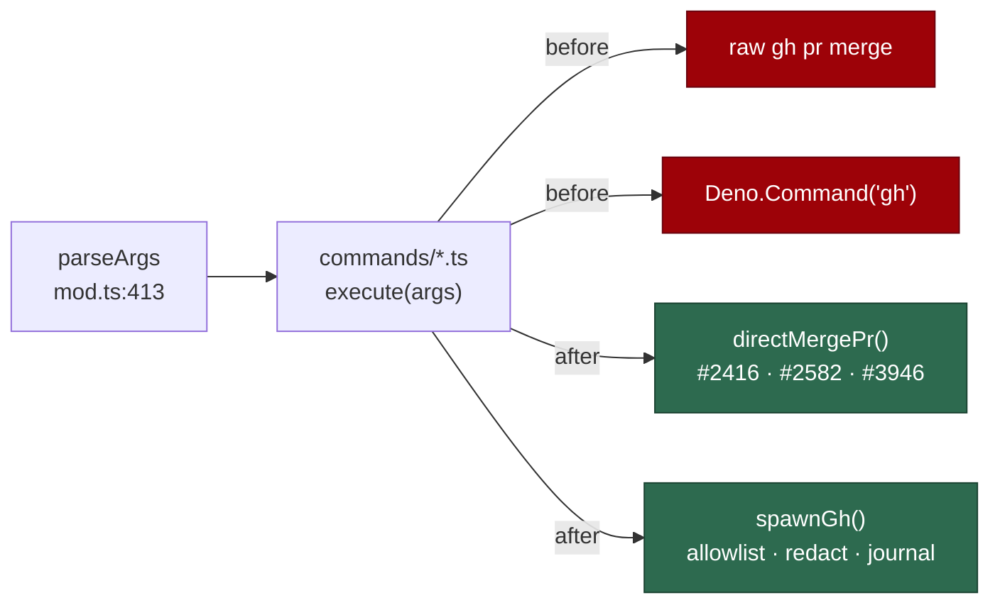

## Summary

Chunk 13 of the #1209 security-scan overflow: all **149** in-scope modules under
`worker/deno/commands/` read at their argument-parsing and dispatch points, in a
priority order posted to the issue before the sweep began. Fourteen root causes
survived triage — **five fixed here**, nine filed as `security` issues, two more
deduped onto issues that already existed. Closes #1218.

**This is not an empty result** — the issue asks that an empty one be stated
explicitly, and it was not empty.

One correction to the issue's framing, established before ordering: no module in
`commands/` reads `Deno.args` and none carries `import.meta.main`. All 149 are
dispatched through the single shared parser `mod.ts::parseArgs` (line 413), so
argument parsing is **one** surface for all of them, not 149 — and it is the
root cause of an entire filed finding class.

### Fixed in this PR

| ID          | Site                                                                            | Class                         | Severity |
| ----------- | ------------------------------------------------------------------------------- | ----------------------------- | -------- |
| SEC-1218-F1 | `commands/check_parent_dependencies.ts:70`                                      | confused deputy               | medium   |
| SEC-1218-F2 | `commands/pr_manager.ts:286`                                                    | privileged op without a guard | high     |
| SEC-1218-F3 | `commands/process_add_repo.ts:602`                                              | chokepoint bypass             | medium   |
| SEC-1218-F4 | `lib/worker_log_cleanup.ts:130` (reached from `commands/worker_log_cleanup.ts`) | destructive path handling     | high     |
| SEC-1218-F5 | `commands/load_config.ts:82`                                                    | command injection             | low      |

- **F1** — `getSubIssues` read the **timeline** and treated every
  `cross-referenced` event as a sub-issue. Anyone who writes `#123` in a comment
  creates one, and `checkParentBlocked` deliberately skips the
  `hasBackReference` confirmation for API-derived children because it trusts the
  endpoint to be authoritative; a cross-reference from another repo also yields
  a number that does not resolve here, and an unresolvable child counts as
  **open**. One comment produced a durable "blocked" verdict on an arbitrary
  issue. Now delegates to the shared
  `lib/native_sub_issues.ts::fetchNativeSubIssueNumbers`, as the pickup path
  already did (Issue #2470).
- **F2** — `--operation finalise-pr`'s `NotAllowed` arm hand-rolled a raw
  `gh pr merge`. `docs/MERGE.md:211` states the gate runs "from inside
  `directMergePr()` so **every** direct-merge call site is protected"; this was
  the one that was not, so a PR number handed to the command merged without the
  default-branch approval guard (#2416/#1082), the CI-green backstop (#2582) or
  the head-SHA pin (#3946). Now routed through the chokepoint, and a refused
  gate returns `success: false` instead of the previous
  `success: true, "direct merge
  attempted"`.
- **F3** — `defaultRunCommand` spawned `Deno.Command(cmd[0]!, …)` with
  `cmd[0] === "gh"`, so label writes against a repository named in an _issue
  title_ skipped the write-repo allowlist, body redaction and the audit journal
  — and the literal-only `GH_SPAWN_PATTERN` could not see it. Now delegated to
  `spawnGh`.
- **F4** — the foreign-file sweep deleted **every** unrecognised plain file
  older than 14 days in the configured log directory, and `log_dir: "~"` is an
  accepted configuration resolving that directory to the operator's `$HOME`,
  bind-mounted read-write into the container. `.bash_history`, `.gitconfig`,
  `.netrc` and any loose document went with it, on every worker start,
  unattended. Now restricted to an explicit worker-debris allowlist.
- **F5** — `exportScalar` escaped its value but never its **name**, and one name
  is built from a `.config.json` key. The output is `eval`'d, so a key of
  `PLAN; PATH=/tmp/evil; #` emitted a second statement that ran, silently. Now
  refused outright.

### Filed, not fixed here

#1263 (clarity gate disabled by a forgeable heading), #1264
(`close-duplicate-prs` selects victims by branch name), #1265 (export scrub gate
PASSes over unscanned files), #1266 (`parseArgs` type confusion defeats
`--dry-run` across seven commands), #1267 (log rotation over any
`.log`/`.jsonl`), #1268 (`DISK_CLEANUP_THRESHOLD` has no lower bound), #1269
(unvalidated ref from `.vibe_default_branch`), #1270 (`software-updates` silent
no-op), #1271 (`security-tree-sweep` unvalidated `--slug`). Deduped rather than
re-filed: **#1227** (variable binary name evades the `gh` chokepoint gate) and
**#1259** (`worker/deno/setup/` unscanned) — both independently confirmed live.

## Evidence

Backend/CLI only — no web interface to screenshot. The evidence is the test
suite and the swept-path record.

**Regression tests** — every fix ships one that goes RED against the unfixed
code and GREEN after it, verified by reverting each production file in turn and
re-running:

| Reverted file                           | Test that went red                                           |
| --------------------------------------- | ------------------------------------------------------------ |
| `commands/check_parent_dependencies.ts` | 3 tests in `check_parent_dependencies_test.ts`               |
| `commands/pr_manager.ts`                | `finalise-pr refuses an ungated direct merge…`               |
| `commands/process_add_repo.ts`          | `the default runner sends gh through the spawnGh chokepoint` |
| `lib/worker_log_cleanup.ts`             | `leaves unrelated old files…` + `isForeignDebrisName…`       |
| `commands/load_config.ts`               | `refuses a phase override key…` + `isSafeShellIdentifier…`   |

**Original trigger closed, no trivial bypass** — static reasoning over each
changed path:

- **F1** — the timeline is no longer queried at all (asserted), so there is no
  attacker-writable channel into the child set. The native `sub_issues` endpoint
  is populated only by a user with write access, and the `per_page=100` request
  is pinned by test so the REST default of 30 cannot creep back and truncate a
  child set into a false "not blocked". Planting a second cross-reference, a
  cross-repo reference, or a `- [ ] #N` checkbox all fail: the first two are now
  unread, and the body path still requires `hasBackReference`.
- **F2** — the arm has no `gh pr merge` argv of its own; it can only merge via
  `directMergePr`, which refuses a default-branch target absent an
  `approvedDefaultBranch` policy this call site does not pass, and otherwise
  merges only behind the CI-green + head-SHA gate. There is no second arm to
  fall through to — the test asserts that no bare `pr merge` argv reaches the
  runner at all.
- **F3** — the delegation is on `cmd[0] === "gh"`, the only spelling by which a
  `gh` binary can be named here; every `gh` call therefore reaches
  `enforceGhWriteAllowlist`, `redactGhBodyArgs` and `auditGhMutation`. A caller
  cannot spell around it, because `spawnGh` itself is the thing being reached.
- **F4** — the sweep changed from a denylist ("delete anything I do not
  recognise") to an allowlist ("delete only these shapes"), which is closed by
  construction: a filename not matching one of the five debris patterns is never
  a candidate, whatever the directory or the mtime. `.bash_history`,
  `.gitconfig`, `.netrc`, `notes.txt` and `id_rsa` are asserted non-matching.
- **F5** — the guard is on `exportScalar`, which is the **only** `export`-line
  emitter in the file, so the whole `eval`'d surface is covered. The refusal is
  a throw, so the script is never printed at all — there is no partial output to
  parse around. Metacharacter, backtick, `$()`, whitespace and digit-leading
  names are asserted refused.

**Swept-path record** — `docs/audits/security-sweep-1218-commands-cli.md`: the
bands, the method, the five fixes, the nine filed findings, the two dedups, and
the refutations, so a later run does not re-derive what was already dropped.

## Acceptance Criteria

<!-- vibe-spec-review inputs="diff+issue-body" -->

- **met** — every module in the regenerated list read, in the stated priority
  order, at its argument-parsing and dispatch points — evidence:
  `docs/audits/security-sweep-1218-commands-cli.md` (band tables,
  `comm`-verified coverage of 149) and the ordering
  [posted to the issue](https://github.com/stSoftwareAU/VibeCoder/issues/1218#issuecomment-5555500608)
  before the sweep — reviewer: partial — reason: the reviewer ran against a
  commit that predated the audit record and called the coverage record absent;
  it is present at HEAD, which is what makes the criterion verifiable.
- **met** — surviving findings filed one per finding as `security` issues with a
  `<!-- finding-id: SEC-… -->` marker and `severity:*` / `confidence:*` labels,
  severity recalibrated by exposure band — evidence: #1263–#1271 — reviewer:
  met.
- **met** — swept paths recorded under `docs/audits/` — evidence:
  `docs/audits/security-sweep-1218-commands-cli.md` — reviewer: missing —
  reason: same stale commit; the file is in the diff at HEAD and registered in
  `_data/page_titles.yml`.
- **met** — an empty result stated explicitly — evidence: the audit record and
  this summary both state the result was **not** empty and give the count —
  reviewer: met.
- **partial** — Failure Detection: route a privileged operation through the
  chokepoint _and let the corresponding build check keep it there_ — evidence:
  `commands/process_add_repo.ts` now routes through `spawnGh`
  (`tests/security_sweep_1218_test.ts::processAddRepoCommand - the default runner
  sends gh through the spawnGh chokepoint`)
  — reviewer: partial — reason: correct and accepted. `GH_SPAWN_PATTERN` still
  matches only a literal `Deno.Command("gh", …)`, so a variable binary name
  stays invisible to CI. That gap is #1227 and the unscanned `setup/` tree is
  #1259 — both pre-existing, both confirmed live by this sweep, and both outside
  `commands/`, which is why they are cross-referenced rather than widened into
  this change.
- **partial** — per-instance fixes ship a test that drives the real argument
  parser with the attacking input (leading-dash slug, unrecognised flag,
  traversing path) — evidence: `tests/security_sweep_1218_test.ts` and
  `tests/check_parent_dependencies_test.ts` drive each real `execute()` with the
  attacking input and assert refusal — reviewer: partial — reason: accurate. The
  tests hand `execute()` an already-parsed args object rather than going through
  `mod.ts::parseArgs`, because none of the five fixed findings is a
  parsing-surface finding. The parsing surface _is_ a finding — it is the root
  cause of #1266 — and the fix there is where a `parseArgs`-driven test belongs.
- **unrequested** — `lib/worker_log_cleanup.ts` is edited although the issue's
  Out of scope lists `worker/deno/lib/` as a sibling issue — reviewer:
  unrequested — reason: the finding is reached only from
  `commands/worker_log_cleanup.ts`, whose unvalidated `--log-dir` supplies the
  path; the deletion loop it hands that path to is in `lib/`. Fixing the command
  alone would leave the deletion intact, so the root cause was fixed where it
  lives.
- **unrequested** — `commands/pr_manager.ts` changes the `finalise-pr` result
  contract (a refused gate now returns `success: false`) — reviewer: unrequested
  — reason: a refusal reported as a success is the silent-failure shape the
  standards forbid, so it cannot stay `true`; `grep` finds no in-repo consumer
  of this operation's `success` beyond `mod.ts`'s exit code, which is the
  intended signal.
- **unrequested** — `defaultRunCommand` in `commands/process_add_repo.ts`
  widened from module-private to exported — reviewer: unrequested — reason: the
  runner is the unit under test and has no other seam; the alternative was
  spawning a real `gh`, which a unit test must not do.

## Standards Review

<!-- vibe-standards-review inputs="diff+CODING-STANDARDS.md" -->

- **violation** — DRY: the sub-issue fetch was re-spelt when
  `lib/native_sub_issues.ts::fetchNativeSubIssueNumbers` already existed —
  evidence: `worker/deno/commands/check_parent_dependencies.ts:88` — reason:
  fixed in this diff; the fetcher now delegates to the shared helper.
- **violation** — fail-loud / partial state: the hand-rolled call omitted
  pagination, so the REST default of 30 silently truncated a large parent's
  child set and an under-reported set reads as "not blocked" — evidence:
  `worker/deno/commands/check_parent_dependencies.ts:92` — reason: fixed by the
  same delegation (`per_page=100`), and pinned by a new assertion in
  `check_parent_dependencies_test.ts`. The residual — the helper's own one-page
  cap and its best-effort empty return — is stated in the audit record rather
  than forked here, because it is shared with the pickup path.
- **violation** — ambiguous ids: the in-code finding ids collided with the ids
  of the nine deferred findings filed as issues — evidence:
  `worker/deno/tests/security_sweep_1218_test.ts:42` — reason: fixed; the
  in-code ids are now `SEC-1218-F1..F5` and the filed ones `SEC-1218-01..09`,
  matching the audit record.
- **violation** — a published page missing from `_data/page_titles.yml` —
  evidence: `docs/audits/security-sweep-1218-commands-cli.md:1` — reason: fixed;
  registered, and `page_titles_completeness_test.ts` passes.
- **violation** — catch-and-ignore in the sub-issue fetch — evidence:
  `worker/deno/commands/check_parent_dependencies.ts:100` — reason: the local
  `catch` is gone with the delegation; the surviving best-effort catch is inside
  the shared helper, whose documented contract is "no native sub-issues found"
  == "endpoint unavailable" and whose callers fall back to the
  back-reference-checked body path. Changing it belongs with the helper, not
  this call site.
- **violation** — one test file covers four unrelated modules that each already
  have a suite — evidence: `worker/deno/tests/security_sweep_1218_test.ts:1` —
  reason: stands. The file is the sweep's regression record and is grouped by
  finding, following the existing `tests/security_scan_overflow_3707_test.ts`
  precedent; splitting it across four suites would lose that grouping.
- **violation** — three `await import(...)` calls inside test bodies in a file
  that otherwise uses static imports — evidence:
  `worker/deno/tests/security_sweep_1218_test.ts:126` — reason: stands, and it
  is load-bearing. A static import of a symbol the fix introduces makes the
  whole module fail to load against unfixed code, which turns a behavioural RED
  into a compile error; the dynamic import keeps each fix's fail direction
  observable independently.
- **violation** — argv-shape assertions (`assertEquals(seen, [["api", …]])`) —
  evidence: `worker/deno/tests/security_sweep_1218_test.ts:143` — reason:
  stands. The claim under test _is_ "this call reached the chokepoint", so the
  argv the chokepoint received is the outcome, not an implementation detail —
  and the paired `check_parent_dependencies_test.ts` assertions sit alongside a
  decision assertion.
- **violation** — the new `NotAllowed` arm's merged and deferred outcomes have
  no test — evidence: `worker/deno/commands/pr_manager.ts:308` — reason: stands.
  The security claim is the refusal, which is covered; the two success paths are
  `directMergePr`'s own contract and are covered by its suite.
- **violation** — `FOREIGN_DEBRIS_PATTERNS` re-states `worker-*` and `agent-*`
  shapes as looser variants of the two patterns above it — evidence:
  `worker/deno/lib/worker_log_cleanup.ts:108` — reason: stands, deliberately.
  The strict patterns govern _retention_ of live logs; the loose ones govern
  _deletion_ of rotation leftovers (`worker-99.log.3`) that the strict patterns
  correctly do not match. Merging them would widen retention.
- **clean** — Australian English throughout (no `color`/`behavior`/`-ize` forms
  in any changed line); JSDoc with `@param`/`@returns`/`@throws` on every new
  export; tests exercise real code against real temp directories rather than
  grepping source; no hidden paths staged; fail-loud error handling in the
  changed production code; `@std/assert` only; no sleeps, wall-clock budgets or
  ratio assertions; every changed file well under any size concern; commit
  messages carry the issue reference and the `Vibe-Coder-Run-Id` trailer.

## Test Plan

- **Added** `worker/deno/tests/security_sweep_1218_test.ts` — 6 tests:
  - `prManagerCommand - finalise-pr refuses an ungated direct merge onto the default branch`
  - `processAddRepoCommand - the default runner sends gh through the spawnGh chokepoint`
  - `workerLogCleanupCommand - leaves unrelated old files in the log directory alone`
  - `isForeignDebrisName - names worker debris only`
  - `isSafeShellIdentifier - accepts identifiers and refuses injection shapes`
  - `loadConfigCommand - refuses a phase override key that is not a shell identifier`
- **Added** to `worker/deno/tests/check_parent_dependencies_test.ts` — 3 tests:
  - `createGhIssueFetcher - getSubIssues ignores forged cross-referenced timeline events`
    — reproduces the flaw, fails against the unfixed code and passes after the
    fix
  - `createGhIssueFetcher - getSubIssues returns genuine native sub-issues`
  - `checkParentBlocked - a forged cross-reference does not block the parent`
- **Unchanged and still green**: `pr_manager_command_test.ts`,
  `worker_log_cleanup_test.ts`, `worker_log_cleanup_command_test.ts`,
  `load_config_test.ts`, `process_add_repo_test.ts`,
  `issue_dependencies_test.ts`. No existing test was modified or removed.
- **Full gate**: `./quality.sh` — every stage passes.
