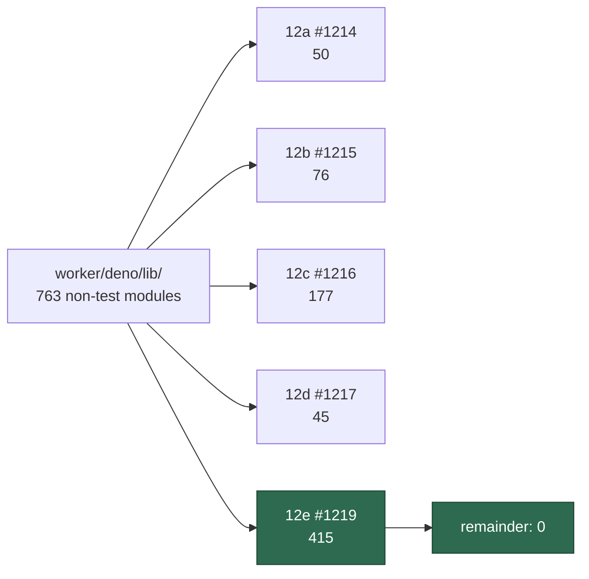

## Summary

Closes the chunk-12 coverage gap over `worker/deno/lib/` and fixes the two
findings that had a fix in reach. Closes #1219.

`lib/` became a 750-file gap because nothing recorded which paths had been read,
so a module added after a sweep was indistinguishable from one the sweep
skipped. This change makes that distinction checkable and then keeps it that
way:

- **`docs/audits/lib-sweep-coverage.json`** partitions all 763 non-test modules
  under `worker/deno/lib/` across the five chunk-12 slices — 50 / 76 / 177 / 45
  / 415, no module unowned, none claimed twice.
- **`docs/audits/security-sweep-1219-lib-closing-pass.md`** is the written
  record for the closing pass. Six already-filed finding issues cite it by name,
  and until this change it did not exist.
- **`worker/deno/tests/lib_sweep_coverage_test.ts`** enforces the partition
  against the real tree, so the gap cannot silently reopen.

**Not an empty result.** The issue asks that a nil return be stated explicitly,
because nil was the expected outcome for modules with no taint sink. It was not
nil: eight root causes survived triage — two fixed here, six filed as
[#1274](https://github.com/stSoftwareAU/VibeCoder/issues/1274)–[#1279](https://github.com/stSoftwareAU/VibeCoder/issues/1279),
each with a `finding-id` marker and `severity:*` / `confidence:*` labels.

### The two fixes

**SEC-1219-01 — `lib/gh_flag_parser.ts`.** `normaliseGhArgs` only inspected
`token[1]`, but pflag also accepts a shorthand _group_ where the first
value-taking letter swallows the remainder: `-iXDELETE` is `-i -X DELETE`.
Because `X` sat at index 2 the token passed through untouched, the classifier
saw no method, fell back to `GET`, and `gh api -iXDELETE repos/o/r/git/refs/…`
reached GitHub without the audit journal, the write-repo allowlist or the
issue-lifecycle guard. `-f`/`-F` were absent entirely, so `-fstate=closed` read
as a body `edit` rather than a `close`.

**SEC-1219-02 — `lib/blocked_deferral.ts`.** The one label write in `lib/` that
reached the labels API with no allowlist check, via a direct
`ghClient.addLabel`. Now routed through `assertWorkerCanApplyLabel`, with
`blocked` added to the allowlist so it describes what the worker actually does.

## Evidence

Backend/CLI change with no web interface, so no screenshot applies. The evidence
is the test suite and the full quality gate.

`./quality.sh` — **PASSED** after the final edit (20 stages; 3 skipped as
environment-dependent: config integration, pages-liquid, mermaid built output).

The coverage gate proved itself mid-change rather than after it. Merging the
milestone branch brought two modules created after the sweeps, and the test went
red naming exactly them:

```text
2 module(s) under worker/deno/lib are claimed by no sweep slice:
  - worker/deno/lib/redacted_text.ts
  - worker/deno/lib/xml_escape.ts
```

Both were then read for the shapes — `clampBudget` returns `0` on a non-finite
or negative budget (keeps less, not more), `escapeXml` replaces `&` first — and
claimed by 12e. A second reconciliation followed: `lib/audit_roster_recovery.ts`
was owned by 12b but appeared in no written record, i.e. marked swept without
having been read; it was read here and moved to 12e.



### Security-fix evidence

- **Regression test, fail direction stated.** Added
  `worker/deno/tests/gh_pflag_spellings_test.ts::gh-guard - refuses an off-allowlist api write hidden in a shorthand group`,
  which reproduces SEC-1219-01: it drives the real guard with `gh api -iXDELETE`
  against an off-allowlist repo. Against the unfixed `expandAttachedShorthand`
  the group is never expanded, the command classifies as a non-mutating `GET`,
  the guard allows it and the test **fails**; with the group walk it is refused
  and the test **passes**. Verified by checking out the pre-fix module and
  re-running: 6 failures in that file, 2 in
  `blocked_deferral_label_guard_test.ts` (the pre-fix red run needs
  `--no-check`, since the test also uses a dep added by the fix).
- **Original trigger closed, no trivial bypass.** `gh api -iXDELETE …` is now
  expanded to `-i -X DELETE` before classification, so it is a mutation and
  passes the journal, allowlist and lifecycle guard. The equivalent spellings
  are closed by the same walk rather than by special-casing: `-X DELETE`,
  `-XDELETE`, `-X=DELETE` and any boolean-prefixed group (`-vXDELETE`,
  `-iXPATCH`) all reach the same code path, and `-fstate=closed` now classifies
  as a `close`. The walk stops at the first value-taking letter, so a guard flag
  cannot be smuggled _behind_ one — `-q.fields` stays byte-identical rather than
  yielding a fabricated `-f`.

## Acceptance Criteria

<!-- vibe-spec-review inputs="diff+issue-body" -->

- **met** — every `lib/` path outside the four sibling slices read at least once
  — evidence: `docs/audits/lib-sweep-coverage.json` (415 paths in 12e) and
  `docs/audits/security-sweep-1219-lib-closing-pass.md` — reviewer: partial —
  reason: the reviewer marked this partial on one hole it found —
  `lib/audit_roster_recovery.ts` owned by 12b but recorded in no sweep record.
  That was a real defect and is fixed in this diff: the module was read and
  moved to 12e, which is why the status differs from the reviewer's verdict.
- **met** — swept paths recorded under `docs/audits/`, union is the whole tree,
  remainder demonstrably empty — evidence:
  `worker/deno/tests/lib_sweep_coverage_test.ts::every worker/deno/lib module is claimed by exactly one sweep slice`
  — reviewer: met — reason: the reviewer's "stale caveat" was that 12d was
  `claimed` rather than `swept`; #1217 has since closed and its record is
  merged, so all five slices are now `swept`.
- **met** — findings filed one per finding with a `finding-id` marker and
  `severity:*` / `confidence:*` labels — evidence: #1274–#1279, verified by the
  reviewer against `FINDING_ID_RE` — reviewer: met
- **met** — an empty result stated explicitly — evidence: the "This is not an
  empty result" block, plus explicit nils for `lib/phases/` and for the
  fail-open and constant-time shapes — reviewer: met
- **met** — progress recorded in the `docs/audits/` ledger as it goes —
  evidence: both the JSON ledger and the Markdown record — reviewer: met
- **met** — confirm #1106's template dedup fixes landed — evidence:
  `MARKER_DEDUP_AUTHOR_UNVERIFIED_FILES` is `[]` and
  `tests/marker_dedup_author_cap_test.ts` passes (11 tests) — reviewer: met
- **met** — no template applies a label outside the `worker_label_guard.ts`
  positive list — evidence: answered positively and filed as #1276; the guard
  has three call sites, all on existing issues, and the shared create-path
  filers call it zero times — reviewer: met
- **met** — Failure Detection: a test diffing `find lib …` against the ledger,
  failing on a file added since the sweep — evidence:
  `worker/deno/tests/lib_sweep_coverage_test.ts`; the reviewer verified it
  empirically by adding a probe module and watching it go red, and it caught two
  real modules during this change — reviewer: met
- **met** — individual fixes ship with a test that fails against the pre-fix
  code, fail direction stated — evidence: the reviewer checked out the pre-fix
  modules and observed 6 + 2 failures — reviewer: met
- **unrequested** — `localLedgerRecords()` and the "every sweep record the
  ledger names exists in the tree" test — reviewer: unrequested — reason: a
  dangling-reference check the issue did not ask for. Kept: six filed issues
  cite the record by name, and it was missing, so the sweep read as closed while
  being unauditable — this is the check that catches that.
- **unrequested** — `blocked` added to `WORKER_APPLIABLE_LABEL_LITERALS` —
  reviewer: unrequested — reason: traceable to SEC-1219-02, but the reviewer
  correctly notes it _widens_ the worker's label authority. Kept because the
  worker already applied the label unguarded; the allowlist now describes actual
  behaviour instead of contradicting it.
- **unrequested** — `-f`/`-F` added to the guard-read shorthand set — reviewer:
  unrequested — reason: same finding as the group walk, slightly wider than the
  `-iXDELETE` shape the record leads with; without it `-fstate=closed` still
  evades the issue-lifecycle guard.
- **unrequested** — `docs/archive/handover/issue-1219.md` — reviewer:
  unrequested — reason: worker-generated interruption note from the previous
  run's timeout, following an existing repo convention; not authored by this
  change.

## Standards Review

<!-- vibe-standards-review inputs="diff+CODING-STANDARDS.md" -->

- **violation** — the new published doc was not registered in
  `_data/page_titles.yml`, failing the page-titles completeness gate — evidence:
  `docs/audits/security-sweep-1219-lib-closing-pass.md:1` — reason: fixed in
  this diff; this was the failing `deno tests` stage.
- **violation** — `gh_flag_parser.ts` asserted an invariant the set did not hold
  ("letters absent here are boolean everywhere"); `-D` and `-j` take values and
  were missing — evidence: `worker/deno/lib/gh_flag_parser.ts:64-78` — reason:
  fixed in this diff. Both letters added, and the one genuinely ambiguous letter
  (`-i`: boolean in `gh api`, an int in `gh run watch`) is now documented with
  why it resolves in favour of `api` and why the residue is bounded. Covered by
  `gh_pflag_spellings_test.ts::normaliseGhArgs - a value shorthand outside the guard set ends the walk`.
- **violation** — the label-guard refusal branch and its `labelGuardLogFn` seam
  were never exercised; standards require an error path per modified public
  function — evidence: `worker/deno/lib/blocked_deferral.ts:254-262` — reason:
  fixed in this diff by adding an injectable `assertLabelAllowed` dep and
  `blocked_deferral_label_guard_test.ts::deferBlockedIssue - a refusing guard stops both label writes`.
- **violation** — `blocked_deferral.ts` commented the change as `SEC-1219-01`;
  the record assigns that id to `gh_flag_parser.ts` — evidence:
  `worker/deno/lib/blocked_deferral.ts:242` — reason: corrected to
  `SEC-1219-02`.
- **violation** — the test docstring said "411 modules"; the slice held 412 —
  evidence: `worker/deno/tests/lib_sweep_coverage_test.ts:8` — reason: the count
  moved again during the merge reconciliation, so the docstring no longer states
  a figure that can drift from the ledger.
- **violation** — `docs/AGENT-ACCOUNTABILITY.md:801-813` publishes the label
  allowlist as a table and does not list `blocked` — evidence: same file —
  reason: **stands.** That table was already stale for three other labels
  (`merge-conflict`, `degraded-model`, `needs-failure-detection-repair`), so
  bringing it up to date is a docs fix wider than this issue and outside the
  Change Scope rule. Recorded here rather than silently extended.
- **clean** — Australian English throughout code, comments, JSON and Markdown
  (the only `color:` hits are Mermaid `style` directives, i.e. CSS); tests call
  real functions with no source-grepping; no sleeps, wall-clock or ratio timing
  assertions (38 tests in the three touched files run in ~110 ms); fail-loud
  handling (`parseCoverageLedger` throws rather than returning a partial ledger;
  the refusal emits `[SECURITY] [WORKER_LABEL_REFUSED]`); JSDoc with
  `@param`/`@returns`/`@throws` on every new export; no hidden or credential-
  shaped paths staged; run-id trailers on every commit; 240 adjacent guard tests
  unaffected.

## Test Plan

Added:

- `worker/deno/tests/lib_sweep_coverage_test.ts` — 11 tests. Ledger parsing
  (including fail-loud on malformed input), the three diff directions (unswept /
  stale / duplicated), the tree walk, `localLedgerRecords`, the record-exists
  check, and the two gates over the real tree.
- `worker/deno/tests/gh_pflag_spellings_test.ts` — 23 tests over the real
  classifier and guard decision, including the shorthand-group bypass, the
  `-fstate=closed` lifecycle spelling, and the new value-letter walk boundary.
- `worker/deno/tests/blocked_deferral_label_guard_test.ts` — 4 tests, covering
  the allowlist invariant, the applied path, the refusal path, and that no label
  outside the allowlist is ever applied.

Full gate: `./quality.sh` PASSED.
