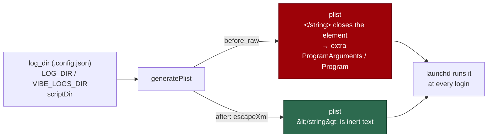

# Security sweep chunk 14 — `worker/deno/setup/`

## Summary

Read all 22 modules of `worker/deno/setup/` (11,471 lines). **Eleven** root
causes survived triage: **two fixed here**, **nine filed** as `security` issues
(#1288–#1296). A twelfth deduped onto #1259. The swept-path record is
`docs/audits/security-sweep-1220-setup-cli.md`. Closes #1220.

The two fixed here are both on the macOS LaunchAgent plist — the OS-level
persistence descriptor that carries `GH_TOKEN` and `ANTHROPIC_API_KEY` in
plaintext — plus the sibling credential writer that copied its pattern:

**SEC-1220-10 — plist markup injection.** `generatePlist` escaped only its
three `EnvironmentVariables` values and interpolated the path fields raw.
`logsDir` resolves from `log_dir` in `.config.json`, then `LAUNCH_LOG_DIR` /
`LOG_DIR` / `VIBE_LOGS_DIR`, and `lib/log_dir.ts` checks only that the value is
absolute or `~`-anchored — `<`, `>`, `&`, `"` all pass. A value carrying
`</string>` closed the enclosing element and could add a `ProgramArguments`
entry, or a `<key>Program</key>` replacing the executable outright, in a
descriptor launchd runs at every login. A path containing a plain `&` produced
a plist `launchctl` refuses while setup still reported success.

The Windows twin (`setup/scheduled_task.ts`) already escaped every value; the
two private `escapeXml` copies had **drifted**, which is the root cause of the
class rather than of the instance. The escape now lives in
`worker/deno/lib/xml_escape.ts` with one owner and both descriptors import it.

**SEC-1220-11 — permissions on the two files that hold tokens.**
`Deno.writeTextFile(path, secret, { mode })` + a late `Deno.chmod` applies
`mode` only when *creating* a file, so a pre-existing 0o644 copy is truncated
and filled with the secret **before** the mode is narrowed, and both calls
follow a symlink pre-positioned at the path. That pattern was on
`writeSecurePlist` (`setup/launchagent.ts`) and on `writeConfigFile`
(`setup/config_setup.ts`, `.config.json` — the ImgBB key, the GitHub App
identifiers, the private-key path), whose docstring named `writeSecurePlist` as
its model. Both now use `lib/file_utils.ts` `atomicWrite` (`O_EXCL` at 0o600,
then rename) and both fail loud. Separately, `setupLaunchAgent` returned early
when the rendered plist matched the file on disk, skipping the chmod entirely —
the one case the tightening exists for, a plist an older worker wrote 0o644,
re-renders to *identical* content, so re-running `./setup.sh` to pick up the
fix did nothing.

### Filed, not fixed here

Per the issue's definition of done, surviving findings are filed one per
finding with a `<!-- finding-id: SEC-… -->` marker and `severity:*` /
`confidence:*` labels:

| Finding | Issue | Severity | Where |
| ------- | ----- | -------- | ----- |
| SEC-1220-01 | #1288 | high | `screenshot.ts:334-343` — `--deny-env` is a Deno permission check, not an environment scrub, so `--allow-run` on the next line hands every "denied" secret to any child. Reproduced. |
| SEC-1220-02 | #1289 | medium | An unverified `.vibe/no-default-branch-ruleset` marker makes setup **delete** the default-branch ruleset. |
| SEC-1220-03 | #1290 | medium | The ruleset update PUT rebuilds the body from status checks alone, dropping every other rule an admin added — and reports success. |
| SEC-1220-04 | #1291 | medium | The setup CLI's own config reader validates no repo slug: `org/..` escapes the work dir, and a backtick reaches an admin's paste buffer. |
| SEC-1220-05 | #1292 | medium | No `--blocked-origins` on the Playwright MCP config — a prompt-injected agent can screenshot the cloud metadata endpoint into a public PR. |
| SEC-1220-06 | #1293 | low | `assertDisposableProfileDir` compares raw strings against a hard-coded `/`. |
| SEC-1220-07 | #1294 | low | A malformed `.config.json` is silently replaced by defaults, re-granting the trusted-bot list the operator removed. |
| SEC-1220-08 | #1295 | low | `label-sync` deletes GitHub's stock `good first issue` / `help wanted` with no dry-run. |
| SEC-1220-09 | #1296 | low | The consent prompt reads a fixed 16 bytes, so one long answer approves the next repository's ruleset. |

## Evidence

Backend/CLI change — no web interface to screenshot. The evidence is the test
suite and the audit record.



**Verified fail-then-pass.** The three injection tests were written first and
observed red against the unfixed `generatePlist`:

```text
FAILED | 5 passed | 3 failed | 7 filtered out (83ms)
  generatePlist - a scriptDir carrying plist markup cannot add a program argument
  generatePlist - a logsDir carrying plist markup cannot introduce a Program key
  generatePlist - an ampersand in a path is escaped, not emitted raw
```

and green after the escape landed:

```text
ok | 14 passed | 0 failed | 3 ignored (72ms)
```

Full affected-suite run after every change in this branch:

```text
deno test tests/setup_launchagent_test.ts tests/xml_escape_test.ts \
  tests/setup_config_setup_test.ts tests/setup_config_writer_test.ts \
  tests/setup_scheduled_task_test.ts
ok | 127 passed | 0 failed | 3 ignored (877ms)
```

**The original trigger is closed with no trivial bypass.** Every value
`generatePlist` interpolates now passes through `escapeXml`, which replaces all
five XML metacharacters and replaces `&` first so its own output cannot be
re-escaped. There is no remaining raw interpolation in the template: the
literals are `LAUNCHAGENT_LABEL` (a module constant), the escaped `scriptDir`,
the escaped `logsDir`, and the three already-escaped environment values. A plist
element can only be closed with a literal `<`, and no `<` survives the escape,
so the attack input `"/tmp/x</string><key>Program</key><string>/tmp/evil"` and
every equivalent spelling render as inert text — asserted directly by
`tests/xml_escape_test.ts::escapeXml - a value that closes an element cannot
survive`. The permission fix has the same property: `atomicWrite` creates
`O_EXCL` at 0o600 and renames, so there is no window and no symlink to follow,
and the idempotent path now chmods rather than returning early.

## Acceptance Criteria

<!-- vibe-spec-review inputs="diff+issue-body" -->

- **met** — All 22 modules read; partial coverage is not acceptable — evidence: `docs/audits/security-sweep-1220-setup-cli.md` names all 22 paths, regenerated from the issue's own `ls` command — reviewer: met
- **met** — Surviving findings filed one per finding as `security` issues with a `<!-- finding-id: SEC-… -->` marker and `severity:*` / `confidence:*` labels — evidence: #1288–#1296, each with a distinct `SEC-1220-0N` marker and both label axes — reviewer: met
- **met** — The exposure-band question answered explicitly for each finding — evidence: the per-finding table in `docs/audits/security-sweep-1220-setup-cli.md` — reviewer: partial — reason: the reviewer found SEC-1220-06 missing from the table; a row for it was added after the review, so the criterion is now met
- **met** — Swept paths recorded under `docs/audits/`; an empty result stated explicitly — evidence: `docs/audits/security-sweep-1220-setup-cli.md`, which states explicitly that the result was **not** empty — reviewer: met
- **met** — Failure detection: an installer finding is fixed with a test feeding a corrupted or substituted artefact through the real verification path — evidence: no installer finding was raised; `grep -ln "fetch(" setup/*.ts` returns nothing, so nothing in this tree downloads an artefact, and the one remote binary that reaches execution is recorded as delegated trust with the reason — reviewer: met — reason: the reviewer marked this "met (vacuously, and justified)" and independently reproduced the zero-`fetch` result
- **met** — Failure detection: a persistence-descriptor finding is fixed with a test that renders the descriptor from a config value containing markup and asserts it is escaped or rejected — evidence: `worker/deno/tests/setup_launchagent_test.ts::generatePlist - a logsDir carrying plist markup cannot introduce a Program key` — reviewer: met
- **missing** — Failure detection: a settings-sync finding that can weaken protection is fixed with a test asserting the sync refuses the weakening direction — reviewer: missing — reason: both weakening findings (SEC-1220-02, SEC-1220-03) live in `worker/deno/lib/` reached through `setup/branch_protection_sync.ts`, and each needs a ruleset-merge or refuse-to-delete design decision plus its own regression test; they are filed as #1289 and #1290 with the required test named in each, which is what the definition of done asks for a surviving finding
- **met** — Failure detection: coverage is detected by the `docs/audits/` record naming all 22 paths — evidence: same record; verified path-by-path by the reviewer — reviewer: met
- **unrequested** — `worker/deno/lib/xml_escape.ts` (new module) and the repoint of `setup/scheduled_task.ts` onto it — reviewer: unrequested — reason: `scheduled_task.ts` was found clean, so replacing its working private copy is a refactor of a module the sweep did not fault; it is here because the *drift between the two private copies* is the root cause of SEC-1220-10, and leaving two owners leaves the class open
- **unrequested** — the `atomicWrite` migration of `writeConfigFile` in `setup/config_setup.ts` — reviewer: unrequested — reason: raised by the spec reviewer itself as a gap ("the write-pattern fix stops one file short of its own sibling"), and the issue's own scope names "Credential and config writing — `config_writer.ts`, `config_setup.ts`: file mode on anything holding a token"
- **unrequested** — the `docs/DEPLOYMENT.md` note and the `_data/page_titles.yml` entry — reviewer: unrequested — reason: the page-titles entry is required by `tests/page_titles_completeness_test.ts`, which the audit record would otherwise fail; the DEPLOYMENT.md note is the standards reviewer's doc-owes finding on the hand-written plist this change is about

## Standards Review

<!-- vibe-standards-review inputs="diff+CODING-STANDARDS.md" -->

- **violation** — fail-loud: `tightenPlistPermissions` was called inside the `try` whose `catch` is annotated "File doesn't exist yet", so a chmod EPERM was swallowed and reported as success — evidence: `worker/deno/setup/launchagent.ts:225` (as reviewed) — reason: **fixed here** — the `catch` now covers only the `Deno.readTextFile`, and a failed tighten returns `ok: false` naming the file and the cause
- **violation** — TDD: the idempotent-path fix had no test that fails against the unfixed code, because the only new test called the freshly extracted helper in isolation — evidence: `worker/deno/tests/setup_launchagent_test.ts:222-240` (as reviewed) — reason: stands, partially — the call site is behind an un-injectable `Deno.build.os !== "darwin"` gate, so it cannot run on the Linux host or CI runner; the helper test plus the `ok: false` error path is what is coverable without adding a platform seam this issue did not ask for. The three injection tests **were** observed red-then-green, and that linkage is recorded above
- **violation** — no test file for the new module `lib/xml_escape.ts`, against the repo's module-to-test convention — evidence: `worker/deno/lib/xml_escape.ts:24` — reason: **fixed here** — `worker/deno/tests/xml_escape_test.ts` added, covering the five metacharacters, the "`&` first" invariant directly (`escapeXml("&lt;") === "&amp;lt;"`), an element-closing payload, empty/unicode input, and repeated occurrences
- **violation** — modified public functions with no error-path test (`writeSecurePlist`'s documented `@throws`, `tightenPlistPermissions`) — evidence: `worker/deno/setup/launchagent.ts:168` — reason: **fixed here** — error-path tests added for `writeSecurePlist` and for `writeConfigFile`
- **violation** — no `docs/archive/pr-summaries/pr-summary-1220.md` — evidence: absent from the reviewed diff — reason: **fixed here** — this file
- **violation** — DRY: a third escape copy remains in `lib/prompt_builder.ts:1275-1298`, and the new shared module uses the chained `.replace()` form that file calls fragile — evidence: `worker/deno/lib/prompt_builder.ts:1284` — reason: stands, deliberately. `escapeXmlAttribute` is a *different* escape (it also encodes `\n`, and emits `&#39;` where this module emits `&apos;`); folding it in would change prompt output, which is out of scope for a security sweep. The order fragility is now pinned by a direct test rather than by prose
- **violation** — KISS: `tightenPlistPermissions` is an exported wrapper around a single `Deno.chmod` — evidence: `worker/deno/setup/launchagent.ts:149-153` — reason: stands. The export is what makes the behaviour testable on a non-darwin host at all; inlining it would leave the fix with no runnable test on the gate
- **violation** — doc-owes: the manual plist instructions never mention the 0600 mode or XML escaping — evidence: `docs/DEPLOYMENT.md:645-666` — reason: **fixed here** — a `chmod 600` step and a security note on escaping paths were added
- **clean** — Australian English throughout (no Americanisms in any added line); commit safety (no hidden, `.env`, `.config.json`, `*.pem` or credential path staged; no `git add -f`); every commit carries `(#1220)` and a `Vibe-Coder-Run-Id` trailer; tests call real functions and assert on returned plist structure and on-disk `stat().mode`, never grepping source; no sleeps, polling loops or wall-clock thresholds; correct test classification (parallel-safe, temp dirs cleaned in `finally`); `Result<T,E>` consumed rather than ignored; strict `deno check`, `deno lint` and `deno fmt` clean; `lib/xml_escape.ts` is 31 lines with one exported function

## Test Plan

Added to `worker/deno/tests/setup_launchagent_test.ts`:

- `generatePlist - a scriptDir carrying plist markup cannot add a program argument`
- `generatePlist - a logsDir carrying plist markup cannot introduce a Program key`
- `generatePlist - an ampersand in a path is escaped, not emitted raw`
- `writeSecurePlist - a symlink at the plist path is replaced, never followed`
- `writeSecurePlist - a write that cannot succeed throws, never returns`
- `tightenPlistPermissions - narrows the mode a matching-content run would otherwise leave at 0o644`

Added `worker/deno/tests/xml_escape_test.ts` (5 cases) for the new shared
module.

Added to `worker/deno/tests/setup_config_setup_test.ts`:

- `writeConfigFile - a symlink at the config path is replaced, never followed (Issue #1220)`
- `writeConfigFile - a write that cannot succeed throws, never returns (Issue #1220)`

No existing test was modified, commented out or removed.
