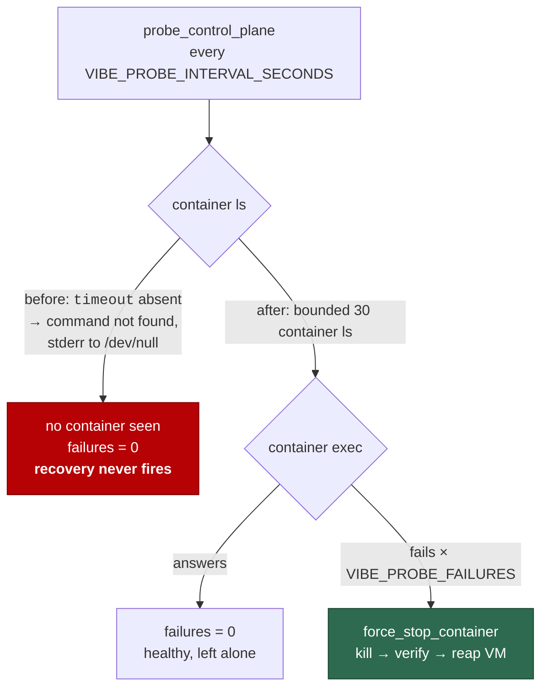

## Summary

Security-scan chunk 15: `run.sh`, `setup.sh` and `loop.sh` read end to end
(3,523 lines, not the "tens of thousands" #1209 estimated), `shellcheck`
triaged, five surviving root causes recorded — one fixed here, four filed as
`security` issues. Closes #1221.

**The fix.** `loop.sh` spelled `timeout 30 container …` literally in the Issue
#323 control-plane probe and its recovery, while the rest of the script used the
`gtimeout`/`timeout` it had already resolved. macOS ships neither binary —
`setup.sh:33-34` treats `timeout` as container-owned and never demands it on the
host — and Apple `container`, the runtime that probe exists for, is macOS-only.
So on a stock fleet host every one of those four calls was a `command not found`
with its stderr sent to `/dev/null`: `container ls` never ran, the probe
concluded there was no container, the failure counter reset every cycle, and the
recovery could never fire. All four now go through a `bounded <seconds>
<command>` helper matching the one `run.sh:196-204` already carries — bounded
where the host has a timeout, unbounded where it has not, never silently not run
at all.

**The review record** is `docs/audits/security-sweep-1221-shell-entry-points.md`,
in the shape of the six sibling chunk records already in `docs/audits/`.

## Evidence

Backend/CLI change with no web interface, so no screenshot. The evidence is the
regression test below, run in both directions, plus the `shellcheck` output the
record quotes.



### The five findings

| # | Where | Class | Severity | Status |
| - | ----- | ----- | -------- | ------ |
| 1 | `loop.sh` control-plane probe | a guard that cannot run | medium | fixed in this PR |
| 2 | `setup.sh:1120` | non-atomic write of a credential-bearing file (CWE-755) | medium | #1298 |
| 3 | `run.sh:1536` | incorrect permission on a critical resource (CWE-732) | low | #1299 |
| 4 | `setup.sh:811-833` | incomplete cleanup of a secret temp file (CWE-459) | low | #1300 |
| 5 | `setup.sh:351`, `:784` | code injection via an unquoted assignment (CWE-94) | low | #1301 |

Each filed issue carries a `<!-- finding-id: SEC-1221-0n -->` marker, a `<!-- cwe: … -->`
marker, and the `security` + `severity:*` + `confidence:*` labels
`docs/SECURITY-SCAN.md` prescribes.

### `shellcheck` triage — no finding came from the linter

At the level CI enforces, all three files are clean:

```console
$ shellcheck -e SC1091 -e SC2034 run.sh setup.sh loop.sh
$ echo $?
0
```

The gate the issue's Failure-Detection section asks for **already exists and
already covers these files**: `.github/workflows/validate-scripts.yml` runs a
pinned, SHA-256-verified `shellcheck` 0.11.0 over `find . -name "*.sh"` in the
`validate` job, which is a required status check for `Develop`, `main` and
`milestone/*`. No new gate was added — adding one would have been redundant.
With every optional check on, the three files produce 205 SC2250, 48 SC2310,
4 SC2312 and 2 SC2249, all triaged as style in the record. **All five findings
came from the read**, because each is semantic: a bound that resolves to a
missing binary, a truncation window, a file mode, a quoting contract between a
writer and a reader.

### Security-fix evidence contract

- **Test file in this branch's diff:** `worker/deno/tests/loop_supervisor_test.ts`.
- **Test identifier:**
  `worker/deno/tests/loop_supervisor_test.ts::loop.sh #1221 - the control-plane probe recovers a wedged container on a host with no timeout binary`.
- **Fail direction, observed both ways.** Against the pre-fix `loop.sh`
  (`git show origin/milestone/…:loop.sh`) it fails with
  `AssertionError: the probe must actually run \`container ls\` on a host with no timeout binary; container calls were:` and an empty log — the stub recorded
  nothing at all, because `container ls` never ran. Against this branch it passes
  in 3s. The test builds a `PATH` holding only the tools `loop.sh` needs and
  neither `timeout` nor `gtimeout` (the premise checked with a real `command -v`
  under that PATH), runs the real `loop.sh` against a `container` stub whose
  `exec` always fails, and asserts the stub recorded `kill vibe-coder-999`.
- **Original trigger closed, no trivial bypass.** The trigger was a literal
  `timeout` in the argv position of four calls. `grep -n timeout loop.sh` now
  returns only comments, the resolution loop, and `run_under_deadline`'s
  `--kill-after` invocation of `${TIMEOUT_CMD}` — which is already guarded by
  `[[ -z "${TIMEOUT_CMD}" ]]` and runs the command unbounded when there is no
  binary. Every remaining bound in the file is `bounded <seconds> …`, whose
  no-`TIMEOUT_CMD` branch runs the command rather than failing to find one.
  There is no equivalent bypass: a `timeout` reintroduced literally would be a
  new call site, and this test covers the probe path it would have to sit on.

**Test classification.** The test spawns the real `loop.sh`, so it lives in
`loop_supervisor_test.ts`, listed in
`worker/deno/lib/integration_test_manifest.ts:64` and run by the
`integration tests (not a required check)` job — the existing classification for
every launcher test in this repo, not a choice made here. It is stated rather
than glossed: the merge-gating counterpart for these files is `shellcheck` in
`validate`, which this change keeps clean.

## Acceptance Criteria

<!-- vibe-spec-review inputs="diff+issue-body" -->

The issue states its criteria under `## Definition of done` and
`## Failure Detection`.

- **met** — All three files read end to end; the chunk closes completely —
  evidence: `docs/audits/security-sweep-1221-shell-entry-points.md` —
  reviewer: met — reason: the reviewer spot-verified ~20 cited line references
  across `run.sh` and `setup.sh` and found every one exact.
- **met** — `shellcheck` run over all three and triaged, stating which findings
  came from the linter and which from the read — evidence: the
  "`shellcheck` triage" section of the audit record — reviewer: met — reason:
  the reviewer reproduced both passes and matched the per-file counts exactly.
- **met** — Surviving findings filed one per finding as `security` issues with a
  `finding-id` marker and `severity:*` / `confidence:*` labels — evidence:
  #1298, #1299, #1300, #1301 — reviewer: partial — reason: the reviewer could
  only see the diff and said the marker and label discipline "lives on GitHub
  and I cannot see it"; the four issues exist with those markers and labels, and
  the fifth root cause is fixed here rather than filed.
- **met** — The line-count correction reflected back on #1209 — evidence:
  <https://github.com/stSoftwareAU/VibeCoder/issues/1209#issuecomment-5556638007>
  — reviewer: partial — reason: same reason, the comment is a GitHub artefact
  the reviewer could not see; it is posted and quotes the 1,636 / 1,412 / 475 /
  3,523 table.
- **met** — An empty result stated explicitly — evidence: the audit record's
  opening blockquote and its "Categories the issue named that came back empty"
  section — reviewer: met.
- **met** — `shellcheck` enforced on these three files in the quality gate —
  evidence: `.github/workflows/validate-scripts.yml:255-260` — reviewer: met —
  reason: pre-existing and covering all three, so no gate was added.
- **met** — Individual fixes ship with a test that fails against the pre-fix
  script, fail direction stated — evidence:
  `worker/deno/tests/loop_supervisor_test.ts::loop.sh #1221 - the control-plane probe recovers a wedged container on a host with no timeout binary`
  — reviewer: met — reason: the reviewer ran it both ways and observed the red
  and the green itself.
- **partial** — Where a fix is not testable in CI, the finding issue records why
  — evidence: #1298–#1301 — reviewer: partial — reason: all four filed issues
  carry a "Failure detection" paragraph naming the test that would go red, so
  none of them invokes this clause; the reviewer could not see the issues to
  confirm it.
- **met** — Cross-reference `docs/BASH-SYNTAX-AUDIT-SCAN.md` and the
  `bash_syntax_audit_template.ts` idle task before starting — evidence: the
  "Cross-reference: the bash-syntax audit (template #12)" section of the audit
  record — reviewer: partial — reason: the reviewer's copy of the record did not
  yet carry that section; it was added in response to the review and states why
  that presence-only audit does not overlap this read.
- **met** — Out of scope respected (`.github/workflows/*.yml`,
  `container/Containerfile`, other shell scripts) — evidence: the diff touches
  neither — reviewer: met — reason: the reviewer found no material scope creep.

No `unrequested` entries: the reviewer traced every hunk to the issue —
`bounded()`/`TIMEOUT_CMD` are the minimum for finding 1, the test is the
Failure-Detection artefact, and the audit record is how "read end to end" and
"empty result stated explicitly" are evidenced. The `_data/page_titles.yml`
entry is not a behaviour change: it is what the repo's own
`page_titles_completeness_test.ts` requires of any new published `docs/` page.

## Standards Review

<!-- vibe-standards-review inputs="diff+CODING-STANDARDS.md" -->

- **violation** — documentation kept in step with code: the record's `loop.sh`
  line anchors were pre-change offsets — evidence:
  `docs/audits/security-sweep-1221-shell-entry-points.md:224` — reason: fixed
  here; every `loop.sh` anchor renumbered against the shipped file
  (`:458-462`, `:464`, `:167-199`, `:155`) and the line-count table marked as
  counted at the base commit.
- **violation** — a stated guard must be accurate: the record claimed a
  containment regression would fail "the required `Validate Scripts` check" —
  evidence: `docs/audits/security-sweep-1221-shell-entry-points.md:213-216` —
  reason: fixed here; `run_sh_launcher_test.ts` is in
  `integration_test_manifest.ts:66` and runs in the job named
  `integration tests (not a required check)`, and the record now says so.
- **violation** — never fail silently: the test's tool-symlink loop skipped a
  tool it could not find, crippling `loop.sh` and reporting the result as "the
  probe did not recover the container" — evidence:
  `worker/deno/tests/loop_supervisor_test.ts:831-835` — reason: fixed here; a
  missing tool now fails the test by name.
- **violation** — tests must assert something real: the `timeout`/`gtimeout`
  absence check tested a directory the helper had just populated from a literal
  list containing neither, so it could not fail — evidence:
  `worker/deno/tests/loop_supervisor_test.ts:840-848` — reason: fixed here;
  replaced with a real `command -v timeout || command -v gtimeout` run under the
  constructed `PATH`.
- **violation** — KISS/DRY: three coexisting representations of one fact
  (`TIMEOUT_CMD`, `TIMEOUT_PREFIX`, `bounded`) and a comment claiming every
  bound went through `bounded` when four call sites did not — evidence:
  `loop.sh:113` — reason: fixed here; `TIMEOUT_PREFIX` is gone, its three
  consumers use `bounded 120 …` or `${TIMEOUT_CMD}`, and the comment is true.
- **violation** — comment economy: a 12-line rationale for a 9-line helper,
  restated in the test and the record, where `run.sh`'s identical helper carries
  two — evidence: `loop.sh:110-121` — reason: trimmed here.
- **violation** — prove behaviour by awaiting the event, not by sleeping a fixed
  span — evidence: `worker/deno/tests/loop_supervisor_test.ts:895` — reason:
  fixed here; the fixed `delay(9_000)` became a bounded poll for the recovery
  marker, matching the `#399` case in the same file. The test now takes 3s
  instead of 9s.
- **clean** — Australian English throughout; bash 3.2 compatibility of the new
  helper and of the retained `${arr[@]+"${arr[@]}"}` idiom; `timeout`/`gtimeout`
  resolution order preserved; no absolute wall-clock threshold assertion; the
  test cleans up through the shared `killProcessTree`; no hidden or
  credential-shaped path staged; `shellcheck` clean at the level CI enforces;
  the `run.sh` and `setup.sh` line citations in the record all resolve; issues
  #1298–#1301 exist and are open.

## Test Plan

- **Added** `worker/deno/tests/loop_supervisor_test.ts::loop.sh #1221 - the control-plane probe recovers a wedged container on a host with no timeout binary`
  — the regression test for the fix, verified red against the pre-fix `loop.sh`
  and green against this branch.
- **Re-ran** the whole of `worker/deno/tests/loop_supervisor_test.ts`: 16 passed,
  0 failed — the existing `#323`, `#399`, `#342`, `#1836` and `#26` cases are
  unaffected by the `TIMEOUT_PREFIX` removal.
- **Re-ran** `worker/deno/tests/launcher_parity_test.ts` and
  `launcher_source_test.ts`: 21 passed, 0 failed.
- **`shellcheck -e SC1091 -e SC2034 run.sh setup.sh loop.sh`** and
  **`bash -n loop.sh`**: clean.
- **`./quality.sh`**: run to completion; see the run notes in the PR thread.
- No existing test was modified, commented out or removed.
