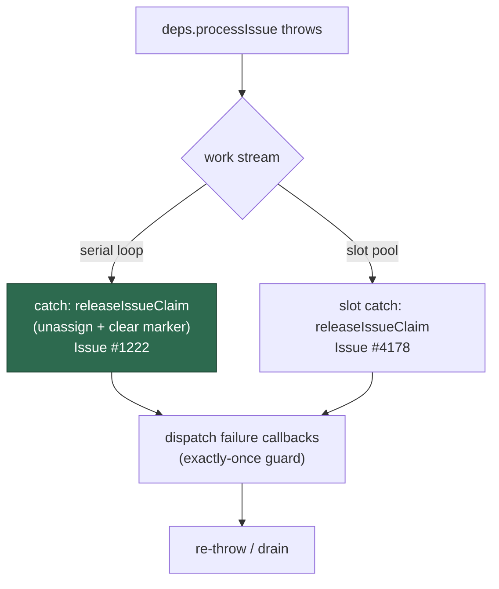

# A `processIssue` that throws now releases its claim

## Summary

The serial scan loop wrapped `deps.processIssue` in a `try`/`catch` that
dispatched the failure callbacks and re-threw **without** releasing the claim.
The heartbeat was already stopped by then (the pipeline's `stopHeartbeat`, or
`runWithRouteClaim`'s `finally` for a pre-pipeline route), so a thrown run left
the issue **assigned with a dead marker** — every host read the assignee as a
live claim until the ~30-minute assigned-without-heartbeat recovery freed it.

The serial loop's catch now calls `releaseIssueClaim` with the derived failure
outcome before the throw unwinds, exactly as the ordinary failure path does. The
release carries the post-run callbacks, so the exactly-once guard still reports
the failed run once.

The slot pool's throw path was found **already covered** — its slot-level catch
has released the claim since Issue #4178 (`run_core.ts:3374`). The issue's
suggested fix named both paths; a regression test now holds the pool's behaviour
too, so a future sync merge cannot silently drop it.

`claimNotHeld` (Issue #1139) does not apply on the throw path: every stand-down
— the pipeline's setup-phase claim refusal and all three pre-pipeline routes
through `routeRunResult` — *returns* a result rather than throwing, so a throw
reaching the catch never carries one. This is stated in the code comment and in
`docs/INTERNALS.md` rather than left implicit.

Closes #1222.

## Evidence

Backend/CLI change with no web interface to screenshot. The evidence is the
regression tests below, which drive the real `runCoreLoop` through injected deps
and assert on the observable side effect — whether `releaseClaim` was called for
the thrown issue.

Before the fix (unfixed `run_core.ts`):

```text
run_core claim release - a serial-loop throw releases the claim before it propagates ... FAILED
run_core claim release - a slot throw releases the claim ... ok
error: AssertionError: Values are not equal.
+   [ "o/a#1" ]     (expected)
-   []              (actual — nothing released)
FAILED | 1 passed | 1 failed
```

After the fix:

```text
ok | 56 passed | 0 failed   (throw-release + callbacks + slot-pool suites)
ok | 281 passed | 0 failed  (all run_core*.ts suites)
```

Full gate: `./quality.sh` — `Result: PASSED (with skipped checks)`.

Where the release now happens on each work stream:



## Reproduction

- **symptom** — a `processIssue` that throws left the issue assigned to the
  worker with a stopped heartbeat, so no host could claim it for ~30 minutes
- **status** — `verified` — the serial regression test was observed failing
  against the unfixed loop (output quoted above) and passing after the fix
- **regression test** —
  `worker/deno/tests/run_core_throw_release_test.ts::run_core claim release - a serial-loop throw releases the claim before it propagates`

## Test Plan

- Added `worker/deno/tests/run_core_throw_release_test.ts`:
  - `a serial-loop throw releases the claim before it propagates` — red before
    the fix, green after; also asserts the release carries a `no_pr` outcome so
    the release comment states the failure rather than going out blank.
  - `a slot throw releases the claim` — holds the pool's existing behaviour
    (Issue #4178) against future regressions.
- Re-ran the neighbouring suites unchanged: `run_core_callbacks_test.ts`,
  `run_core_slot_pool_test.ts`, and all `run_core*.ts` (281 tests, 0 failures).
- No existing test was modified or removed.

## Docs

- `docs/INTERNALS.md` — the **Unified claim release** bullet now lists the throw
  path, and a new bullet records why a throw releases and why `claimNotHeld`
  cannot apply to it.
