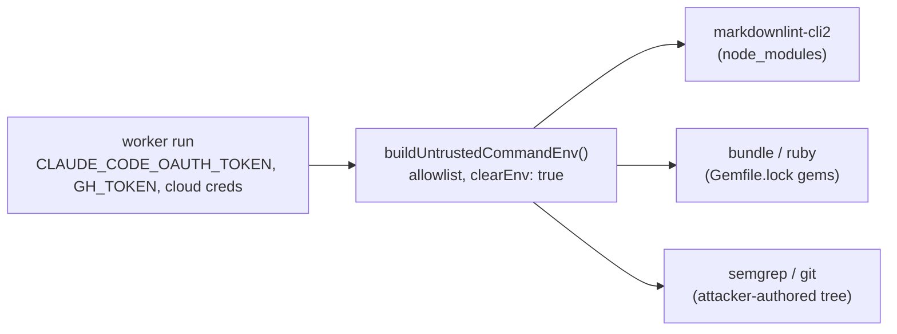

## Summary

Content-processing tooling no longer inherits the worker's credentials.
Issue #1214 built the environment for the three spawns of repository-supplied
code; a second band was left inheriting everything, so a compromised npm
dependency, gem or scanner image saw `CLAUDE_CODE_OAUTH_TOKEN`, `GH_TOKEN` and
any cloud credential the run held. Each of those sites now spawns with
`env: buildUntrustedCommandEnv()` and `clearEnv: true` — the same control
`quality_gate_phase.ts` applies. Closes #1226.

| Site | Spawn | Change |
| --- | --- | --- |
| `worker/deno/lib/markdownlint_check.ts` | `markdownlint-cli2` (runner and `--help` probe) | built environment, allowlist only |
| `worker/deno/lib/pages_liquid_check.ts` | `bundle`/`ruby` (driver and probe) | built environment, plus the Ruby toolchain names |
| `worker/deno/lib/security_tree_sweep.ts` | `semgrep`, container runtime | built environment, plus two declared container-runtime names |

The sweep's `git ls-files` half of that row is no longer a direct spawn: PR
#1327 (Issue #1227) routed `cmd.bin === "git"` through `runGitCommand`, the
shared git chokepoint that owns the timeout and the audit journal. That path is
left alone deliberately — `git` is the worker's own binary reading a tree, not
attacker-supplied code being executed, and narrowing the shared chokepoint's
environment would change every `git` call in the worker (`push` included, which
needs its credential helper). The scanner spawn beside it — the one that runs
attacker-reachable scanner code — is the one this change closes.

Two allowlist decisions came with it, both non-credential by name and by the
existing `ALLOWED_ENV_NAMES` guard test:

- `GEM_HOME`, `GEM_PATH`, `BUNDLE_PATH`, `BUNDLE_APP_CONFIG` join the shared
  allowlist. Without them `bundle exec` cannot resolve the gems the repository
  pinned and the pages-liquid check would quietly degrade to SKIPPED.
- `DOCKER_HOST` and `XDG_RUNTIME_DIR` are declared at the sweep call site via
  `extraNames`, because only the sweep reaches a container runtime — rootless
  podman and a remote Docker daemon are unreachable without them.

## Evidence

Backend/CLI change with no web interface, so there is no screenshot to
capture. The evidence is the tests below plus the full gate.

- New regression tests, run against the unfixed code and then against the fix:
  all three FAILED before (`… these names were inherited rather than built from
  the allowlist`) and PASS after. The red run was produced by stripping only
  the `env:`/`clearEnv:` lines from the three modules.
- `./quality.sh` → `Result: PASSED (with skipped checks)`, re-run after the
  milestone branch was merged in. The `markdownlint` stage still reports PASSED
  while running under the built environment, which is the live proof the
  allowlist carries what that tool needs. `pages-liquid` reports SKIPPED for a
  reason that predates this change and is not caused by it: the container has
  no `liquid` gem, so `bundle exec ruby -rliquid` fails identically with the
  worker's inherited environment and with the built one.

The `Security Tree Sweep` check on this PR reports 11 unbaselined findings, all
in files this branch does not touch (`repo_settings_harden.ts`,
`work_volume_prune.ts`, `container_extension_config.ts`, `run_core.ts` and
others) plus six stale baseline entries. It is pre-existing baseline drift on
the milestone branch — the same check fails on the other issue branches cut
from it, including #1227's, which merged — and not a required check.

Unrelated pre-existing breakage on the milestone branch, fixed here so the gate
is green: `lib_sweep_coverage_test.ts` failed because
`worker/deno/lib/gh_body_file_io.ts` (PR #1304) and
`worker/deno/lib/gh_timeout.ts` (PR #1319) were claimed by no sweep slice.
Verified failing with this branch's changes stashed. They are claimed in
`docs/audits/lib-sweep-coverage.json` by shape — the first reads and writes
files (slice 12b), the second is pure constants and functions (slice 12e) —
following the precedent of commit `a03159d`.

## Security Self-Check

- **Original trigger closed** — the reported flaw is that these children
  inherited the worker's environment. Every spawn on the three paths now passes
  `clearEnv: true` with an environment built by name from
  `ALLOWED_ENV_NAMES`, so a credential can only reach a child if its name is on
  that allowlist; the existing
  `untrusted_command_env_test.ts::ALLOWED_ENV_NAMES - the allowlist itself
  carries no credential name` guard rejects any credential-shaped addition, and
  the names added here (`GEM_*`, `BUNDLE_*`, `DOCKER_HOST`,
  `XDG_RUNTIME_DIR`) carry no secret. There is no trivial bypass: the
  allowlist is positive (unknown names are simply absent rather than filtered),
  `clearEnv: true` stops Deno merging the built environment over the inherited
  one, and the probe spawns beside each runner (`canRunBinary`, `canRunLiquid`)
  were changed too, so no sibling code path re-opens the same channel.
- **Input validation / injection surface** — no new external input is parsed
  and no argv is built from untrusted data; the change only narrows what an
  existing spawn can see.
- **Secrets** — no credentials or hidden files staged.

## Test Plan

New file `worker/deno/tests/content_tooling_env_test.ts` — each test drives the
real production spawn path with a stub binary that reports the environment it
was handed, and fails when any name the worker holds outside the allowlist
reaches the child:

- `worker/deno/tests/content_tooling_env_test.ts::markdownlint - the linter runs with a built environment, not the worker's`
  — reproduces the flaw at the markdownlint site (runner and `--help` probe),
  fails against the unfixed code and passes after the fix.
- `worker/deno/tests/content_tooling_env_test.ts::pages-liquid - the Ruby driver runs with a built environment, not the worker's`
  — same, for the Ruby/Liquid driver.
- `worker/deno/tests/content_tooling_env_test.ts::security tree sweep - scanners run with a built environment, not the worker's`
  — same, for the sweep's scanner runner, with the two declared
  container-runtime names allowed.

The tests read the process environment and never write it, so they stay out of
the `parallel_safety_cap_test.ts` (Issue #880) mutator list and run in the
gate's fast parallel pass.

Existing suites re-run unchanged: `markdownlint_check_test.ts`,
`markdownlint_probe_test.ts`, `pages_liquid_check_test.ts`,
`security_tree_sweep_test.ts`, `untrusted_command_env_test.ts`, plus the full
`./quality.sh`.
