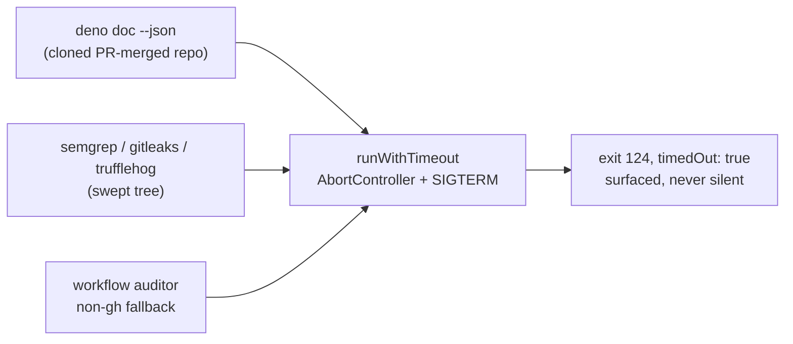

# Bound the three unbounded spawns over attacker-influenced content

## Summary

Three subprocess spawns processed attacker-influenced content with no
`signal`/`AbortController` at the spawn and none anywhere in their call chain,
so a stalled child was a hang rather than a slowdown — the worker's own
watchdogs starve and a human has to kill the host. Each now runs under
`runWithTimeout` from `lib/subprocess_timeout.ts` with an explicit bound. Closes
#1228.

| Site                                      | Spawns                                                                 | Bound                               |
| ----------------------------------------- | ---------------------------------------------------------------------- | ----------------------------------- |
| `worker/deno/lib/coverage_gap_scanner.ts` | `deno doc --json <workDir>` over the cloned, PR-merged repository      | `DENO_DOC_TIMEOUT_MS` = 120 s       |
| `worker/deno/lib/security_tree_sweep.ts`  | the scanners (`semgrep`, `gitleaks`, `trufflehog`) over the swept tree | `SWEEP_SCANNER_TIMEOUT_MS` = 900 s  |
| `worker/deno/lib/workflow_auditor.ts`     | the non-`gh` fallback branch                                           | `AUDITOR_COMMAND_TIMEOUT_MS` = 60 s |

The auditor's `gh` branch and the sweep's `git` branch were already delegated to
`spawnGh` / `runGitCommand` by Issue #1227, which own their timeouts; this
change closes the remaining direct-spawn branches beside them.

Each timeout fails **loud**, never as a clean result:

- `deno doc` — the runner emits a `⚠️` warning naming the timeout and throws.
  `findCoverageGaps` keeps its documented best-effort degradation to an empty
  gap list, so the run proceeds, but the timeout is on the log rather than
  indistinguishable from a repo with full coverage.
- the sweep scanners — `runWithTimeout` returns exit `124`, and `collectSemgrep`
  already treats any code outside `{0, 1}` as a fault, so a timed-out scanner
  throws `semgrep failed (exit 124) … Timed out after
  900000ms` instead of
  reporting a clean tree.
- the auditor — a spawn error throws with the binary named, matching the
  previous `Deno.Command` throw-on-spawn-failure behaviour; a timeout arrives as
  `success: false` with `Timed out after 60000ms` on stderr.

Issue #1226's credential boundary is preserved: the sweep still passes
`buildUntrustedCommandEnv(...)` with `clearEnv: true`, now through
`runWithTimeout`'s `env`/`clearEnv` options, and a test asserts both survive the
wrapping.



## Evidence

Backend/CLI change with no web interface, so no screenshot applies. The evidence
is the test run below, executed against both the unfixed and the fixed code.

Against the **unfixed** code (the three library files stashed, the new test
kept), the test fails — the bounds do not exist:

```
error: TS2305 [ERROR]: Module '.../lib/coverage_gap_scanner.ts' has no exported
member 'createDenoDocRunner'.
…
Found 6 errors.
error: Type checking failed.
```

Against the **fixed** code:

```
running 6 tests from ./tests/spawn_timeout_bounds_1228_test.ts
deno doc spawn is bounded and returns the document on success ... ok (702µs)
a timed-out deno doc fails loud and never reads as a clean scan ... ok (590µs)
sweep scanner spawn is bounded, keeping cwd and the built environment ... ok (402µs)
a timed-out sweep scanner surfaces exit 124, not an empty clean result ... ok (206µs)
workflow auditor's non-gh spawn is bounded ... ok (260µs)
workflow auditor reports a timed-out spawn as a failure ... ok (109µs)

ok | 6 passed | 0 failed (33ms)
```

The full gate was run in the foreground after the final edit:
`./quality.sh < /dev/null` → `Result: PASSED (with skipped checks)` (the three
skips are the pre-existing environment-gated checks: config integration,
pages-liquid, mermaid built output). The 88 tests of the three modules' existing
suites (`coverage_gap_scanner_test.ts`, `security_tree_sweep_test.ts`,
`security_tree_sweep_workflow_test.ts`, the three `workflow_auditor` suites and
`timeout_docs_consistency_test.ts`) also pass unchanged.

### Original trigger closed, no trivial bypass

The reported flaw is the **absence of a bound**, so it is closed when no path
through these three call sites can spawn without one. Statically, over the
changed code paths:

- every remaining spawn in the three modules goes through `runWithTimeout`,
  which always installs an `AbortController` firing at `timeoutMs` and kills the
  child with `SIGTERM`; the `timeoutMs` argument is a module constant at each
  call site, not caller-supplied, so no caller can pass `undefined`, `0` or
  `Infinity` to restore unbounded behaviour;
- the injected `runFn` seam is a **default parameter** used only by tests —
  production constructs the runners with no argument (`createDenoDocRunner()`,
  `createDefaultRunner()`, `createDefaultRunCommand(options.ghConfigDir)`), so
  the real `runWithTimeout` is always the one that runs;
- the two delegating branches (`git` → `runGitCommand`, `gh` → `spawnGh`) carry
  their own timeouts, so neither is an unbounded escape route;
- a timeout can no longer be read as success anywhere: exit `124` fails the
  sweep's collector check, the `deno doc` runner warns and throws, and the
  auditor returns `success: false`. There is no branch where a killed child
  yields a clean-looking result.

`deno check` and the `gh`/`git` spawn-chokepoint gates both pass, so no new
direct `Deno.Command` was introduced.

## Test Plan

- **Added** `worker/deno/tests/spawn_timeout_bounds_1228_test.ts` — six tests
  against the real runners with an injected subprocess runner (nothing is
  spawned, so each test takes microseconds):
  - `worker/deno/tests/spawn_timeout_bounds_1228_test.ts::deno doc spawn is bounded and returns the document on success`
  - `worker/deno/tests/spawn_timeout_bounds_1228_test.ts::a timed-out deno doc fails loud and never reads as a clean scan`
  - `worker/deno/tests/spawn_timeout_bounds_1228_test.ts::sweep scanner spawn is bounded, keeping cwd and the built environment`
  - `worker/deno/tests/spawn_timeout_bounds_1228_test.ts::a timed-out sweep scanner surfaces exit 124, not an empty clean result`
  - `worker/deno/tests/spawn_timeout_bounds_1228_test.ts::workflow auditor's non-gh spawn is bounded`
  - `worker/deno/tests/spawn_timeout_bounds_1228_test.ts::workflow auditor reports a timed-out spawn as a failure`

  These are the regression tests for this finding: they were run against the
  unfixed code (bounds absent → the suite fails to type-check, output quoted
  above) and against the fixed code (all six pass).
- **Unchanged and still passing**: the existing suites for the three modules —
  no test was modified, commented out or removed.
