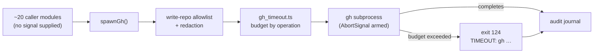

# The `gh` chokepoint now times out by default

## Summary

`spawnGh` attached an `AbortSignal` only when a caller supplied one, and the
dominant path (`github.ts:runGhCommandRaw` → `runGhOrThrow(args)`) supplies
none — so the great majority of `gh` invocations across the worker's ~20
calling modules ran with **no timeout at all**, and a stalled GitHub call hung
the run until the host was killed. Only `gh_wrapper.ts:defaultRunGhCommand`
wrapped its own call.

The control is now a **default at the chokepoint**, the same shape #1214 gave
`git` via `getTimeoutForOperation`: a new `worker/deno/lib/gh_timeout.ts` picks
the budget from the arguments, and `spawnGh` arms it on every attempt (the
credential re-stage retry gets a freshly armed signal, not the remains of the
first attempt's). A timed-out call fails loud — exit `124` with
`TIMEOUT: gh <args> timed out after <n>s` on stderr, which `runGhOrThrow`
turns into a thrown error — rather than hanging or returning empty stdout.

Closes #1229.

| Operation                | Budget | Environment override    |
| ------------------------ | ------ | ----------------------- |
| `gh repo clone`          | 600s   | `GH_CLONE_TIMEOUT`      |
| `gh api --paginate` read | 300s   | `GH_PAGINATED_TIMEOUT`  |
| everything else          | 60s    | `GH_COMMAND_TIMEOUT`    |

Callers may override with the new `timeoutSeconds` option; a caller that
installs its own `AbortSignal` (the rate-limit wrapper) keeps its own deadline
and its abort still propagates as an `AbortError`. A missing, unparseable or
non-positive override falls back to the default, so `GH_COMMAND_TIMEOUT=0`
cannot restore unbounded behaviour.



## Evidence

Backend/CLI change with no web interface, so there is no screenshot to
capture; the evidence is the test run and the full quality gate.

- Regression run against the **unfixed** `gh_spawn.ts`
  (`git show HEAD~1:… > gh_spawn.ts`, `deno test --no-check tests/gh_spawn_test.ts`):

  ```text
  spawnGh - arms a default timeout when the caller supplies no signal (Issue #1229) ... FAILED
  spawnGh - a stalled gh call is aborted and reported as a timeout (Issue #1229) ... FAILED
  runGhOrThrow - a timed-out call throws rather than returning empty stdout (Issue #1229) ... FAILED
  ```

- Same tests after the fix: `ok | 24 passed | 0 failed`, and
  `tests/gh_timeout_test.ts` `ok | 8 passed | 0 failed`.
- `./quality.sh < /dev/null` — **PASSED** (with skipped checks), including the
  `gh spawn chokepoint`, `semgrep`, `deno tests`, lint, type check and fmt
  stages.

**Original trigger closed, no trivial bypass.** The unbounded path was
`runGhCommandRaw` → `runGhOrThrow(args)` with no options: it reached
`runner(args, options)` with `options.signal === undefined`, so `Deno.Command`
was constructed without a signal and the call could block forever. Every
spawn now goes through `runWithTimeout`, the single place that invokes the
runner, and that function arms `AbortSignal.timeout(...)` whenever the caller
supplied no signal — there is no argument shape, option or caller that reaches
the runner unbounded, because the only alternative branch is one where the
caller installed its own deadline. The environment overrides cannot widen the
hole either: a `0`, negative, empty or non-numeric value is rejected in favour
of the built-in default.

## Test Plan

Added — all fail against the unfixed code and pass after the fix:

- `worker/deno/tests/gh_spawn_test.ts::spawnGh - a stalled gh call is aborted and reported as a timeout (Issue #1229)`
  — the regression test: a runner that never completes returns exit `124`
  with the `TIMEOUT: gh issue view 1` stderr instead of hanging.
- `worker/deno/tests/gh_spawn_test.ts::spawnGh - arms a default timeout when the caller supplies no signal (Issue #1229)`
  — reproduces the reported flaw directly: the runner used to receive
  `signal: undefined`.
- `worker/deno/tests/gh_spawn_test.ts::runGhOrThrow - a timed-out call throws rather than returning empty stdout (Issue #1229)`
  — a timeout surfaces as a thrown error, never a silent empty result.

Added — guarding the surrounding contract:

- `worker/deno/tests/gh_spawn_test.ts::spawnGh - a caller's own signal is passed through untouched (Issue #1229)`
- `worker/deno/tests/gh_spawn_test.ts::spawnGh - a caller signal's abort still surfaces as an error (Issue #1229)`
- `worker/deno/tests/gh_timeout_test.ts` — eight tests over the real
  `getGhTimeoutForOperation`: the three tiers, the documented environment
  overrides, the refusal of a non-positive override, an empty argument list,
  the process-environment default, and `isGhTimeoutExitCode`.
- `worker/deno/tests/operational_defaults_test.ts::operational_defaults - GH_PAGINATED_TIMEOUT defaults to 300`

No existing test was modified or removed. The tests inject their environment
(`envFrom`) rather than mutating `Deno.env`, so the parallel-safety cap
(Issue #880) stays green.

## Files changed

- `worker/deno/lib/gh_timeout.ts` (new) — the budget policy and the shared
  `124` exit code.
- `worker/deno/lib/gh_spawn.ts` — `runWithTimeout` around both runner calls,
  plus the `timeoutSeconds` option.
- `worker/deno/lib/gh_wrapper.ts` — imports the timeout constants it used to
  duplicate, so the defaults have one home (DRY; no behaviour change).
- `worker/deno/lib/operational_defaults.ts`, `docs/CONFIGURATION.md` — the new
  `GH_PAGINATED_TIMEOUT` default and a note that every `gh` invocation is now
  bounded at the chokepoint.
