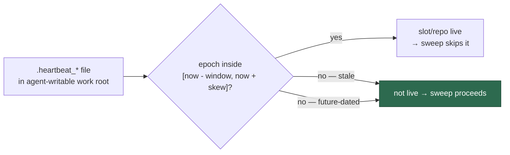

## Summary

A `.heartbeat_*` file in the agent-writable work root could switch the disk
reclaim off permanently. `repoHasHeartbeat` (`work_volume_prune.ts`) matched on
the **filename** only, so any file called `.heartbeat_a_<repo>_1` exempted that
repo's cargo `target/` from the artefact prune for ever — and nothing on the
sweep side ever removed it. `anySlotMidExecute` (`work_volume_tiers.ts`) and
`collectActiveRepos` (`session_sweeper.ts`) tested `now - epoch <= window` with
no upper bound, so a single file containing `9999999999` read as a live slot
for the next three centuries and every tier reclaim returned
`skippedSlotActive`. The self-healing that Issues #228/#242/#387 exist to
provide was silently off from that moment, and the host filled with no
recovery short of manual intervention.

The three readers now share one bounded liveness check,
`worker/deno/lib/heartbeat_freshness.ts`: a beat counts as live only inside
`[now - windowSeconds, now + HEARTBEAT_FUTURE_SKEW_SECONDS]` (skew 300s, for
NTP drift between a container and its host), and `repoHasHeartbeat` reads and
age-checks the file's epoch instead of trusting its name. Unparseable content
falls back to the file's mtime under the same bounds, so the microsecond window
in which a live worker's rewrite leaves the file empty does not read as "not
running" — and the fallback still expires. `parseHeartbeatEpoch` accepts digits
only and rejects millisecond-scale values, so `9999999999junk` and
`1786000000000` are no longer read as timestamps.

Closes #1232.



## Evidence

Backend/CLI change — no web interface to screenshot. The evidence is the
regression tests, run red against the unfixed code and green after the fix.

Red (fix reverted, tests present — `deno test --no-check --filter forged`):

```
FAILURES
sweepAllSessions - a forged future-dated heartbeat does not preserve a stale session => ./tests/session_sweeper_test.ts:283:6
repoHasHeartbeat - a forged future-dated heartbeat never marks a repo active => ./tests/work_volume_prune_test.ts:118:6
pruneWorkVolume - a forged heartbeat does not exempt a repo's artefacts => ./tests/work_volume_prune_test.ts:136:6
anySlotMidExecute - a forged future-dated heartbeat is not a live slot => ./tests/work_volume_tiers_test.ts:621:6
FAILED | 0 passed | 4 failed
```

Green (fix applied, the four suites together): `ok | 51 passed | 0 failed`.
The neighbouring work-volume, disk-space and stale-workdir suites also pass
unchanged: `ok | 110 passed | 0 failed`.

**Original trigger closed, no trivial bypass.** The attack input from the issue
— `${WORK_DIR}/.heartbeat_a_<monitored-repo>_1` containing `9999999999` — now
fails every reader: `isHeartbeatEpochLive` rejects any epoch more than 300s
ahead of `now`, so the file is inert on the first sweep rather than permanently
protective. The three near-miss variants are closed with it: a *filename with
no readable beat* no longer exempts a repo (`repoHasHeartbeat` reads the file);
a *non-numeric or millisecond-scale* payload is rejected by
`parseHeartbeatEpoch` rather than parsed loosely by `parseInt`; and the mtime
fallback used for unparseable content is bounded by the same window and skew,
so `touch -d '+1 year'` on the file does not restore the exemption either. The
worst an attacker can now achieve is a self-healing exemption lasting one
window (15 min for the work-volume sweeps), which the next sweep clears.

## Test Plan

New — `worker/deno/tests/heartbeat_freshness_test.ts`:

- `isHeartbeatEpochLive - a fresh beat is live, a stale one is not`
- `isHeartbeatEpochLive - a future-dated beat past the skew is never live`
- `isHeartbeatEpochLive - a non-finite epoch is not live`
- `parseHeartbeatEpoch - digits only, bounded to a plausible epoch`
- `isHeartbeatFileLive - reads the epoch and bounds it at both ends`
- `isHeartbeatFileLive - unparseable content falls back to a bounded mtime`

Regression tests reproducing the flaw (each fails against the unfixed code and
passes after the fix):

- `worker/deno/tests/work_volume_prune_test.ts::repoHasHeartbeat - a forged future-dated heartbeat never marks a repo active`
- `worker/deno/tests/work_volume_prune_test.ts::pruneWorkVolume - a forged heartbeat does not exempt a repo's artefacts`
- `worker/deno/tests/work_volume_tiers_test.ts::anySlotMidExecute - a forged future-dated heartbeat is not a live slot`
- `worker/deno/tests/session_sweeper_test.ts::sweepAllSessions - a forged future-dated heartbeat does not preserve a stale session`

Modified (documented, not removed):
`work_volume_prune_test.ts::repoHasHeartbeat - matches the repo segment of a
heartbeat file name` wrote the placeholder content `"1"` (epoch 1, i.e. 1970)
and asserted the repo was active. The file's epoch is now read and age-checked,
so the test writes a live beat and passes the injected clock; its
repo-segment-matching assertions are unchanged.
