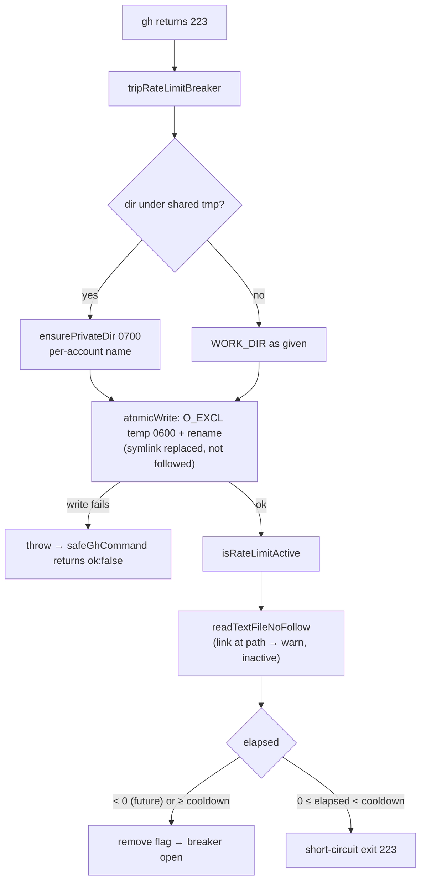

# Harden the gh rate-limit circuit breaker flag file

## Summary

The `gh` rate-limit circuit breaker kept its state in a fixed-name flag file
whose default directory could fall back to the shared `/tmp`, written with a
bare `Deno.writeTextFile`. Two variants of the same weakness followed: a
symlink planted at that path was followed and its target truncated, and a
plain file holding a **future** timestamp produced a negative `elapsed` that is
always below the cooldown, so the auto-reset never fired and every
`safeGhCommand` short-circuited with exit 223 indefinitely.

`worker/deno/lib/gh_wrapper.ts` now:

- routes the write through `atomicWrite` (`O_EXCL` temp file created `0600`,
  then rename), so a pre-positioned symlink is **replaced**, never followed;
- names the shared-temp fallback with `sharedTmpStateDir("vibe-gh-rate-limit")`
  (Issue #1215) via the new exported `defaultRateLimitFlagDir`, giving each
  account its own directory, created `0700` when it sits under the shared
  temporary root;
- reads the flag with `readTextFileNoFollow`, so a link at the flag path can
  never supply the timestamp — the refusal is logged, never swallowed;
- treats `elapsed < 0` (a future timestamp — clock jump or planted value) as
  expired and clears the flag, exactly as an aged one is; and
- reports a flag write that fails instead of dropping it: `tripRateLimitBreaker`
  throws with the path, and `safeGhCommand` converts that into an `ok: false`
  result rather than returning a rate-limited value behind a breaker that
  silently never tripped.

`Deno.stat` became `Deno.lstat` in the freshness probe so a dangling symlink
still counts as an existing entry. The `lstat`-then-write remains a TOCTOU, but
its only consequence is still the `freshActivation` boolean.

Closes #1233.

## Evidence

Backend/CLI change with no web interface to screenshot. Evidence is the test
suite plus the full quality gate.

Quality gate: `./quality.sh` — **PASSED** (semgrep, deno tests, lint, type
check, fmt all green; `config integration`, `pages-liquid` and
`mermaid built output` skipped as usual in this environment).

`deno test --allow-all tests/gh_wrapper_test.ts` — 25 passed, 0 failed.

### Security evidence

The six regression tests below were run **against the unfixed code first** (with
a stub `defaultRateLimitFlagDir` preserving the old
`WORK_DIR ?? TMPDIR ?? "/tmp"` semantics so the module still loaded) and all six
failed; after the fix all six pass. Named test identifiers, each added in this
branch's diff:

- `worker/deno/tests/gh_wrapper_test.ts::gh_wrapper - a future timestamp in the flag file expires the breaker`
  — reproduces the permanent-wedge variant: fails against the unfixed code
  (`isRateLimitActive` returns `true` forever), passes after the fix.
- `worker/deno/tests/gh_wrapper_test.ts::gh_wrapper - tripping the breaker does not write through a planted symlink`
  — reproduces the symlink-truncation variant: fails against the unfixed code
  (the victim file is truncated to an epoch), passes after the fix.
- `worker/deno/tests/gh_wrapper_test.ts::gh_wrapper - the flag file is owner-only (0600)`
- `worker/deno/tests/gh_wrapper_test.ts::gh_wrapper - a symlink at the flag path is not read as an active breaker`
- `worker/deno/tests/gh_wrapper_test.ts::gh_wrapper - defaultRateLimitFlagDir falls back to a per-account shared-tmp directory`
- `worker/deno/tests/gh_wrapper_test.ts::gh_wrapper - defaultRateLimitFlagDir prefers WORK_DIR`

**Original trigger closed, no trivial bypass.** Both reported triggers act by
pre-creating `${dir}/.gh_rate_limit_active`. The symlink trigger is closed
because every write now goes through `atomicWrite`, which creates its temp file
with `createNew` (`O_EXCL`) and `rename`s it over the target — `rename(2)`
replaces the link itself and never resolves it — and the matching read uses
`readTextFileNoFollow`, which `lstat`s and refuses any non-regular file, so
neither the read nor the write path can be redirected. The poisoned-timestamp
trigger is closed because the activation window is now bounded on **both**
sides: `elapsed < 0 || elapsed >= cooldown` clears the flag, so no value —
future, past, or non-numeric — can hold the breaker shut for longer than
`cooldown`. Replacing the flag with a directory, a FIFO or a hard link fails the
same `refuseNonRegular` check on read and is renamed over on write; the only
remaining effect an attacker retains is deleting the flag, which opens the
breaker rather than wedging it. Under the shared temporary root the path is no
longer shared at all: `sharedTmpStateDir` binds the directory name to this
account and it is created `0700`, so another local account cannot reach the
path in the first place.

## Test Plan

Added to `worker/deno/tests/gh_wrapper_test.ts` (existing tests unchanged):

- `gh_wrapper - a future timestamp in the flag file expires the breaker`
- `gh_wrapper - tripping the breaker does not write through a planted symlink`
- `gh_wrapper - the flag file is owner-only (0600)`
- `gh_wrapper - a symlink at the flag path is not read as an active breaker`
- `gh_wrapper - defaultRateLimitFlagDir falls back to a per-account shared-tmp directory`
- `gh_wrapper - defaultRateLimitFlagDir prefers WORK_DIR`

Existing coverage re-run green: `tests/gh_wrapper_test.ts` (25 tests) and
`tests/deno_bridge_migration_test.ts` (25 tests), plus the full `./quality.sh`
gate.
