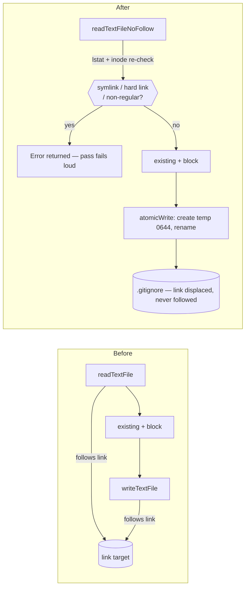

# PR Summary — symlink-follow on the `.gitignore`/`.gitattributes` rewrite (Issue #1234)

## Summary

`gitignore_enforcer.ts` read `${repoPath}/.gitignore` and
`${repoPath}/.gitattributes` with `Deno.readTextFile` and rewrote them with
`Deno.writeTextFile`. Both follow a symlink, and both paths sit inside a
monitored-repo clone that is the agent's writable working tree and persists
between runs — an untracked `.gitignore` symlink even survives
`git reset --hard` when the repo tracks no `.gitignore`. A planted link had the
canonical pattern block appended into whatever it pointed at, and the read side
copied the link target's content into the file written back.

The module now reads link-free and writes by rename:

- **`file_utils.readTextFileNoFollow()`** (new) — an `lstat` refuses a symlink,
  a hard link or any non-regular target before the open; the descriptor's inode
  is re-checked against a fresh `lstat` afterwards, closing the check→open
  window; an absent file is reported as `null` rather than thrown. Failure is
  returned, never swallowed.
- The private `lstatOrNull` / `refuseNonRegular` helpers take the caller's name
  and verb, so `appendNoFollow`'s existing messages are byte-identical and
  `refuseNonRegular` now returns an `Error` instead of a `Result<void>`.
- Both enforcer passes read through the new primitive and return the refusal as
  the pass's error (surfaced per-repo by `gitignore_sync.ts`), then write
  through `atomicWrite()` at mode `0644` — `rename(2)` never follows a link, so
  a link swapped in after the read is displaced rather than written through.

Closes #1234.

## Evidence

Backend-only change with no web interface to screenshot. The evidence is the
test run: the four new refusal tests fail against the unfixed enforcer and pass
after the fix, and `./quality.sh` passes in full (semgrep, deno lint, type
check, fmt, and the whole Deno suite).

Observed against the unfixed code:

```text
FAILED | 0 passed | 4 failed | 18 filtered out (7ms)
ensureGitignorePatterns - refuses a symlinked .gitignore (Issue #1234)
ensureGitattributesPatterns - refuses a symlinked .gitattributes (Issue #1234)
ensureGitignorePatterns - refuses a hard-linked .gitignore (Issue #1234)
ensureGitignorePatterns - refuses a non-regular .gitignore (Issue #1234)
```

After the fix:

```text
ok | 22 passed | 0 failed (69ms)   # tests/gitignore_enforcer_test.ts
ok | 48 passed | 0 failed (183ms)  # + file_utils_test.ts, gitignore_sync_test.ts
Result: PASSED (with skipped checks)   # ./quality.sh
```

Write path before and after:



### Trigger closed, no trivial bypass

The original trigger — a symlink at `${repoPath}/.gitignore` (or
`.gitattributes`) — is now rejected before any file content is read: the
`lstat` sees `isSymlink` and the pass returns an error, so neither the read nor
the write happens. The three near-miss bypasses are closed too:

- **Race the check** — a link planted between the `lstat` and the `open` is
  caught by the post-open inode comparison against a fresh `lstat`, and even a
  link planted after that is only ever displaced by `rename(2)`, which does not
  follow links.
- **Hard link instead of symlink** — refused by the `nlink > 1` check, which
  has no link for `lstat` to see but the same integrity effect.
- **Non-regular target** (directory, FIFO) — refused by the `isFile` check with
  an explicit message rather than an opaque `Is a directory` OS error.

The appended bytes were always a fixed constant, so there was no
attacker-chosen-content or code-execution path to close beyond this.

## Test Plan

Added (all fail against the unfixed code, pass after the fix):

- `worker/deno/tests/gitignore_enforcer_test.ts::ensureGitignorePatterns - refuses a symlinked .gitignore (Issue #1234)`
  — plants a `.gitignore` symlink over a victim file, asserts the pass fails
  with a `symlink` error, the victim is unchanged, and the link is refused
  rather than silently replaced.
- `worker/deno/tests/gitignore_enforcer_test.ts::ensureGitattributesPatterns - refuses a symlinked .gitattributes (Issue #1234)`
  — same for the `.gitattributes` pass.
- `worker/deno/tests/gitignore_enforcer_test.ts::ensureGitignorePatterns - refuses a hard-linked .gitignore (Issue #1234)`
  — hard-linked target refused, partner file unchanged.
- `worker/deno/tests/gitignore_enforcer_test.ts::ensureGitignorePatterns - refuses a non-regular .gitignore (Issue #1234)`
  — a directory at the path is refused with `not a regular file`.
- `worker/deno/tests/file_utils_test.ts::readTextFileNoFollow - reads a regular file`
  — happy path.
- `worker/deno/tests/file_utils_test.ts::readTextFileNoFollow - reports an absent file as null`
  — edge case: missing file is not an error.
- `worker/deno/tests/file_utils_test.ts::readTextFileNoFollow - refuses a symlink, a hard link and a directory`
  — error paths for the new primitive.

Existing coverage kept green and unmodified: the `appendNoFollow` tests (whose
messages the helper refactor preserves), the full `gitignore_enforcer` suite
(idempotency, user-content preservation, `git check-ignore` behaviour), and
`gitignore_sync_test.ts`.
