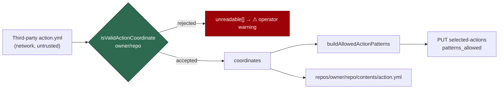

# Validate action coordinates parsed from third-party manifests (Issue #1235)

## Summary

`resolveTransitiveActionCoordinates` collected `owner/repo` straight out of
`runs.steps[].uses` in a **network-fetched third-party `action.yml`** and let it
flow, unvalidated, into two sinks: `buildAllowedActionPatterns` (whose output is
PUT to `actions/permissions/selected-actions` as `patterns_allowed` under
`--apply`) and the `repos/{owner}/{repo}/contents/action.yml` endpoint. A
hostile composite action could therefore emit an everything-pattern that
silently disabled the allow-list this module exists to enforce, or steer the
contents GET with `..` segments.

`isValidActionCoordinate(owner, repo)` now gates every one of those points:
owner and repo must be GitHub name characters (`[A-Za-z0-9._-]+`) and must not
be the `.` or `..` path segments. A rejected coordinate is **reported** through
the existing `unreadable` channel — the operator sees
`⚠ Could not read the manifest of N action(s)` — never silently dropped.

Closes #1235.



## Evidence

Backend/CLI change — no web interface to screenshot. The evidence is the
regression tests below plus the full local gate.

Observed red against the unfixed code (the exact vulnerability in the issue):

```text
[Diff] Actual / Expected
-     "*/*@*",
-     "../..@*",
...
FAILED | 11 passed | 2 failed
```

Green after the fix: `deno test tests/repo_settings_harden_test.ts` →
`ok | 14 passed | 0 failed`. `./quality.sh` → `PASSED (with skipped checks)`
(skips are environment-only: Ruby/Liquid, `.config.json`, no Pages build).

**Original trigger is closed with no trivial bypass.** The `uses: */*@v1` input
from the issue is rejected in `visit()` before `coordinates.add`, so no pattern
is built from it, and rejected in `readActionManifest` before the endpoint
string is built, so no `..` reaches the API path. Both sinks named in the issue
are covered, and `buildAllowedActionPatterns` re-checks independently, so a
coordinate reaching it by any other route is dropped too. The allowlist is
character-class based (only `A-Za-z0-9._-`, with `.` and `..` excluded as whole
segments), so there is no encoding or wildcard variant that passes it — `*`,
whitespace, `/`, `%2e%2e` and `:` are all outside the class. Every element of a
multi-segment path (`owner/repo/sub`) is taken from `split("/")` and each of the
first two segments is validated individually.

## Test Plan

Added to `worker/deno/tests/repo_settings_harden_test.ts`:

- `worker/deno/tests/repo_settings_harden_test.ts::resolveTransitiveActionCoordinates - a hostile manifest's wildcard and traversal uses: are rejected, never collected and never fetched (Issue #1235)`
  — serves a hostile composite manifest through the `gh` stub and asserts the
  wildcard/traversal/whitespace coordinates are neither collected nor turned
  into an API path, that the legitimate step still is, and that each rejection
  is reported. **Fails against the unfixed code** (it produced `*/*` in the
  coordinates and `*/*@*` in the patterns) and passes after the fix.
- `worker/deno/tests/repo_settings_harden_test.ts::buildAllowedActionPatterns - a wildcard or traversal coordinate never becomes an allow-list pattern (Issue #1235)`
  — the second sink, directly. **Fails against the unfixed code** (emitted
  `*/*@*`, `../..@*`, `./local@*`) and passes after the fix.
- `worker/deno/tests/repo_settings_harden_test.ts::parseAllowActionArg - an operator coordinate the pattern builder would drop is rejected loudly, not silently (Issue #1235)`
  — `--allow-action ../..` used to parse and would now be dropped by the
  hardened pattern builder; it is rejected with the existing loud error
  instead, so the fix introduces no silent drop.
- Extended the existing `allowListCovers` test with multi-wildcard and exact
  patterns, covering the glob matcher that replaced the constructed `RegExp`.

Not requested by the issue, but required to land it: the pre-existing
`new RegExp(...)` in `allowListCovers` is flagged by the repo's semgrep gate
(`detect-non-literal-regexp`) as soon as the file is in a change set, which
blocked the gate. It is replaced with a linear `*`-glob scan — same behaviour,
no ReDoS surface — and covered by the extended test above.
