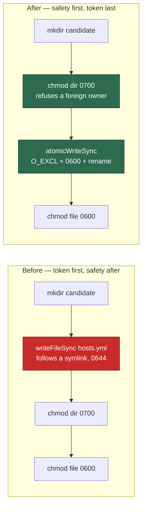

# Stage the gh credential symlink-free and private-first (Issue #1238)

## Summary

The worker's staged `hosts.yml` — a live GitHub token — was written with a bare
`Deno.writeFileSync` (`O_CREAT|O_TRUNC`, the process umask's mode, and it
follows a symlink at the target) into a directory that was only tightened to
0700 **after** the credential had landed. Two of the three staging candidates
(`${VIBE_SCRATCH_DIR}/gh-config`, `${TMPDIR}/vibe-gh-config`) sit in the scratch
space the untrusted `agent` account can write, so a link pre-positioned at
`hosts.yml` sent the token wherever the attacker chose, and a pre-created 0755
directory let it read the token at 0644 for the width of the write. The
`catch {}` around the loop then moved a partially-staged credential quietly to
the next candidate. Closes #1238.

- `productionIo.writeFile` now writes through `file_utils`' `atomicWriteSync`:
  a kernel-random sibling created with `createNew` (`O_EXCL`) at mode 0600 and
  renamed over the target. `rename(2)` **replaces** a planted symlink rather
  than following it, and the token is never on disk at any other mode.
- The staging directory is chmod'ed `0700` **before** the credential is
  written. `mkdir` accepts an existing directory of any mode or ownership
  silently, so ordering is the security property — and doing it first also
  refuses a candidate another uid owns or symlinked, because `chmod` belongs to
  the owner alone.
- The write probe in `isWritableDir` uses a `crypto.randomUUID()` suffix and
  `createNew`, removing the arbitrary-truncation primitive that the fixed
  `.vibe-write-probe` name gave on every path it probed.
- A candidate that fails now emits a `[SECURITY] cannot stage the gh
  credential into …` warning instead of being swallowed.
- `atomicWrite`/`atomicWriteSync` accept `Uint8Array` content, so the
  credential bytes reach disk without a lossy decode round-trip.



## Evidence

Backend/CLI change with no web interface to screenshot; the evidence is the
regression suite driving the real functions against a real filesystem
(temporary directories, real symlinks, real modes).

Added `worker/deno/tests/gh_credential_symlink_1238_test.ts`, which reproduces
the flaw. It **fails against the unfixed code and passes after the fix** — the
red run was observed on this branch with the fix reverted and only the two new
mode constants added back so the file type-checked:

```text
restageGhConfigDir - a symlink planted at hosts.yml is replaced, never followed
  AssertionError: - <the test token bytes>   + untouched      <- the token went down the link
restageGhConfigDir - the directory is tightened before the token is written
  AssertionError: the credential was written before the directory was tightened:
  mkdir …, write …/hosts.yml, chmod …/gh-config 700, chmod …/hosts.yml 600
restageGhConfigDir - a refused candidate is reported, not swallowed
  AssertionError: the refusal was swallowed
isGhConfigDirUsable - the write probe does not truncate a planted target
  AssertionError: the victim file was truncated to ""
FAILED | 1 passed | 4 failed
```

After the fix: `ok | 5 passed | 0 failed`, and the wider related suites
(`gh_credential_stage_test.ts`, `file_utils_test.ts`,
`credit_log_symlink_1239_test.ts`, `credential_preflight_test.ts`) run
`ok | 72 passed | 0 failed`. The full `./quality.sh` gate passed (deno tests,
lint, type check, fmt, semgrep, markdownlint).

### The original trigger is closed, with no trivial bypass

The issue's trigger is
`ln -s /path/to/read /tmp/vibe-gh-config/hosts.yml` (or pre-creating the
staging directory at 0755). Both are closed by the changed code path:

- **The symlink is never followed.** The write no longer touches
  `hosts.yml`'s name with a create; it creates
  `hosts.yml.tmp.<randomUUID>` with `createNew` (`O_EXCL`, so any pre-existing
  path — link included — fails the create rather than being opened) and then
  `rename(2)`s it over `hosts.yml`. `rename` operates on the directory entry,
  so a link at the target is unlinked, never traversed. The equivalent-bypass
  candidates are covered: the temp name is kernel-random and therefore not
  pre-positionable; a **hard** link at `hosts.yml` is likewise replaced by the
  rename, leaving the other name's contents untouched; and after the fix the
  attacker cannot even enumerate the directory, because it is 0700 before the
  first byte is written.
- **The 0644 read window is closed.** The file exists at mode 0600 from
  creation (`Deno.openSync(..., { createNew: true, mode })` plus a defensive
  `chmod` of the temp file before the rename), so there is no moment at which
  it carries the umask's mode.
- **The pre-created hostile directory is refused, loudly.** The `chmod` to
  0700 runs before the write; on a directory owned by another uid it fails with
  `EPERM`, the candidate is abandoned with nothing written, and the failure is
  warned rather than swallowed.
- **The probe primitive is gone.** `isWritableDir` writes
  `.vibe-write-probe.<randomUUID>` with `createNew`, so there is no predictable
  name to plant a link at and an existing entry is refused rather than
  truncated.

## Test Plan

Added `worker/deno/tests/gh_credential_symlink_1238_test.ts`:

- `worker/deno/tests/gh_credential_symlink_1238_test.ts::restageGhConfigDir - a symlink planted at hosts.yml is replaced, never followed`
  — the regression test for the reported flaw: real temp dirs, a real symlink
  at the staged `hosts.yml`, and an assertion that the victim file is untouched
  and the staged path is a regular file holding the credential.
- `worker/deno/tests/gh_credential_symlink_1238_test.ts::restageGhConfigDir - the credential is never readable at the umask's mode`
  — a pre-existing 0755 staging directory ends at 0700 with the file at 0600.
- `worker/deno/tests/gh_credential_symlink_1238_test.ts::restageGhConfigDir - the directory is tightened before the token is written`
  — pins the ordering, which both orders' end states otherwise hide.
- `worker/deno/tests/gh_credential_symlink_1238_test.ts::restageGhConfigDir - a refused candidate is reported, not swallowed`
  — a chmod refusal warns, writes nothing into that candidate, and falls
  through to the next.
- `worker/deno/tests/gh_credential_symlink_1238_test.ts::isGhConfigDirUsable - the write probe does not truncate a planted target`
  — a link at the old fixed probe name no longer truncates its target.

Existing `worker/deno/tests/gh_credential_stage_test.ts` and
`worker/deno/tests/file_utils_test.ts` were left unmodified and still pass.
