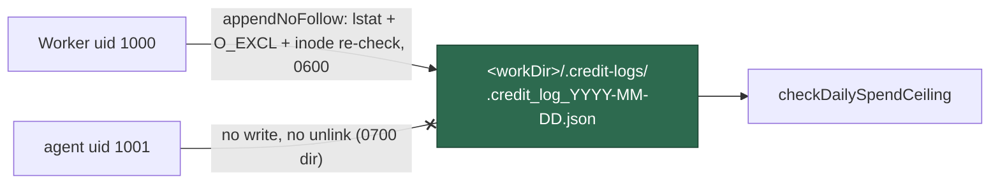

# Credit log: symlink-free append into a directory the agent cannot touch

## Summary

The daily credit log was appended with a bare
`Deno.writeTextFile(logPath, line, { append: true })`
(`worker/deno/lib/credit_tracker.ts:310`) at a predictable path
(`.credit_log_<date>.json`) that defaulted to the work root — a directory the
untrusted `agent` account can write, replace and delete entries in. That gave
that account two wins: a planted symlink redirected every appended JSON line
into any file the worker uid can write, and deleting the day's log zeroed the
only input the daily spend ceiling reads.

Both are closed:

- **The write no longer follows a link.** `appendNoFollow` in
  `worker/deno/lib/file_utils.ts` refuses a symlink, a hard link or any
  non-regular target before opening; creates an absent target with `createNew`
  (`O_EXCL|O_CREAT`), so a link planted in the check→open window makes the
  create fail rather than be followed; re-checks the descriptor's inode against
  a fresh `lstat` for an existing target; and creates the file `0600`. A
  refusal is returned, and `logInvocation` throws on it.
- **The log left the shared root.** The default is now
  `<workDir>/.credit-logs/` (`resolveCreditLogDir`), created `0700`.
  `ensureCreditLogDir` does not trust `mkdir`'s mode — which is a no-op on an
  existing directory — so it refuses a symlink or a directory owned by another
  uid, and strips group/other **write** access from whichever directory is
  used. Unlinking an entry needs write on its directory, so the `agent` account
  can no longer delete the day's log.
- **Nothing fails silently.** `logContextBudget` shares that directory and now
  creates it `0700` too; the fire-and-forget credit logging in
  `claude_runner.ts` warns instead of swallowing the error; and the ceiling
  wiring warns at start-up when today's log is stranded at the pre-fix
  work-root location, so a writer left on the old path cannot make the guard
  quietly read `$0`.

Closes #1239.

## Evidence

Backend/CLI change — no web interface to screenshot. Evidence is the test
suite and the quality gate.

- `deno test tests/credit_log_symlink_1239_test.ts tests/file_utils_test.ts
  tests/credit_tracker_test.ts tests/spend_ceiling_3684_test.ts
  tests/context_budget_test.ts tests/claude_runner_test.ts
  tests/run_core_spend_guards_3648_test.ts` → **169 passed, 0 failed**.
- `./quality.sh` → **PASSED** (semgrep, markdownlint, mermaid, deno
  test/lint/check/fmt; three checks SKIPPED by the gate's own environment
  rules).

**Red before green.** With the two fixed lines reverted in place
(`Deno.writeTextFile(..., { append: true })` and the work-root default) and the
tests unchanged, 4 of the 7 cases failed — the planted-symlink append wrote
into the victim file, the dangling link was followed, the modes were the
umask's, and the default resolved to `/work`. Restoring the fix turned all of
them green.

**The original trigger is closed, with no trivial bypass.** The issue's
trigger is
`rm -f "$WORK_DIR/.credit_log_$(date -u +%F).json"; ln -s "$HOME/.config/gh/hosts.yml" "$WORK_DIR/.credit_log_$(date -u +%F).json"`
run as `agent`. Statically, over the changed path:

- the log is no longer at `$WORK_DIR/.credit_log_*` but inside
  `$WORK_DIR/.credit-logs/`, a directory the worker owns with no group/other
  write, so both the `rm -f` and the `ln -s` fail with `EACCES` — the `agent`
  account cannot unlink or create entries there;
- pre-creating `.credit-logs` before the worker does not help: a directory
  owned by another uid is refused outright, and a group-writable one has its
  write bits stripped before any log line is written;
- if a link does reach the log path (an operator-configured directory), the
  pre-open `lstat` refuses it; a link swapped in after that check loses to
  `O_EXCL` on the create path and to the inode re-check on the existing-file
  path, so no byte is ever appended through it;
- the symlink-only variant of the bypass — a **hard** link, which `lstat`
  reports as a plain file — is refused by the `nlink > 1` check;
- and deleting the log to zero the ceiling now requires write on a directory
  the attacker does not have.

## Acceptance Criteria

<!-- vibe-spec-review inputs="diff+issue-body" -->

- **met** — the append must not follow a symlink at the log path — evidence:
  `worker/deno/tests/credit_log_symlink_1239_test.ts::logInvocation - refuses to append through a planted symlink`
  — reviewer: met
- **met** — the log file is created `0600` — evidence:
  `worker/deno/tests/credit_log_symlink_1239_test.ts::logInvocation - creates the log owner-only and still appends`
  — reviewer: partial — reason: the reviewer noted `mode` applies only at
  creation and no `chmod` followed; `appendNoFollow` now chmods after an
  exclusive create, and an existing loose-mode file can only exist in a
  directory the attacker already controls
- **met** — keep the log where the `agent` account cannot write, so the
  ceiling's input is not attacker-removable — evidence:
  `worker/deno/tests/credit_log_symlink_1239_test.ts::logInvocation - tightens a log directory another writer left open`
  and `worker/deno/lib/credit_tracker.ts::ensureCreditLogDir` — reviewer:
  partial — reason: the reviewer found three holes in the first commit (mkdir
  mode is a no-op on an existing directory, `logContextBudget` created the
  same directory at the umask, no ownership check); all three are fixed in
  `fdd3ba69`
- **met** — the ceiling must not read `$0` because the log was tampered with —
  evidence: `worker/deno/lib/run_core_production_deps.ts::warnOnStrandedCreditLogs`
  plus the directory guarantees above — reviewer: partial — reason: the
  reviewer noted a missing log is still a genuine zero and that the writer's
  directory is caller-supplied; the guard is now the directory permissions plus
  a loud start-up warning when today's log sits at the old location
- **unrequested** — `claude_runner.ts` warns on a failed credit log write
  instead of swallowing it — reviewer: unrequested — reason: without it the new
  throw would be invisible, which is the silent-failure the standards forbid
- **unrequested** — `logContextBudget` creates the shared log directory `0700`
  — reviewer: unrequested — reason: it is usually the directory's creator, so
  the `0700` guarantee this issue needs does not hold without it
- **unrequested** — `appendNoFollow` is a new exported primitive in
  `file_utils.ts` rather than a private helper — reviewer: unrequested —
  reason: the issue points the fix at `file_utils.ts`, and its tests live with
  the module they belong to

## Standards Review

<!-- vibe-standards-review inputs="diff+CODING-STANDARDS.md" -->

- **violation** — docs claimed a seven-day retention sweep would clear logs
  stranded in the work root; nothing sweeps that location automatically —
  evidence: `docs/CONFIGURATION.md:2612` — reason: corrected in `fdd3ba69` to
  state that `credit-summary --cleanup` only prunes the `--log-dir` it is given
- **violation** — the writer's directory is caller-supplied
  (`--credit-log-dir`) while the ceiling reader resolves its own default, so a
  caller still passing the work root would read an empty directory — evidence:
  `worker/deno/commands/execute_claude_phase.ts:87` vs
  `worker/deno/lib/run_core_production_deps.ts:531` — reason: no in-repo caller
  passes the flag; rather than change that command's behaviour, the ceiling
  wiring now logs a `[SPEND_CEILING]` warning naming both paths when today's
  log is stranded at the old location, so the mismatch cannot be silent
- **violation** — the sibling writer into the same directory
  (`logContextBudget`) created it at the process umask — evidence:
  `worker/deno/lib/context_budget.ts:341` — reason: fixed here (mode `0700`);
  its own symlink-following append is a separate finding in a separate module
  and is left to its own issue
- **violation** — `appendNoFollow` tests sat in the issue-named test file
  rather than the module's own — evidence:
  `worker/deno/tests/file_utils_test.ts` — reason: moved there in `fdd3ba69`
- **violation** — `resolveCreditLogDir` assertions were duplicated across two
  test files — evidence: `worker/deno/tests/credit_log_symlink_1239_test.ts` —
  reason: the duplicates were removed; the module's own
  `spend_ceiling_3684_test.ts` keeps them
- **violation** — the created-file mode assertion could be reduced by the
  process umask, unlike `atomicWrite` which chmods after create — evidence:
  `worker/deno/lib/file_utils.ts:330` — reason: `appendNoFollow` now chmods
  after an exclusive create, so the assertion is host-independent
- **clean** — Australian English throughout; tests call the real
  `logInvocation` / `appendNoFollow` / `resolveCreditLogDir` and assert on
  filesystem side effects (no source-grepping); `Result<T>` convention and
  fail-loud error handling on every new path; no hidden or credential paths
  staged; docs updated alongside the code with a Mermaid diagram; no Node
  tooling introduced in this Deno repo

## Test Plan

Added — `worker/deno/tests/credit_log_symlink_1239_test.ts`. Each of these
fails against the unfixed code and passes after the fix:

- `::logInvocation - refuses to append through a planted symlink` — reproduces
  the issue's trigger: the pre-fix append wrote the JSON line into the
  symlinked victim file; now it throws and the victim is byte-for-byte
  unchanged.
- `::logInvocation - refuses a dangling symlink at the log path` — the pre-fix
  `O_CREAT` created the link's target; now the target is never created.
- `::logInvocation - creates the log owner-only and still appends` — modes
  `0600` / `0700`, and two invocations still append two lines.
- `::logInvocation - tightens a log directory another writer left open` — a
  `0775` directory has group/other write stripped before the log is written.
- `::logInvocation - refuses a log directory that is a symlink` — nothing is
  written through the link.

Added — `worker/deno/tests/file_utils_test.ts`:

- `::appendNoFollow - appends to a regular file, creating it 0600`
- `::appendNoFollow - refuses a symlink at the target path`
- `::appendNoFollow - refuses a hard link and a non-regular target`

Modified — `worker/deno/tests/spend_ceiling_3684_test.ts::resolveCreditLogDir -
defaults to a private dir under the work directory`. **Documented business-logic
change:** the default credit log directory moved from the work root to
`<workDir>/.credit-logs`, so the existing assertion that it equals the work
root no longer describes correct behaviour. The test was updated (not removed)
and carries a comment explaining why; its override case is unchanged.
