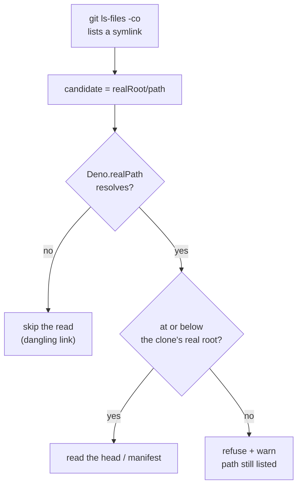

## Summary

The codebase map read files through symlinks that leave the clone. `git ls-files
-co --exclude-standard -z` lists committed **and untracked** symlinks like any
other path, so a source-looking entry such as
`worker/deno/lib/aaa.ts -> /home/vibe/.config/gh/hosts.yml` had its head read by
`extractPurpose` and a symlinked `deno.json`/`package.json` had every
`tasks`/`scripts` string read by `readManifestRecord` — both of which land in the
agent's prompt and in the on-disk codebase-map cache.

Every read the map performs is now resolved with `Deno.realPath` and refused
unless the result sits at or below the clone's **real** root, the containment
check `container_extension_digest.ts` already applies to synced extension
directories. Closes #1240.

- `worker/deno/lib/codebase_map.ts` — `renderCodebaseMap` resolves the clone
  root once (an unresolvable root is a loud error, not an empty map) and threads
  it into `renderModules`/`renderCommands`; the new private
  `resolveInsideRepo(realRoot, relativePath)` guards both `extractPurpose` and
  `readManifestRecord`.
- A refusal is **logged** (`⚠️  Codebase map refused …`), never swallowed: the
  path is still listed in the module index, so a silent skip would be invisible.
- Resolving the whole path — not `lstat` on the leaf — also covers a symlinked
  parent directory, and a symlink that stays inside the clone is still read.
- `docs/MODEL-AND-CACHING.md` — the "repo-derived and therefore untrusted"
  section now records that the *paths* are untrusted too, and what the guard
  does.

## Evidence

Backend/library change with no web surface, so no screenshot applies. The
evidence is the test run below plus the full quality gate.



Targeted run against the fix:

```text
generateCodebaseMap - refuses to read a source symlink that leaves the clone ... ok
generateCodebaseMap - refuses to read a manifest symlinked outside the clone ... ok
generateCodebaseMap - still reads a symlink that stays inside the clone ... ok
renderCodebaseMap - fails loud when the repository directory cannot be resolved ... ok
ok | 32 passed | 0 failed
```

Full gate: `./quality.sh` — **PASSED** (semgrep, markdownlint, mermaid, deno
tests/lint/type check/fmt; `config integration`, `pages-liquid` and `mermaid
built output` skipped as usual locally).

### Regression test linkage

Added the regression test

`worker/deno/tests/codebase_map_test.ts::"generateCodebaseMap - refuses to read a source symlink that leaves the clone"`

which reproduces the flaw (finding `SEC-1215-04`): it
plants a secret file outside the clone, symlinks `src/leaked.ts` at it, and
asserts the secret's first line never reaches the rendered map. Run against the
unfixed code it **failed** (`Values are not equal: symlink target contents
leaked into the codebase map` — the `# oauth_token: …` first line was emitted as
the module's purpose) and it **passes** after the fix. The companion
`generateCodebaseMap - refuses to read a manifest symlinked outside the clone`
failed the same way on the `deno.json` path (`escaping deno.json symlink
contributed commands`) and now passes.

### Original trigger closed, no trivial bypass

The issue's trigger — commit `worker/deno/lib/aaa.ts -> /home/vibe/.config/gh/hosts.yml`,
or `deno.json -> /home/vibe/.config/gh/hosts.yml`, and generate a map — is
closed: both reads now go through `resolveInsideRepo`, which resolves the
candidate and returns `undefined` for anything outside the clone's real root, so
`Deno.open`/`Deno.readTextFile` are never reached for an escaping path. The
obvious bypasses are covered by construction rather than by pattern-matching the
attack:

- **A `..`-walking or absolute-target link** — `Deno.realPath` collapses `..`
  and returns the final absolute location, which is then compared against the
  real root; only the resolved location decides.
- **A symlinked parent directory** (which an `lstat`-the-leaf fix would miss) —
  the whole path is resolved, so a link anywhere in the chain is caught.
- **A link chain (link → link → host file)** — `realPath` follows the chain to
  its end before the check.
- **A clone reached through a symlink itself** (`/tmp` → `/private/tmp`, a
  worktree) — the root is `realPath`-resolved once too, so both sides of the
  comparison are real paths and a legitimate repo is not falsely refused.
- **An escaping link that also exists inside the clone** — containment is a
  string comparison on normalised real paths via the shared
  `isAtOrAbove`/`normalisePath` helpers, not a prefix test on the unresolved
  input.

Residual, and unchanged by this issue: a local attacker who can swap the file at
the resolved path between the check and the read (TOCTOU) — that requires write
access to the clone at the exact instant, and the resolved path is by then inside
the clone.

## Test Plan

Added to `worker/deno/tests/codebase_map_test.ts` (all call the real generator
against real temporary git repositories with real symlinks):

- `generateCodebaseMap - refuses to read a source symlink that leaves the clone`
  — the escaping docstring read is refused, the path is still listed, and files
  inside the clone are unaffected.
- `generateCodebaseMap - refuses to read a manifest symlinked outside the clone`
  — an escaping `deno.json`/`package.json` contributes no commands.
- `generateCodebaseMap - still reads a symlink that stays inside the clone` —
  the guard does not over-block legitimate in-repo links.
- `renderCodebaseMap - fails loud when the repository directory cannot be
  resolved` — an unresolvable root returns an error `Result`, not an empty map.

No existing test was modified or removed; the 28 pre-existing codebase-map tests
still pass.
