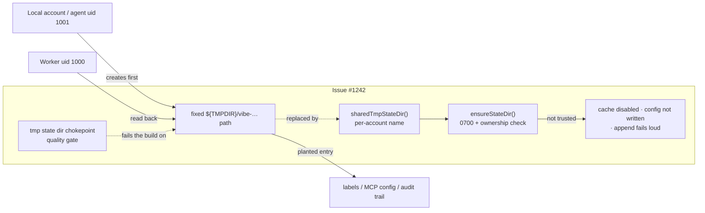

# 🟡 Compose every shared-tmp state directory with `sharedTmpStateDir()`

## Summary

Five worker state directories still built their path by raw `TMPDIR`/`/tmp`
interpolation after the Issue #1215 cache fix — the label cache, the Playwright
MCP config, the audit journal, the repo failure counters and the browser
profile. Each was the same path for every account on the host (CWE-377), so any
second local account — or the container's `agent` account (uid 1001), which runs
repository-supplied code — could create the directory first and own what the
worker later read back.

Every one of them now composes its name with `sharedTmpStateDir()` and creates
it through the new `ensureStateDir()` helper, which under the shared temporary
root creates the directory `0700` and verifies ownership before it is used. Each
caller acts on the verdict rather than ignoring it: the label cache is disabled
and the labels come straight from `gh`, the MCP config is not written (the agent
runs without a browser, logged), the audit append fails loud through the
`Result` it already returns, and the repo failure counters log the refusal.

The durable half is the new `tmp state dir chokepoint` quality-gate check
(`worker/deno/lib/tmp_state_dir_check.ts`), which fails the build on a new raw
`${TMPDIR}/vibe-…` interpolation — the idiom `gh_spawn_chokepoint_check.ts` uses
for `gh`. Running it against the tree surfaced two further sites of the same
class, `timeline_cache.ts` and the staged `gh` credential directory in
`gh_credential_stage.ts`, which are converted with the five.

Closes #1242.



| Site | Was | Now |
| --- | --- | --- |
| `label_operations.ts` → `label_cache.ts` | `${TMPDIR}/vibe-label-cache` | `sharedTmpStateDir("vibe-label-cache")`, read and write gated on the trust verdict |
| `agent_mcp_config.ts` | `${TMPDIR}/vibe-playwright-mcp` | `sharedTmpStateDir("vibe-playwright-mcp")`, write refused when not private |
| `audit_journal.ts` | `${TMPDIR}/vibe-audit` | `sharedTmpStateDir("vibe-audit")`, append refused when not private |
| `run_core_production_deps.ts` | `${TMPDIR}/vibe-repo-failures-<pid>` | `sharedTmpStateDir("vibe-repo-failures")/failures-<pid>`, warned when not private |
| `setup/screenshot.ts` | `/tmp/vibe-playwright-profile` (+ its sibling output dir) | `sharedTmpStateDir(...)` for both |
| `timeline_cache.ts`, `gh_credential_stage.ts` | hand-built per-account / shared names | the same helper (surfaced by the new gate) |

## Evidence

Backend/CLI change with no web interface to screenshot. The evidence is the
tests below, run in this branch.

The new gate is red against the unfixed tree and green after the fix — the
production-tree scan reported exactly the sites the issue names, plus the two
siblings:

```
worker/deno/lib/agent_mcp_config.ts:108: return `${tmp.replace(…)}/vibe-playwright-mcp`;
worker/deno/lib/audit_journal.ts:267: return `${tmp}/vibe-audit`;
worker/deno/lib/gh_credential_stage.ts:192: `${tmp && tmp.length > 0 ? tmp : "/tmp"}/vibe-${STAGED_GH_DIR_NAME}`,
worker/deno/lib/label_operations.ts:134: `${Deno.env.get("TMPDIR") ?? "/tmp"}/vibe-label-cache`;
worker/deno/lib/run_core_production_deps.ts:669: }/vibe-repo-failures-${Deno.pid}`;
worker/deno/lib/timeline_cache.ts:86: return `${tmpDir}/vibe-timeline-cache-deno-…`;
worker/deno/setup/screenshot.ts:131: return `/tmp/${BROWSER_PROFILE_DIR_NAME}`;
```

After the fix: `tmp state dir check - the production tree is clean ... ok`.

### Regression test linkage (security-fix evidence)

Added `worker/deno/tests/shared_tmp_state_dir_test.ts::label cache - refuses
labels planted in a world-writable directory`, which reproduces the issue's
stated trigger — `mkdir -m 777 ${TMPDIR:-/tmp}/vibe-label-cache` plus a planted
`owner_repo.cache` — and asserts the planted label is never returned. It **fails
against the unfixed code and passes after the fix**: with the trust gate removed
from `getCachedLabels` the test reported `["planted-label"]` instead of the live
`gh` result (observed this run), and with the fix in place it returns
`["bug", "enhancement"]` and calls `gh` once.

### The original trigger is closed, with no trivial bypass

The trigger requires the worker to read back a directory an attacker created.
Both halves of that are now gone. The path is no longer guessable-shared:
`sharedTmpStateDir()` appends the worker's own uid, so `${TMPDIR}/vibe-label-cache`
is not a path the worker ever addresses. Even at the per-account path, every
read and write first passes `ensureStateDir()`, which refuses a directory owned
by another uid or carrying group/other bits, so pre-creating
`vibe-label-cache-uid1000` at mode 777 disables the cache instead of poisoning
it — verified by the test above and by the sibling audit-journal and MCP-config
tests. The one path that is *not* refused is a directory this account already
owns whose bits are group/other **readable but not writable** (`0755`): nothing
could have been planted in it, so it is tightened to `0700` and re-verified
rather than failing a legitimate work directory. Equivalent bypasses through a
different name are closed by the gate: any new `${TMPDIR}/vibe-…` or
`/tmp/vibe-…` construction in `worker/deno/{lib,commands,setup}` fails the build.

## Test Plan

- **Added** `worker/deno/tests/shared_tmp_state_dir_test.ts` — 6 tests against
  the real functions and a real filesystem: every remaining default name is
  per-account; the browser profile and its sibling output dir are per-account;
  the label cache refuses planted labels in a world-writable directory and
  writes nothing into it; the label cache creates its own directory `0700` and
  serves its own entries; the audit journal refuses to append into a
  world-writable directory; the MCP config is not written into one (and says so).
- **Added** `worker/deno/tests/tmp_state_dir_check_test.ts` — 11 tests driving
  the scanner with literal content (inline read, variable root, method call,
  multi-line interpolation, fixed `/tmp` literal, helper accepted, bare root
  accepted, prose ignored, allowlist, directory walk) plus a
  production-tree-is-clean test that fails if any new site appears.
- **Updated** (path expectations only, no behaviour removed):
  `agent_mcp_config_test.ts`, `gh_credential_stage_test.ts`,
  `setup_screenshot_test.ts`, `run_core_production_deps_test.ts` — each now
  derives the expected directory from `cacheDirUserSuffix()` instead of the old
  shared literal.
- **Docs**: `docs/CONTAINER.md`, `docs/CONTAINMENT.md`, `docs/DEPLOYMENT.md`
  (browser profile path) and `docs/audits/filesystem-path-temp-sweep-1215.md`
  (SEC-1215-06 recorded as fixed, with the gate).
