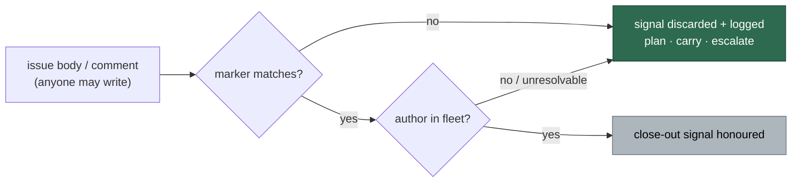

# Verify the author of every planning close-out signal (Issue #1244)

## Summary

Four reads decided whether a planning parent may be closed, and all four read
text **any GitHub account can write** without asking who wrote it. Each now asks
GitHub for the `author` and filters the match through the existing fleet author
check before it counts. Closes #1244.

| Site | Was | Now |
| --- | --- | --- |
| `planning_processor.ts` `checkSubIssuesOnGitHub()` | `gh search issues --match body "Part of #N" --json number,url` — one planted issue skipped the planner and closed the parent | `--json number,url,author`, filtered through `selectFleetAuthoredMatches` |
| `planning_processor.ts` `listSubIssuesViaIssueList()` | any body matching `Part of #N` / `Parent: #N` / `Child of #N` counted, and suppressed the #1219 retry | `--json number,url,body,author`, the parent-link matches filtered through `selectFleetAuthoredMatches` |
| `planning_carrier.ts` `fetchNothingToDoSignal()` | any comment reading `Nothing to do —` disabled the carrier safety net | marker-carrying comments filtered through `selectFleetAuthoredComments` |
| `plan_coverage_gate.ts` `runPlanCoverageGate()` | the first comment carrying a table won, before the parent's own failing table was read | only fleet-authored comment tables are candidates |

The comparison set is the fleet identity (`resolveFleetMaintenanceAuthorSet`:
this host's login ∪ `fleet_pr_authors` ∪ `service_accounts`), resolved once from
the config the run already loaded — deliberately not `allowed_authors`, and not
`--author @me`, which would break cross-host convergence.

**The fail direction is towards doing the work.** An unattributable match — and
*every* match when the fleet identity cannot be resolved — is discarded and the
discard is logged loudly: the planner runs, the carrier is created, and the
coverage gate falls through to the parent body and escalates.

Two signals are deliberately left unfiltered because they are already
authenticated: the `invalid` / `duplicate` / `wontfix` labels need triage
permission on the repository, and the parent **body** belongs to the issue whose
work is being planned, not to a third party commenting on it.

## Evidence

Backend/CLI only — no web interface to screenshot. The evidence is the test
suite.

**Regression tests fail against the unfixed code and pass after the fix.**
With the three `lib/` files stashed and the new tests run against the unfixed
code (`deno test --no-check`), **10 of the new tests failed**; with the fix
applied all 169 tests in the three files pass:

```
# unfixed lib, new tests:   FAILED | 159 passed | 10 failed
# fixed:                    ok     | 169 passed |  0 failed
```

The two most direct reproductions:

- `worker/deno/tests/planning_processor_test.ts::checkSubIssuesOnGitHub - an outsider's 'Part of #N' issue is not a sub-issue`
  — reproduces the planted-issue close; fails against the unfixed code (the
  outsider's URL is returned as a sub-issue) and passes after the fix.
- `worker/deno/tests/plan_coverage_gate_test.ts::runPlanCoverageGate - an outsider's passing table does not pass the gate`
  — reproduces the planted coverage table; fails against the unfixed code
  (`passed: true`) and passes after the fix.

**The original trigger is closed, with no trivial bypass.** Every one of the
four decisions is now taken from rows that survived
`selectFleetAuthoredMatches` / `selectFleetAuthoredComments`, so the planted
`Part of #N` issue, the planted `Nothing to do —` comment and the planted
coverage table are all discarded before they reach the close/skip branch. There
is no equivalent bypass through the marker text: the filter keys on the GitHub
`author` login, which an unprivileged account cannot forge, and rewording the
marker only makes the module's own predicate reject it earlier. An attacker
cannot force the *permissive* direction either — an unresolvable fleet set
discards **all** rows rather than accepting them.



Full gate: `./quality.sh` — **PASSED** (semgrep, markdownlint, mermaid, deno
tests, lint, type check, fmt).

## Test Plan

Added (`worker/deno/tests/`):

- `planning_processor_test.ts::checkSubIssuesOnGitHub - asks GitHub who wrote each match`
- `planning_processor_test.ts::checkSubIssuesOnGitHub - an outsider's 'Part of #N' issue is not a sub-issue`
- `planning_processor_test.ts::checkSubIssuesOnGitHub - an unresolved fleet discards every match`
- `planning_processor_test.ts::listSubIssuesViaIssueList - asks GitHub who wrote each match`
- `planning_processor_test.ts::listSubIssuesViaIssueList - an outsider's parent-link body is not a sub-issue`
- `planning_processor_test.ts::processIssuePlanning - an outsider's 'Part of #N' issue does not skip the planner`
  — the end-to-end path: the planted row no longer skips Claude or reaches the
  reported sub-issue set
- `planning_carrier_test.ts::maybeCreateCarrierSubIssue - an outsider's nothing-to-do comment still creates the carrier`
- `planning_carrier_test.ts::fetchNothingToDoSignal - an unresolved fleet discards every marker comment`
- `planning_carrier_test.ts::fetchNothingToDoSignal - a fleet comment and the parent body are both honoured`
- `plan_coverage_gate_test.ts::runPlanCoverageGate - an outsider's passing table does not pass the gate`
- `plan_coverage_gate_test.ts::runPlanCoverageGate - an unresolved fleet discards every comment table`
- `plan_coverage_gate_test.ts::runPlanCoverageGate - a fleet-authored table still passes`

Modified (business-logic change, documented rather than silent): existing
fixtures that asserted a close-out signal now state a **fleet author** on the
issue row or comment they serve, because an unauthored signal is no longer
evidence. No test was removed or disabled —
`maybeCreateCarrierSubIssue - nothing-to-do marker line skips carrier`,
`runPlanCoverageGate - finds the table in a parent comment`,
`runPlanCoverageGate - the newest table wins`, the `checkSubIssuesOnGitHub` /
`listSubIssuesViaIssueList` unit tests and the `processIssuePlanning` end-to-end
tests all still assert the same outcomes, with the author supplied.

Docs: `docs/workflows/planning-and-questions.md` gains
**🔐 Every close-out signal is author-verified**, and
`marker_dedup_author_manifest.ts` records these four sites as scanner blind
spots that are now fixed.
