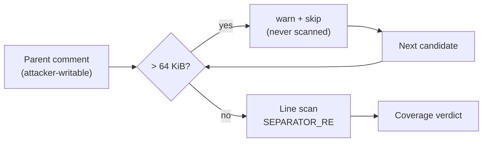

# Bound the plan-coverage separator match (Issue #1245)

## Summary

`SEPARATOR_RE` in `worker/deno/lib/plan_coverage_gate.ts` was
`/^\s{0,3}\|[\s:|-]*-[\s:|-]*\|?\s*$/` — two adjacent quantified classes both
containing `-`, so a run of dashes had exponentially many ways to split between
them. `extractCoverageTable()` runs that pattern over every line of every
candidate (each comment on the planning parent, plus the issue body) with no
length cap, and a comment body is writable by any account on a public
repository, so one comment of dashes stalled the planning close-out path on
every planning close.

Two changes:

- **The pattern is rewritten so no two quantifiers can consume the same
  character.** A separator row is now a leading pipe, one cell, any number of
  `|`-prefixed cells, then an optional closing pipe that carries its own
  trailing whitespace — `(?:\|\s*)?$`, never `\|?\s*$`.
- **The candidate is capped at `MAX_COVERAGE_SCAN_CHARS` (64 KiB)** and
  rejected rather than scanned. The skip is logged with the repo, issue,
  length and cap: an unscanned candidate is not a candidate that carried no
  table, and the next candidate (or the parent body) still decides.

The independent Spec review caught a second instance of the same defect in the
first rewrite: it killed the dash-run split but left a `\s*\|?\s*$` tail, which
is the identical shape in whitespace (`|-` plus 64 000 spaces still cost 4.2 s,
no better than the original). Both shapes are now guarded.

Closes #1245.

## Evidence

Backend-only change, no web interface to screenshot. The evidence is the
measurements below and the regression suite.

Measured in this checkout with Deno, `SEPARATOR_RE.test()` on a single line:

| payload (64 000 chars) | original | first rewrite | shipped |
| --- | --- | --- | --- |
| `\|` + dashes + `x` | 11 723 ms | 0.9 ms | 1.2 ms |
| `\|-` + spaces + `x` | 4 020 ms | 4 200 ms | 0.2 ms |
| `\|-` + tabs + `x` | 4 014 ms | 4 178 ms | 0.2 ms |
| `\|` + `---\|`×16 000 + `x` | (>120 s, killed) | 0.9 ms | 0.4 ms |

Both regression tests were observed red against the code they guard and green
after:

- `extractCoverageTable - a hostile dash run scales linearly` against the
  original pattern: *"8 015 chars took 148 ms but 32 015 chars (4.0x) took
  2 545 ms, over the 1 185 ms a linear rule allows — the rule is
  super-linear"*.
- `extractCoverageTable - a hostile whitespace tail scales linearly` against
  the first rewrite: *"8 016 chars took 47 ms but 32 016 chars (4.0x) took
  767 ms, over the 374 ms a linear rule allows"*.

Both pass on the shipped pattern (whole suite: 5 tests, 4 ms).

**The original trigger is closed, with no trivial bypass.** The reported
payload — a line of dashes in a comment on the planning parent — now matches in
linear time, and so does every neighbouring shape, because the rewritten
pattern has no two quantifiers that can consume the same character: each
whitespace run is bounded by a literal `|`, a `-`, a `:` or an anchor, and
cells are separated by a literal `|` no quantifier can eat. A payload that
evades the pattern entirely still cannot cost more than one bounded scan: a
candidate over 64 KiB is rejected before any line is matched. The shapes an
attacker would reach for next — whitespace tails, tab runs, thousands of empty
cells, mixed `:`/`-`/space runs — were measured directly (table above) and are
all sub-millisecond at the cap.

## Acceptance Criteria

<!-- vibe-spec-review inputs="diff+issue-body" -->

The issue states no `## Acceptance Criteria` section; the criteria below are
its **Fix direction** and **Failure detection** items, reviewed independently.

- **met** — cap the candidate length before matching — evidence:
  `worker/deno/lib/plan_coverage_gate.ts` (`exceedsCoverageScanCap`, applied in
  `extractCoverageTable` and `runPlanCoverageGate`) — reviewer: partial —
  reason: the reviewer noted 64 KiB is exactly GitHub's own body limit, so no
  real comment trips it; kept at the `ci_failure_issue.ts` value deliberately —
  it is a backstop against a future super-linear rule, and a lower arbitrary
  cap would reject legitimate parents into human escalation. The linear
  rewrite, not the cap, is what defends the reported payload.
- **met** — rewrite the separator pattern so the quantified classes are
  disjoint — evidence:
  `worker/deno/tests/plan_coverage_gate_bounds_1245_test.ts::extractCoverageTable - a hostile whitespace tail scales linearly (Issue #1245)`
  — reviewer: partial — reason: the reviewer's `partial` was against the first
  rewrite, whose `\s*\|?\s*$` tail was still quadratic; that finding is fixed
  in commit `75d2ebe` and pinned by the second growth test.
- **met** — `assertLinearGrowth` over `extractCoverageTable()` at N and 4N with
  a dash-run input — evidence:
  `worker/deno/tests/plan_coverage_gate_bounds_1245_test.ts::extractCoverageTable - a hostile dash run scales linearly (Issue #1245)`
  — reviewer: met
- **met** — a test that a body above the cap is rejected rather than scanned —
  evidence:
  `worker/deno/tests/plan_coverage_gate_bounds_1245_test.ts::extractCoverageTable - a candidate past the scan cap is rejected, not scanned (Issue #1245)`
  — reviewer: met
- **unrequested** — the rewritten pattern rejects rows the old one accepted
  (`| --- || --- |`, `|  | --- |`, `| -- - |`) — evidence:
  `worker/deno/lib/plan_coverage_gate.ts` `SEPARATOR_RE` — reviewer:
  unrequested — reason: none is a valid GFM delimiter row, and an
  unambiguous pattern cannot accept them; a malformed line inside a table body
  now becomes an offending data row, which fails towards escalation rather than
  towards a silent pass. Pinned by the alignment-form test.
- **unrequested** — `WALL_CLOCK_TEST_FILES`, `CODING-STANDARDS.md` and
  `docs/workflows/planning-and-questions.md` updated — evidence:
  `worker/deno/lib/parallel_unsafe_test_manifest.ts` — reviewer: unrequested —
  reason: the new suite uses `assertLinearGrowth`, so
  `parallel_unsafe_test_manifest_test.ts` fails until it is listed, and both
  documents asserted no such suite exists — a code change owing a docs change.

## Standards Review

<!-- vibe-standards-review inputs="diff+CODING-STANDARDS.md" -->

- **violation** — the suite uses `assertLinearGrowth` but was not in
  `WALL_CLOCK_TEST_FILES`, so `parallel_unsafe_test_manifest_test.ts` failed —
  evidence: `worker/deno/lib/parallel_unsafe_test_manifest.ts:162` — reason:
  fixed here; the file is now listed and runs in the serial pass.
- **violation** — `CODING-STANDARDS.md` claimed "No suite in this repository
  needs it today", and the manifest's prose said the same — evidence:
  `CODING-STANDARDS.md:286` — reason: fixed here; both now say why the
  behavioural form cannot cover this pattern (~12 s stalls a planning close but
  finishes inside a test timeout).
- **violation** — the operator manual described the gate without the new cap —
  evidence: `docs/workflows/planning-and-questions.md:507` — reason: fixed
  here, with the skip behaviour spelled out.
- **violation** — the cap was written out twice with two behaviours, and the
  header comment's measurements contradicted the inline ones — evidence:
  `worker/deno/lib/plan_coverage_gate.ts:356` — reason: fixed here; the cap is
  one exported predicate and the measurements are consistent.
- **clean** — Australian English throughout; tests call real exported functions
  with real markdown (no source-text greps); ratio timing rather than an
  absolute budget, as the standards require; unit-test speed (5 tests, 4 ms);
  fail-loud (the skip is warned with repo, issue, length and cap, and an
  unfound table still fails the gate towards escalation); commit safety (no
  hidden or credential-shaped paths staged; run-id trailer on both commits).

## Test Plan

Added `worker/deno/tests/plan_coverage_gate_bounds_1245_test.ts`:

- `extractCoverageTable - a hostile dash run scales linearly (Issue #1245)` —
  `assertLinearGrowth` at 8 000 and 32 000 dashes; red against the original
  pattern.
- `extractCoverageTable - a hostile whitespace tail scales linearly (Issue
  #1245)` — the same at 8 000 and 32 000 spaces; red against the first rewrite.
- `extractCoverageTable - a candidate past the scan cap is rejected, not
  scanned (Issue #1245)` — an over-cap blob carrying a valid table returns
  `null`, while the same table under the cap is still parsed.
- `extractCoverageTable - every markdown alignment form still separates a table
  (Issue #1245)` — `---`, `:---`, `---:`, `:---:`, indented and unterminated
  rows all still parse.
- `runPlanCoverageGate - an oversized comment is skipped loudly and a real
  table still decides (Issue #1245)` — the skip is warned and the genuine table
  behind it still passes the gate.

Unchanged and still green: `plan_coverage_gate_test.ts` (29 cases),
`coverage_gate_summary_test.ts`, `planning_coverage_prompts_test.ts`,
`parallel_unsafe_test_manifest_test.ts`, `timing_assertion_policy_test.ts`,
`test_category_definitions_test.ts` — 88 tests, 0 failures.
