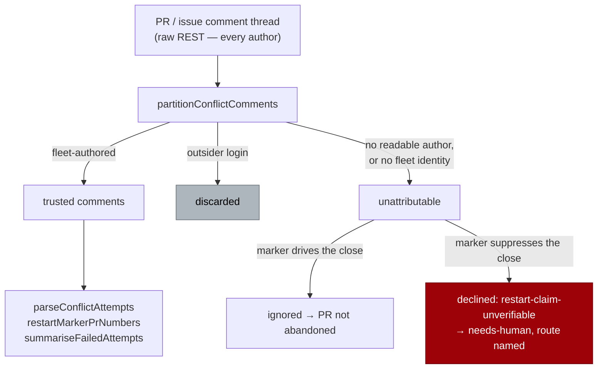

# Verify the author of every merge-conflict marker

## Summary

The merge-conflict ladder kept its whole attempt history in marker comments and
read it back off the **raw** REST array `fetchIssueCommentPages` returns — every
author's. A PR comment is writable by any GitHub account on a public repository,
so both directions were exploitable with no repository permission at all:

- **Two planted `CONFLICT_FAILED_MARKER` comments closed the PR.**
  `parseConflictAttempts` counted them, `hasExhaustedConflictAttempts` called the
  budget spent, and `abandonAndRestart` closed the PR and re-queued its issue — a
  destructive write driven entirely by unauthenticated text.
- **One planted `<!-- vibe-merge-conflict-restart -->` comment did the
  opposite.** `restartMarkerPrNumbers` read it off the originating issue, the
  rung declined `already-restarted` permanently, and the conflicted PR stalled
  unowned.
- **An outsider's failure text was quoted verbatim** into the permanent abandon
  comment by `summariseFailedAttempts`, along with the issue numbers it named.

Both readers now attribute the thread through the new
`worker/deno/lib/conflict_marker_trust.ts` against the push-capable fleet
maintenance set the scan already resolves — no second definition of "the fleet",
and no extra GitHub call.

`MARKER_DEDUP_AUTHOR_UNVERIFIED_CONSUMERS` is empty again. Closes #1247.

### The two fail directions

This was recorded in the manifest rather than fixed alongside the rest of the
class in #1216 because the fail direction is **not** the usual one, and the fix
had to express both:

| Marker | What it does | Unattributable ⇒ |
| --- | --- | --- |
| `CONFLICT_FAILED_MARKER` / `CONFLICT_ATTEMPT_MARKER` on the PR | **drives** the close | discarded — fewer counted attempts, so the PR is *not* abandoned |
| `CONFLICT_RESTART_MARKER` on the issue | **suppresses** the close | the abandon **declines** (`restart-claim-unverifiable`) — discarding it would relax the only bound on closing and re-raising the work |

"Unattributable" is deliberately narrower than "untrusted": a comment carrying an
outsider's login *is* attributed — to an outsider — and is simply dropped, which
is the fix. Only a comment with no readable `user.login`, or one compared against
no configured fleet identity, is unattributable. `trustedAuthors` is a
**required** dependency of `abandonAndRestart`, so no call site can read a claim
off a comment anybody could have written; the scan defaults it to the maintenance
set it already computes, and `run_core_production_deps.ts` threads the same set
into the processor.



## Evidence

Backend-only change — there is no web interface to screenshot. The evidence is
the regression suite below, run against the unfixed code and against the fix.

**The regression tests were observed red before the fix.** With
`partitionConflictComments` neutered to a pass-through (the pre-fix behaviour of
every call site), the six new behavioural tests fail:

```text
abandonAndRestart - an outsider's restart claim does not stall the rung ... FAILED
abandonAndRestart - a claim that cannot be attributed refuses the close ... FAILED
abandonAndRestart - an outsider's failure text is never quoted back ... FAILED
findConflictingPr - planted failure markers cannot close a PR ... FAILED
findConflictingPr - the abandon seam is handed the fleet's comments only ... FAILED
findConflictingPr - an unresolved fleet identity spends no budget ... FAILED

FAILED | 83 passed | 6 failed
```

With the filter in place the same suite is green:

```text
ok | 94 passed | 0 failed (179ms)
```

Full gate: `./quality.sh` — **PASSED** (semgrep, deno tests, lint, type check,
fmt, markdownlint and every chokepoint check).

### The original trigger is closed, with no trivial bypass

The attack input was: post two comments containing the exported
`CONFLICT_FAILED_MARKER` string on a conflicted PR. That input is now rejected
before it can be counted — `findConflictingPr` reduces the fetched thread to
`partitionConflictComments(thread, trustedAuthors).trusted` and
`parseConflictAttempts` never sees the planted comments, so the tally stays at
zero and `hasExhaustedConflictAttempts` is false. The regression test
`worker/deno/tests/pr_merge_conflict_scan_test.ts::findConflictingPr - planted
failure markers cannot close a PR` asserts exactly that input reaches no abandon
and no escalation.

There is no equivalent bypass along the same path:

- **Vary the marker.** All three merge-conflict markers
  (`CONFLICT_ATTEMPT_MARKER`, `CONFLICT_FAILED_MARKER`,
  `CONFLICT_RESOLVED_MARKER`) are read out of the *same* filtered list, so no
  marker in the vocabulary is reachable from an untrusted comment. That includes
  the resolved marker, which resets the budget — it cannot be planted either.
- **Move to the issue side.** The restart claim is filtered by the same helper,
  and its unattributable case *refuses* rather than proceeds, so the suppression
  half cannot be reopened by making the claim unreadable.
- **Forge the author.** Attribution is `user.login` from the REST payload
  compared against the resolved fleet set with `isFleetAuthor` (the fleet's
  single case-insensitive comparison), not a body string, so nothing an
  attacker writes into a comment body can satisfy it. A body that *quotes* a
  marker still fails the author check.
- **Blank the author.** A comment with no readable `user.login` counts as
  unattributable, which is discarded on the driving path and refuses on the
  suppressing path — both non-destructive.
- **Reach the rung by another caller.** `trustedAuthors` is a required field of
  `AbandonRestartDeps`, so a new call site that omits it does not compile; the
  rung re-attributes `request.prComments` even when the caller claims to have
  filtered them, so an unfiltered thread cannot be smuggled in through the seam.

## Test Plan

Added — each fails against the unfixed code and passes after the fix:

- `worker/deno/tests/pr_merge_conflict_scan_test.ts::findConflictingPr - planted failure markers cannot close a PR`
  — reproduces the reported flaw: outsider-authored `CONFLICT_FAILED_MARKER`
  comments fed through `parseConflictAttempts` → `abandonRestart`, asserting the
  PR is neither abandoned nor escalated.
- `worker/deno/tests/pr_merge_conflict_scan_test.ts::findConflictingPr - the abandon seam is handed the fleet's comments only`
- `worker/deno/tests/pr_merge_conflict_scan_test.ts::findConflictingPr - an unresolved fleet identity spends no budget`
- `worker/deno/tests/conflict_abandon_restart_test.ts::abandonAndRestart - an outsider's restart claim does not stall the rung`
- `worker/deno/tests/conflict_abandon_restart_test.ts::abandonAndRestart - a claim that cannot be attributed refuses the close`
- `worker/deno/tests/conflict_abandon_restart_test.ts::abandonAndRestart - an outsider's failure text is never quoted back`

Added as no-regression guards (green in both directions — the filter must not
weaken the genuine bounds):

- `worker/deno/tests/pr_merge_conflict_scan_test.ts::findConflictingPr - the fleet's own failure markers still spend the budget`
- `worker/deno/tests/conflict_abandon_restart_test.ts::abandonAndRestart - the fleet's own restart claim still bounds the rung`

New unit suite for the helper — `worker/deno/tests/conflict_marker_trust_test.ts`:

- `conflictCommentAuthor - reads the REST user.login shape`
- `partitionConflictComments - keeps the fleet's own, discards outsiders`
- `partitionConflictComments - a comment with no author is unattributable`
- `partitionConflictComments - no fleet identity makes everything unattributable`
- `partitionConflictComments - an empty thread is neither trusted nor unattributable`

Existing suites updated, none removed or disabled: the fixtures in
`pr_merge_conflict_scan_test.ts` and `conflict_abandon_restart_test.ts` now carry
the `user.login` a real REST comment carries, and the abandon tests supply
`trustedAuthors`. The three planned attempt-counting, cooldown and cross-host
dedup assertions are unchanged and still pass.

## Pre-PR Security Self-Check

- [x] **Input validation** — `partitionConflictComments` and
      `conflictCommentAuthor` type-check every field of an `unknown` REST object
      before use; malformed entries count as unattributable rather than throwing.
- [x] **Secrets** — no credentials, no hidden paths staged.
- [x] **Injection surface** — no new SQL, shell, filesystem or HTTP calls; no
      new `gh` invocations at all (the fix reuses the thread the scan already
      fetched).
- [x] **Output encoding** — the abandon comment's existing `sanitiseIssueText`
      pass is untouched; this change reduces what reaches it.
- [x] **Authorisation** — the new check *is* the authorisation, resolved from the
      same push-capable maintenance set the surrounding pass already uses.
- [x] **Error handling** — no new catch sites; the decline is a typed outcome the
      escalation names to the human, not a swallowed error.
- [x] **Dependencies** — none added.
