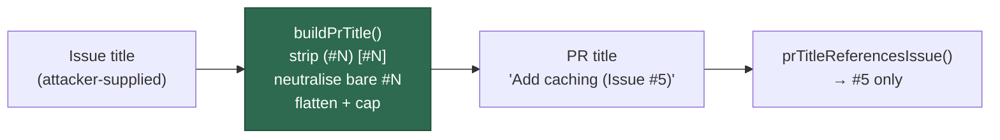

# Scrub issue-reference syntax from the PR title (Issue #1248)

## Summary

`worker/deno/lib/phases/completion_phase.ts` interpolated the issue title into
the PR title verbatim (`${issueTitle} (Issue #${issueNumber})`). The title comes
from `gh issue view --json title`, so any issue author could plant a second
issue reference in it: an issue #5 titled `Add caching [#999]` produced the
**fleet-authored** PR title *"Add caching [#999] (Issue #5)"*, which
`prTitleReferencesIssue()` / `prTitleMatchesIssue()` — and through them
`isBlockedByRecentlyClosedPR()`, `fetchPRsForIssueByTitle()` and the
duplicate-PR guard — read as a reference to issue #999 as well. Once that PR
merged, the merged-PR skip is documented as **permanent** (Issue #3151), so
#999 was stranded for good under a skip reason that reads like a passing
cooldown. The matching side was hardened in Issue #319; this closes the
injection side.

New leaf module `worker/deno/lib/pr_title_build.ts` builds the title instead:

- delimited references — `(#N)`, `(Issue #N)`, `(issue #N)`, `[#N]`,
  `[Issue #N]`, `[issue #N]` — are removed whole;
- any surviving `#` that introduces a number loses the `#` and keeps the digits,
  so `#999` and `owner/repo#999` still read sensibly but match nothing;
- control characters and newlines are flattened to single spaces;
- the title is capped at 180 characters (GitHub's own limit is 256), so the
  suffix always fits;
- a title that scrubs away to nothing falls back to `Untitled issue` rather than
  leading with the suffix.

The worker's own `(Issue #<n>)` suffix is then appended as the single
authoritative reference the PR title carries.

The patterns are fixed literals — nothing interpolates the issue number or any
other external value into a `RegExp` — and none nests a quantifier inside a
quantifier, so no ReDoS surface is added (the same constraint
`pr_title_issue_ref.ts` documents).

Closes #1248.



## Evidence

Backend/CLI change — no web interface to screenshot. The evidence is the test
run.

The regression test drives the real completion phase with a stubbed
`gh pr create` and captures `--title`. Against the unfixed code:

```text
completion - an issue-reference in the issue title does not reach the PR title (Issue #1248) ... FAILED
error: AssertionError: PR title "Add caching [#999] (Issue #5)" still strands issue #999
FAILED | 0 passed | 1 failed
```

After the fix, with the two new suites and the existing matcher suite:

```text
deno test tests/completion_phase_pr_title_injection_test.ts \
          tests/pr_title_build_test.ts tests/pr_title_issue_ref_test.ts
ok | 23 passed | 0 failed
```

**Original trigger closed, no trivial bypass.** The issue's own trigger —
issue #5 titled `Add caching [#999]` — now yields `Add caching (Issue #5)`:
`prTitleReferencesIssue(title, 999)` is `false` and
`prTitleMatchesIssue(title, 5)` is `true`. The bypasses an attacker would reach
for next are closed on the same code path, because scrubbing happens on the
whole title rather than on a fixed shape: the other five delimited forms are
covered by the `DELIMITED_REFERENCE` pass and asserted in
`buildPrTitle - strips every delimited reference style`; an undelimited ` #999`
and a cross-repository `owner/repo#999` lose the `#` in the
`BARE_HASH_REFERENCE` pass; newline and control-character smuggling is flattened
before either pass; and a 4 kB title is capped. Since `#` is the only character
the matchers in `pr_title_issue_ref.ts` treat as introducing a reference, and no
`#`-plus-digit sequence survives `buildPrTitle()`, the only issue reference left
in a fleet PR title is the worker's own suffix. `buildPrTitle()` is the sole
producer of that title (`completion_phase.ts:974`), so there is no second path
to the same sink.

## Security Self-Check

- **Input validation** — the issue title is treated as untrusted and scrubbed
  before use; length is capped.
- **Injection surface** — the value still reaches `gh` as a discrete argv
  element (no shell string concatenation); this change removes the *semantic*
  injection into the fleet's own title grammar.
- **Secrets / dependencies / output encoding** — unchanged; no new dependency,
  no new endpoint, no new logging of user content.

## Test Plan

- Added `worker/deno/tests/completion_phase_pr_title_injection_test.ts::completion - an issue-reference in the issue title does not reach the PR title (Issue #1248)`
  — the regression test. It reproduces the flaw end to end through
  `workOnIssueCompletion()`, **fails against the unfixed code** (output quoted
  above) and passes after the fix.
- Added `worker/deno/tests/pr_title_build_test.ts` — 11 unit tests over
  `buildPrTitle()`: the plain case, the issue's own
  `Add caching [#999]` detection case, all six delimited forms, a bare `#999`,
  a cross-repository reference, control-character flattening, the length cap,
  the reference-only and empty fallbacks, a non-integer issue number, and a
  title that already carries the worker's suffix.
- `worker/deno/tests/pr_title_issue_ref_test.ts` (existing matcher suite) still
  passes unchanged — the matching side is untouched.
- `docs/audits/lib-sweep-coverage.json` gains the new module under slice 12e, as
  `lib_sweep_coverage_test.ts::every worker/deno/lib module is claimed by
  exactly one sweep slice` requires.

## Quality Gate

`./quality.sh` was run in full. Every check passes except `deno tests`, which
fails on one test that is **pre-existing on this milestone branch and unrelated
to this change**:
`tests/plan_coverage_gate_bounds_1245_test.ts::runPlanCoverageGate - an
oversized comment is skipped loudly and a real table still decides (Issue
#1245)`. It was reproduced failing on commit `f52d4578` (PR #1353) in a clean
detached worktree, before any work on this branch, and is filed as
stSoftwareAU/VibeCoder#1358. Every other check — semgrep, deno lint, deno type
check, deno fmt, markdownlint, mermaid and the chokepoint scans — passed.
