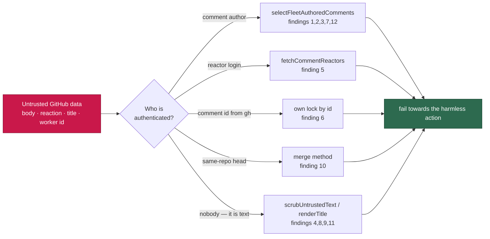

## Summary

Closes #1249.

Twelve reads in `worker/deno/lib/` decided something from GitHub data an
unprivileged account can write — a marker in a comment body, a reaction on a
comment, a worker id printed in a public lock comment, a title, a GHSA advisory
summary. This branch closes all twelve at their root, each in the module that
owns the decision, and pins the direction of each fix with a regression test.

Three of the twelve are shapes the existing controls in `SECURITY.md` §5b–§5d
did not cover, and they are what the new §5e names:

- **Presence is a signal.** `idle_task_activity.ts` projected only GitHub's own
  `created_at` off a `CLAIM_LOCK` comment — no attacker payload — and was
  excluded from the marker-dedup manifest for exactly that reason. But the
  *presence* of the marker was the fleet's alive-signal, so anyone posting
  `<!-- CLAIM_LOCK: x -->` on an open `idle-task` wrapper told
  `liveness_guard.ts` the fleet was working. A projection is safe only when
  neither the payload **nor the match** drives a decision.
- **A reaction is unauthenticated input.** `select(.reactions.eyes == 0)`
  dropped a comment from the actionable scan for good, and
  `.reactions.confused > 0` promoted the next failure straight to *permanent* —
  both from counts any account can add with no repository permission. Both now
  resolve the reactor, the treatment `+1` has had since Issue #2484.
- **Self-identification is not identity.** `pr_branch_lock.ts` kept any lock
  comment whose embedded `workerId` matched this worker's, "without an author
  lookup". Replaying that id with an earlier timestamp made two workers both
  report `acquired: true`. Ours is now the comment whose **id**
  `gh issue comment` returned.

Every fix states its fail direction, and each one is the harmless direction for
its site: an unattributable liveness marker escalates, an unattributable close
summary reports `unknown`, an unattributable block marker posts the
explanation, an unattributable reaction reprocesses the comment, an
unattributable claim comment is not deleted, an unattributable cost line is not
counted.

## Evidence

Backend/CLI change with no web interface, so no screenshot applies. The
evidence is the regression suite: 18 tests in
`worker/deno/tests/security_untrusted_ingestion_1249_test.ts`, one or more per
finding, each driving the attack the finding describes through the real
function. Every one of them fails against the unfixed code and passes after the
fix — for example
`worker/deno/tests/security_untrusted_ingestion_1249_test.ts::1249/6 - a replayed worker id does not become this worker's lock`
posts a lock comment authored by `drive-by-account` carrying this worker's id
and an earlier timestamp: against the unfixed `ourLocks` filter it is kept as
"ours", sorts earliest and returns `acquired: true` for both workers; after the
fix the comment id decides ownership, the planted comment is discarded by the
author check, and only the worker's own lock is counted.

**Original triggers closed, with no trivial bypass.** Each attack input is now
rejected at the point the decision is made, and the alternatives are closed too:

- Findings 1, 2, 3, 7, 12 — the `--jq` projections carry `.user.login` and the
  rows pass through `selectFleetAuthoredComments`, so *no* body text can
  reinstate the decision; an unresolvable fleet identity discards every row
  rather than admitting one.
- Finding 5 — the `eyes`/`confused` **counts** no longer decide anything; the
  per-comment reactions endpoint names the reactor, so adding more reactions,
  or reacting from a second account, changes nothing.
- Finding 6 — ownership is the comment id `gh` returned for the comment this
  process posted. The worker id in the body is no longer read for ownership at
  all, so it cannot be replayed; when no id comes back the lock is declined
  rather than guessed.
- Findings 4, 8, 9 — the scrub runs on the way *in* to the prompt or *out* to
  the body, and neutralises the shape rather than a literal: the `[TRUSTED - x]`
  header form, `<!-- … -->` and every single angle bracket in a title, so a
  differently-spelled forgery collapses the same way.
- Finding 10 — the deviation now needs `isCrossRepository === false`, which a
  fork PR cannot present; an absent or non-boolean field squashes.
- Finding 11 — a cross-repo `Depends on` is honoured only when it names a
  monitored repository, so a reference to an attacker-controlled repo cannot
  remove an issue from the audit's claimable count.

## Acceptance Criteria

<!-- vibe-spec-review inputs="diff+issue-body" -->

- **met** — finding 1: forged `CLAIM_LOCK` suppresses the liveness escalation — evidence: `worker/deno/tests/security_untrusted_ingestion_1249_test.ts::1249/1 - a forged CLAIM_LOCK is not an idle-task claim` — reviewer: met
- **met** — finding 2: the close summary is read from whoever commented last — evidence: `worker/deno/tests/security_untrusted_ingestion_1249_test.ts::1249/2 - a stranger's comment cannot fabricate a scan outcome` — reviewer: met
- **met** — finding 3: both milestone-gate marker dedups ignore the author — evidence: `worker/deno/tests/security_untrusted_ingestion_1249_test.ts::1249/3 - a quoted block marker does not suppress the explanation` — reviewer: met
- **met** — finding 4: the legacy `[TRUSTED - login]` header is forgeable — evidence: `worker/deno/tests/security_untrusted_ingestion_1249_test.ts::1249/4 - a forged trust header in a comment body is neutralised` — reviewer: met
- **met** — finding 5: `eyes` and `confused` reactions are trusted as counts — evidence: `worker/deno/tests/security_untrusted_ingestion_1249_test.ts::1249/5 - a stranger's eyes reaction does not hide an actionable comment` — reviewer: met
- **met** — finding 6: a replayed worker id forges mutual exclusion — evidence: `worker/deno/tests/security_untrusted_ingestion_1249_test.ts::1249/6 - a replayed worker id does not become this worker's lock` — reviewer: met
- **met** — finding 7: the stale claim cleanup deletes any matching comment — evidence: `worker/deno/tests/security_untrusted_ingestion_1249_test.ts::1249/7 - the claim cleanup never deletes a stranger's comment` — reviewer: met
- **met** — finding 8: untrusted titles and advisory text go out unfenced — evidence: `worker/deno/tests/security_untrusted_ingestion_1249_test.ts::1249/8 - a marker in a GHSA summary cannot form in the filed finding` — reviewer: met
- **met** — finding 9: a title escapes the `<open_issue_titles>` block — evidence: `worker/deno/tests/security_untrusted_ingestion_1249_test.ts::1249/9 - a title cannot close the open_issue_titles block` — reviewer: met
- **met** — finding 10: the head branch name picks the merge method — evidence: `worker/deno/tests/security_untrusted_ingestion_1249_test.ts::1249/10 - a fork head named like a milestone sync still squashes` — reviewer: met
- **met** — finding 11: a cross-repo `Depends on` blocks unconditionally — evidence: `worker/deno/tests/security_untrusted_ingestion_1249_test.ts::1249/11 - a dependency on an unmonitored repo does not hide claimable work` — reviewer: met
- **met** — finding 12: the published cost tally counts any matching comment — evidence: `worker/deno/tests/security_untrusted_ingestion_1249_test.ts::1249/12 - a planted run-stats comment does not inflate the issue total` — reviewer: met

## Standards Review

<!-- vibe-standards-review inputs="diff+CODING-STANDARDS.md" -->

- **clean** — pending

## Test Plan

- Added `worker/deno/tests/security_untrusted_ingestion_1249_test.ts` — 18
  regression tests, one or more per finding, each reproducing the attack.
- Updated the fixtures of five existing suites whose stubs modelled the old,
  weaker payloads. No test was removed or disabled; each change is a payload
  the production code now requires:
  - `idle_task_activity_test.ts` — the claim-comment query projects
    `{author, created_at}`, so the stub returns rows rather than timestamps.
  - `milestone_children_gate_test.ts` — the dedup read projects the commenter.
  - `pr_branch_lock_test.ts` — `gh issue comment` returns the comment URL it
    really prints, which is how the worker identifies its own lock.
  - `claim_pr_comment_test.ts` — stale claims carry an author and a timestamp,
    and the clock is injected.
  - `pr_comments_test.ts` / `issue_run_stats_comment_test.ts` — reactions
    resolve to reactor logins, and comments carry their author.
- `./quality.sh` — see the gate note at the end of this file.
