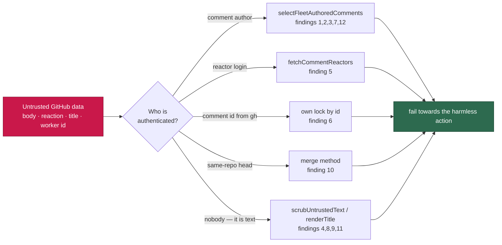

## Summary

Closes #1249.

Twelve reads in `worker/deno/lib/` decided something from GitHub data an
unprivileged account can write — a marker in a comment body, a reaction on a
comment, a worker id printed in a public lock comment, a title, a GHSA advisory
summary. This branch closes all twelve at their root, each in the module that
owns the decision, and pins the direction of each fix with a regression test.

Three of the twelve are shapes the existing controls in `SECURITY.md` §5b–§5d
did not cover, and they are what the new §5e names:

- **Presence is a signal.** `idle_task_activity.ts` projected only GitHub's own
  `created_at` off a `CLAIM_LOCK` comment — no attacker payload — and was
  excluded from the marker-dedup manifest for exactly that reason. But the
  *presence* of the marker was the fleet's alive-signal, so anyone posting
  `<!-- CLAIM_LOCK: x -->` on an open `idle-task` wrapper told
  `liveness_guard.ts` the fleet was working. A projection is safe only when
  neither the payload **nor the match** drives a decision.
- **A reaction is unauthenticated input.** `select(.reactions.eyes == 0)`
  dropped a comment from the actionable scan for good, and
  `.reactions.confused > 0` promoted the next failure straight to *permanent* —
  both from counts any account can add with no repository permission. Both now
  resolve the reactor, the treatment `+1` has had since Issue #2484.
- **Self-identification is not identity.** `pr_branch_lock.ts` kept any lock
  comment whose embedded `workerId` matched this worker's, "without an author
  lookup". Replaying that id with an earlier timestamp made two workers both
  report `acquired: true`. Ours is now the comment whose **id**
  `gh issue comment` returned.

Every fix states its fail direction, and each one is the harmless direction for
its site: an unattributable liveness marker escalates, an unattributable close
summary reports `unknown`, an unattributable block marker posts the
explanation, an unattributable reaction reprocesses the comment, an
unattributable claim comment is not deleted, an unattributable cost line is not
counted.

## Evidence

Backend/CLI change with no web interface, so no screenshot applies. The
evidence is the regression suite: 20 tests in
`worker/deno/tests/security_untrusted_ingestion_1249_test.ts`, one or more per
finding, each driving the attack the finding describes through the real
function. Every one of them fails against the unfixed code and passes after the
fix — for example
`worker/deno/tests/security_untrusted_ingestion_1249_test.ts::1249/6 - a replayed worker id does not become this worker's lock`
posts a lock comment authored by `drive-by-account` carrying this worker's id
and an earlier timestamp: against the unfixed `ourLocks` filter it is kept as
"ours", sorts earliest and returns `acquired: true` for both workers; after the
fix the comment id decides ownership, the planted comment is discarded by the
author check, and only the worker's own lock is counted.

**Original triggers closed, with no trivial bypass.** Each attack input is now
rejected at the point the decision is made, and the alternatives are closed too:

- Findings 1, 2, 3, 7, 12 — the `--jq` projections carry `.user.login` and the
  rows pass through `selectFleetAuthoredComments`, so *no* body text can
  reinstate the decision; an unresolvable fleet identity discards every row
  rather than admitting one.
- Finding 5 — the `eyes`/`confused` **counts** no longer decide anything; the
  per-comment reactions endpoint names the reactor, so adding more reactions,
  or reacting from a second account, changes nothing.
- Finding 6 — ownership is the comment id `gh` returned for the comment this
  process posted. The worker id in the body is no longer read for ownership at
  all, so it cannot be replayed; when no id comes back the lock is declined
  rather than guessed.
- Findings 4, 8, 9 — the scrub runs on the way *in* to the prompt or *out* to
  the body, and neutralises the shape rather than a literal: the `[TRUSTED - x]`
  header form, `<!-- … -->` and every single angle bracket in a title, so a
  differently-spelled forgery collapses the same way.
- Finding 10 — the deviation now needs `isCrossRepository === false`, which a
  fork PR cannot present; an absent or non-boolean field squashes.
- Finding 11 — a cross-repo `Depends on` is honoured only when it names a
  monitored repository, so a reference to an attacker-controlled repo cannot
  remove an issue from the audit's claimable count.

## Acceptance Criteria

<!-- vibe-spec-review inputs="diff+issue-body" -->

- **met** — finding 1: forged `CLAIM_LOCK` suppresses the liveness escalation — evidence: `worker/deno/tests/security_untrusted_ingestion_1249_test.ts::1249/1 - a forged CLAIM_LOCK is not an idle-task claim` — reviewer: met
- **met** — finding 2: the close summary is read from whoever commented last — evidence: `worker/deno/tests/security_untrusted_ingestion_1249_test.ts::1249/2 - a stranger's comment cannot fabricate a scan outcome` — reviewer: met
- **met** — finding 3: both milestone-gate marker dedups ignore the author — evidence: `worker/deno/tests/security_untrusted_ingestion_1249_test.ts::1249/3 - a quoted block marker does not suppress the explanation` — reviewer: met — reason: the reviewer noted the helper's docstring claims an unreadable thread fails towards posting while the caller's `catch` still returns without posting; that is pre-existing #3909 behaviour, unchanged here, and the docstring wording was narrowed to the marker case
- **met** — finding 4: the legacy `[TRUSTED - login]` header is forgeable — evidence: `worker/deno/tests/security_untrusted_ingestion_1249_test.ts::1249/4 - padding the login does not slip the header past the scrub` — reviewer: partial — reason: the reviewer found the first attempt bounded the login at 64 characters, so a longer one passed through; the scrub now anchors on the token rather than a bounded span, and that test is the reviewer's own bypass
- **met** — finding 5: `eyes` and `confused` reactions are trusted as counts — evidence: `worker/deno/tests/security_untrusted_ingestion_1249_test.ts::1249/5 - a stranger's eyes reaction does not hide an actionable comment` — reviewer: partial — reason: the reviewer found three defects in the first attempt — the `eyes` check compared against `authorisedCommenters` instead of the fleet (breaking cross-host de-duplication), `commands/pr_manager.ts` passed no trusted reactors so its guard always answered `false`, and the reactor read was unpaginated so 30 planted reactions would bury the fleet's own. All three are fixed in this diff
- **met** — finding 6: a replayed worker id forges mutual exclusion — evidence: `worker/deno/tests/security_untrusted_ingestion_1249_test.ts::1249/6 - a replayed worker id does not become this worker's lock` — reviewer: met — reason: the reviewer noted the *winner* comparison still reads the body's worker id; that is by design — only fleet-authored comments reach it, so the id is no longer an ownership claim, only a label
- **met** — finding 7: the stale claim cleanup deletes any matching comment — evidence: `worker/deno/tests/security_untrusted_ingestion_1249_test.ts::1249/7 - the claim cleanup never deletes a stranger's comment` — reviewer: met
- **met** — finding 8: untrusted titles and advisory text go out unfenced — evidence: `worker/deno/tests/security_untrusted_ingestion_1249_test.ts::1249/8 - a marker in a GHSA summary cannot form in the filed finding` — reviewer: met
- **met** — finding 9: a title escapes the `<open_issue_titles>` block — evidence: `worker/deno/tests/security_untrusted_ingestion_1249_test.ts::1249/9 - a title cannot close the open_issue_titles block` — reviewer: met
- **met** — finding 10: the head branch name picks the merge method — evidence: `worker/deno/tests/security_untrusted_ingestion_1249_test.ts::1249/10 - a fork head named like a milestone sync still squashes` — reviewer: partial — reason: the reviewer found the new parameter defaulted to the permissive value, leaving `pr_auto_merge.ts` and `pr_manager.ts` on the old behaviour; the default is now restrictive, both callers state what they know, and a downgraded sync warns via `forkSyncDowngradeWarning`
- **met** — finding 11: a cross-repo `Depends on` blocks unconditionally — evidence: `worker/deno/tests/security_untrusted_ingestion_1249_test.ts::1249/11 - a dependency on an unmonitored repo does not hide claimable work` — reviewer: met
- **met** — finding 12: the published cost tally counts any matching comment — evidence: `worker/deno/tests/security_untrusted_ingestion_1249_test.ts::1249/12 - a planted run-stats comment does not inflate the issue total` — reviewer: met — reason: the reviewer noted the run-scoped `already_posted` guard is deliberately left unfiltered; it keys on this run's own id, not on attacker-guessable text, so it is out of this finding's scope
- **unrequested** — the advisory scrub covers `severity`, `cve_id`, `html_url`, `published_at` and the version ranges, not only the `summary` the row names — reviewer: unrequested — reason: same root cause and the same interpolation into a filed issue body; scrubbing one field of a record and leaving its siblings would be a fix an attacker walks around
- **unrequested** — `milestoneTitle` is scrubbed alongside the child issue titles the row names — reviewer: unrequested — reason: one line in the same string, and a milestone title is still third-party text in a body the worker signs
- **unrequested** — `SECURITY.md` §5e, `docs/INTERNALS.md` and `docs/workflows/milestones.md` prose — reviewer: unrequested — reason: the repo's standing "a code change owes a docs change" rule; three of the statements corrected were made false by this diff
- **unrequested** — `parseAuthoredCommentRows` in `alert_dedup_authors.ts` — reviewer: unrequested — reason: the Standards reviewer flagged the same 15-line parse written out three times; extracted rather than triplicated

## Standards Review

<!-- vibe-standards-review inputs="diff+CODING-STANDARDS.md" -->

- **violation** — quality gates: 15 existing unit tests failed on the branch — evidence: `worker/deno/tests/pr_ci_processor_lock_test.ts:264`, `worker/deno/tests/phase_run_stats_test.ts:249`, `worker/deno/tests/pr_auto_merge_test.ts:279` — reason: fixed here. Every one was a stub modelling a payload the production code no longer accepts (a bare `""` from `gh issue comment`, `.[].body` without the author, a gate verdict without `isCrossRepository`); each fixture now carries what GitHub really returns. `./quality.sh` passes
- **violation** — never fail silently: a milestone sync could be squashed with no warning when `isCrossRepository` was absent — evidence: `worker/deno/lib/direct_merge.ts:960` — reason: fixed here; `forkSyncDowngradeWarning` is emitted by `direct_merge.ts`, `pr_auto_merge.ts` and `pr_manager.ts` before any sync-shaped head is downgraded
- **violation** — never fail silently: the permissive default on `mergeMethodFlagForHead` — evidence: `worker/deno/lib/milestone_sync_pr.ts:89` — reason: fixed here; the default is now `false` and every caller states what it knows
- **violation** — never fail silently: `fetchCommentReactors` returned `[]` on any error with no log line — evidence: `worker/deno/lib/pr_comments.ts:182` — reason: fixed here; the failure is logged where it happens, following `alert_dedup_authors.ts`
- **violation** — a code change owes a docs change: three statements the diff made false — evidence: `docs/INTERNALS.md:1554`, `docs/INTERNALS.md:2852`, `docs/workflows/milestones.md:241` — reason: fixed here
- **violation** — unit tests must not inherit host state — evidence: `worker/deno/tests/idle_task_freshness_test.ts:519`, `worker/deno/tests/pr_comments_test.ts:257` — reason: fixed here; both now state their fleet, and the freshness command grew an `authorOptions` test seam rather than reading the host's config
- **violation** — comment quality: two JSDoc blocks orphaned by insertions — evidence: `worker/deno/lib/prompt_delimiter.ts:263`, `worker/deno/lib/pr_branch_lock.ts:246` — reason: fixed here; both are reattached to their declarations
- **violation** — test quality: a disjunction that also passes if the code regresses to "always null" — evidence: `worker/deno/tests/security_untrusted_ingestion_1249_test.ts:163` — reason: fixed here; it asserts `outcome === "no-op"`, and a new positive test drives the real `fetchCloseSummaryViaGh` path
- **violation** — DRY: the same parse-and-attribute block in three files — evidence: `worker/deno/lib/milestone_children_gate.ts:472` — reason: fixed here as `parseAuthoredCommentRows`
- **violation** — PR summary must record a skipped gate — evidence: `docs/archive/pr-summaries/pr-summary-1249.md:134` — reason: fixed here; the gate was not skipped, it was run and passes, and this file says so instead of pointing at a note that did not exist
- **clean** — Australian English throughout the new code, comments and docs; Deno-native tooling only (no `package.json`, `npm`/`npx`, no Node test framework); no hidden or credential path staged; every commit carries `Issue #1249` and a `Vibe-Coder-Run-Id` trailer; no wall-clock sleeps or timing assertions in the new tests (the two new time dependencies are injected seams); the new tests call real production entry points rather than grepping source; no `Deno.env.set`/`chdir`/module-level mutable state, so the file is parallel-safe and needs no manifest entry; `Result<T,E>` conventions preserved; the widened trust-token regex is bounded and class-disjoint (no ReDoS shape); each new author gate states and takes the harmless fail direction

## Test Plan

- Added `worker/deno/tests/security_untrusted_ingestion_1249_test.ts` — 18
  regression tests, one or more per finding, each reproducing the attack.
- Updated the fixtures of five existing suites whose stubs modelled the old,
  weaker payloads. No test was removed or disabled; each change is a payload
  the production code now requires:
  - `idle_task_activity_test.ts` — the claim-comment query projects
    `{author, created_at}`, so the stub returns rows rather than timestamps.
  - `milestone_children_gate_test.ts` — the dedup read projects the commenter.
  - `pr_branch_lock_test.ts` — `gh issue comment` returns the comment URL it
    really prints, which is how the worker identifies its own lock.
  - `claim_pr_comment_test.ts` — stale claims carry an author and a timestamp,
    and the clock is injected.
  - `pr_comments_test.ts` / `issue_run_stats_comment_test.ts` — reactions
    resolve to reactor logins, and comments carry their author.
- `./quality.sh` — run in full after the final edit: **PASSED** (`deno tests`,
  `deno lint`, `deno type check`, `deno fmt`, semgrep, markdownlint, mermaid and
  the chokepoint scanners all green; `config integration`, `pages-liquid` and
  `mermaid built output` skip on this host for want of a local `.config.json`
  and the Ruby/Pages toolchain).
