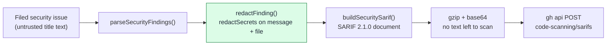

# Redact SARIF free text in the builder, before gzip (Issue #1255)

## Summary

`buildSecuritySarif()` copied untrusted issue free text — the title-derived
`message` and the `<file>` path parsed out of that title — straight into the
SARIF document, and `security_sarif_upload.ts` then gzip+base64-encoded the
document before a request body existed. A secret that reached a finding's title
was therefore published to the repository's code-scanning surface, and no
sink-level redactor could ever see it: by the time the payload reached stdin it
was compressed bytes.

The fix redacts where the document is built. `buildSecuritySarif()` now maps
every finding through `redactFinding()` before serialisation, so
`redactSecrets()` covers `rule.shortDescription.text`,
`rule.fullDescription.text`, `result.message.text` and
`result.locations[].physicalLocation.artifactLocation.uri`. The `SEC-<hex>`
finding id is deliberately not redacted — it is structurally constrained to
`SEC-<alphanumeric>` by `FINDING_ID_RE` and is the rule id, rule index key and
dedupe fingerprint, so masking it would collapse distinct findings onto one
placeholder id.

Closes #1255.

## Evidence

Backend-only change — no web interface to screenshot. The evidence is the test
run: the two redaction tests were observed **failing against the unfixed
builder** and passing after the fix.

Red (builder reverted, tests present):

```text
FAILURES
buildSecuritySarif - redacts a secret in the finding message
buildSecuritySarif - redacts a secret in the artifact location URI
FAILED | 21 passed | 2 failed (72ms)
```

Green (fix applied):

```text
ok | 23 passed | 0 failed (32ms)
```

Where the redaction now sits on the path:



**Original trigger closed, no trivial bypass.** The only free text
`buildSecuritySarif()` copies out of an issue is `finding.message` and
`finding.file`; both are now passed through `redactSecrets()` inside the
builder, and every SARIF field that carries issue-derived text is derived from
those two values (`shortDescription`, `fullDescription`, `message`,
`artifactLocation.uri`). The remaining fields are either constants
(`$schema`, tool name/URI), enumerated values (`level`, `security-severity`,
CWE tag built from a `CWE-\d+` match), a numeric line, or the regex-constrained
`SEC-<alphanumeric>` id — none can carry a secret. Because the redaction is
inside the builder rather than at the upload sink, it cannot be bypassed by the
gzip step that made the original finding unfixable downstream: every caller of
`buildSecuritySarif()` (`security_sarif_emit.ts:168` is the only one) gets the
redacted document.

## Test Plan

Added to `worker/deno/tests/security_sarif_test.ts` — all three call the real
builder with fixtures and assert on the produced document:

- `worker/deno/tests/security_sarif_test.ts::buildSecuritySarif - redacts a secret in the finding message`
  — parses an issue whose title carries a shape-valid fake `ghp_` token, builds
  the document, and asserts the token is absent from the serialised SARIF while
  the placeholder is present in the rule and result message fields. This is the
  regression test: it **fails against the unfixed code and passes after the
  fix** (verified by reverting `security_sarif.ts` and re-running — output
  above).
- `worker/deno/tests/security_sarif_test.ts::buildSecuritySarif - redacts a secret in the artifact location URI`
  — the same token inside the parsed file path is masked in
  `artifactLocation.uri`. Also fails against the unfixed code.
- `worker/deno/tests/security_sarif_test.ts::buildSecuritySarif - leaves ordinary finding text unchanged`
  — guards against over-redaction: an ordinary message and path are byte-identical.

Quality gate: `./quality.sh` run in full. Every check passes except
`deno tests`, which fails on
`tests/plan_coverage_gate_bounds_1245_test.ts::runPlanCoverageGate - an oversized comment is skipped loudly and a real table still decides (Issue #1245)`.
That failure is **pre-existing on the milestone base branch** — confirmed by
running the same test in a clean worktree at `HEAD~1` (commit `f52d457`), where
it fails identically — and is already tracked by
stSoftwareAU/VibeCoder#1358. It is unrelated to this change: the test does not
touch any SARIF module.

## Documentation

`docs/SECURITY-SCAN.md` now records that redaction happens in the builder and
why it cannot be done at the sink.
