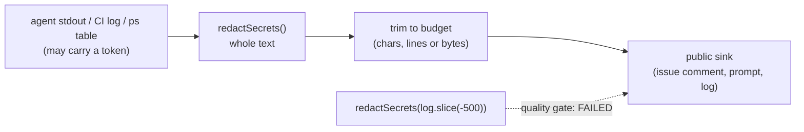

## Summary

Fourteen size-capped sinks cut attacker-influenceable text **before** redacting
it, inverting the rule `SECURITY.md` states plainly: a cut splits a credential,
and the fragment left behind has lost the leading anchor every signature rule
keys on (`ghp_`, `sk-ant-`, the `AKIA…` id, a PEM `BEGIN` marker), so the later
pass at the sink matches nothing and publishes it. Two sites documented the
inversion in their own comments as the way to keep a byte cap honest — that
rationale is wrong on its own terms and is replaced: redacting first is the
_tighter_ cap, because a placeholder wider than the secret it replaced can no
longer push the finished block past the budget. Closes #1257.

What changed:

- **Two new constructors** in `worker/deno/lib/redacted_text.ts` —
  `redactedLineTail()` (line-granular tails) and `redactedLogTail()` (byte cap
  with the `truncateLogTail` drop marker) — so the two remaining cut shapes mint
  `RedactedText` like the existing `redactedTail`/`redactedHead`.
- **Every inverted site converted**: `ci_failure_issue.ts`,
  `pr_failure_actions.ts` (the two documented inversions),
  `execute_claude_phase.ts` (three branches), `claude_runner.ts` (three stderr
  tails, one of which had no redaction at all), `quality_helpers.ts`,
  `bump_deps.ts`, `claude_health_message.ts`, `git_push_recovery.ts`,
  `claude_executor.ts`, `dependency_conflict_apply.ts`, `run_failure_issue.ts`
  and `github_status.ts` (listed in the sweep ledger, unlisted in the issue
  body).
- **`buildFailureMessage` / `buildOutOfMemoryMessage` take `RedactedText`**, so
  the phase modules cannot hand them a raw slice again — the same brand
  `FailureDiagnosticContext.lastOutputSnippet` already carries.
- **A new quality-gate check**, `redact before truncate`
  (`worker/deno/lib/redact_truncate_order_check.ts`), in the shape of the
  `gh`/`git` spawn chokepoint checks: it fails the build on any truncation
  (`.slice()`, `.substring()`, `.substr()`, `truncateLogTail()`) nested inside a
  redaction call. Arguments are extracted by matching parentheses rather than by
  a regex, so nothing backtracks over attacker-length input, and string literals
  are blanked so prose naming the shape is not a false positive.
- **Docs**: `SECURITY.md` records the new check and why the two documented
  rationales were rejected;
  `docs/audits/security-sweep-1217-env-config-secrets.md` marks SEC-1217-06
  closed; the new module is claimed by slice 12e in
  `docs/audits/lib-sweep-coverage.json`.

Sites deliberately **not** changed: `kill_diagnostics.ts` and
`phases/execute_phase.ts` already redact first (verified at
`kill_diagnostics.ts:55,249` and `execute_phase.ts:794,924`), and
`failure_message.ts:142,161` cuts text that is already `RedactedText`, so its
second cut cannot split anything.



## Evidence

Backend/CLI change with no web interface, so there is nothing to screenshot. The
evidence is the test suite and the gate.

Full local gate after the final edit — `./quality.sh` → **PASSED (with skipped
checks)**, including the new stage:

```
git spawn chokepoint           PASSED
redact before truncate         PASSED
...
deno tests                     PASSED
deno lint                      PASSED
deno type check                PASSED
deno fmt                       PASSED
```

**Red before green.** With `worker/deno/lib/` reverted to the unfixed tree, the
regression tests were run against it (the four tests naming symbols added by
this change were removed for that run, since the unfixed tree cannot import
them) — **9 failed, 0 passed**:

```
formatCiFailureContext - no byte cap leaks a split PEM body
formatPrFailureActionsExcerpt - no byte cap leaks a split PEM body
buildClaudeFailureLog - masks a PEM the 5-line stderr cut would split
formatQualityFailureMessage - masks a token in the quoted tail
formatBaselineQualityNote - masks a token in the quoted tail
buildBumpRejectionComment - masks a token in the output tail
summariseHealthFailure - masks a token in the stderr preview
captureTimeoutDiagnostics - masks a token in the captured tail
formatRunFailureExcerpt - masks a token in the bounded excerpt
FAILED | 0 passed | 9 failed
```

The same file against the fixed tree: `ok | 14 passed | 0 failed`.

**The original trigger is closed, with no trivial bypass.** The trigger is a
credential in attacker-influenceable text that a sink cuts before scanning. At
every converted site the cut now operates on the output of `redactSecrets()`
over the **whole** input, so no cut boundary can exist inside an unscanned
credential — the boundary is chosen after masking, and masking is applied to
text that was never truncated. The bypass a reviewer would look for —
reintroducing the inversion elsewhere, or handing a branded constructor pre-cut
text (`redactedTail(raw.slice(-500), 500)`, which type-checks) — is now a build
failure: the `redact before truncate` gate stage flags a truncation nested
inside _any_ redaction entry point, branded constructors included, and its
argument extraction reads real nesting rather than a line-local regex, so
splitting the call across lines does not evade it. Two allowlist entries exist
and both are documented at the allowlist: `redacted_text.ts` (which implements
the ordering) and `gh_body_redaction.ts` (whose `.substring("--body=".length)`
strips a known literal flag prefix, not a size cap, and redacts the whole
remaining value).

## Test Plan

Added `worker/deno/tests/redact_before_truncate_test.ts` — one behavioural test
per converted sink, each driving the real formatter with a secret positioned so
the cut lands inside it. Each reproduces the flaw, fails against the unfixed
code and passes after the fix:

- `worker/deno/tests/redact_before_truncate_test.ts::formatCiFailureContext - no byte cap leaks a split PEM body`
- `worker/deno/tests/redact_before_truncate_test.ts::formatPrFailureActionsExcerpt - no byte cap leaks a split PEM body`
- `worker/deno/tests/redact_before_truncate_test.ts::buildFailureOutputTail - masks a PEM the 100-line cut would split`
- `worker/deno/tests/redact_before_truncate_test.ts::buildClaudeFailureLog - masks a PEM the 5-line stderr cut would split`
- `worker/deno/tests/redact_before_truncate_test.ts::formatQualityFailureMessage - masks a token in the quoted tail`
- `worker/deno/tests/redact_before_truncate_test.ts::formatBaselineQualityNote - masks a token in the quoted tail`
- `worker/deno/tests/redact_before_truncate_test.ts::buildBumpRejectionComment - masks a token in the output tail`
- `worker/deno/tests/redact_before_truncate_test.ts::summariseHealthFailure - masks a token in the stderr preview`
- `worker/deno/tests/redact_before_truncate_test.ts::gitFailureDetail - masks a tokenised push URL`
- `worker/deno/tests/redact_before_truncate_test.ts::captureTimeoutDiagnostics - masks a token in the captured tail`
- `worker/deno/tests/redact_before_truncate_test.ts::formatConflictGitDetail - masks a token in the bounded git output`
- `worker/deno/tests/redact_before_truncate_test.ts::formatRunFailureExcerpt - masks a token in the bounded excerpt`
- `worker/deno/tests/redact_before_truncate_test.ts::buildGhStatusMessage - masks a token pasted into an issue title`

Added `worker/deno/tests/redact_truncate_order_check_test.ts` — the gate check,
exercised against literal file contents, a real temporary directory, and the
worker's own tree:

- `::scanContentForRedactInversion - flags a truncation inside redactSecrets`
- `::scanContentForRedactInversion - flags a slice inside a multi-line call`
- `::scanContentForRedactInversion - flags a pre-truncated branded constructor`
- `::scanContentForRedactInversion - accepts the compliant order`
- `::scanContentForRedactInversion - ignores the shape in comments`
- `::scanContentForRedactInversion - ignores a slice inside a string literal`
- `::scanDirectoriesForRedactInversion - walks a directory and skips tests`
- `::scanDirectoriesForRedactInversion - the worker source tree is clean`

Extended `worker/deno/tests/redacted_text_test.ts` with the two new constructors
— `::redactedLineTail - keeps the last lines and masks a straddling
secret`,
`::redactedLineTail - a budget of zero or less keeps nothing`,
`::redactedLogTail - redacts before the byte cap, at every cap size`,
`::redactedLogTail - text within the cap is returned whole`.

**Existing tests modified, and why:** `execute_claude_phase_test.ts` and
`execute_timeout_test.ts` passed string literals to `buildFailureMessage` /
`buildOutOfMemoryMessage`, whose `failureOutput` is now `RedactedText`. Each
literal is wrapped in `buildFailureOutputTail(...)` — the same helper the
production call sites use. No test was removed, disabled or weakened; the
assertions are unchanged.
