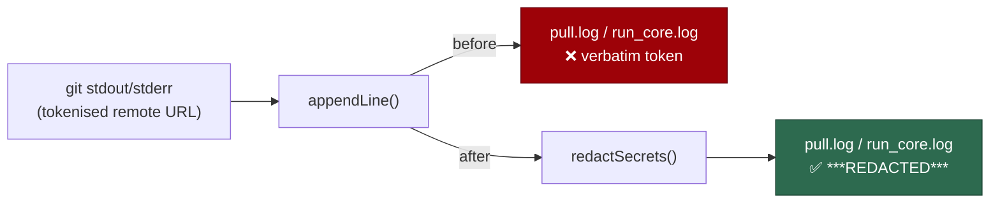

## Summary

`pull.log` and `run_core.log` are appended outside `createLogger`, so neither
structural redactor covered them — the console patch masks `console.*` calls
only, not a file write. Both files carry raw `git` stdout and stderr, which is
the canonical carrier of a tokenised remote URL — the `x-access-token`
credential embedded in the `https://` origin URL git echoes back in its own
error text — so a credential could be written verbatim to a durable log under
the mounted log directory.

Each module's private `appendLine` helper now routes its text through
`redactSecrets` before the write:

- `worker/deno/lib/checkout_update.ts:392` — the only writer of `pull.log`
  (git step output plus the retry notes).
- `worker/deno/lib/run_bootstrap.ts:247` — the writer behind
  `appendRunCoreLogLine`, which `checkout_update.ts:1352` feeds git stderr via
  `deps.log`.

Redacting inside `appendLine` rather than at each call site makes it the
chokepoint for every byte those modules append to the log directory, so a
future writer inherits the masking instead of owing a new wiring.

Closes #1258.

## Evidence

Backend/CLI change with no web interface to screenshot. The evidence is the two
regression tests below, observed red against the unfixed code and green after
the fix, plus a full `./quality.sh` run (PASSED, all stages including semgrep).

Sink coverage before and after:

### Security-fix evidence

- **Regression tests added in this branch** —
  `worker/deno/tests/checkout_update_test.ts::resetCheckoutToDefaultBranch - a tokenised remote URL never reaches pull.log (Issue #1258)`
  and
  `worker/deno/tests/run_bootstrap_test.ts::appendRunCoreLogLine - a tokenised remote URL never reaches run_core.log (Issue #1258)`.
  Both were run against the unfixed code and **failed**
  (`AssertionError: the token must not survive into pull.log` /
  `… into run_core.log`), and both **pass** after the fix — the fail direction
  is stated explicitly: each asserts the known-shaped fake token is *absent*
  from the written file, so a broken ordering fails rather than passing quietly.
- **Original trigger closed, no trivial bypass** — the trigger was a `git`
  invocation whose combined stdout and stderr echoed a tokenised remote URL
  into `pull.log` (`checkout_update.ts:566-569`) and into `run_core.log` via
  `appendRunCoreLogLine`. Redaction now sits in the single private `appendLine`
  each module owns, which is the *only* function either module uses to write
  those files, so there is no second path to the sink: the retry notes, the git
  output, the timestamped `run_core.log` lines and the worker-log header all
  pass through it. A caller cannot reach the file without being redacted short
  of adding a new `Deno.writeTextFile` call, which the standard in `SECURITY.md`
  already forbids without its own `redactSecrets` wiring. Redaction happens
  before the write and before any trimming, so the redact-before-truncate
  ordering holds.

## Test Plan

- Added `worker/deno/tests/checkout_update_test.ts::resetCheckoutToDefaultBranch - a tokenised remote URL never reaches pull.log (Issue #1258)`
  — drives the real update sequence with a fake git runner returning a
  tokenised clone URL in stderr, then asserts the token is absent from
  `pull.log`, the placeholder is present, and the surrounding diagnostic
  (`remote: Repository not found.`, `github.com/owner/repo.git`) survives.
- Added `worker/deno/tests/run_bootstrap_test.ts::appendRunCoreLogLine - a tokenised remote URL never reaches run_core.log (Issue #1258)`
  — same assertion shape against the exported `run_core.log` writer.
- Existing suites re-run unchanged: `checkout_update_test.ts`,
  `checkout_update_escalation_spool_test.ts`, `worker_checkout_update_test.ts`,
  `run_bootstrap_test.ts`, `run_bootstrap_command_test.ts` — 93 passed, 0 failed.
- `./quality.sh` — PASSED (with the usual environment-gated skips).

## Documentation

- `SECURITY.md` — the "Logs" sink bullet now names `pull.log` and
  `run_core.log` as log-directory files written outside the structured logger,
  each redacting in its own `appendLine`.
- `docs/audits/security-sweep-1217-env-config-secrets.md` — the sink 1 row for
  these two files records that the BYPASS is fixed.
