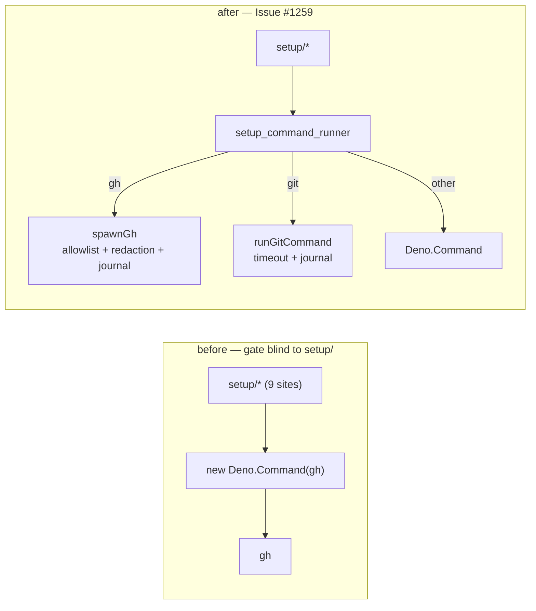

## Summary

`worker/deno/setup` spawned `gh` itself — `config_writer.ts:104`,
`setup_cli.ts:131` and seven copies of the same `createDefaultRunCommand` handed
`["gh", …]` by their callers — so a setup `gh` call ran outside all three
controls `spawnGh` owns: the per-run write-repo allowlist, `redactGhBodyArgs`
(the `setup_cli.ts` runner is the one `milestone_ruleset_check.ts:753` publishes
`--input` bodies through) and the audit journal. The gate could not see any of
it: both spawn chokepoint checks scanned only `worker/deno/lib` and
`worker/deno/commands`.

Two halves, the second the durable one:

- **New `worker/deno/setup/setup_command_runner.ts`** — the one setup runner.
  `gh` goes to `spawnGh`, `git` to `runGitCommand` (timeout, message redaction,
  journal), any other binary is spawned directly. The nine bypass sites now use
  it; `setup_cli.ts`'s JSON executor uses `runGhOrThrow`.
- **Both checks now scan `worker/deno/setup`** via exported `GH_SPAWN_SCAN_DIRS`
  / `GIT_SPAWN_SCAN_DIRS`, which `quality_gate.ts` consumes.
  `setup/prerequisite_install_plan.ts` is allowlisted as a documented false
  positive: it names `gh`/`git` as _package data_ (`brewFormula("gh", "gh")`)
  and the process it spawns is the package manager.

Closes #1259.

## Evidence

Backend/CLI change — no web interface to screenshot. Evidence is test output and
the gate.

Routing, before and after:



Both new scan-set tests were observed **failing against the unfixed scan set**
(the two-directory list) and passing after it:

```
GH_SPAWN_SCAN_DIRS - a direct gh spawn under setup/ is caught ... FAILED (11ms)
GIT_SPAWN_SCAN_DIRS - a direct git spawn under setup/ is caught ... FAILED (11ms)
FAILED | 20 passed | 2 failed
```

After the fix, with the production tree scanned under the new set:

```
GH_SPAWN_SCAN_DIRS - a direct gh spawn under setup/ is caught ... ok (985µs)
scanDirectoriesForGhSpawn - the worker tree has no direct gh spawns ... ok (237ms)
GIT_SPAWN_SCAN_DIRS - a direct git spawn under setup/ is caught ... ok (975µs)
scanDirectoriesForGitSpawn - the worker tree has no direct git spawns ... ok (243ms)
ok | 22 passed | 0 failed (541ms)
```

`./quality.sh` — PASSED (with skipped checks); `gh spawn chokepoint` and
`git spawn chokepoint` both PASSED with `worker/deno/setup` in the scanned set.
205 existing setup tests pass unchanged.

**Original trigger closed, no trivial bypass.** The two named sites no longer
construct a subprocess at all: `config_writer.ts` calls `runSetupCommand`, and
`setup_cli.ts`'s `createSetupGhJson` — the runner
`milestone_ruleset_check.ts:753` hands `--input` bodies to — is now
`runGhOrThrow`, so every body it publishes passes `redactGhBodyArgs` and the
allowlist before a process starts. The bypass class is closed rather than the
instances: `scanDirectoriesForGhSpawn(repoRoot, GH_SPAWN_SCAN_DIRS)` now walks
`worker/deno/setup`, and it catches both the literal `new Deno.Command("gh", …)`
and the variable-binary evasion (`new Deno.Command(cmd[0]!, …)` in a module
naming `gh` in an argv literal) that hid the seven copied runners. A new setup
module cannot reintroduce either without failing the gate. The one allowlisted
file spawns package managers only, and `spawnGh`'s own controls are unchanged by
this diff.

## Test Plan

- Added `worker/deno/tests/setup_command_runner_test.ts` — six tests over the
  shared runner:
  `runSetupCommand - routes a gh command through the spawnGh
  chokepoint`
  (asserts the chokepoint's low-level runner receives the argv),
  `createSetupRunCommand - passes the configured GH_CONFIG_DIR to the
  chokepoint`,
  `runSetupCommand - reports a failed gh command instead of
  throwing`,
  `runSetupCommand - routes git through the timeout chokepoint`,
  `runSetupCommand - spawns a non-guarded binary directly`, and
  `runSetupCommand - an empty command vector fails loud`.
- Added the regression test
  `worker/deno/tests/gh_spawn_chokepoint_check_test.ts::GH_SPAWN_SCAN_DIRS - a direct gh spawn under setup/ is caught`,
  which reproduces the flaw (a `gh` spawn under `setup/` that the gate did not
  see), fails against the unfixed scan set and passes after the fix.
- Added its `git` counterpart
  `worker/deno/tests/git_spawn_chokepoint_check_test.ts::GIT_SPAWN_SCAN_DIRS - a direct git spawn under setup/ is caught`,
  same linkage.
- Both existing "the worker tree has no direct spawns" tests now scan through
  the exported constants, so the production `setup/` tree is asserted clean.
