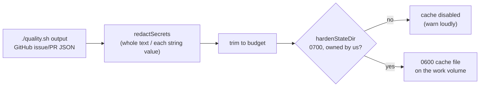

# PR Summary — Issue #1261

## Summary

Two on-disk caches under the work volume persisted text no redactor had seen,
and read it back into later prompts. `baseline_quality_cache.ts` stored a raw
tail of the aggregated `./quality.sh` output — the stdout and stderr of every
subprocess the gate ran — and `issue_cache.ts` stored GitHub issue and PR JSON
verbatim, so a token pasted into an issue body was written to disk. Neither
checked the directory it was handed unless that directory sat under the shared
temporary root, so an entry another account could have planted was served back
as a cache hit. Closes #1261.

The fix is the one the finding asks for — redact on write, and gate both cache
directories the way `timeline_cache.ts` already does:

- **`redactedTail()` for the gate output.** The whole output is redacted before
  the 20 000-character tail is cut. Cutting first splits a credential and the
  surviving fragment loses the leading anchor every signature rule keys on
  (`ghp_`, `sk-ant-`, the `AKIA…` id), so the later redaction pass matches
  nothing.
- **Secret-bearing findings are dropped, not masked.** A `GenericFinding.key` is
  its identity for the baseline diff — it is matched against keys recomputed
  live on the next run — so rewriting one would make a pre-existing finding look
  new and fail the gate on a finding nobody introduced. The entry still records
  pass/fail; the caller re-runs the gate when it needs findings.
- **`redactJsonStrings()` for the cached GitHub JSON.** Redaction runs over each
  string **value**, never the serialised document: the `secret-assignment` rule
  matches `"access_token":"…"` across the structural quotes, and redacting the
  serialised form would leave the file unparseable — turning every later read
  into a silent miss.
- **`hardenStateDir()` gates both directories wherever they sit.** The work
  volume is not private on its own either, and for the baseline cache a planted
  `passed: true` would skip a whole quality gate. A directory left at the umask
  default by an earlier release is narrowed to `0700` rather than refused; a
  group/other-writable one, or one owned by another uid, disables the cache with
  a loud warning. Entries are written `0600`.

## Evidence

Backend-only change — no web interface to screenshot. The evidence is the test
suite plus the full quality gate:

- `deno task test tests/cache_secret_redaction_1261_test.ts` — **7 failed**
  against the unfixed code, **7 passed** after the fix.
- `./quality.sh` — `Result: PASSED (with skipped checks)`; the only skip is
  `config integration` (no `.config.json` in the worktree), which is unrelated
  to this change. The `redact before truncate` chokepoint check passes, so the
  new write path is covered by the standing gate as well as by these tests.

## Test Plan

New file `worker/deno/tests/cache_secret_redaction_1261_test.ts` — each test
drives the real class against a real filesystem and then reads the raw bytes off
disk:

- `baseline quality cache - a token in the gate output never reaches disk` — the
  regression test for the primary trigger.
- `baseline quality cache - findings carrying a secret are not persisted`
- `baseline quality cache - refuses a world-writable cache directory` — a
  planted entry is not served, and no new entry is written.
- `baseline quality cache - writes the cache file owner-only`
- `issue cache - a token in a cached issue body never reaches disk` — asserts
  the surrounding JSON still round-trips, so redaction does not corrupt the
  document.
- `issue cache - gates a work-volume directory it was handed` — the production
  shape that previously skipped the check entirely.
- `issue cache - tightens a work-volume directory left group-readable`

**Regression linkage:** added
`worker/deno/tests/cache_secret_redaction_1261_test.ts::baseline quality cache - a token in the gate output never reaches disk`,
which writes `GITHUB_TOKEN=ghp_…` through `writeBaselineQualityCache` and reads
the cache file back. It **fails against the unfixed code** (the raw
`outcome.output.slice(-MAX_CACHED_OUTPUT_CHARS)` put the token straight on disk)
and **passes after the fix**; the six sibling tests were observed red and then
green in the same way.

Existing suites re-run unchanged and green: `baseline_quality_cache_test.ts`,
`baseline_quality_phase_cache_test.ts`, `baseline_quality_duration_test.ts`,
`issue_cache_test.ts`, `private_cache_dir_test.ts`,
`shared_tmp_cache_dir_test.ts`, `timeline_cache_test.ts` (79 tests), plus the
whole 19 000-test suite via `./quality.sh`.

## Original trigger closed, with no trivial bypass

The trigger is secret-bearing text reaching a cache file. Both write paths are
now single chokepoints with no unredacted branch:

- `writeBaselineQualityCache` is the only writer of the baseline cache, and its
  `output` field is produced solely by `redactedTail(outcome.output, …)` —
  redaction over the **whole** input before the cut, so the split-credential
  bypass (the reason a later redaction at the sink fails) is closed. `findings`
  is produced solely by `persistableFindings`, which returns `undefined` for any
  list where `containsSecret` matches a `key` or a `display`, so no
  partly-masked finding exists to bypass.
- `IssueCache.write` is the only writer of an issue-cache entry, and `data` is
  produced solely by `redactJsonStrings(data)`, which recurses through arrays
  and objects to a bounded depth and redacts **every** string it reaches.
  Nesting a secret deeper does not evade it; beyond the depth cap the value is
  dropped rather than persisted.
- Both writers, and every read, are behind a directory-trust check, so the
  "plant an entry another account authored" route now yields a disabled cache
  and a warning rather than a hit. Neither cache trusts a directory it merely
  created earlier: the check re-stats on each new instance.

The residual, stated plainly: redaction is signature-based, so a credential in a
shape no rule matches is still stored. That is the standing limit of
`secret_redaction.ts` across every sink in the worker, not a bypass introduced
here.
