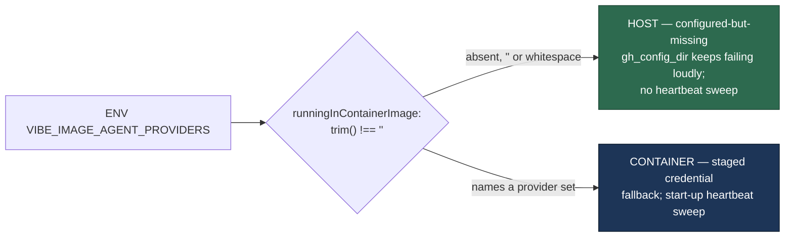

## Summary

`VIBE_IMAGE_AGENT_PROVIDERS` — the stamp the container build bakes into the
image — was read with a **presence** test (`env(...) !== undefined`) at three
mode switches, so `VIBE_IMAGE_AGENT_PROVIDERS=` (the empty string) satisfied it
on a host run. The sharpest consequence was the `gh` credential fallback in
`service_account_env.ts`: with a blank stamp and a configured `gh_config_dir`
that does not exist, resolution fell through to `stagedGhConfigDirsFromEnv`,
whose first candidate is the ambient `GH_CONFIG_DIR` — so the worker
authenticated as whoever wrote that `hosts.yml`, and `applyServiceAccountEnv`
propagated it to every child `gh` and `git`. That silent fall-through is exactly
the Issue #3530 leak the module's own documentation says must not happen on a
host.

The rule is now **value, not presence**, and it lives in one place:

- New `worker/deno/lib/container_stamp.ts` — `runningInContainerImage(env)`
  returns `true` only for a stamp with non-whitespace content. A blank stamp
  reads exactly like an absent one: host. That is the direction the repo already
  encodes — the setup suites export `VIBE_IMAGE_AGENT_PROVIDERS=""` precisely to
  simulate a host run — and it is fail-safe: a blank stamp *narrows* what the
  worker will do, never widens it.
- `service_account_env.ts` and `stuck_issue_detector.ts` read the stamp through
  that helper, so a blank value can no longer re-enable the ambient-credential
  fall-through, nor flip `sweepAllHeartbeats` on a host that shares a work
  volume with a sibling worker.
- `agent_provider.ts` reads it through the same helper and its
  `IMAGE_AGENT_PROVIDERS_ENV` now aliases the canonical constant. This site
  already treated a blank stamp as absent (`agent_provider.ts:894` before the
  change), so the behaviour is unchanged — what changes is that the rule is no
  longer restated per module.
- `detectAndRecoverStuckIssues` gained an injectable `ghCommandFn`, forwarded to
  all three scans, so the sweep decision is assertable without the network.
  Production passes nothing and each scan still falls back to the real `gh`.

The trigger is closed with no trivial bypass: the sole input to the decision is
`VIBE_IMAGE_AGENT_PROVIDERS`, and `runningInContainerImage` reduces it to
`(value ?? "").trim() !== ""` — absent, `""`, spaces and tabs all yield `false`,
and every container-only branch is now guarded by that one boolean. There is no
second variable, no alternative spelling and no partial-credit path: the only
way to reach the fallback is a stamp that names something, which is what a real
image build always produces.

Closes #1262.

## Evidence

Backend/CLI change with no web interface to screenshot. The evidence is the
regression tests, each observed failing against the unfixed code and passing
after the fix (transcript below), plus the full `./quality.sh` gate.

Red against the unfixed `service_account_env.ts` — the leak itself, the ambient
directory winning over the configured path:

```text
buildServiceAccountEnv - a blank container stamp does not enable the ambient fall-through (Issue #1262) ... FAILED
    [Diff] Actual / Expected
-   /tmp/c797ed3ce4718220/ambient-gh
+   /tmp/c797ed3ce4718220/.config/gh-vibe
FAILED | 0 passed | 2 failed
```

Green after the fix:

```text
ok | 2 passed | 0 failed (3ms)
```

The same red/green was observed for the sweep: reverting
`stuck_issue_detector.ts:132` to the presence test fails
`detectAndRecoverStuckIssues - a blank container stamp does not sweep a live
heartbeat (Issue #1262)`; restoring the helper passes it.

How the stamp is read now:



## Acceptance Criteria

<!-- vibe-spec-review inputs="diff+issue-body" -->

- **met** — require a non-empty value at `service_account_env.ts` — evidence:
  `worker/deno/lib/service_account_env.ts:194` and
  `worker/deno/tests/service_account_env_test.ts::buildServiceAccountEnv - a blank container stamp does not enable the ambient fall-through (Issue #1262)`
  — reviewer: met
- **met** — require a non-empty value at `stuck_issue_detector.ts` — evidence:
  `worker/deno/lib/stuck_issue_detector.ts:132` and
  `worker/deno/tests/stuck_issue_detector_test.ts::detectAndRecoverStuckIssues - a blank container stamp does not sweep a live heartbeat (Issue #1262)`
  — reviewer: met
- **met** — require a non-empty value at `agent_provider.ts` — evidence:
  `worker/deno/lib/agent_provider.ts:903`, covered by the existing
  `worker/deno/tests/agent_provider_test.ts:348` blank-stamp assertion —
  reviewer: met — reason: the reviewer noted this site already rejected a blank
  stamp before the change, so it is a behaviour-preserving move onto the shared
  rule rather than a fix; recorded here so the distinction is not lost
- **partial** — register the variable in `vibe_env_registry.ts` "so a malformed
  value is rejected loudly rather than read as a mode switch" — evidence:
  `worker/deno/lib/vibe_env_registry.ts:413` already registers
  `VIBE_IMAGE_AGENT_PROVIDERS` (`role: "launch_plumbing"`) — reviewer: missing —
  reason: the registration half was already true before this change, and the
  "reject loudly" half is deliberately not implemented — the registry is a pure
  inventory with no validation path, and a blank stamp is treated as *host*
  rather than thrown on, because throwing would contradict the repo's own
  convention (`tests/setup_provider_credential_flow_test.ts:55` sets the stamp
  to `""` to simulate a host run) and would turn a host misconfiguration into a
  crash. Reading blank as host is the fail-safe direction and closes the leak;
  `VIBE_AGENT_PROVIDER(S)` throws because a bad value there names a provider
  that does not exist, which has no safe reading
- **unrequested** — new module `worker/deno/lib/container_stamp.ts` rather than
  three inline non-empty tests — reviewer: unrequested — reason: the three sites
  must agree on one reading of the stamp; a fourth divergent spelling is how
  this class of bug recurs. It is 42 lines, one predicate, and
  `IMAGE_AGENT_PROVIDERS_ENV` now aliases its constant
- **unrequested** — `ghCommandFn` option on `detectAndRecoverStuckIssues`
  (`worker/deno/lib/stuck_issue_detector.ts:121`) — reviewer: unrequested —
  reason: a test seam, without which the sweep decision could only be asserted
  by spawning a real `gh`. Production behaviour is unchanged: unset, each scan
  falls back to `runGh` exactly as before
- **unrequested** — doc updates to
  `docs/audits/security-sweep-1217-env-config-secrets.md`,
  `docs/audits/lib-sweep-coverage.json` and `docs/CONTAINER.md` — reviewer:
  unrequested — reason: the audit ledger records this finding and its direction,
  and the sweep-coverage gate (`tests/lib_sweep_coverage_test.ts`) fails a new
  `lib/` module that no sweep slice claims

## Standards Review

<!-- vibe-standards-review inputs="diff+CODING-STANDARDS.md" -->

- **violation** — no `docs/archive/pr-summaries/pr-summary-1262.md`, and the
  regression-test linkage stated nowhere — evidence:
  `docs/archive/pr-summaries/pr-summary-1262.md` — reason: fixed here; this file
  is that summary, and the red/green linkage is stated in **Evidence** above
- **violation** — the module docstring claimed "one rule every stamp reader
  shares" while six further readers still use the presence test — evidence:
  `worker/deno/lib/container_stamp.ts:5` and
  `worker/deno/lib/agent_provider.ts:901` — reason: fixed here; the prose now
  names the three readers it actually serves, and the remaining six
  (`run_housekeeping.ts:191`, `claude_env.ts:172`, `crash_notification.ts:65`,
  `disk_space.ts:646`, `software_updates.ts:1809`, `commands/benchmark.ts:46`)
  plus the two duplicate constants are filed as
  stSoftwareAU/VibeCoder#1493 rather than folded into a security fix
- **violation** — the audit's per-module table was updated for
  `stuck_issue_detector.ts` but had no row for the new env-reading module —
  evidence: `docs/audits/security-sweep-1217-env-config-secrets.md:382` —
  reason: fixed here; `container_stamp.ts` now has its own row
- **violation** — the new `ghCommandFn` option carried no JSDoc, unlike the
  `sweepAllHeartbeats` option it forwards to — evidence:
  `worker/deno/lib/stuck_issue_detector.ts:121` — reason: fixed here; both
  options are now documented
- **clean** — Australian English throughout; tests call real functions and
  assert results (no source-grepping); parallel-safe (env injected via
  `tests/support/env_lookup.ts`, no `Deno.env.set`, no `Deno.chdir`); fail-loud
  direction preserved (the fix strictly narrows container mode); Deno-native
  tooling only; no hidden or credential-shaped paths staged; `deno fmt`,
  `deno lint` and `deno check` clean

## Test Plan

- Added `worker/deno/tests/container_stamp_test.ts` — four tests over
  `runningInContainerImage`: a stamped provider set is a container run, an
  absent stamp is a host run, a blank/whitespace stamp is a host run and not a
  mode switch, and surrounding whitespace does not hide a real stamp.
- Added `worker/deno/tests/service_account_env_test.ts::buildServiceAccountEnv - a blank container stamp does not enable the ambient fall-through (Issue #1262)`
  — reproduces the leak (the ambient `GH_CONFIG_DIR` winning over the configured
  path), fails against the unfixed code and passes after the fix.
- Added `worker/deno/tests/service_account_env_test.ts::buildServiceAccountEnv - a whitespace container stamp does not enable the ambient fall-through (Issue #1262)`
  — the trimmed case, same red/green.
- Added `worker/deno/tests/stuck_issue_detector_test.ts::detectAndRecoverStuckIssues - a blank container stamp does not sweep a live heartbeat (Issue #1262)`
  — a young heartbeat survives a blank stamp and no `gh` mutation is issued;
  fails against the unfixed presence test, passes after the fix.
- Added `worker/deno/tests/stuck_issue_detector_test.ts::detectAndRecoverStuckIssues - a stamped container run still sweeps every heartbeat (Issue #4241)`
  — the other half of the rule, so the fix cannot be mistaken for switching
  container mode off.
- Existing coverage relied on: `worker/deno/tests/agent_provider_test.ts:348`
  (blank stamp yields no image set) and
  `worker/deno/tests/lib_sweep_coverage_test.ts` (the new `lib/` module is
  claimed by a sweep slice).
- Full `./quality.sh` gate run in the foreground; all stages pass.
