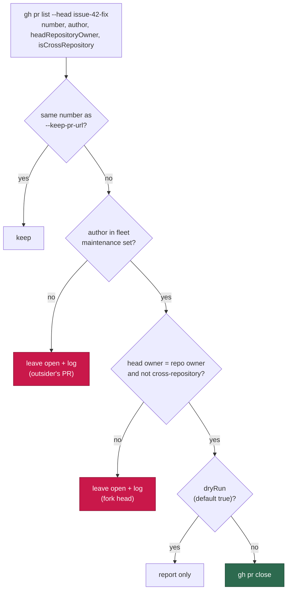

## Summary

`closeDuplicatePrs` picked its victims by head-branch name alone. `gh pr list
--head <branch>` filters on `headRefName`, which matches PRs from **any** head
repository and **any** author, and the worker's branch convention
(`issue-<n>-<slug>`) is public and machine-derivable — so naming a branch that
way was enough to have a third party's open PR closed by the service account
with a misleading "duplicate" comment.

Every candidate is now listed with `author`, `headRepositoryOwner` and
`isCrossRepository`, and is closed only when **both** hold:

- its author is in the push-capable fleet maintenance author set
  (`resolveFleetMaintenanceAuthorSet` — the "may act on" set, never the
  broader defer-to set), or the acting `gh` login when no set is configured; and
- its head is a branch of the target repo itself (owner matches **and**
  `isCrossRepository === false`).

Unknown ownership is never permission: a missing author or a missing
cross-repository flag (a stale cache entry, a listing that did not ask) refuses
the close and logs why. The operation is also report-only by default — the
library's `dryRun` and the CLI's `--dry-run` both default **on**, so the two
production call sites in `completion_phase.ts` state `dryRun: false` explicitly.

Closes #1264.

## Evidence

Backend/CLI change — no web interface to screenshot. The evidence is the test
suite below plus the full quality gate (`./quality.sh`: **PASSED**, semgrep
included).

### Security-fix evidence

- **Regression test** —
  `worker/deno/tests/pr_issue_linking_test.ts::pr_issue_linking - closeDuplicatePrs never closes an outsider's PR on the same branch`.
  It drives `closeDuplicatePrs` with a stub `gh` returning three open PRs on
  `issue-42-fix` — the kept PR, a worker duplicate (#43) and `outsider`'s #99 —
  and asserts the recorded argv contains `pr close 43` and nothing else.
- **Fails before, passes after** — run against the unfixed code (before the
  ownership gate existed) the same scenario recorded
  `["43", "99"]`, i.e. the outsider's PR was closed; with the fix it records
  `["43"]`. Observed, not inferred: the red run was executed first, then the
  fix, then the green run.
- **Original trigger closed, no trivial bypass** — the attack input is "open a
  PR whose head branch is named like a worker branch". Branch name no longer
  participates in the close decision beyond selecting candidates: the close
  requires an author inside a configured fleet login set the attacker cannot
  join, **and** a head inside the target repo, which requires write access to
  push. A same-owner fork (the near-miss an owner-only comparison would allow)
  is refused by `isCrossRepository !== false`, and an absent field is treated as
  unknown and refused. The remaining route — becoming a fleet author or gaining
  push access — is not a bypass of this gate but a compromise of the account.

## Acceptance Criteria

<!-- vibe-spec-review inputs="diff+issue-body" -->

- **met** — request `number,url,author,headRepositoryOwner` in the listing — evidence: `worker/deno/lib/issue_query.ts` (`fetchPRsByBranch` `--json` field list) and `worker/deno/tests/issue_query_test.ts::issue_query - parsePRListJson reads the ownership fields (Issue #1264)` — reviewer: met — reason: `url` is not requested because `pr close` addresses the PR by number; the reviewer confirmed nothing depends on it.
- **met** — skip any candidate whose `author.login` is not the acting user or in the fleet author set — evidence: `worker/deno/tests/pr_issue_linking_test.ts::pr_issue_linking - closeDuplicatePrs never closes an outsider's PR on the same branch` — reviewer: met
- **met** — skip any candidate whose head repository is not the target repo — evidence: `worker/deno/tests/pr_issue_linking_test.ts::pr_issue_linking - closeDuplicatePrs skips a fork PR that shares the branch name` — reviewer: partial — reason: departed from the reviewer's verdict — it saw an owner-only comparison that a same-owner fork could pass; `isCrossRepository === false` was added afterwards (`lib/pr_issue_linking.ts`, the head gate) and closes that gap.
- **met** — add a `--dry-run` that defaults on — evidence: `worker/deno/commands/pr_manager.ts` (`coerceBooleanFlag(args["dry-run"], "dry-run", true)`), library default in `CloseDuplicatePrsOptions`, and `worker/deno/tests/pr_issue_linking_test.ts::pr_issue_linking - closeDuplicatePrs is report-only by default` — reviewer: met
- **met** — regression test asserting `pr close` for the worker's duplicate only — evidence: the regression test named above — reviewer: met
- **met** — CLI-level coverage of the new flag — evidence: `worker/deno/tests/pr_manager_command_test.ts::prManagerCommand - close-duplicate-prs refuses an unreadable --dry-run` — reviewer: partial — reason: departed — the reviewer saw no CLI test in the diff it reviewed; the refusal-path test was added afterwards.
- **unrequested** — the 5th parameter of `closeDuplicatePrs` changed from a positional `cache?` to an options object — reviewer: unrequested — reason: the ownership and dry-run options have to reach the function; all call sites are updated in this diff.
- **unrequested** — the bespoke uncached `gh pr list --json number,url --jq` branch was deleted in favour of the single `fetchPRsByBranch` call — reviewer: unrequested — reason: it is what puts the ownership fields on *every* path; two listings with different field sets is exactly how the gate would be bypassed later.
- **unrequested** — `gh api user` fallback when no author set is supplied, and a fail-closed refusal when the identity cannot be resolved — reviewer: unrequested — reason: without it the CLI path has no identity at all and would either close nothing or close everything; the refusal is the fail-loud half.
- **unrequested** — an injectable `log` sink with one line per skipped candidate and per dry-run candidate — reviewer: unrequested — reason: a guard that silently declines to act is indistinguishable from a guard that never ran.
- **unrequested** — the interpolated body-marker `new RegExp(...)` in `findExistingPrForIssue` was replaced with a literal pattern plus a numeric comparison — reviewer: unrequested — reason: pre-existing, but semgrep's `detect-non-literal-regexp` scans changed files and blocked the gate on this file, so the PR could not be raised without it.
- **unrequested** — `docs/audits/security-sweep-1218-commands-cli.md` records SEC-1218-02 as fixed — reviewer: unrequested — reason: that audit is the register the finding was filed in; leaving it saying "filed, not fixed" would be stale.

## Standards Review

<!-- vibe-standards-review inputs="diff+CODING-STANDARDS.md" -->

- **violation** — modified public function `parsePRListJson` shipped with no test — evidence: `worker/deno/lib/issue_query.ts:255` — reason: fixed here — added `issue_query_test.ts::issue_query - parsePRListJson reads the ownership fields (Issue #1264)` and `::issue_query - parsePRListJson leaves malformed ownership fields unset (Issue #1264)`.
- **violation** — new CLI flag and changed result contract with no test — evidence: `worker/deno/commands/pr_manager.ts:656` — reason: fixed here — added `pr_manager_command_test.ts::prManagerCommand - close-duplicate-prs refuses an unreadable --dry-run`. The success paths call `runGhCommand` directly and are covered at the library level instead.
- **violation** — `catch {}` discarded the `gh api user` error, so the refusal named the symptom and not the cause — evidence: `worker/deno/lib/pr_issue_linking.ts:579` — reason: fixed here — the caught message is logged with the refusal.
- **violation** — the `pr list` fake ignored the `--head` it was queried with, returning `issue-42-fix` for a `fix-branch` query — evidence: `worker/deno/tests/pr_issue_linking_test.ts:536` — reason: fixed here — `prListJson` now takes the head ref and derives `isCrossRepository` from the head owner, the way the API does.
- **violation** — `dryRun` defaulting to `true` is a second change riding the security fix — evidence: `worker/deno/lib/pr_issue_linking.ts:611` — reason: it stands — the issue asks for it in terms ("Add a `--dry-run` that defaults on"), so it is requested scope, not creep.
- **violation** — fifth copy of the `gh api user --jq .login` lookup (DRY) — evidence: `worker/deno/lib/pr_issue_linking.ts:576` — reason: it stands — extracting it touches five modules that are not this issue; `lib/acting_github_user.ts` resolves from args/env, not the API, so the consolidation is a separate change.
- **violation** — `pr_manager.ts` still names its config parameter `_config` while reading it — evidence: `worker/deno/commands/pr_manager.ts:673` — reason: it stands — pre-existing (the first real read is at `:349`), and renaming the parameter edits lines this issue has no business in.
- **clean** — Australian English throughout the added lines; fail-loud refusals on every gate branch (bad `owner/repo`, unresolvable identity, non-fleet author, foreign head) with no silent degradation; the allow-set is the push-capable maintenance set rather than the defer-to set; logins compared case-insensitively; no secrets, no shell interpolation, no subprocess outside `ghCommandFn`; Deno-native tooling only; no existing test deleted or commented out; comments explain *why* and carry their issue numbers.

## Test Plan

Added (`worker/deno/tests/pr_issue_linking_test.ts`):

- `pr_issue_linking - closeDuplicatePrs never closes an outsider's PR on the same branch` — the regression test for this issue.
- `pr_issue_linking - closeDuplicatePrs skips a fork PR that shares the branch name`.
- `pr_issue_linking - closeDuplicatePrs closes a fleet sibling's duplicate` — the guard does not over-block; login matching is case-insensitive.
- `pr_issue_linking - closeDuplicatePrs is report-only by default`.
- `pr_issue_linking - closeDuplicatePrs closes nothing when the acting login is unresolvable`.
- `pr_issue_linking - closeDuplicatePrs skips a candidate with no author (stale cache shape)`.

Added (`worker/deno/tests/issue_query_test.ts`):

- `issue_query - parsePRListJson reads the ownership fields (Issue #1264)`.
- `issue_query - parsePRListJson leaves malformed ownership fields unset (Issue #1264)`.

Added (`worker/deno/tests/pr_manager_command_test.ts`):

- `prManagerCommand - close-duplicate-prs refuses an unreadable --dry-run`.

Modified (signature and wire-format updates, no assertion weakened): the four
existing `closeDuplicatePrs` tests in `pr_issue_linking_test.ts` and the two in
`pr_issue_linking_cache_test.ts` now pass the options object and stub the JSON
listing (the bespoke `--jq` output format no longer exists).

Full gate: `./quality.sh` — **PASSED** (semgrep, deno test, lint, type check,
fmt, markdownlint, mermaid).
