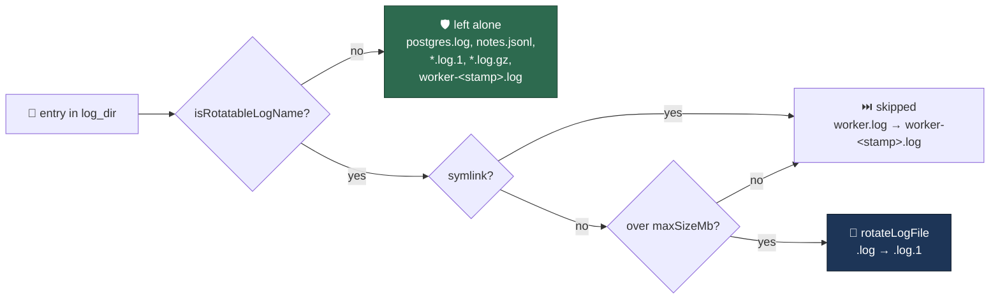

# Scope log rotation to the worker's own log filenames

## Summary

`rotateAllLogs` rotated **any** file whose name ended `.log` or `.jsonl`,
skipping only symlinks and `worker-<pid>.log`. Rotation is destructive —
`rotateLogFile` unlinks the oldest generation and then renames the rest — and
the directory it sweeps is operator-set: `normaliseConfiguredLogDir` accepts the
bare value `"~"` (`worker/deno/lib/log_dir.ts`), resolving the log directory to
`$HOME`, which `container_launch.ts` bind-mounts read-write at the container's
`~/logs`. `run_housekeeping.ts` runs the pass unattended on every worker start,
with no `--dry-run` and no report-only mode, so a third-party `postgres.log`
became `postgres.log.1` and its `postgres.log.3` was deleted.

The pass now **names what it rotates** — `isRotatableLogName` in
`worker/deno/lib/log_rotation.ts` — the same allowlist discipline
`isForeignDebrisName` applies to the sibling `worker-log-cleanup` sweep fixed
under #1218. Closes #1267.



### What the worker owns

`run_core.log`, `run_guard.log`, `pull.log`, `tabletop-run.log`, `launch-*.log`,
`launchagent-*.log`, `worker.log`, `cron.log`, `security.log`,
`self-heal.jsonl`, `agent-*.jsonl`. Each pattern anchors on `.log` / `.jsonl`
exactly, so rotated backups (`.log.1`) and gzipped copies (`.log.gz`) are never
rotated again.

`worker-<timestamp>.log` is deliberately **not** on the list: `worker_log_gzip.ts`
compresses every prior run's log at worker start and `worker_log_cleanup.ts`
ages the results out (3 days, 200-file cap). The old skip stated that boundary
but only matched the `worker-<pid>.log` shape, so the timestamp names of #4227
slipped past it — this restores the intended boundary rather than widening it.
`worker.log` *is* on the list because when its symlink is absent the logger
creates a real file nothing else bounds; the symlink guard still spares the
usual symlink form.

## Evidence

Backend/CLI change with no web interface, so the evidence is test output rather
than a screenshot.

The regression test was observed red against the unfixed code — `postgres.log`
had been renamed away, so the read failed:

```
log-rotation command - leaves an unrelated postgres.log untouched ... FAILED (2ms)
error: NotFound: No such file or directory (os error 2):
  readfile '/tmp/c72c32b13b95f346/logs/postgres.log'
FAILED | 5 passed | 1 failed (6ms)
```

and green after the fix:

```
ok | 31 passed | 0 failed (53ms)   # log_rotation_test.ts + log_rotation_command_test.ts
```

**Original trigger closed, no trivial bypass.** The pre-fix trigger — a
third-party `postgres.log` (or any `.log` / `.jsonl`) in the operator's log
directory, over `maxSizeMb` — is now rejected before `checkAndRotateLog` is
reached, at `worker/deno/lib/log_rotation.ts` in the single `readDir` loop that
is the only route into `rotateLogFile` from this pass. The predicate is a
closed allowlist of anchored (`^…$`) literal and bounded-character-class
patterns, so no prefix, suffix, path component, trailing space, unicode
look-alike or NUL byte reaches an allowed branch (asserted in
`isRotatableLogName refuses edge-case names`). Rotated (`.log.1`) and gzipped
(`.log.gz`) forms fall outside every pattern, so a backup cannot be re-entered.
No other caller reaches this loop: the only other `rotateLogFile` route is
`checkAndRotateLog` called with a literal, worker-authored path
(`run_core_production_deps.ts:1250`, `issue_worker_wiring.ts`).

## Acceptance Criteria

<!-- vibe-spec-review inputs="diff+issue-body" -->

- **met** — scope `rotateAllLogs` to the worker's own filename patterns rather than the `.log` / `.jsonl` extension, the same allowlist discipline `lib/worker_log_cleanup.ts` applies — evidence: `worker/deno/lib/log_rotation.ts` (`ROTATABLE_LOG_PATTERNS` / `isRotatableLogName`), `worker/deno/tests/log_rotation_test.ts::log_rotation - isRotatableLogName accepts the worker's own logs` — reviewer: partial — reason: the reviewer reviewed the first commit and called the allowlist under-inclusive on four names; three of them (`worker.log`, `cron.log`, `security.log`) were genuine gaps and are now on the list, and the fourth (`worker-<timestamp>.log`) is a recorded deliberate exclusion — see the `unrequested` entry below
- **met** — third-party `.log` / `.jsonl` files are no longer renamed out from under their owners — evidence: `worker/deno/tests/log_rotation_test.ts::log_rotation - rotateAllLogs leaves third-party logs untouched` — reviewer: met
- **met** — the oldest third-party generation is no longer deleted — evidence: `worker/deno/tests/log_rotation_test.ts::log_rotation - rotateAllLogs never deletes a third-party generation` — reviewer: met
- **met** — regression test `logRotationCommand.execute({ "log-dir": tmp, "max-size-mb": 0 })` over a directory containing an unrelated `postgres.log`, asserting `postgres.log` untouched and `postgres.log.1` never created, red before / green after — evidence: `worker/deno/tests/log_rotation_command_test.ts::log-rotation command - leaves an unrelated postgres.log untouched` — reviewer: met — reason: the reviewer independently replayed the test against the base branch and observed the red
- **unrequested** — `worker-<timestamp>.log` is excluded from size rotation, where before this change the #4227 timestamp names were rotated (the old `worker-\d+\.log` skip never matched them) — reviewer: unrequested — reason: deciding what the worker owns is what the issue deferred to this change; those logs have their own retention (gzip at start, 3-day age, 200-file cap) and rotating one mid-run renames a file the driver holds open by fd, which moves the bytes without detaching the writer. The trade-off is stated in the module comment and the two docs that claimed otherwise are corrected
- **unrequested** — names outside the allowlist no longer increment `skippedCount` — reviewer: unrequested — reason: they are not rotation candidates at all, matching how the old code treated non-`.log` names; counting every foreign file in an operator's `$HOME` would make the figure meaningless
- **unrequested** — doc updates in `docs/CONFIGURATION.md`, `docs/DEPLOYMENT.md`, `docs/INTERNALS.md`, `docs/audits/security-sweep-1218-commands-cli.md` and `worker/deno/lib/agent_transcript.ts` — reviewer: unrequested — reason: each stated the old scope, so the standards axis required them under "A Code Change Owes a Docs Change"

## Standards Review

<!-- vibe-standards-review inputs="diff+CODING-STANDARDS.md" -->

- **violation** — the `worker-*.log` exclusion silently dropped size rotation for the #4227 timestamp names, an undocumented behaviour change — evidence: `worker/deno/lib/log_rotation.ts:63` — reason: the exclusion stands (it restores the intended boundary), but it is no longer silent: the module comment now states the trade-off in full and the two docs that asserted the old behaviour are corrected
- **violation** — "A Code Change Owes a Docs Change": `docs/DEPLOYMENT.md:905` and `docs/INTERNALS.md:366-368` still asserted the removed behaviour — evidence: `docs/DEPLOYMENT.md:905` — reason: both rewritten in this diff to name what is size-rotated and what is bounded by gzip plus age retention
- **violation** — a new comment named `run_core.sh`, a file that does not exist — evidence: `worker/deno/lib/log_rotation.ts:67` — reason: corrected to `run.sh`, the real writer
- **violation** — declined files are invisible: non-allowlisted names `continue` without touching `skippedCount` — evidence: `worker/deno/lib/log_rotation.ts:216` — reason: stands. A foreign file is not a candidate, so counting it would inflate the figure with every unrelated file in an operator's `$HOME`; the allowlist itself is the contract and it is asserted name-by-name in the tests
- **violation** — `/^run_guard\.log$/` is speculative: nothing in the tree writes it — evidence: `worker/deno/lib/log_rotation.ts:69` — reason: stands. It is named in this module's own header and in `docs/DEPLOYMENT.md` as one of the unbounded logs this pass exists to bound; an allowlist entry for a documented name is inert, whereas omitting it would silently drop a log if the writer returns
- **violation** — coverage gap: `isRotatableLogName` had no empty/unicode edge cases — evidence: `worker/deno/tests/log_rotation_test.ts` — reason: fixed here — `isRotatableLogName refuses edge-case names` pins empty string, prefix/suffix, trailing space, path components, traversal, unicode look-alikes and a NUL byte
- **violation** — DRY: the command test re-implemented existence checking inline — evidence: `worker/deno/tests/log_rotation_command_test.ts:116` — reason: fixed here — replaced with a local `fileExists` helper mirroring the sibling suite
- **clean** — Australian English throughout; every test calls real code and asserts on filesystem side effects (no source-grepping); no test removed or commented out (the two renamed fixtures in `rotateAllLogs does not rotate small files` carry an inline note); unit tests stay fast with per-test temp dirs cleaned up in `finally`, no sleeps and no wall-clock thresholds; KISS — a frozen pattern list plus a one-line predicate mirroring `isForeignDebrisName`; commit safety — no hidden paths or key material staged; both commits carry the issue reference and the `Vibe-Coder-Run-Id` trailer; `deno fmt`, `deno lint` and `deno check` pass

## Test Plan

Added to `worker/deno/tests/log_rotation_test.ts`:

- `log_rotation - rotateAllLogs leaves third-party logs untouched` — a
  `postgres.log` and a `metrics.jsonl` survive a sweep that rotates the
  `run_core.log` beside them.
- `log_rotation - rotateAllLogs never deletes a third-party generation` — the
  `postgres.log.3` that `rotateLogFile` used to unlink is still there, with its
  contents intact.
- `log_rotation - rotateAllLogs skips a symlinked worker-owned log` — the
  `worker.log → worker-<stamp>.log` symlink reaches the symlink guard and is
  skipped, not rotated.
- `log_rotation - rotateAllLogs rotates worker.log when it is a real file` —
  the logger's own sink is still bounded when the symlink is absent.
- `log_rotation - isRotatableLogName accepts the worker's own logs` — all
  eleven owned shapes.
- `log_rotation - isRotatableLogName refuses files the worker does not own` —
  third-party names, rotated and gzipped backups, and both `worker-*.log`
  shapes.
- `log_rotation - isRotatableLogName refuses edge-case names` — empty string,
  affixes, trailing space, path components, traversal, unicode look-alikes, NUL.

Added to `worker/deno/tests/log_rotation_command_test.ts`:

- `log-rotation command - leaves an unrelated postgres.log untouched` — the
  regression test the issue specifies, driven through
  `logRotationCommand.execute` with `--max-size-mb 0` so only the filename
  allowlist stands between the sweep and the operator's files. **Red against the
  unfixed code, green after the fix.**

Modified (documented, no test removed): `log_rotation - rotateAllLogs does not
rotate small files` used `small.log` / `large.log`, names the worker does not
own. Its subject is the size threshold, so the fixtures are now `pull.log` and
`run_core.log` — only rotatable names reach the threshold at all.

`./quality.sh` passes in full.
