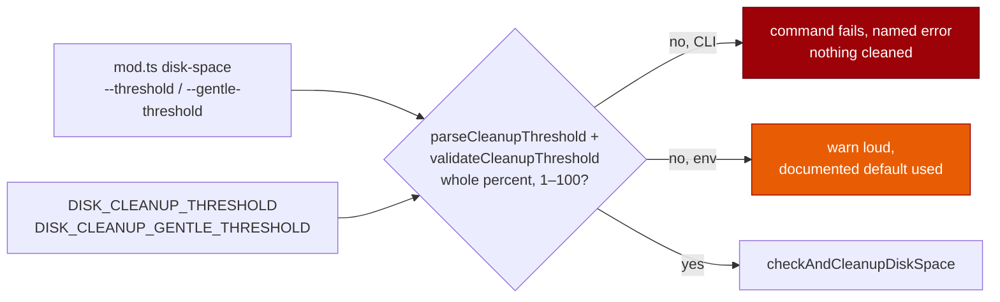

# Bound the disk cleanup thresholds to 1–100 (Issue #1268)

## Summary

`DISK_CLEANUP_THRESHOLD` had no lower bound. `0` did not mean "disabled" — it
made `usagePercent >= threshold` true on every check, so the aggressive tier
fired at each worker start and `nukeWorkDir` deleted the work directory and
every repository clone on the volume. `parseInt` made it worse: `"0abc"` read
as `0` and `"9x"` as `9`, so a typo became a destructive threshold the operator
never wrote.

Both operator-facing boundaries now refuse a threshold outside 1–100:

- `commands/disk_space.ts` fails the command with a named error before
  `checkAndCleanupDiskSpace` is called, so nothing is cleaned.
- `buildHousekeepingSteps` (`lib/run_housekeeping.ts`) applies the same bound to
  `DISK_CLEANUP_THRESHOLD` / `DISK_CLEANUP_GENTLE_THRESHOLD`, announces the bad
  value on `warn` (defaulting to `console.error`) and uses the documented
  default rather than the operator's unusable one. It no longer routes those two
  values through `getEnvNumberOrDefault`, which read `"9x"` as `9`.

There is deliberately no "disabled" spelling overloading `0`;
`docs/USAGE.md` documents `DISK_CLEANUP_THRESHOLD=100` as the way to hold the
aggressive tier back until the volume is completely full.

Closes #1268.

## Evidence

Backend/CLI change — no web interface to screenshot. The evidence is the test
suite.

The regression test was observed failing against the unfixed code and passing
after the fix: with `worker/deno/commands/disk_space.ts` restored to its
pre-fix content (`git show 5a54014:worker/deno/commands/disk_space.ts`), the
new file reported `FAILED | 7 passed | 2 failed` — `threshold: 0` returned
`success === true` and ran the cleanup. With the fix in place the same file
reports `ok | 12 passed | 0 failed`, and the targeted run across the
neighbouring suites (`disk_space_test.ts`, `disk_space_two_tier_test.ts`,
`disk_space_incremental_test.ts`, `disk_space_command_test.ts`,
`run_housekeeping_test.ts`, `config_test.ts`) reports
`ok | 175 passed | 0 failed`.

**Original trigger closed, no trivial bypass.** The trigger was
`DISK_CLEANUP_THRESHOLD=0` (or `--threshold 0`) reaching
`checkAndCleanupDiskSpace`. Every path that supplies a threshold from operator
input now passes through `parseCleanupThreshold` + `validateCleanupThreshold`
before the call: the CLI returns `success: false` and never invokes the check,
and the housekeeping builder substitutes the default. The near-miss bypasses are
closed with it — `"0abc"`, `"9x"`, `" 0 "`, `-1`, `101` and `1.5` are all
refused, because the parser accepts only a whole-number string and the validator
only integers in 1–100. `0` cannot be re-spelled as a smaller-than-1 value
either: the bound is inclusive of 1 and the message names it. The only
remaining ways to reach the aggressive tier are a genuine 1–100 threshold the
operator wrote, which is the intended behaviour.

Full `./quality.sh` gate: PASSED (deno tests, lint, type check, fmt, semgrep,
markdownlint, mermaid and the chokepoint checks).

## Acceptance Criteria

<!-- vibe-spec-review inputs="diff+issue-body" -->

- **met** — refuse `threshold` / `gentle-threshold` outside `1..100` in
  `commands/disk_space.ts` with a named failure — evidence:
  `worker/deno/commands/disk_space.ts:29-39` and `:82-96`, message from
  `worker/deno/lib/disk_space.ts:71-93` — reviewer: met
- **met** — `buildHousekeepingSteps` applies the same bound to the environment
  value — evidence: `worker/deno/lib/run_housekeeping.ts:229-241` — reviewer:
  partial — reason: the reviewer saw an earlier revision in which the env path
  still used `getEnvNumberOrDefault` (so `"9x"` read as `9`) and called the
  warn-and-default enforcement "not the same refusal"; the strict parser is now
  shared by both boundaries, and the env path keeps the safe default
  deliberately — a `buildHousekeepingSteps` that threw would abort log rotation
  and every later sweep as well
- **met** — regression test: `threshold: 0` asserts `success === false` with a
  "must be 1–100" message and that the fixture clone survives — evidence:
  `worker/deno/tests/disk_space_threshold_bounds_test.ts::disk-space command - refuses threshold 0 and preserves the work directory`
  — reviewer: met
- **met** — an explicit spelling rather than overloading `0` for "disabled" —
  evidence: `docs/USAGE.md:496-503` — reviewer: partial — reason: the issue
  made this conditional ("if 'disabled' is wanted"); no disabled mode is added,
  and the documented substitute is `DISK_CLEANUP_THRESHOLD=100`, whose wording
  was corrected after the review to say the tier is held back until the volume
  is completely full rather than "unreachable"
- **unrequested** — `parseCleanupThreshold` refuses any present-but-unreadable
  value (`"0abc"`, `"9x"`, `50.5`) instead of falling back to the default —
  reviewer: unrequested — reason: the issue names `"0abc"` surviving `parseInt`
  as part of the same fault; refusing it is what stops a typo becoming a
  threshold the operator never wrote
- **unrequested** — third `warn` parameter on `buildHousekeepingSteps` —
  reviewer: unrequested — reason: injected sink so the warning is asserted
  without capturing `console.error`; defaults to `console.error`, existing
  two-argument callers are unchanged
- **unrequested** — `docs/USAGE.md` paragraph on the bound — reviewer:
  unrequested — reason: required by "a code change owes a docs change"; the
  variable's only documented surface
- **unrequested** — `DISK_CLEANUP_THRESHOLD_MIN` / `_MAX` exported constants —
  reviewer: unrequested — reason: the bound and the failure message it prints
  now come from one place

## Standards Review

<!-- vibe-standards-review inputs="diff+CODING-STANDARDS.md" -->

- **violation** — bespoke result union instead of the repo's `Result<T, E>` —
  evidence: `worker/deno/commands/disk_space.ts:33` — reason: fixed here, the
  command now returns `Result<number, string>` from `types.ts`
- **violation** — the accepted-path test asserted only `success === true`, so a
  silently misread `"100"` would still pass — evidence:
  `worker/deno/tests/disk_space_threshold_bounds_test.ts:132` — reason: fixed
  here, the test now asserts the thresholds the check actually ran with
- **violation** — the env path still admitted `parseInt` prefix values (`"9x"`
  → `9`), so the doc claim "never applied silently" overstated the code —
  evidence: `worker/deno/lib/run_housekeeping.ts:233` — reason: fixed here, the
  raw environment string is parsed by the shared strict parser and a covering
  test was added
- **violation** — the bound `1–100` was hardcoded in the message that validates
  against the `MIN`/`MAX` constants — evidence:
  `worker/deno/lib/disk_space.ts:87` — reason: fixed here, the message is built
  from the constants
- **violation** — the same rationale restated in six comments — evidence:
  `worker/deno/commands/disk_space.ts:20-23` — reason: fixed here, the
  narrative lives on `validateCleanupThreshold` and the other sites link to it
- **violation** — fail-loud asymmetry: the CLI refuses, the env boundary warns
  and uses the default — evidence: `worker/deno/lib/run_housekeeping.ts:236` —
  reason: stands, deliberately. The fallback is the safe direction (90/80, not
  a nuke), it is announced on every build, and throwing here would abort the
  whole startup housekeeping sequence, which is best-effort by design
- **clean** — Australian English throughout; commit safety (five tracked
  non-hidden paths, no `add -f`, no `--no-verify`); run-id trailer on both
  commits; docs updated in the same change; no `Deno.env` mutation in tests
  (the `envFrom` seam is used); temp dirs removed in `finally`; no test removed
  or commented out; no sleeps or absolute wall-clock assertions; `deno fmt`,
  `deno lint` and `deno check` clean

## Test Plan

Added `worker/deno/tests/disk_space_threshold_bounds_test.ts`:

- `disk-space command - refuses threshold 0 and preserves the work directory` —
  the issue's regression test: `success === false`, a "must be 1–100" message,
  and the fixture clone still on disk. Red against the unfixed command, green
  after.
- `disk-space command - refuses out-of-range and unparseable thresholds` —
  `-1`, `101`, `"0abc"`, `50.5`, and both out-of-range gentle values.
- `disk-space command - applies in-range thresholds, including string form` —
  asserts the thresholds the check actually ran with, so a silent fallback to
  90/80 cannot pass.
- `buildHousekeepingSteps - refuses an out-of-range DISK_CLEANUP_THRESHOLD and warns`
  and the `DISK_CLEANUP_GENTLE_THRESHOLD` equivalent — the default is used and
  the warning names the variable and the bound.
- `buildHousekeepingSteps - refuses a prefix-numeric environment threshold` —
  `"9x"` no longer reads as `9`.
- `buildHousekeepingSteps - passes in-range environment thresholds through` —
  95 / 70 arrive unchanged with no warning.
- `parseCleanupThreshold - falls back only when the value is absent` and
  `validateCleanupThreshold - accepts 1..100 and refuses everything else` —
  the shared parser and bound directly, including `NaN` and `Infinity`.

Existing suites re-run unchanged and green: `disk_space_test.ts`,
`disk_space_two_tier_test.ts`, `disk_space_incremental_test.ts`,
`disk_space_command_test.ts`, `run_housekeeping_test.ts`, `config_test.ts`.
