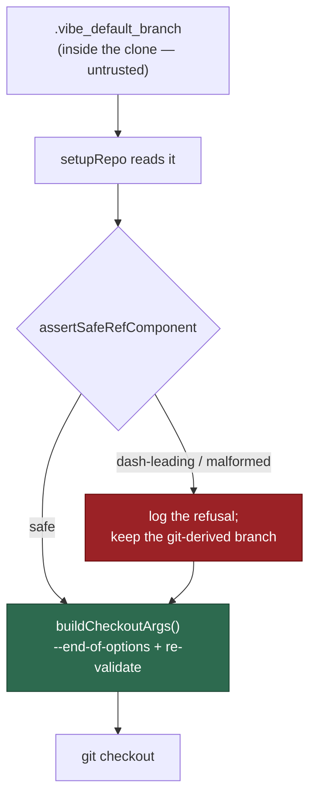

## Summary

`setupRepo()` read the default branch out of `.vibe_default_branch` — a file
that lives **inside the cloned repository**, so any repo that commits one
controls the value — and passed it straight to `git checkout` as a bare
positional. The read happens before `reset --hard HEAD` / `clean -fd`, and a
committed file survives both, so a value such as
`--pathspec-from-file=/etc/passwd` reached a `git checkout` option slot on the
worker's clone. Neither call site used `assertSafeGitRef` nor
`buildCheckoutArgs`, and the CI chokepoint excluded `defaultBranch` by design.

Three layers now close it:

1. **Validate on read** —
   `assertSafeRefComponent(cached, "cached default
   branch")` in
   `setupRepo()`. A poisoned value is refused loudly on stderr and **ignored**;
   the git-derived value from `git symbolic-ref refs/remotes/origin/HEAD`
   stands. Ignoring rather than aborting is deliberate: the file is committed,
   so returning a hard failure would turn one attacker file-write into a
   permanent denial of service on that repo, and the fallback value never came
   from the repo's working tree. The warning repeats every run, because
   `reset --hard` restores the file.
2. **Route every `defaultBranch` positional through the builders** —
   `buildCheckoutArgs` in `commands/git_operations.ts` and
   `lib/git_state_recovery.ts` (the two sites the finding names), plus the
   remaining ones in `lib/git_pull.ts` (`rebase`, two `checkout`s) and
   `lib/git_push.ts` (`fetch`). `recoverGitState()`,
   `ensureDefaultBranchCurrent()` and `syncMilestoneBranchWithDefault()` gained
   the top-of-function guard `syncFeatureBranchWithDefault()` already had, so
   each refuses a bad ref with a `Result` error before its first git call —
   which also covers the sinks the argv gate cannot see
   (`git merge <defaultBranch>`, `git branch -f <defaultBranch>`).
   `assertSafeRefComponent` is used wherever the value is interpolated into
   `origin/<branch>` or a refspec, so `main:refs/heads/attack` is rejected too,
   not just a leading dash.
3. **Widen the CI gate** — `defaultBranch` joins
   `GIT_REF_ARGV_UNTRUSTED_IDENTIFIER`, so a new inline
   `["checkout", defaultBranch]` fails the `git ref chokepoint` check. The
   comment calling it a "safe internal ref" was an assumption about provenance
   the code did not hold; it is corrected in place.

Closes #1269.

## Evidence

Backend/CLI change with no web interface, so there is nothing to screenshot. The
evidence is the regression tests plus the full quality gate.

- `deno task test tests/setup_repo_default_branch_cache_test.ts` — **3 of 6
  failed against the unfixed code** (`setupRepo` consumed the poisoned value
  with no warning; `recoverGitState` and `ensureDefaultBranchCurrent` returned
  no refusal), **6 of 6 pass after the fix**. Verified by restoring the three
  pre-fix source files from `900eb43e` and re-running the same command.
- `./quality.sh` — **PASSED** (20 checks; `config integration` skipped as it
  needs a live config). `git ref chokepoint: PASSED` with the widened
  identifier, and the whole `lib/` + `commands/` tree scans clean.

**The original trigger is closed with no trivial bypass.** The attack input from
the finding — a committed `.vibe_default_branch` holding
`--pathspec-from-file=/etc/passwd` — is rejected by `assertSafeRefComponent` at
the point of the read, before any git command runs, and never becomes
`defaultBranch`. A value that somehow evaded that check still cannot reach an
option slot: every `git checkout|fetch|rebase` taking `defaultBranch` now emits
`--end-of-options` before the positional via the `git_ref_args.ts` builders,
which re-validate the ref themselves, and the three library entry points that
take a default branch refuse a dash-leading or refspec-splitting name before
their first git call — which is also what guards the `git merge` and
`git branch -f` positionals the verb-based gate does not match. The
`reset --hard origin/<b>` and `ls-remote refs/heads/<b>` sites interpolate
behind a prefix, so no dash can lead there, and the component check now forbids
the `:` that would split the refspec. Widening the CI identifier means a future
inline call site cannot reintroduce the shape without failing the gate.

## Review Notes

The issue states no acceptance criteria, so no criteria block is emitted. Two
independent reviewers (spec-vs-issue and diff-vs-`CODING-STANDARDS.md`) read the
first commit; every finding they raised was acted on in the second and third
commits:

- **`ensureDefaultBranchCurrent`'s new refusal path had no test** — added, with
  its positive control.
- **A deleted `["push", "origin", defaultBranch]` assertion** — restored,
  asserted in the opposite direction, with a note at the removal site.
- **The new guards used the weaker validator than their sinks need** — both
  upgraded to `assertSafeRefComponent`.
- **`git merge <defaultBranch>` in the milestone sync stayed an unguarded
  positional the gate cannot see** — `syncMilestoneBranchWithDefault` now
  validates its inputs up front.
- **Refusing the repo on a poisoned file was a latching denial of service** —
  changed to ignore-and-warn, as described above.

## Test Plan

Added `worker/deno/tests/setup_repo_default_branch_cache_test.ts`:

- `setup_repo_default_branch_cache_test.ts::setupRepo - ignores a poisoned .vibe_default_branch instead of checking it out`
  — builds a real clone, writes the finding's attack value into
  `.vibe_default_branch`, calls the real `setupRepo`, and asserts the resulting
  default branch is still `main`, that HEAD is still `main`, and that the
  refusal was logged. **Reproduces the flaw: fails against the unfixed code
  (which adopted the poisoned value silently) and passes after the fix.**
- `setup_repo_default_branch_cache_test.ts::setupRepo - accepts a legitimate cached default branch`
  — the positive control: a normal `main` cache still drives the setup.
- `setup_repo_default_branch_cache_test.ts::recoverGitState - refuses a dash-leading default branch (Issue #1269)`
  — the second call site, asserted on the returned `Result` error. Also fails
  against the unfixed code.
- `setup_repo_default_branch_cache_test.ts::recoverGitState - a clean tree on a valid branch still recovers`
  — the positive control for that guard.
- `setup_repo_default_branch_cache_test.ts::ensureDefaultBranchCurrent - refuses a dash-leading default branch (Issue #1269)`
  — the third hardened entry point. Against the unfixed code the call reached
  `git fetch` and came back with git's own "Failed to fetch origin/…", not the
  refusal this asserts.
- `setup_repo_default_branch_cache_test.ts::ensureDefaultBranchCurrent - a valid default branch is brought up to date`
  — the positive control for that guard.

Added to `worker/deno/tests/git_ref_argv_check_test.ts`:

- `git_ref_argv_check_test.ts::scanner - flags an unguarded checkout of defaultBranch (Issue #1269)`
- `git_ref_argv_check_test.ts::scanner - a builder-shaped defaultBranch call stays clean (Issue #1269)`

**Modified existing tests (documented, not removed):** two cases in
`git_ref_argv_check_test.ts` asserted that `["checkout", defaultBranch]` and
`["push", "origin", defaultBranch]` were _not_ violations. That is the
excluded-by-design behaviour this issue reverses, so both lines moved to the new
"flags an unguarded checkout of defaultBranch" test — asserted in the opposite
direction, not dropped — with a comment at each removal site saying where they
went. The surrounding cases still cover `baseBranch` / `milestoneBranch`, which
stay excluded.

Also re-ran the suites that touch the changed call sites —
`setup_repo_skip_fetch_test.ts`, `setup_repo_slug_guard_test.ts`,
`git_state_recovery_test.ts`, `git_operations_command_test.ts`,
`regression_git_operations_test.ts`, `git_ref_args_integration_test.ts`, and
every `git_pull` / `git_push` / `sync` / `milestone_branch` suite — all green.
