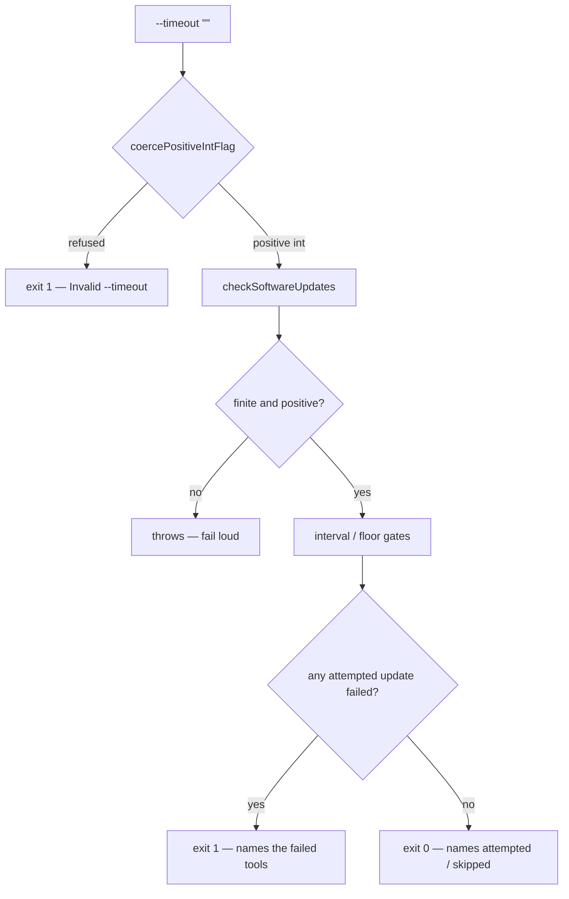

# 🔵 software-updates no longer reports "check complete" after a NaN interval or timeout

## Summary

`commands/software_updates.ts` converted `--interval` and `--timeout` with
`parseInt` and passed the result on with `??`. `NaN` is neither nullish nor
negative, so an unreadable flag value flowed straight through:

- `elapsed >= NaN` is `false`, so once a timestamp file existed the interval
  never elapsed and every run ended at "Software updates checked recently —
  skipping";
- `setTimeout(abort, NaN * 1000)` fires immediately, so every install aborted as
  exit 124 "transient", was retried, and ended at "failed after N attempts —
  continuing anyway".

Either way the command returned
`{ success: true, message: "Software update
check complete" }` and exited 0 — a
host on the supply-chain update path that never updates the Claude CLI, `gh` or
Deno, while its exit code says otherwise.

The fix refuses unreadable durations at the flag boundary and inside the
library, and makes the command's exit status reflect what the run actually did.
Closes #1270.

- `lib/command_args.ts` — new `coercePositiveIntFlag()`, the numeric sibling of
  the existing `coerceBooleanFlag()` / `coerceStringListFlag()`: a present but
  unreadable value (`""` from an unset-but-quoted shell variable, `true` from a
  valueless trailing flag, a non-integer, zero, a negative) is **refused**, not
  mapped to `undefined` or `NaN`.
- `lib/software_updates.ts` — `shouldCheckForUpdates`,
  `shouldAttemptFloorUpdate` and `checkSoftwareUpdates` throw on a non-finite or
  non-positive duration, so a bad value can never reach the
  `elapsed >= intervalSeconds` gate or `setTimeout`. Defence in depth: the CLI
  is not the only caller.
- `lib/software_updates.ts` — each tool updater now returns `false` when an
  update it actually attempted failed after its retries (a skip, a quarantine
  hold or an absent binary is not a failure), `checkSoftwareUpdates` returns a
  `SoftwareUpdateRunOutcome` (`status` + `attempted` / `skipped` / `failed`),
  and a failed tool is logged at error level rather than left in a mid-log
  warning. The worker's own callers stay best-effort and ignore the value.
- `commands/software_updates.ts` — exits **non-zero** when an attempted tool
  update failed, and its final line names the tools attempted, skipped or failed
  instead of always claiming a completed check.

## Evidence

Backend/CLI change with no web interface, so there is no screenshot to capture.
The evidence is the test run and the full quality gate.

- `./quality.sh < /dev/null` → **PASSED** (deno tests, lint, type check, fmt,
  markdownlint, mermaid, semgrep and every chokepoint check).
- `deno test --allow-all tests/software_updates_command_test.ts
  tests/software_updates_test.ts tests/command_args_test.ts < /dev/null`
  → all pass.

**Red before green (TDD).** Added
`worker/deno/tests/software_updates_command_test.ts::softwareUpdatesCommand - refuses an empty --timeout from the CLI (Issue #1270)`,
which reproduces the flaw: it drives
`parseArgs(["software-updates",
"--timeout", ""])` — the exact wrapper shape
from the finding — into `softwareUpdatesCommand.execute` and asserts a non-zero
result naming `--timeout`. Against the unfixed `parseInt` command body the file
failed 4/6 tests; with the fix all 6 pass. The library guards were verified the
same way: with the `assertPositiveSeconds` calls removed, the four Issue #1270
tests in `worker/deno/tests/software_updates_test.ts` failed ("Expected function
to throw"); restored, all seven pass.

**Original trigger closed, with no trivial bypass.** The trigger was
`--timeout ""` / `--interval ""` (and the equivalent valueless `--timeout`)
reaching `parseInt` and producing `NaN`. `parseInt` is gone from that path:
`coercePositiveIntFlag` accepts only a `number` that is finite, integral and
`> 0`, or a string matching `/^\d+$/` that parses to the same, and refuses
everything else — so `""`, `"  "`, `true`, `"abc"`, `"12x"`, `[]`, `{}`, `0`,
`-1`, `1.5`, `NaN` and `Infinity` all return a `Result` error rather than a
value. The bypass route of reaching the gate by another caller is closed
separately: `shouldCheckForUpdates`, `shouldAttemptFloorUpdate` and
`checkSoftwareUpdates` each assert the duration is finite and positive before
using it, so no in-process or env-driven caller can deliver `NaN` to
`elapsed >= intervalSeconds` or to `setTimeout`. A refusal is loud in both
places — a non-zero command result, or a thrown error — never a silent
substitution of the default.

## Test Plan

Added (all in this branch's diff):

- `worker/deno/tests/software_updates_command_test.ts` (new file)
  - `softwareUpdatesCommand - refuses an empty --timeout from the CLI (Issue #1270)`
    — the regression test for the reported trigger, driven through `parseArgs`.
  - `softwareUpdatesCommand - refuses an empty --interval (Issue #1270)`
  - `softwareUpdatesCommand - refuses a valueless --timeout flag (Issue #1270)`
  - `softwareUpdatesCommand - refuses non-positive durations (Issue #1270)`
  - `softwareUpdatesCommand - accepts well-formed durations and reports the outcome (Issue #1270)`
    — valid values still run, and the message states what the run did. Uses a
    temporary timestamp directory and injects no process state, so the file
    stays in the gate's parallel pass (Issue #880).
- `worker/deno/tests/software_updates_test.ts`
  - `shouldCheckForUpdates - a NaN interval is refused before the gate (Issue #1270)`
  - `shouldCheckForUpdates - a non-positive interval is refused (Issue #1270)`
  - `shouldAttemptFloorUpdate - a NaN interval is refused (Issue #1270)`
  - `checkSoftwareUpdates - a NaN timeout fails loud instead of aborting every install (Issue #1270)`
  - `checkSoftwareUpdates - reports which attempted tool updates failed (Issue #1270)`
  - `checkSoftwareUpdates - a skipped tool is reported as skipped, not failed (Issue #1270)`
  - `checkSoftwareUpdates - a not-due run says so rather than reporting a completed check (Issue #1270)`
- `worker/deno/tests/command_args_test.ts` — four cases covering
  `coercePositiveIntFlag` (accepted values, absence, `parseInt`-to-`NaN` inputs,
  non-positive and non-integer inputs).

No existing test was removed, weakened or commented out.

## Documentation

- `docs/INTERNALS.md` — the `software-updates` entry now states the duration
  flags' contract and the non-zero exit on a failed tool update.
- `docs/CONFIGURATION.md` — `SOFTWARE_UPDATE_CHECK_INTERVAL_SECONDS` and
  `CLAUDE_UPDATE_TIMEOUT` are documented as positive whole numbers of seconds.
