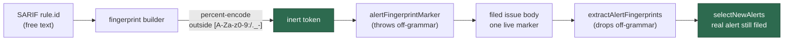

# Constrain the alert-fingerprint token so a free-text rule id cannot forge a marker

## Summary

The alert-feed dedup marker `<!-- alert-fingerprint: … -->` is deliberately
rendered on the first line of a filed issue body, **outside** the untrusted
fence, but the token it carries was built by bare string concatenation over
alert fields the fetchers document as *free text, verbatim*
(`CodeScanningAlert.ruleId`, `DependabotAlert.packageName` / `ghsaId`). A rule
id containing `-->` therefore closed the marker early and opened a second,
forged one naming a real Dependabot alert — the next run's `selectNewAlerts`
read both tokens back and treated the genuine high/critical alert as already
filed, suppressing it permanently. A whitespace-bearing rule id was the weaker
variant: the marker failed to re-parse, so the alert re-filed every run.

Fixed at the point the fingerprint is **built**, not where it is rendered:

- `sanitiseFingerprintToken` percent-encodes every character outside
  `[A-Za-z0-9:/._-]`, and both builders apply it. Because `%` is itself outside
  the set it is encoded too, so the mapping stays **injective** — two distinct
  alerts can never collapse onto one fingerprint and suppress each other.
  Tokens already drawn from the grammar (every real GHSA id, `js/zipslip`) come
  back byte-unchanged, so alerts already filed are not re-filed.
- `alertFingerprintMarker` now **fails loud** on an off-grammar token, and
  `extractAlertFingerprints` drops off-grammar tokens rather than admitting
  them to the known-open set (defence in depth on both ends of the round trip).
- `ruleId`, `packageName`, `ecosystem` and `ghsaId` are passed through
  `inlineAlertField` — the shared single-line scrub (`scrubUntrustedText`,
  which neutralises delimiter and HTML-comment sequences) plus a whitespace
  collapse — before they reach `detailLines` or the issue title. The issue's
  suggestion was `fenceUntrustedAlertText`; a nonce-fenced block per bullet is
  unreadable, and `scrubUntrustedText` is the repo's documented single-line
  equivalent for exactly this case (Issue #1249, finding 8).
- Corrected the `AlertFinding.detailLines` comment, which asserted those values
  were "never free-text" — the property the code did not have.

Closes #1275.

## Original trigger is closed

The issue's trigger — a SARIF `rule.id` of
`a --><!-- alert-fingerprint: dependabot:<owner>/<repo>:<GHSA> -->b` — now
yields the token
`code-scanning:acme/widget:a%20--%3E%3C%21--%20alert-fingerprint:%20dependabot:acme/widget:GHSA-real-real-real%20--%3Eb:42`.
No trivial bypass exists on that path:

- `<`, `>` and `!` are all outside the allowlist, so **no** `<!--` or `-->`
  sequence can form inside the token — an HTML comment cannot be closed or
  opened however the rule id is shaped, including via unicode look-alikes
  (anything non-ASCII is encoded to its UTF-8 bytes) or an already-encoded
  `%3E` (the `%` is re-encoded to `%25`, so it decodes to nothing live).
- The encoding is applied at both build sites, which are the only producers of
  a fingerprint in the codebase (`grep` for `alertFingerprintMarker`,
  `codeScanningAlertFingerprint`, `dependabotAlertFingerprint` shows
  `alert_feed_template.ts` as the sole non-test caller), and the renderer
  throws on anything off-grammar, so a future hand-built token fails loudly
  rather than silently re-opening the hole.
- The read side is symmetric: even a marker planted by some other route is
  ignored unless its token matches the grammar.
- The other free-text sinks on the same body (`detailLines`, title) are
  scrubbed, so no live `<!--` / `-->` survives anywhere outside the fence — the
  advisory free-text was already fenced (Issue #3397).

## Evidence

Backend/CLI change with no web interface, so there is nothing to screenshot.
The evidence is the regression suite plus the full gate.

```
deno test tests/alert_fingerprint_grammar_test.ts
  ok | 9 passed | 0 failed
```

Against the **unfixed** code the same file reported
`FAILED | 2 passed | 7 failed`, with
`alert body - forging rule id cannot suppress a real alert` returning three
tokens — the alert's own, plus the forged target fingerprint twice — instead of
one.

Existing alert-feed coverage is unchanged and still green
(`alert_feed_dedup_test.ts`, `alert_feed_template_test.ts`,
`alert_issue_body_untrusted_fence_test.ts`, the two fetcher suites and the two
remaining alert tests: `137 passed | 0 failed`), and `./quality.sh` passed in
full (semgrep, markdownlint, mermaid, deno tests/lint/type check/fmt).



## Test Plan

Added `worker/deno/tests/alert_fingerprint_grammar_test.ts` — nine tests
calling the real builders/renderers:

- `worker/deno/tests/alert_fingerprint_grammar_test.ts::alert body - forging rule id cannot suppress a real alert`
  — the regression test for the reported flaw: it builds a finding from the
  issue's exact `-->`-bearing rule id, renders the body, and asserts
  `extractAlertFingerprints` returns exactly the alert's own token and that the
  targeted alert is still filed by `selectNewAlerts`. It **fails against the
  unfixed code** (three tokens read back, the real alert suppressed) and
  **passes after the fix**.
- `…::alert fingerprint - marker-closing rule id yields a single readable token`
  — the token grammar itself (also red before the fix).
- `…::alert fingerprint - whitespace-bearing rule id still round-trips` — the
  flooding variant.
- `…::alert fingerprint - hostile Dependabot fields are constrained` — `ghsaId`
  carrying a forged marker, a newline, an emoji, and a pre-encoded `%`.
- `…::alert fingerprint - encoding is injective, so distinct alerts stay distinct`.
- `…::alert fingerprint - benign fingerprints are byte-unchanged` — the dedup
  stability guard against re-filing already-open alerts.
- `…::alert fingerprint - marker renderer rejects an off-grammar token` —
  fail-loud.
- `…::alert fingerprint - extraction ignores tokens outside the grammar`.
- `…::alert body - free-text detail lines carry no live comment sequence` — no
  `<!--` / `-->` / newline in `detailLines` or the title for either feed.
